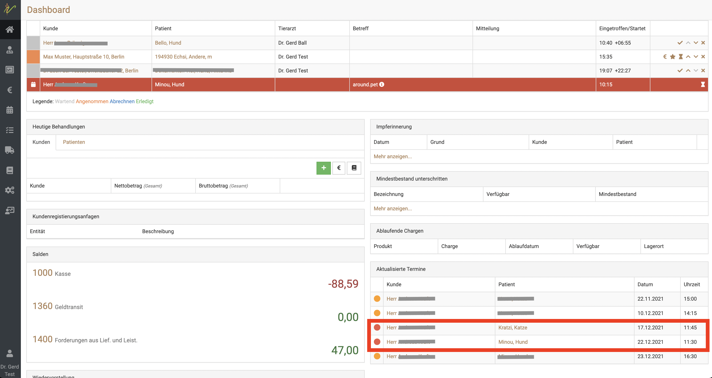
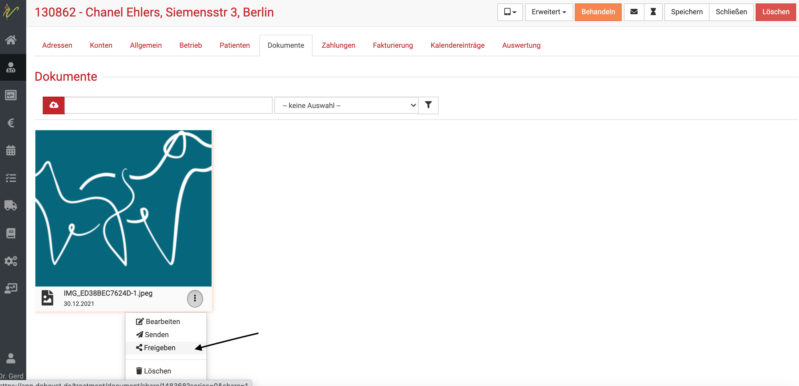

# Online Termine vergeben

Die debevet Software bietet Ihnen ein ideales System zur Vergabe von Terminen via Onlinebuchung. 
Dabei stehen zwei Möglichkeiten zur Verfügung, wie Ihre Kunden bei Ihnen buchen können: 

- Ein Webwidget, also eine Möglichkeit, direkt über den Browser zu buchen (Sie können dieses über Ihre Webseite verlinken)
- Eine App wie bereits bisher (around.pet App) 

Beide sind miteinander verbunden, so dass Ihre Kunden (und Sie) wählen können, ob und wie Sie welche Möglichkeit nutzen können.
Das eine schließt das andere nicht aus und unsere Empfehlung ist, einfach beides anzubieten, je nach Vorlieben können Ihre Kunden selbst wählen.

Dabei wird unterschieden (und das stellen Sie selbst pro Terminanlass ein) in:

1. Terminanfragen (die Sie dann bestätigen müssen))
2. Direkte Terminbuchung (ohne, dass Sie noch etwas manuell tun müssen, ist der Termin fix eingebucht)

**Da beides über around.pet läuft, müssen Sie in jedem Fall die Schnittstelle aktivieren.**

## around.pet Schnittstelle aktivieren

Zunächst müssen Sie in der debevet Software die around.pet Verbindung einmalig einrichten. Klicken Sie dazu auf **Administration** und dann
**API**.

Gehen Sie auf den Button aktivieren und setzen Sie den Haken bei "Ich akzeptiere die Nutzungsbedingungen des Anbieters".
Anschließend können Sie die Schnittstelle aktivieren.

   

:::info Videotipp:  

Hier finden Sie ein Video, welches die grundsätzliche Aktivierung der Schnittstelle und die Basis Einstellungen der Online-Terminbuchung
erklärt:   

<iframe width="560" height="315" src="https://www.youtube.com/embed/jqN9BBbicqE?si=fg0g1AzLU7oVv46H" title="YouTube video player" frameborder="0"
allow="accelerometer; autoplay; clipboard-write; encrypted-media; gyroscope; picture-in-picture; web-share" allowfullscreen></iframe>    

:::  

## Zeiten für Termine vorgeben

Natürlich können Sie die Zeiten, in denen Termine buchbar sein sollen, frei vergeben. Wichtig ist, hier zu verstehen, wie die Logik
des Programms funktioniert.   

:::tip Hinweis:   

Damit ein Termin als extern buchbar erscheint, müssen folgende Bedingungen erfüllt sein:  

1. Ein Mitarbeiter muss im Arbeitszeitplan verfügar sein 
2. Es muss einen Terminanlass geben, der als "extern buchbar" (das bedeutet, dass der Kunde es selbst buchen kann) für den Kalender 
des Mitarbeiters freigeben ist  
3. Sie können Zeiten für Terminanlässe setzten, aber der Mitarbeiter muss mit seiner Arbeitszeit für diese dann verfügbar sein, damit sie buchbar werden

:::  

Die Zeiten, zu denen die Termine buchbar sind, werden in den Terminanlässen festgelegt. Alles zu Terminanlässen finden Sie hier:   
https://handbuch.debevet.de/docs/Kalendernutzung/Terminanlaesse  

Alles zu den Arbeitszeitplänen finden Sie hier:    

https://handbuch.debevet.de/docs/Arbeitszeitplanung/Arbeitszeitplanung  

## Mögliche Buchungsvarianten /Zeitvorgaben

Sie können an den buchbaren Terminanlässen immer selbst entscheiden, ob diese   
* Extern buchbar sein sollen (also über Web oder App) 
* Sofort buchbar sein soll (oder Sie es als Termin-Anfrage nutzen wollen)  

Bei Termin-Anfragen müssen Sie die Termine noch einmal bestätigen, bei "Sofort buchbar" wird der Termin direkt fest eingebucht ohne, 
dass Sie manuell noch einmal tätig werden müssen.

:::tip Tipp:  

Auch OPs könnten mit dieser Variante zur Onlinebuchung angeboten werden. Vor allem Kastrationen, bei diesen könnten Sie dann direkt in der Terminanfrage sehen,
ob es sich um ein Ihnen bekanntes Tier handelt. Unbekannte Tiere oder Tiere, die Sie lange nicht gesehen haben, könnten Sie zunächst erneut kontaktieren, um das Tier zu sehen,
bevor der OP Termin bestätigt werden kann. Nach Vorgesprächen zur Kastration mit Ihnen bekannten Kunden könnten diese aber durchaus über eine Onlineterminbuchung
angenommen werden.   

:::  

## Wie lange vorab sollen Ihre Termine buchbar sein? (Vorlauf)

Bisher haben wir im debevet nur die Möglichkeit, eine globale Vorlaufzeit in Stunden festzulegen, die Ihre Kunden maximal vorher buchen
dürfen. Wenn Sie beispielsweise nicht wünschen, dass die Kunden noch am selben Tag buchen können, setzen Sie die Vorlaufzeit auf mind. 24 Stunden.
Bitte beachten Sie dabei, dass Buchungen auch Sonntags erfolgen könnten!

Um die Vorlaufzeit festzulegen, klicken Sie auf **Administation** und dann **Einstellungen**. Dort wählen Sie den Reiter **API**.  

Dort finden Sie das Feld "Vorlauf", in das Sie die gewünschte Stundenzahl eintragen können.  

   

Auf Wunsch können Sie auch festlegen, wie viele Tage die Kunden maximal im voraus Termine buchen können, z.B. 28 Tage.

## Das Webwidget nutzen  

Wenn Sie das Webwidget nutzen möchten, gehen Sie wie folgt vor: 
Klicken Sie den Link mit der Übersicht aller Tierärzte, die mit debevet eine Onlinebuchung anbieten und suchen Sie Ihre eigene Praxis. 

[https://termine.around.pet/](https://termine.around.pet/)

Suchen Sie Ihre Praxis in der Liste unserer Tierärzte, die die Onlinebuchung aktiviert haben und klicken Sie **Termin buchen**-  

  

Wenn Sie in die nächste Ansicht gelangen, nutzen Sie den Link aus der Browser Adresszeile und kopieren diesen. Dieser sollte nun 
mit einem Button "Termin direkt online buchen" (oder ähnlichem) auf Ihrer Homepage eingebunden werden.   

Auf diesem Wege sehen die Kunden nicht ALLE Praxen, sondern gelangen immer direkt in den Buchungssektor Ihrer eigenen Praxis. Dort können Sie nun 
online Ihre Termine direkt buchen oder Terminanfragen stellen (je nach Ihren Vorgaben).   

Wie das fertige Webwidget bzw. der Buchungsprozess für die Kunden aussieht, sehen Sie hier: 

https://handbuch.debevet.de/docs/Online_Terminbuchung/Kundenansicht  

Die Kunden müssen sich einen around.pet account erstellen (können diesen aber auch mit google login oder apple login sehr schnell erzeugen), um den 
Termin abschließend zu buchen.  

Bei Ihnen im debevet wird automatisch eine Kartei erstellt, in der die Adress- und Kontaktdaten des Besitzers bereits eingegeben sind. Außerdem wird eine Kartei
für das Tier erstellt. Dazu werden vorerst nur Name und Tierart übermittelt, für die Abfrage weiterer Tierdaten lesen Sie bitte weiter unten.

:::tip Anmerkung: 
Das sogenannte Mapping (also die Prüfung, ob dieser Kunde in Ihrer Praxis bereits existiert) erfolgt immer über seine Mailadresse. Sollte
also eine zweite Kartei angelegt werden, prüfen Sie bitte die Mailadressen. 
Auf diese Art versuchen wir sicherzustellen, dass es keine doppelten Karteien gibt. Dennoch kann bei Kunden mit mehreren Mailadressen natürlich eine Dublette 
entstehen.   

:::   

## Abfrage erweiterter Tierdaten (bei Neukunden)

## Den Fragebogen in die Terminbuchung einbinden (bei Neukunden)

## Tierbesitzer zur App einladen   

Wenn Sie die Kunden auf die App hinweisen möchten (falls diese eher App-affin sind, vor allem bei jüngerem Klientel), können Sie 
dies direkt aus der Kundenkartei erledigen.

:::caution Hinweis: 

Hinweis: Es ist wichtig, dass sich der Kunde mit der E-Mail zu der Sie die Einladung schicken bei der around.pet App
registriert. Nur dann kann die richtige Zuordnung stattfinden.  

:::  

1. Gehen Sie auf das Profil des Kunden.

2. Gehen auf den Reiter "Allgemein".

3. Gehen Sie im Bereich Einladungsmail auf den Button „around.pet“. Dadurch wird an die hinterlegte E-Mail-Adresse des Kunden eine Einladungsmail versendet.  

  

## Bestätigungsmail und Erinnerungsmail   

Egal, ob die Kunden mit der App oder dem Webwidget buchen: Es werden immer automatisch eine Buchungs-Bestätigung via Mail sowie 24 Stunden vor dem 
Termin eine Erinnerungsmail verschickt. Kunden, die die App installiert haben, erhalten die Termin Erinnerung außerdem via Push auf Ihr Handy.

## Neukunden über die App  

Kunden, die die App nutzen, bekommen in der Liste der Tierärzte Ihre Praxis angezeigt und können sich über die App mit Ihnen verbinden.  

Wenn die Kunden alle Daten angeben, werden Sie als Kunden bei Ihnen angelegt, das spart Ihnen den Aufwand des Anlegens/Registrierens vor Ort!  

:::tip Tipp:  

Wenn Sie unter **Administration** → **Textbausteine** → **Datenschutzerklärung** einen entsprechenden
Text hinterlegt haben, kann der Kunde diesen lesen und stimmt mit seiner Verbindung mit Ihnen der Datenschutzerklärung zu. 
Diese wird bei Ihrem debevet unter Dokumente des Kunden dann mit entsprechendem Datum als Nachweis für Sie gespeichert.  

::: 

## Terminanzeige für Kunden in der App  

:::tip Tipp:  
Der Kunde erhält 25h und 1h bevor der Termin stattfindet eine Push-Nachricht durch die App.
Deshalb ist es wichtig, dass der Kunde die Benachrichtigungen für die around.pet App auf seinem Smartphone aktiviert.  

:::  

Erstellen Sie wie gewohnt einen Termin für einen Kunden und seinen Patienten. **Der Kunde sieht bei sich den Inhalt im Feld
Beschreibung des Kalendereintrages als Grund des Termines. Das Feld des Titels eines Kalendereintrages sehen nur Sie.**

1. Wählen Sie den Kunden der die around.pet App nutzt und dessen Tier.

2. Wählen Sie bei Kalender around.pet und speichern Sie den Kalendereintrag.

3. Der Kunde erhält sofort eine Benachrichtigung auf sein Handy mit den Details zu seinem nächsten Termin, wenn er mit Ihnen verbunden ist.  

  

## Terminanfragen vom Kunden annehmen  

Auf Ihrem Dashboard gibt es ein Fenster für **Aktualisierte Termine**. Dort sehen Sie alle Terminanfragen von Kunden, die über die 
around.pet App hereinkommen. (mit einem orangenen Punkt erkenntlich) 

  

Klicken Sie auf den Patienten- oder Kundennamen und klicken dann oben rechts **Erweitert**. 

Nun können Sie die **Terminanfrage annehmen**.    

  

Der Eintrag ist dann aus dem Dashboard Feld **Aktualisierte Termine** verschwunden. 

## Termin absagen oder Anfrage ablehnen  

In der Detailansicht eines Termines können Sie über **Erweitert** eine Terminanfrage bzw. einen Termin durch 
Klick auf **Abbrechen** absagen. Der Patientenbesitzer erhält sofort eine Benachrichtigung. (Via App und Email) 

  

## Terminabsage durch Kunden  

Die Kunden können in der App oder im Webwidget im Rahmen der von Ihnen gesetzten Absagefristen (Siehe Terminanlässe) die Termine einfach mit einem
Klick absagen.

Für Kunden, die via Webwidget gebucht haben, hängt an der Bestätigungsmail ein Link, mit welchem der Kunde nach seinem Login ein 
Portal sieht. In diesem sind seine Termine sichtbar und stornierbar innerhalb der Fristen.

Wenn Kunden einen Termin abgsagen, erscheint dieser in **Rot** auf der Liste **Aktualisierte Termine** auf 
Ihrem Dashboard.

:::caution Hinweis:   

In den Terminanlässen können Sie selbst bestimmen, welche Terminart wie früh VOR einem Termin storniert werden darf.   

::: 

  

## Termin ändern  

Wenn Sie wie gewohnt im Kalender den Eintrag (z.B. Datum, Uhrzeit) ändern, bekommt Ihr Kunde dieses direkt via Push Nachricht angezeigt
und per Mail mitgeteilt.

## Dokumenten Service  

Sie können alle Dokumente wie z. B. Röntgen, Laborergebnisse, Untersuchungsprofile usw. direkt für Ihren Kunden freigeben.
Diese werden dann direkt in der App für den Kunden verfügbar und können nicht wie als Email evtl. gelöscht werden und sind dann für den 
Kunden nicht mehr verfügbar.  

