# Onlinebuchung aus Kundensicht

Damit Sie sich ein besseres Bild machen können, wie die Terminbuchung für Ihre Kunden aussehen wird, stellen wir hier die Möglichkeiten und
Ansichten für Ihre Praxiskunden dar.

Falls Sie möchten, dürfen Sie diese Seite auch gern als Anleitung für Ihre Kunden verlinken, falls diese anfänglich Probleme mit der Terminbuchung haben.

## Einen Termin auf der Webseite buchen

Die erste Ansicht, auf die Sie gelangen, ist die Übersichtsseite, in der die Praxisdaten angezeigt werden. Generelle Öffnungszeiten,
Kontaktdaten, Adresse und Telefonnummer.

Mit einem Klick auf "Termin vereinbaren" erscheint die nächste Seite.

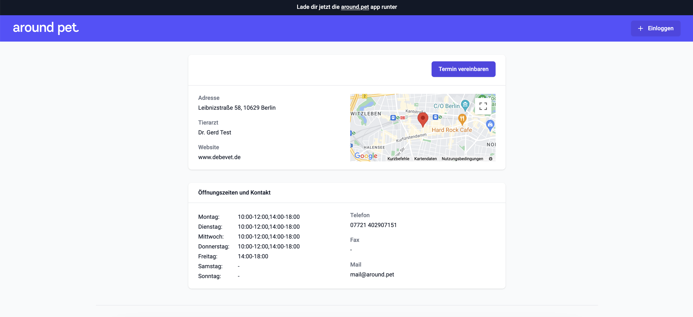

Wenn die Praxis mehr als einen Tierarzt für Termine zur Verfügung stellt, stehen nun alle Tierärzte oben zur Auswahl. Es kann entweder:

* Der gewünschte Tierarzt gewählt werden oder
* Der Haken gesetzt werden bei "Ich bevorzuge keinen bestimmten Tierarzt"

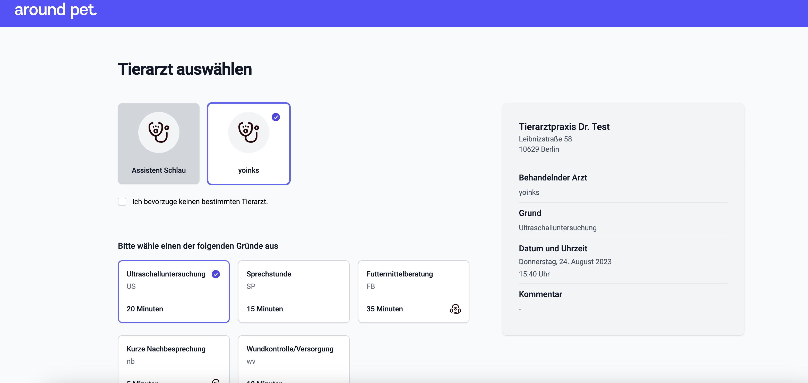

Ebenso könnte auch zunächst die gewünschte Dienstleistung gewählt werden, und erst dann die Arztauswahl erfolgen.

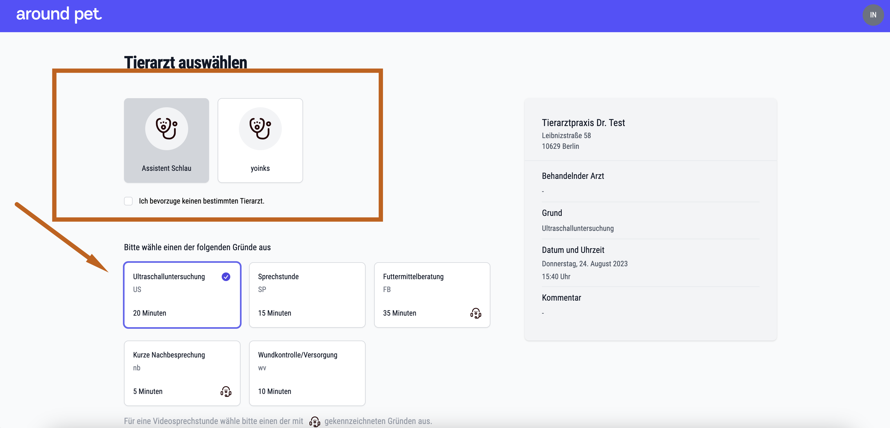

Wird ein Tierarzt ausgewählt, so werden Dienstleistungen, die dieser nicht anbietet grau hinterlegt und sind nicht mehr wählbar.

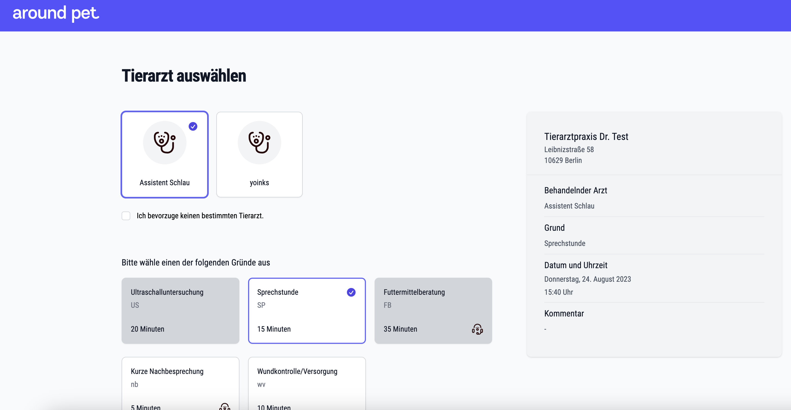

Umgekehrt werden bei der Auswahl einer bestimmten Dienstleistung Ärzte, die diese nicht anbieten, grau hinterlegt (wenn zuerst
die Dienstleistung gewählt wird).

Es sind also grundsätzlich nur WEIß hinterlegte Felder wählbar.

**Videosprechstundentermine**

Termine, die nicht live vor Ort stattfinden, sondern mit einer Videosprechstunde abgehalten werden, sind mit einem kleinen
Headset Symbol gekennzeichnet.

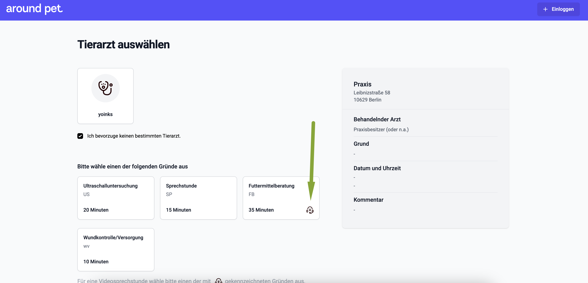

Der Videolink ist in der Bestätigungsmail eingefügt, der Tierarzt findet diesen in seinem Kalender.

Sind der Tierarzt und der Termingrund gewählt, wird nach dem Klick auf **weiter** unten rechts die Kalenderauswahl angezeigt.
Tage, an denen die gewählte Kombination aus Arzt und Dienstleistung angeboten werden, sind schwarz hinterlegt.

Nach der Auswahl eines Tages werden die für den Tag angebotenen und noch freien Buchungszeiten angezeigt.

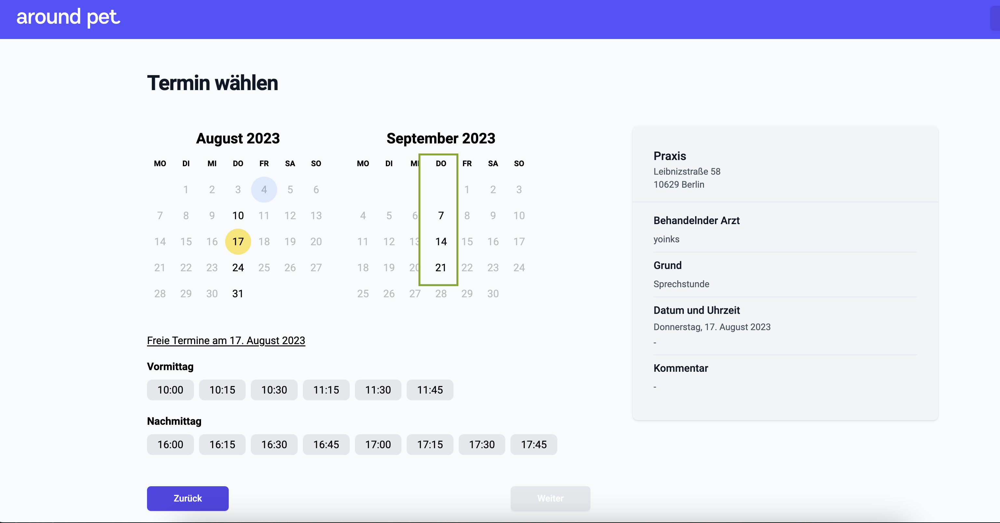

Nach dem Klick auf **Weiter** unten rechts kann noch ein Kommentar/Anmerkung übermittelt werden.

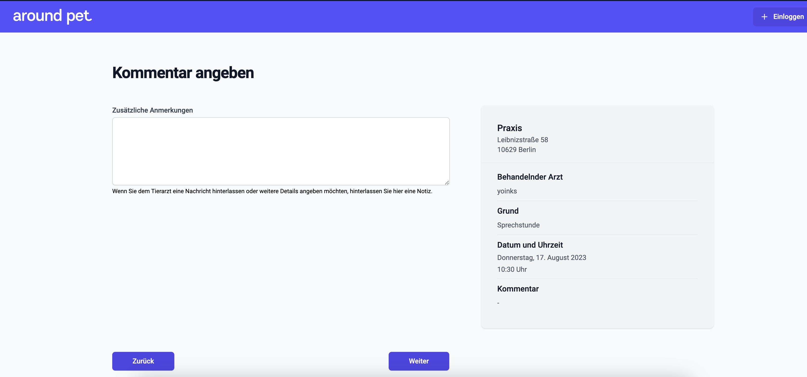

Da die Onlinebuchung für debevet grundsätzlich über around.pet erfolgt, muss einmalig ein Accout für around.pet erstellt werden.
Dafür bestehen 3 Optionen:

* Google Login nutzen (Android nutzende Kunden haben immer automatisch einen Google Account)
* Apple Login nutzen (iphone Nutzer haben immer automatisch einen Apple Account)
* Einen neuen Account im around.pet manuell erstellen

Zur Neuerstellung eines Accounts ohne Nutzung von Google oder Apple login klicken Sie unten auf "Registrieren".

Nun müssen die Mailadresse und ein gewünschtes Passwort eingegeben werden. Wichtig ist hierbei, dieselbe Mailadresse zu nutzen, die bereits beim Tierarzt hinterlegt ist.
Ansonsten würde eine zweite Kartei angelegt werden.

Im nächsten Schritt werden die Adressdaten abgefragt. Mit diesen wird eine neue Kartei im Tierarztprogramm debevet automatisch erzeugt. Sollte mit der
Emailadresse bereits eine Karte existieren, so wird diese genutzt.

Im nächsten Schritt besteht die Möglichkeit, das gewünschte Tier anzulegen. Dies geschieht natürlich nur einmalig.

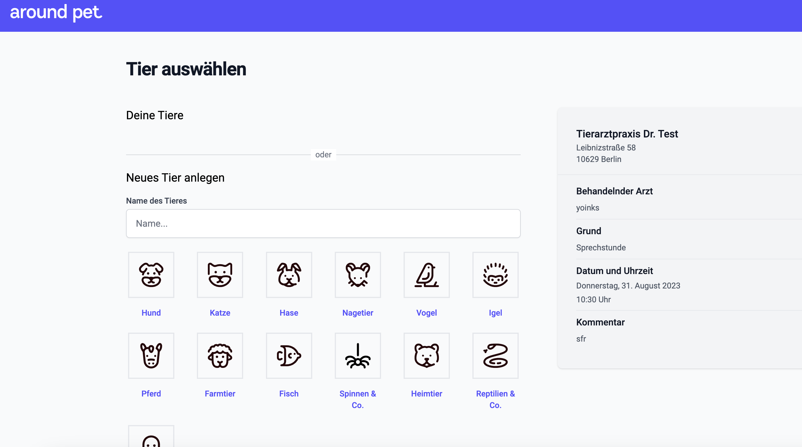

Bei jeder weiteren Buchung werden nach dem Login automatisch die angelegten Tiere zur Auswahl angezeigt.
Das gewünschte Tier kann dann gewählt werden.

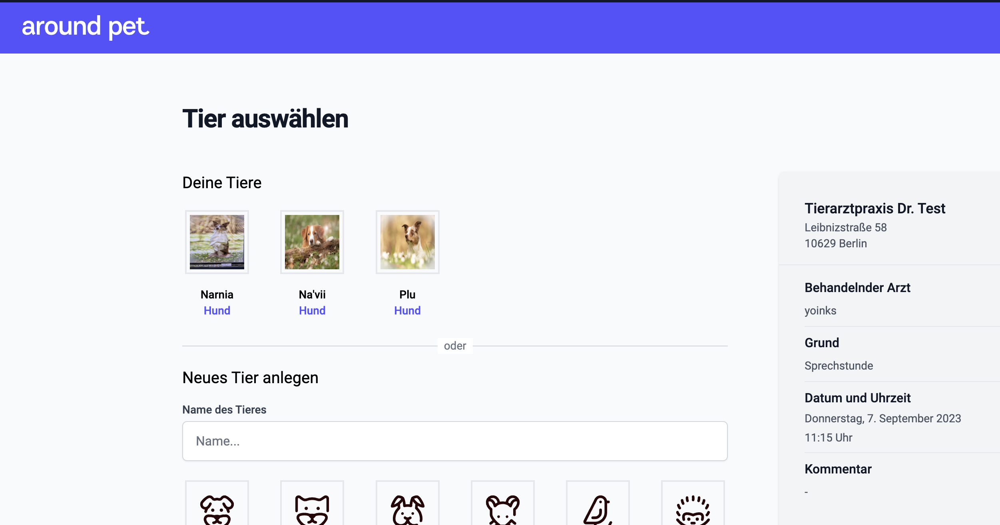

Nach dem Klick auf **Termin bestätigen** unten wird eventuell noch eine Abfrage erfolgen, die eine Doppelung der Karteien vermeiden soll.
Falls beim Tierarzt ein Tier zu diesem Kunden mit diesem Namen bereits existiert (eventuell Schreibweise anders etc.) muss noch einmalig
gewählt werden, um welches Tier es sich handelt. So wird eine Doppelung vermieden.

Der Termin ist nun gebucht bzw. wenn es sich nur um eine Terminanfrage handelt, liegt diese Anfrage beim Tierarzt. Der Bestätigungstext auf der
Erfolgsseite sowie in der automatisch versandten Bestätigungsmailist entsprechend angepasst. Falls es sich um eine Terminanfrage handelt, wird nach dem Annehmen
des Termins seitens des Tierarztes eine endgültige Bestätigung erneut versandt.

## Terminerinnerungen

Aktuell werden 24 Stunden und 1 Stunde vor Termin eine Mail mit einer Terminerinnerung verschickt.

## Termine einsehen und Termine absagen

Um Termine einzusehen (Terminliste) oder abzusagen, muss der Kunde sich in den around.pet Account einloggen. Dies kann mit einem Klick oben rechts
mit Klick auf **Einloggen** erfolgen.

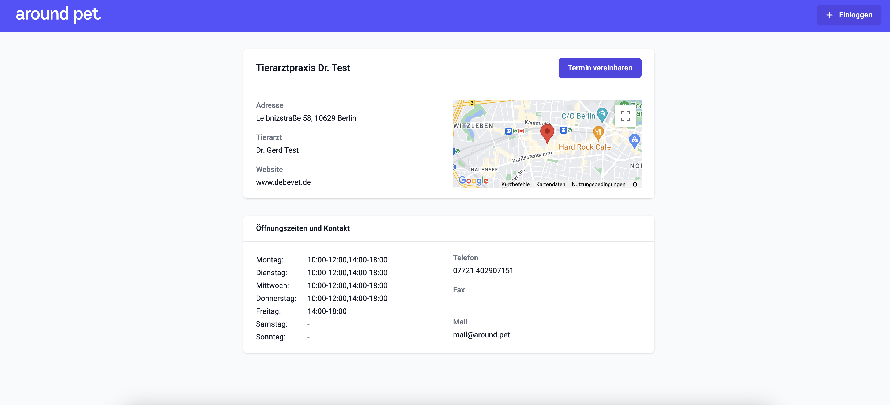

Anschließend kann mit einem Klick auf das Kreis-Symbol oben rechts **Terminübersicht** gewählt werden.

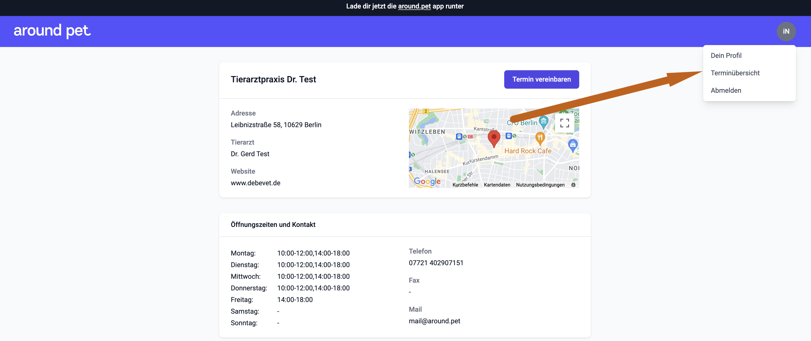

Nun werden alle gebuchten Termine sichtbar und können im Rahmen der vorgegebenen Stornierungszeiten mit Klick auf **Termin absagen** storniert
werden. Die Termine bleiben in der Liste sichtbar, werden aber als abgesagt gekennzeichnet. Dabei wird unterschieden in "Vom Tierarzt abgesagte" und
"Vom Kunden abgesagte" Termine.

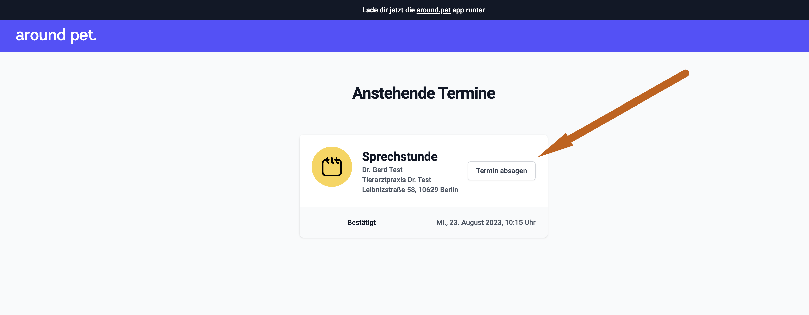

In Bearbeitung: Am Termin wird zeitnah der Tiername zu sehen sein, damit Kunden mit mehreren Tieren den Überblick behalten.

## Kundenansicht der around.pet App

Generell ist unsere App ein Multitool: Der Kunde kann viele Vorteile nutzen, die auch Sie als Tierarzt genießen können:

* Terminbuchung möglich
* Terminerinnerungen via Push Nachricht
* Termine einfach Absagen
* Alle wichtigen Daten vom Tier dokumentieren:
* Unterlagen wie z.B. Versicherungen abspeichern, um diese immer griffbereit zu haben
* Krankheitstagebuch (vor allem zur Dokumentation von chronisch kranken Tieren perfekt)
* Impfungen und Wurmkuren eintragen
* Medikamentenpläne erstellen
* Operationen eintragen
* Gewicht dokumentieren (mit Grafiken, sehr motivierend beim Abspecken)
* Erste Hilfe Lexikon von Tierärzten geschrieben
* Gesundheitstipps im Blog von Tierärzten geschrieben, Fachwissen zu diversen Themen

Nach dem Herunterladen der App kann ein Account mit Apple, Google oder einfach manuell erstellt werden. Die eigenen Tiere können,
sogar mit Foto, angelegt werden. Auch alle gewünschten Daten und Informationen können im Tier hinterlegt werden.

Download im Appstore: (iphone, ipad)
https://apps.apple.com/de/app/around-pet/id1538220356

Download für Android:  
https://play.google.com/store/apps/details?id=pet.around.pet&pli=1

Die Startseite sieht so aus (Beispiel mit bereits angelegten Tieren):

    

### Tier anlegen

Mit einem Klick unten im Menü auf **Tiere** erscheint eine Übersicht über alle Tiere. Mit einem Klick auf das Plus-Symbol oben rechts kann
ein neues Tier angelegt werden.

    

Zunächst muss die Tierart und die Rasse angegeben werden.

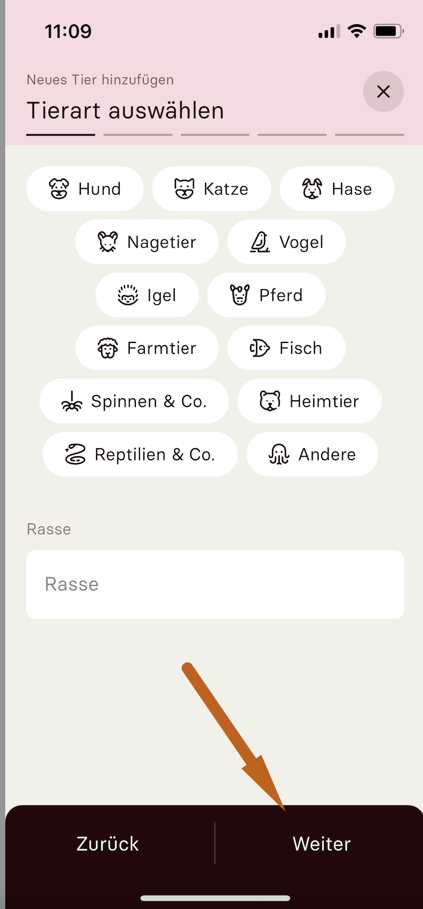

Mit dem Klick unten rechts auf **Weiter** werden in jedem Schritt weitere Details abgefragt und es besteht die Möglichkeit, ein
Bild einzufügen.

Am Ende kann das Tier angelegt werden und ist dann in der Übersicht verfügbar.

### Termine buchen mit der App

Mit einem Klick auf **Termine** unten wird die Option **Neuen Termin vereinbaren** angezeigt.

Anschließend kann dann eine Tierarztpraxis nach Standort oder Namen gesucht werden. Die bereits mit dem Kunden verbundenen Tierarztpraxen werden
direkt zur Auswahl angeboten.   
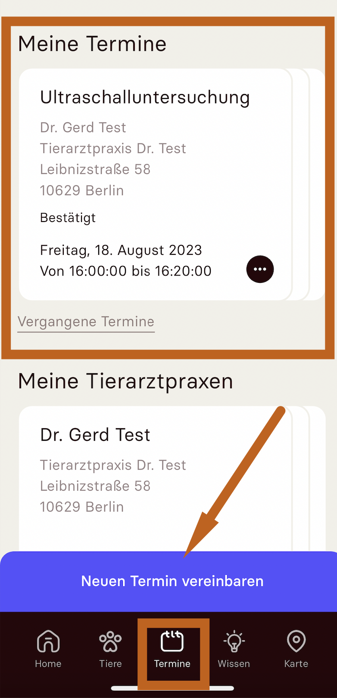

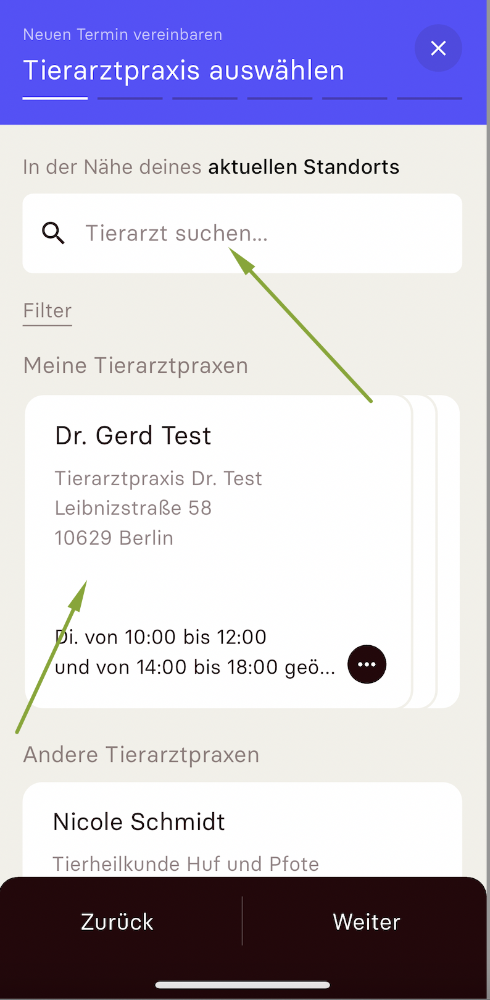

Anschließend kann ein Tierarzt und eine Dienstleistung gebucht werden. Wenn ein Tierarzt eine bestimmte Dienstleistung nicht anbietet,
wird diese ausgegraut und ist nicht wählbar. Gewählte Elemente werden in gelb dargestellt.

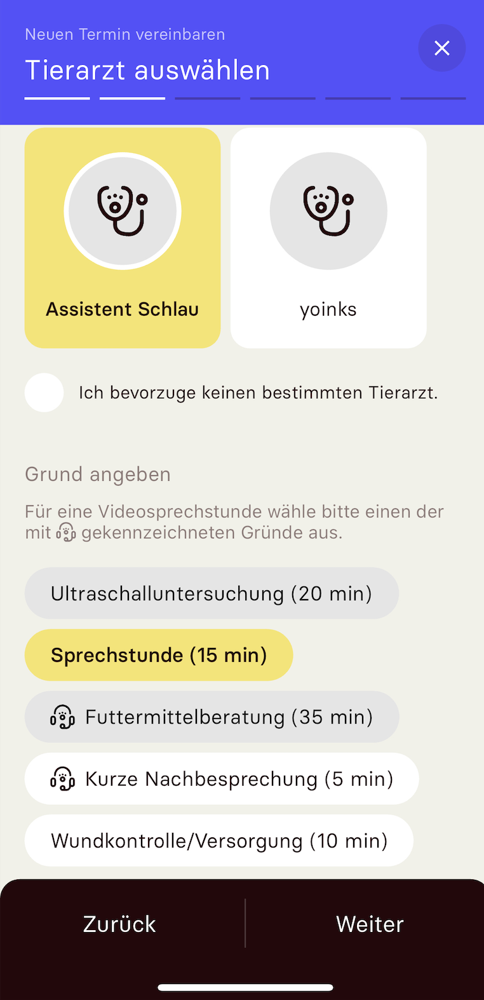

Mit einem Klick auf **Weiter** unten rechts wird die Kalenderansicht angezeigt. Tage, an denen die gewünschte Dienstleistung verfügbar ist,
sind schwarz.

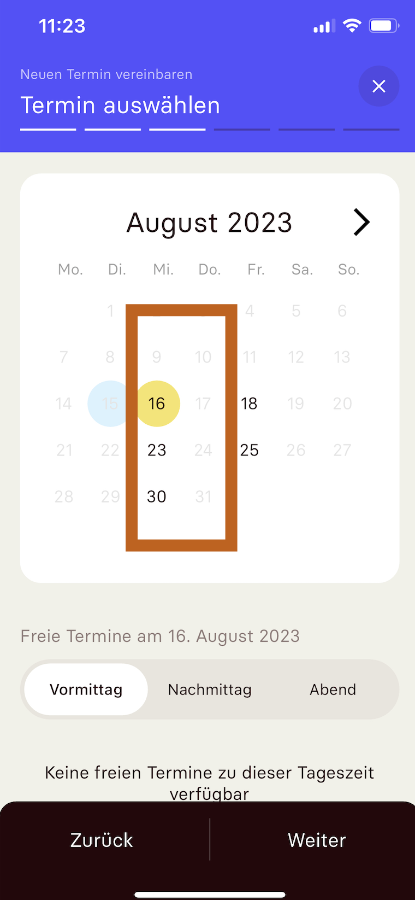

Anschließend muss die Tageszeit gewählt werden, anschließend werden die Zeiten angeboten.

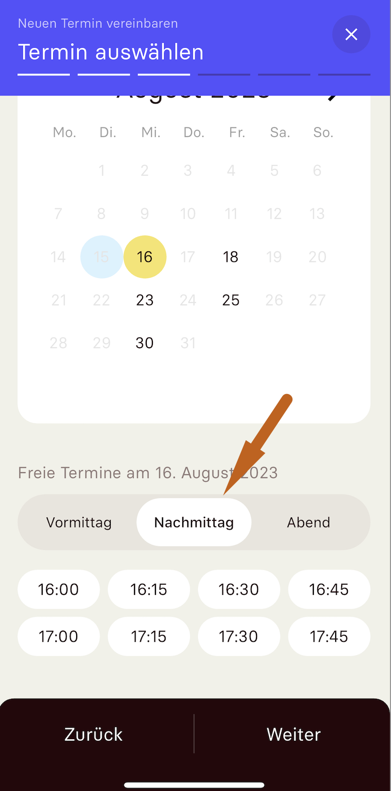

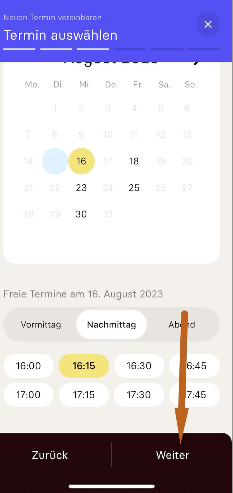

Nach Auswahl und Klick **Weiter** gelangt man zur Tierauswahl.

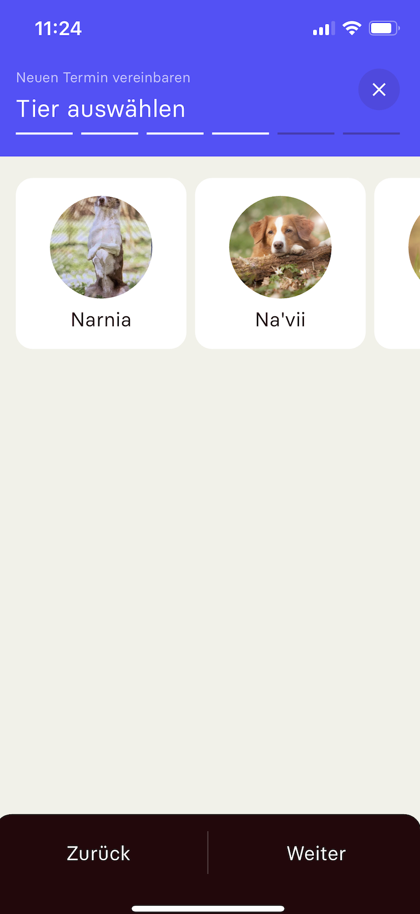

Nach dem Wählen des Tieres kann eventuell eine Auswahl nötig sein, falls der Tierarzt schon Tiere kennt. In diesem Fall
muss das Tier dem bereits im Tierarztprogramm bekannten Tier zugewiesen werden, um eine doppelte Kartei zu vermeiden:

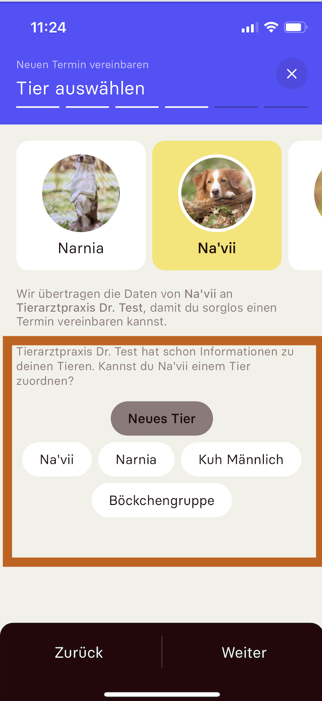

Nach dem Klick auf **Weiter** kann ein Kommentar übermittelt werden.

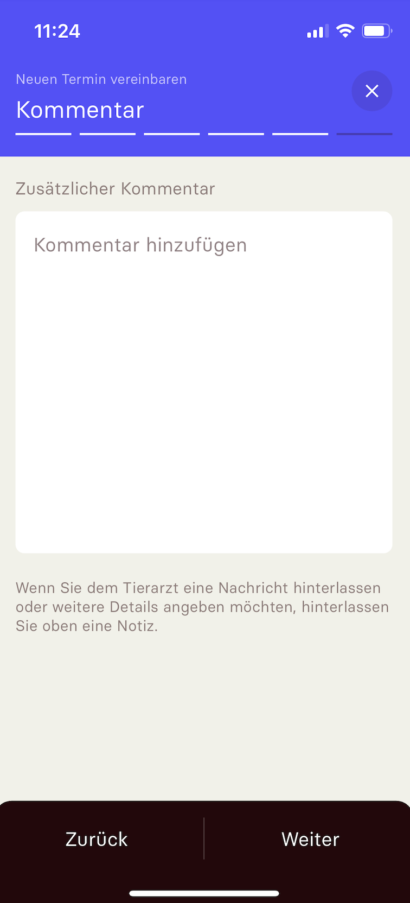

Anschließend wird eine Übersicht der Daten angezeigt und der Termin muss abschließend bestätigt werden. Er erscheint dann in der
Terminübersicht, entweder als "angefragt" oder direkt als "bestätigt", je nach Vorgaben des Tierarztes.

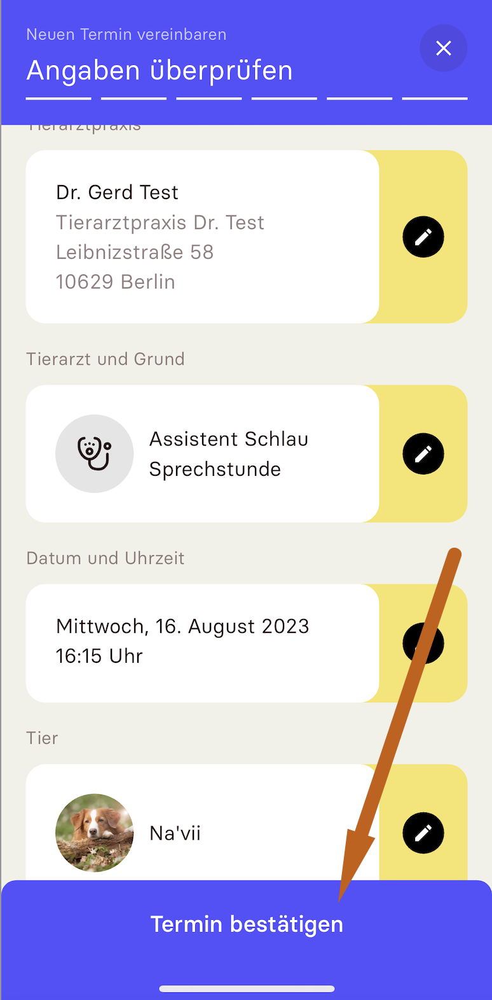

### Termine einsehen und absagen mit der App

Mit dem Klick auf **Termine** im Menü unten wird eine Übersicht der gebuchten Termine erstellt. Mit wischen nach rechts und links
kann zwischen den Terminen gewechselt werden.

Jeder Termin kann angeklickt werden und zeigt eine Übersicht, mit welchem Tier, bei welchem Tierarzt zu welcher Uhrzeit und an welchem Tag
der Termin stattfindet. Ganz unten gibt es die Option **Termin absagen**. Damit kann der Termin (im Rahmen der Absagefristen) storniert werden.

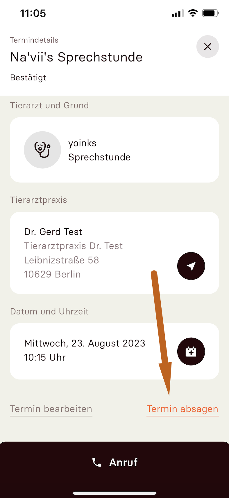

Anschließend wird der Termin in der Terminübersicht als "abgesagt" gekennzeichnet.

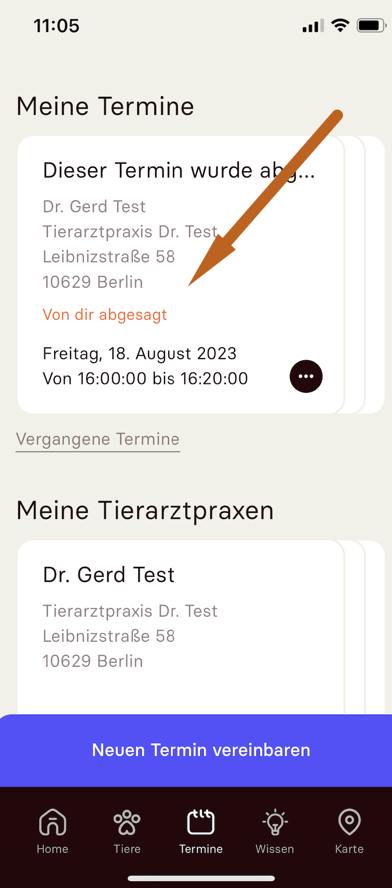

### Tipps und Erste Hilfe Lexikon lesen

Wird unten die Auswahl **Wissen** angeklickt, stehen unsere Wissensartikel (von Tierärzten geschrieben) sowie ein Erste Hilfe Lexikon
zur Verfügung(ebenfalls tierärztlich verfasst). Ein Klick auf den Pfeil oben links leitet zurück auf die Hauptseite.

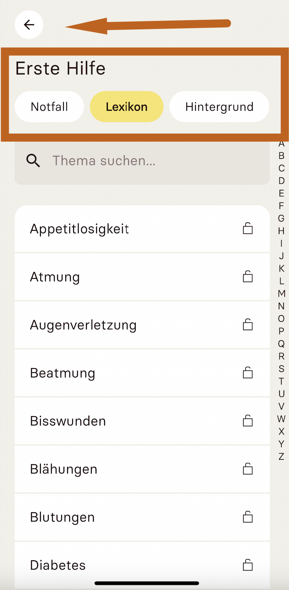