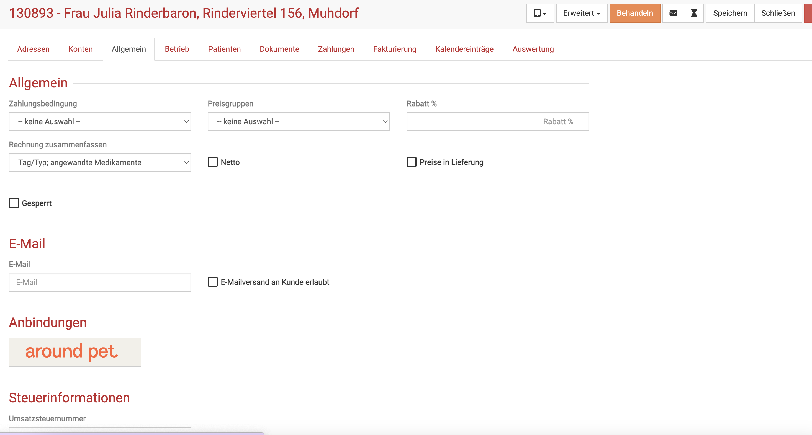

# Terminerinnerungen verschicken 

Sie möchten Ihre Kunden an die Termine in Ihrer Praxis erinnern?

Wenn Ihre Kunden einmalig mit unserer around.pet Schnittstelle verbunden sind, ist dies problemlos möglich. 

Sobald der Kunde einen around.pet Account hat, und mit Ihrer Praxis darüber verbunden ist, bekommt der Kunde folgende
Benachrichtigungen:   

* Terminbestätigung  
* Terminerinnerung 24 Stunden vor dem Termin
* Terminerinnerung 1 Stunde vor dem Termin 

Dabei bekommt der Kunde:   

* Eine Email (mit Absagelink)   
* Eine Push-Nachricht auf sein Smartphone (sofern diese in den Einstellung des Smartphones zugelassen sind und die App installiert ist!)   

:::tip Tipp:  

Die Kunden haben nach der Onlinebuchung über das Webwidget einen mit Ihrer Praxis verknüpften Account. Alternativ können Sie an
jedem Kunden unter "Allgmein" mit Klick auf den around.pet Button zur App einladen.    

   

:::  

Bedenken Sie bitte, dass Sie für diese Funktion Ihre around.pet Schnittstelle aktivieren müssen. Die Anleitung dazu finden Sie hier:

https://handbuch.debevet.de/docs/Online_Terminbuchung/Online_Terminvergabe#aroundpet-schnittstelle-aktivieren