# Einrichtung des Dashboards

Debevet bietet Ihnen die Möglichkeit, individuell das Dashboard, also die "Startseite" Ihrer Praxis Software zu gestalten. Die wichtigsten Dinge haben Sie somit immer direkt im Griff.

Um Ihr Dashboard zu gestalten, gehen Sie wie folgt vor:

1. Klicken Sie links in der Leiste auf das Zahnradsymbol   
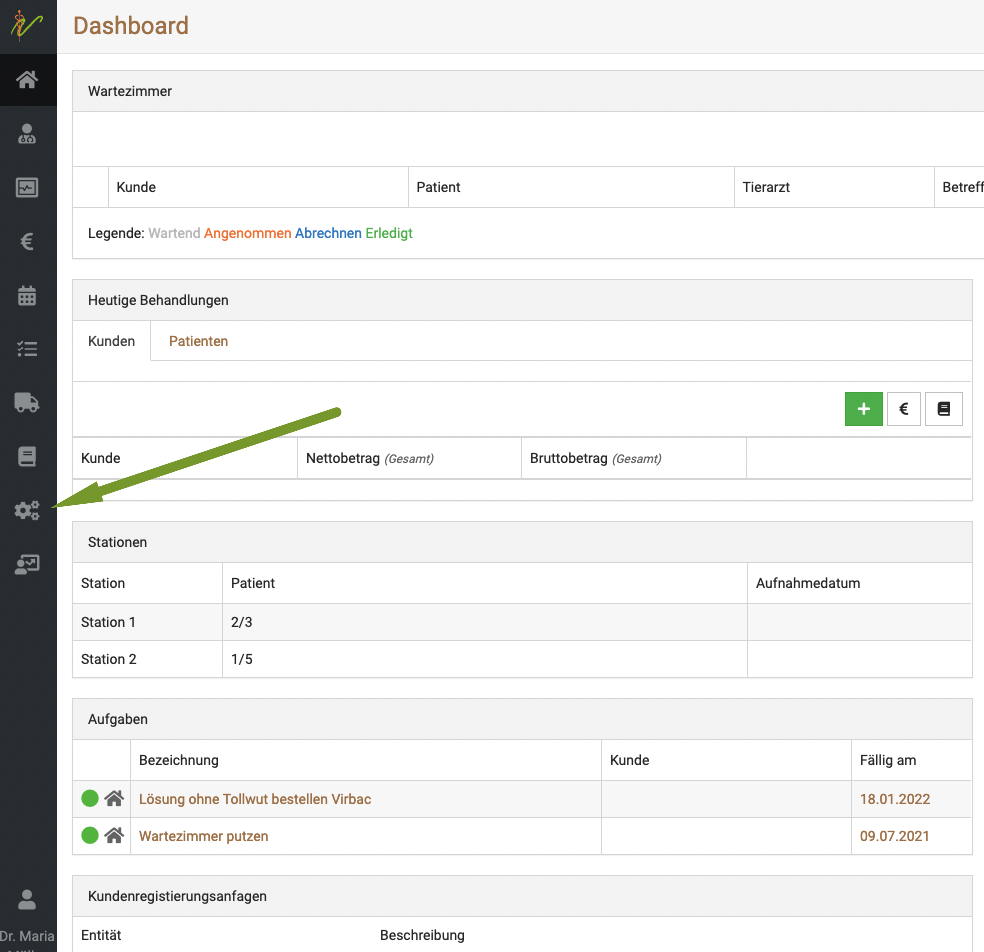
   

2. Klicken Sie auf **"Einstellungen"**    

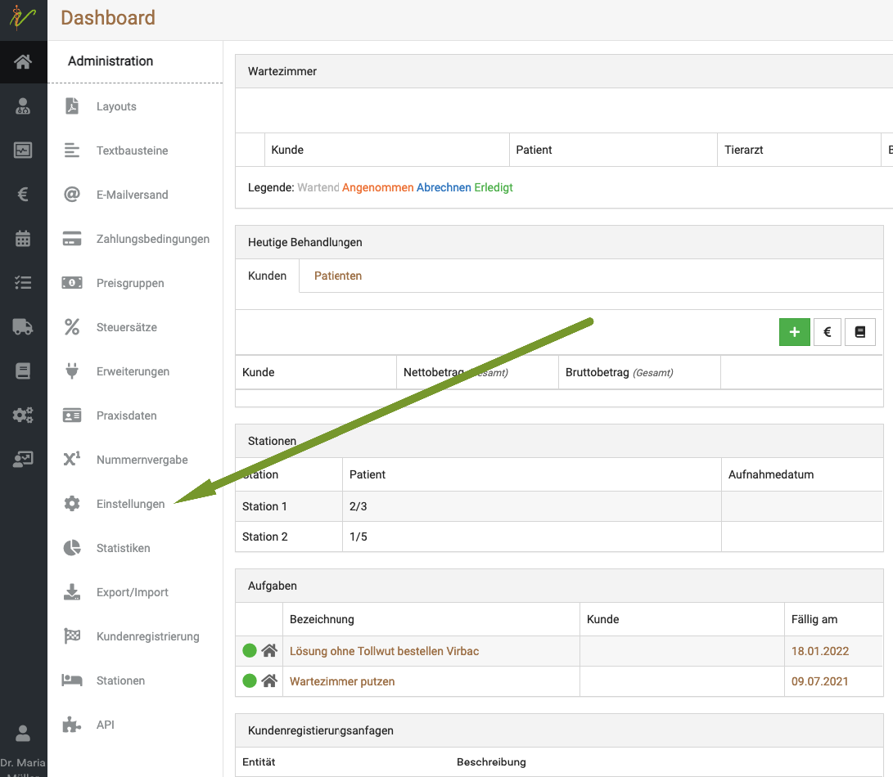

1. Wählen Sie nun die unterschiedlichen Optionen, was Sie auf ihrem Dashboard anzeigen möchten. Der lila-farbene Haken
bedeutet, dass die Option aktiv angezeigt wird. Mit einem Klick auf den Haken können Sie diesen entfernen oder setzen.
Klicken Sie anschließend oben rechts auf "speichern"     

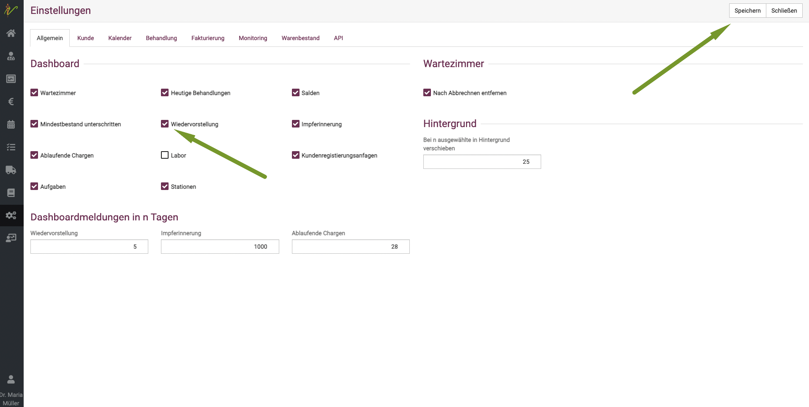

## Wartezimmer

Im **Wartezimmer** erhalten SIe einen Überblick oder die wartenden Kunden.  

Es informiert Sie übersichtlich über die tagesaktuellen Sprechstundentermine, den behandelnden Tierarzt und den Status 
der einzelnen Kunden bzw. Patienten (z.B. wartend, in Behandlung, fertig bzw. abzurechnen).  

Zudem können Sie Mitteilungen über einen Patienten/Kunden in der Behandlung dort anzeigen lassen.  

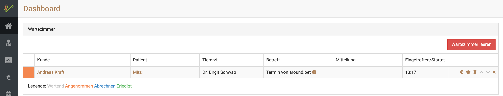  

### Funktionen des Wartezimmers  

Diese Funktionen stehen Ihnen zur Verfügung:

* **Sanduhr:** Der Patient wir dem Wartezimmer hinzugefügt.
* **Häkchen:** Der Patient wurde behandelt.
* **Pfeil nach unten:** Verschieben Sie diesen Patienten eine Position nach unten bzw. hinten.
* **Pfeil nach oben:** Verschieben Sie diesen Patienten eine Position nach oben bzw. vorne.
* **Stern:** Der Patient wird mit "Erledigt" markiert.
* **Euro:** Der Patient wird mit "Abrechnen" markiert.
* **Kreuz:** Löschen Sie diesen Patienten aus dem Wartezimmer.

### Patienten ins Wartezimmer sezten

Der Patient wird aus der Kundenkartei über das Sanduhr-Symbol in das Wartezimmer geschoben.  

  

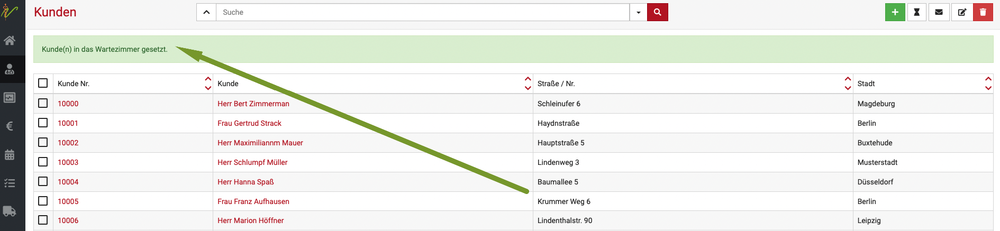  

Sie können auch direkt aus dem Terminkalender den Kunden annehmen und dort über das gleiche Symbol in das Wartezimmer hinzuzufügen.

In dem Fall kommt der Betreff kommt aus dem Titel des Kalendereintrages und die Mitteilung wird aus der Behandlungsansicht dargestellt.

:::caution Achtung:  

Wenn Sie einen Kunden aus dem Terminkalender in das Wartezimmer setzen, wird automatisch als "Tierarzt" der Tierarzt in der Übersicht 
angezeigt, auf dessen Namen der Kalender läuft! Wenn Sie also verschiedene Ärzte nutzen, funktioniert diese Übersicht nur dann korrekt,
wenn der Patiententermin auch im passenden Kalender war.  

:::  

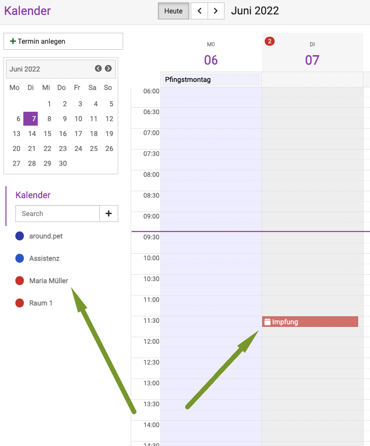  

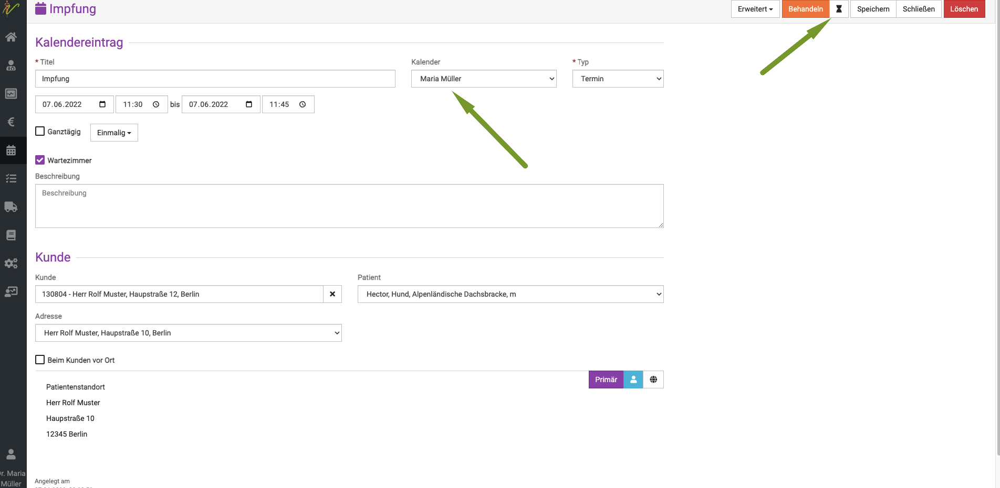

Hier im Beispiel ist der Termin im Kalender von Maria Müller eingetragen. Somit erscheint der Patient dann im Wartezimmer in der Übersicht auch
für diesen Tierarzt. Wenn Sie in Ihrer Praxis also im Wartezimmer bereits Zuweisungen nutzen wollen, muss die Mitarbeiterin, die den Kunden ins Wartezimmer
setzt, diesen in den passenden Kalender setzten, bevor Sie ihn ins Wartezimmer schiebt.  

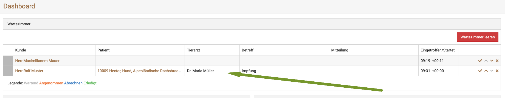

## Heutige Behandlungen 

**Heutige Behandlungen** gibt Ihnen einen Überblick über die heute anstehenden Behandlungen.

### Heutige Behandlungen einsehen  

Unter **Heutige Behandlungen** erscheinen die Patienten, die Sie an diesem Tag behandelt haben. Wenn Sie auf das Plus-Symbol klicken, gelangen Sie zu **Behandlung**. 
Dort können Sie im Suchfeld nach dem Patienten oder dem Kunden suchen. Haben Sie den richtigen Datensatz gefunden, gelangen Sie zur Datenübersicht und können die heutige Behandlung
eintragen - zum Beispiel eine Impfung mit Chargennummer.

Alternativ können Sie den Patienten ins Wartezimmer setzen, indem Sie auf Wartezimmer und "Hinzufügen" klicken. Von dort aus können Sie den Patienten direkt abrechnen. 
Oder Sie nutzen das €-Symbol unter "Heutige Behandlungen", um den Kunden abzurechnen.

Nach der Abrechnung ist der Patient aus dem Wartezimmer und "Heutige Behandlungen" verschwunden.

Ist der Patient noch nicht vorhanden, legen Sie die Daten wie folgt an:   
Klicken Sie auf das Plus-Symbol neben **Kunde** unter **Heutige Behandlungen** und ergänzen Sie in der Eingabemaske die Daten. 
Im Anschluss können Sie durch Anwählen des Plus-Symbols neben **Patient** die Daten zum Tier eintragen.  

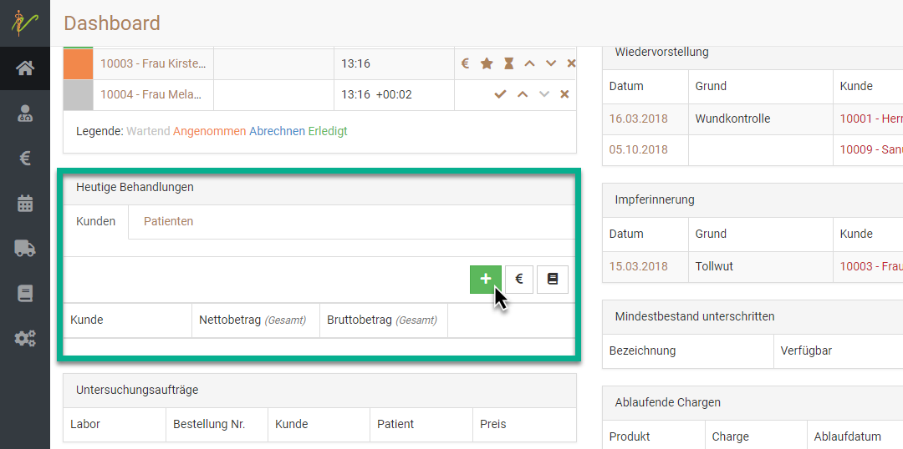   

## Patienten abrechnen oder abschließen  

Haben Sie Ihre Behandlung in der debevet-Patientenakte eingetragen, erscheint der Eintrag automatisch unter Heutige Behandlungen. 
Sie können den Kunden nun entweder aus dem Wartezimmer löschen, indem Sie das x klicken, oder bis zum gewünschten Zeitpunkt in der Wartezimmer-Übersicht stehen lassen.  

### Sofortige Abrechnung

Wenn Sie die Behandlung sofort abrechnen möchten, klicken Sie auf das €-Symbol im Bereich Wartezimmer oder im Bereich Heutige Behandlungen.

Debevet erzeugt automatisch eine Rechnung auf der Grundlage der bei diesem Patienten eingetragenen Vorlagen-Behandlung. Sobald die Rechnung erzeugt wurde, 
verschwindet der Kunde sowohl aus dem Wartezimmer als auch aus **Heutige Behandlungen**.

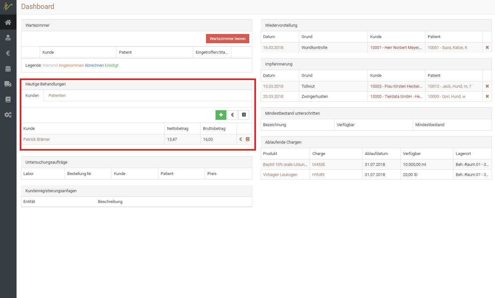   

## Untersuchungsaufträge

Hier sehen Sie einen Überblick über die anstehenden Untersuchungsaufträge Ihrer Praxis. (Labor)

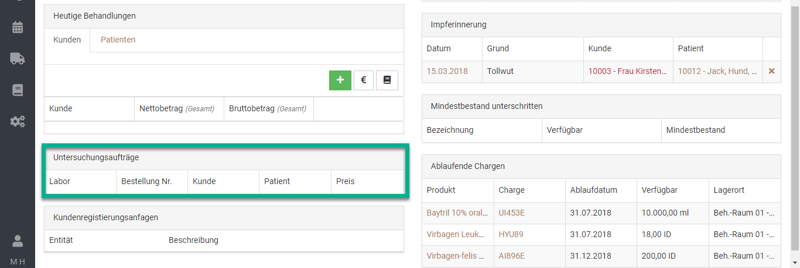  

## Salden  

Um Ihre Salden nach dem Jahreswechsel im Dashboard anzeigen zu lassen, können Sie in der Buchhaltung unter "Belege" folgende Einstellung vornehmen: 
Gehen Sie, wie in den unten abgebildeten Screenshots über Vorlagen (oben rechts) und wählen Sie die Vorlage "Saldenvortrag". 
Diese können Sie mit einem gewünschten Datum, Konto, Betrag und Buchungstext speichern. Daraufhin wird sich der gespeicherte Saldenvortrag im Dashboard anzeigen.

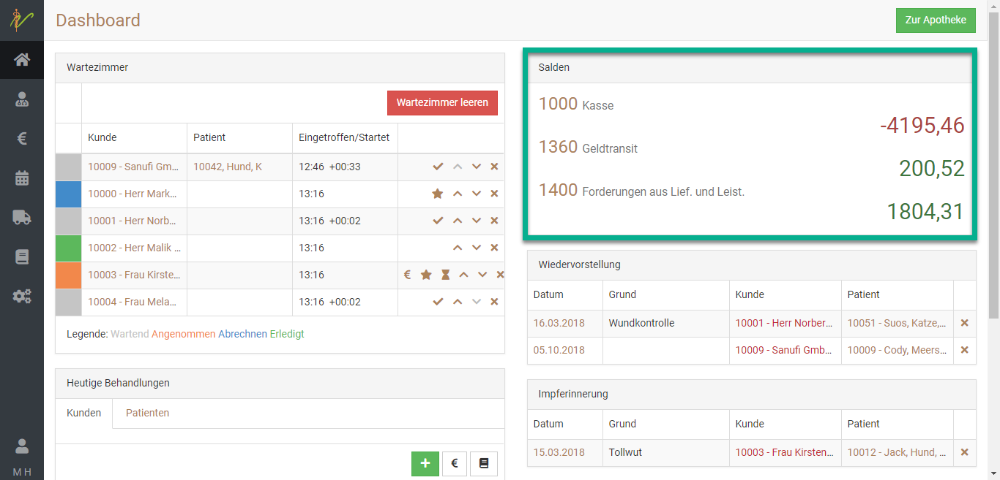  

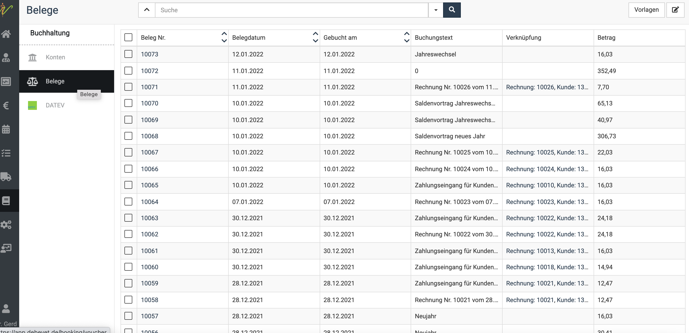  

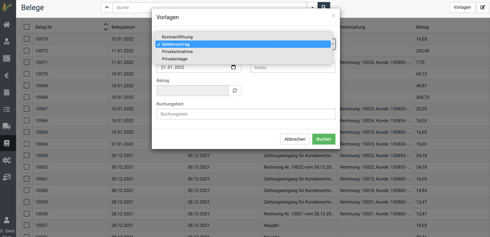  

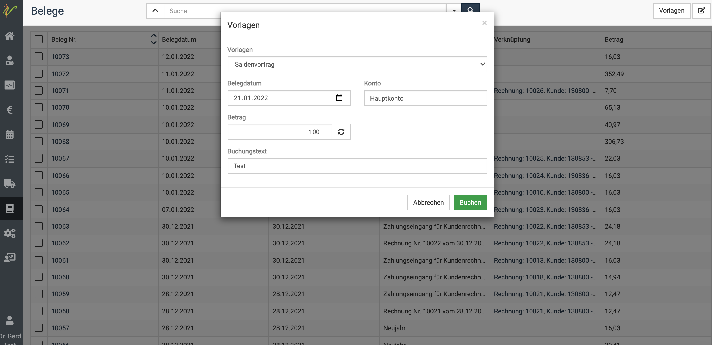
  
## Wiedervorstellungen

Unter **Wiedervorstellungen** sehen Sie fällige Wiedervorstellungen. Klicken Sie auf den Kunden, um zur Bearbeitungsseite zu gelangen.

In debevet können Sie festlegen, ab wann Erinnerungen angezeigt werden sollen.

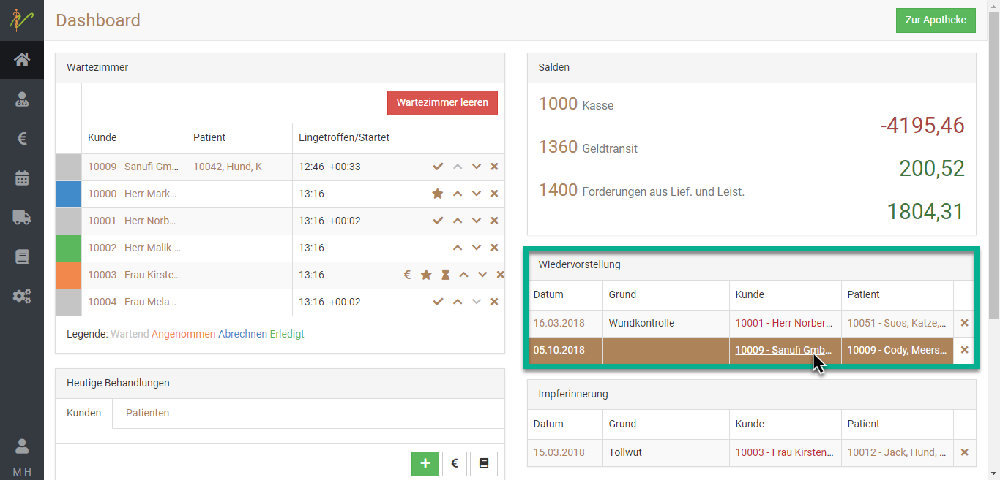  

## Impferinnerung  

Unter **Impferinnerung** sehen Sie in debevet auf einen Blick, welche Impfungen als nächstes vorgenommen werden müssen. 
Wenn Sie in die Daten klicken, gelangen Sie direkt zur Patientenakte.  

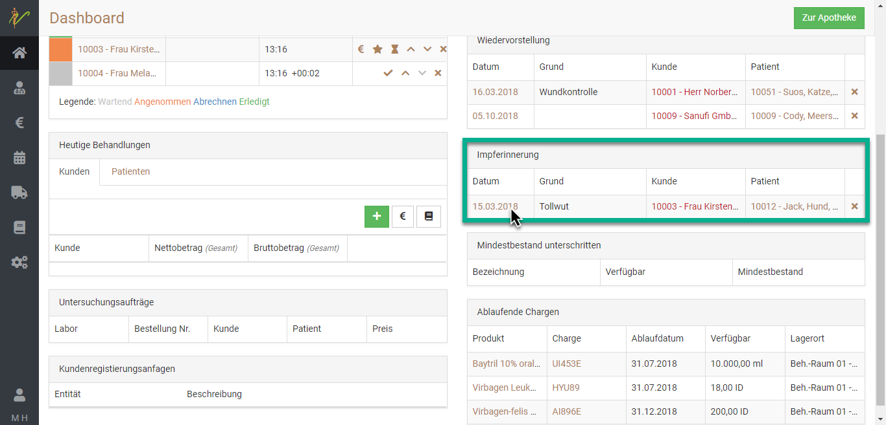  

## Mindestbestand unterschritten  

Im Dashboard wird Ihnen angezeigt, bei welchen Produkten der **Mindestbestand** unterschritten wurde. 

:::caution Achtung:

Das funktioniert nur, wenn Sie beim Anlegen des Produktes einen Mindestbestand hinterlegt haben. Somit werden in dieser Übersicht 
nur die Medikamente/Produkte angezeigt, bei denen Sie selbst vorher einen Mindestbestand hinterlegt haben.   

:::  

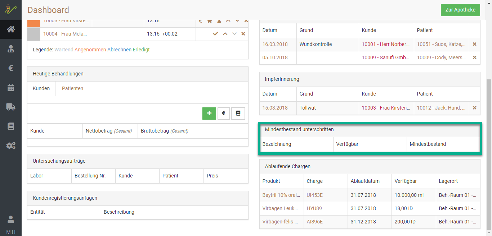  

## Ablaufende Chargen  

Im Dashboard sehen Sie auch auf einen Blick, welche Chargen **in Kürze ablaufen werden**. Mit Klick auf das Medikament gelangen Sie zu der betroffenen Charge.
  
:::danger WICHTIG:  

Bitte beachten Sie diese Ablaufdaten **unbedingt** und entsorgen Sie die entsprechenden Produkte nach dem Ablaufdatum.   

:::  

