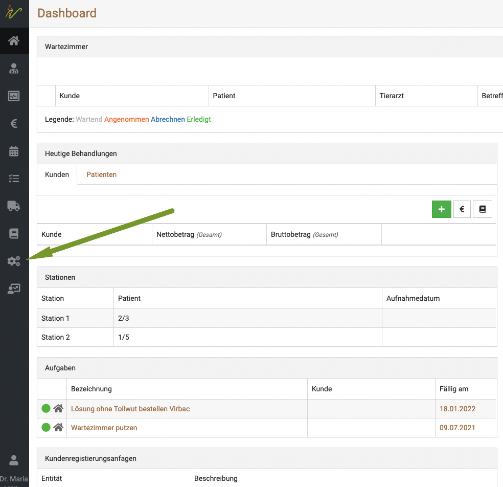
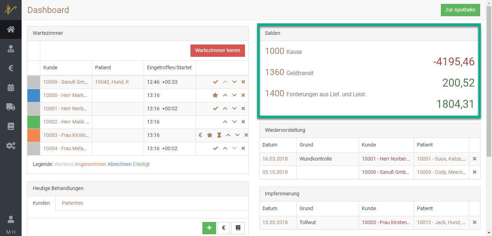
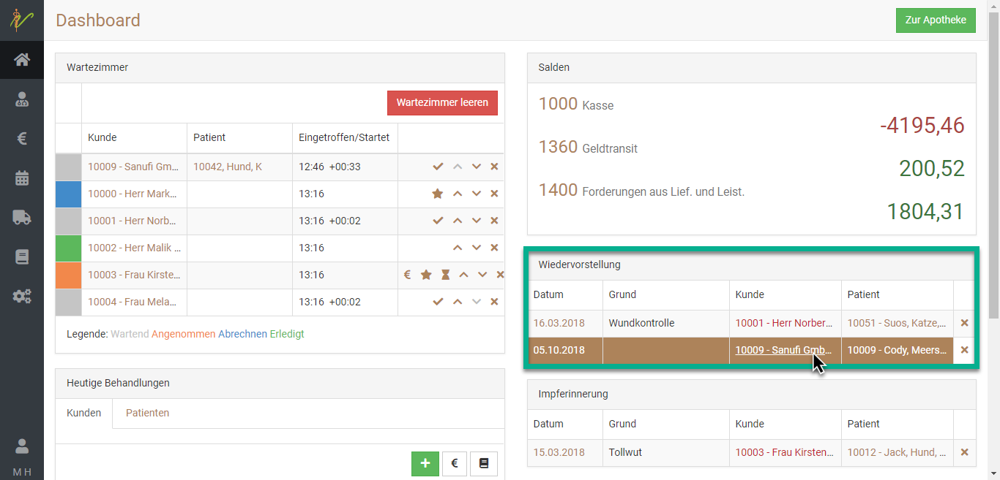
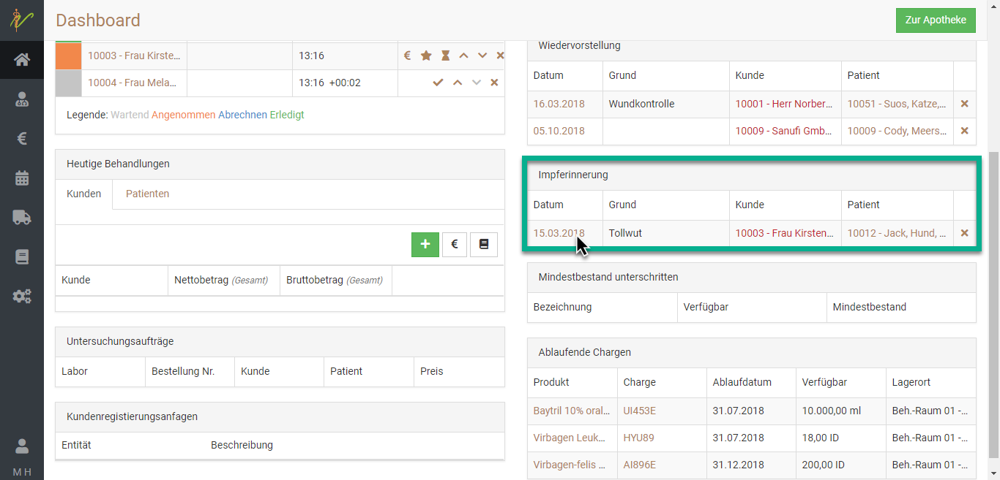

# Einrichtung des Dashboards

Debevet bietet Ihnen die Möglichkeit, individuell das Dashboard, also die "Startseite" Ihrer Praxis Software zu gestalten. Die wichtigsten Dinge haben Sie somit immer direkt im Griff.

Um Ihr Dashboard zu gestalten, gehen Sie wie folgt vor:

1. Klicken Sie links in der Leiste auf das Zahnradsymbol   

   

2. Klicken Sie auf **"Einstellungen"**    

1. Wählen Sie nun die unterschiedlichen Optionen, was Sie auf ihrem Dashboard anzeigen möchten. Der lila-farbene Haken
bedeutet, dass die Option aktiv angezeigt wird. Mit einem Klick auf den Haken können Sie diesen entfernen oder setzen.
Klicken Sie anschließend oben rechts auf "speichern"     

## Wartezimmer  

Die Nutzung des Wartezimmers ist noch einmal in einem gesonderten Artikel beschrieben. Auf dem Dashboard haben Sie einen Überblick, welche Patienten 
in welchem "Status" im Wartezimmer sind. 

Lesen Sie mehr dazu hier:  

[Wartezimmer nutzen](/docs/Patienten/Wartezimmer)

## Untersuchungsaufträge

Hier sehen Sie einen Überblick über die anstehenden Untersuchungsaufträge Ihrer Praxis. (Labor)

  

## Salden  

Um Ihre Salden im Dashboard anzeigen zu lassen, Sie den Haken bei **Salden** setzen.  

:::caution Hinweis  

Bei der Nutzung von lexware als Buchhaltungserweiterung steht diese Anzeige auf dem Dashboard leider nicht zur Verfügung.  Sie müssen
Collmex oder die debevet interne Buchhaltung nutzen, um diese Funktion zu nutzen.   

::: 

Unter Ihrer Buchhaltungsschnittstelle können Sie dann einstellen, welche Konten Ihnen hier angezeigt werden können. Mehr dazu finden
Sie in der Beschreibung der jeweiligen Buchhaltung hier in diesen Hilfeseiten.

  
## Wiedervorstellungen

Unter **Wiedervorstellungen** sehen Sie fällige Wiedervorstellungen. Klicken Sie auf den Kunden, um zur Bearbeitungsseite zu gelangen.

In debevet können Sie festlegen, ab wann Erinnerungen angezeigt werden sollen.

  

## Impferinnerung  

Unter **Impferinnerung** sehen Sie in debevet auf einen Blick, welche Impfungen als nächstes vorgenommen werden müssen. 
Wenn Sie in die Daten klicken, gelangen Sie direkt zur Patientenakte.  

  

## Mindestbestand unterschritten  

Im Dashboard wird Ihnen angezeigt, bei welchen Produkten der **Mindestbestand** unterschritten wurde. 

:::caution Achtung:

Das funktioniert nur, wenn Sie beim Anlegen des Produktes einen Mindestbestand hinterlegt haben. Somit werden in dieser Übersicht 
nur die Medikamente/Produkte angezeigt, bei denen Sie selbst vorher einen Mindestbestand hinterlegt haben.   

:::  

  

## Ablaufende Chargen  

Im Dashboard sehen Sie auch auf einen Blick, welche Chargen **in Kürze ablaufen werden**. Mit Klick auf das Medikament gelangen Sie zu der betroffenen Charge.
  
:::danger WICHTIG:  

Bitte beachten Sie diese Ablaufdaten **unbedingt** und entsorgen Sie die entsprechenden Produkte nach dem Ablaufdatum.   

:::  

## Aufgaben 

Wenn Sie den Haken in diesem Feld aktivieren, sehen Sie auch alle zu erledigenden Aufgaben, die im Bereich **Aufgaben** angelegt wurden.