# Kundenverwaltung in debevet

Kunden nennen wir in debevet die Patientenbesitzer, also die Besitzer der Tiere.  

Hier können Sie Kunden suchen, anlegen, ändern oder auch löschen. Ferner gelangen Sie über die Bearbeitungsseite eines Kunden,
zu Informationen und Daten die zum jeweils ausgewählten Kunden in Beziehung stehen, wie z.B. Patienten, Rechnungen, Termine und vieles mehr.

## Neue Kunden anlegen

Klicken Sie im Hauptmenü auf **'Praxis'** und wählen Sie den Untermenüpunkt **'Kunden'**. Sie sehen die ungefilterte Liste Ihrer Kunden. Klicken Sie nun auf das grüne 'Plussymbol', um auf die Seite zur Eingabe eines neuen Kunden zu gelangen.

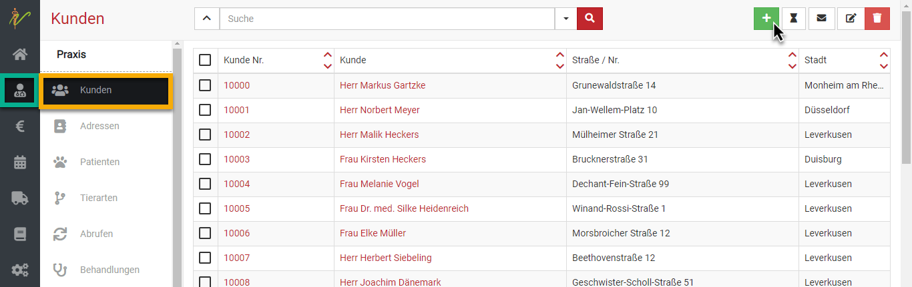
  
Geben Sie in der Eingabeseite die gewünschten Informationen ein und speichern Sie den neuen Kunden anschließend, in dem Sie auf **'Speichern'** klicken.  
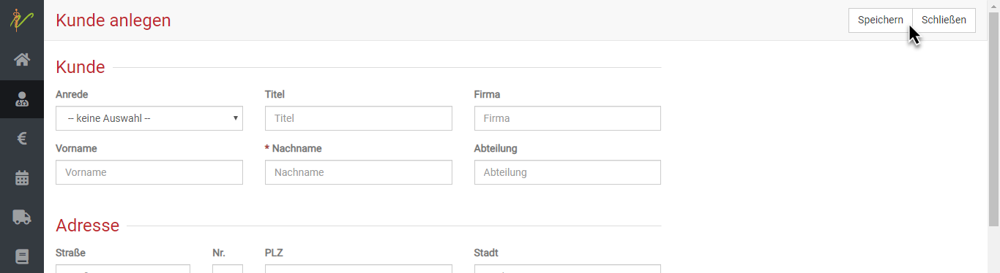   

:::info Videotipp  

Hier zu gibt es auch eine Videoanleitung   

<iframe width="560" height="315" src="https://www.youtube.com/embed/EYyZxKCDvNk" title="YouTube video player" frameborder="0"
allow="accelerometer; autoplay; clipboard-write; encrypted-media; gyroscope; picture-in-picture" allowfullscreen></iframe>  

:::  

  
### Automatische Adressvervollständigung

Für das Feld **'Straße'** ist die Online-Suche an eine Adressdatenbank angebunden. Bereits das Tippen weniger Buchstaben listet passende 
Treffer auf. Wählen Sie den passenden Eintrag aus, so werden die Adressdaten vollständig und automatisch in die Eingabefelder eingetragen.  

## Kunden suchen und finden  

Klicken Sie auf **Praxis**, dann auf **Kunden**. Das System listet alle Kunden auf. Tippen Sie in das Suchfenster wie bei einer Suchmaschine Begriffe ein, die auf den gewünschten Kunden passen und drücken Sie die **Entertaste** oder Klicken Sie auf das **Lupensymbol**.  

   
Wenn Sie neben dem Eingabefeld für die Schnellsuche oben auf den Pfeil nach unten klicken, können Sie auch nach gezielten Parametern bzw. weiteren Suchbegriffen filtern.  
 

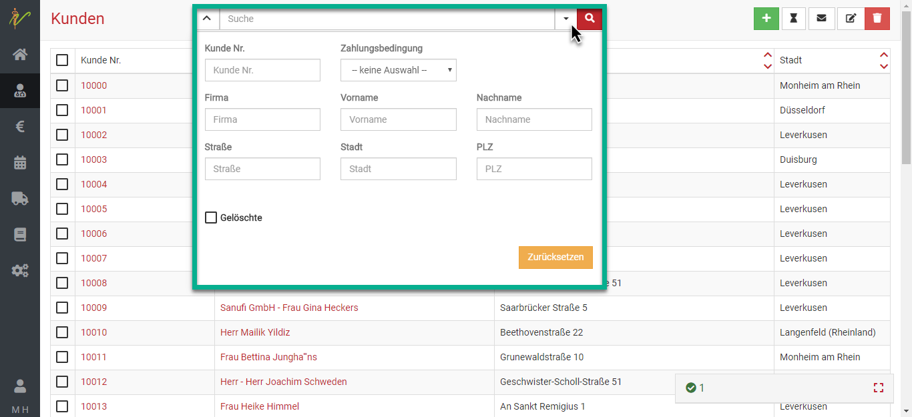
  
### Suchenfilter zurücksetzen

Wenn Sie eine Suche ausgeführt haben, ist die Kundenliste gefiltert, was dadurch angezeigt wird, dass der Pfeil nach unten neben den der Schnellsuche *gelb* ist. Klicken Sie auf den Pfeil nach unten und dann auf Zurücksetzen, um die Kundenliste wieder ungefiltert angezeigt zu bekommen.  

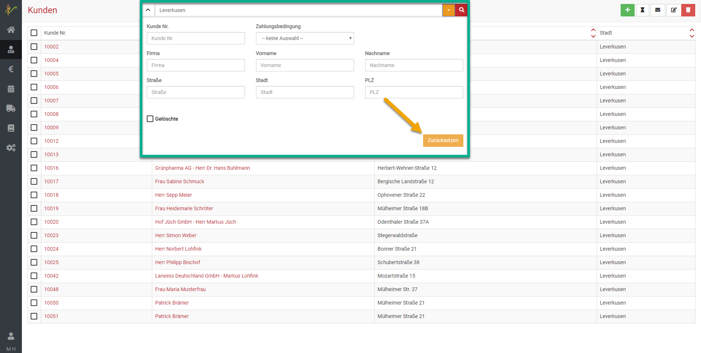
  
:::tip Tipp

Diese Funktion zum Nutzen der Suchenfilter und das Zurücksetzten des Suchfilters ist im kompletten Programm genauso nutzbar, wie hier beschrieben.  

:::  

## Kunden bearbeiten und weitere Details

Klicken Sie auf **Praxis** und auf **Kunden**. Klicken Sie in der Liste Ihrer Kunden auf den Link in der Spalte Kunde oder Kundennummer, um auf die Bearbeitungsseite des Kunden zu gelangen. Natürlich können Sie die Liste vorher über die Suche filtern.   

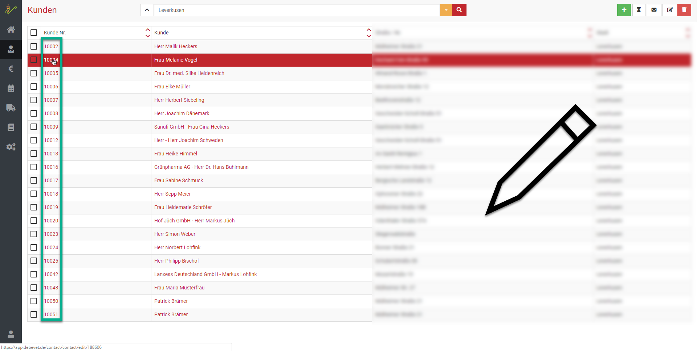

### Kundenadressen anlegen und bearbeiten  (z.B. Stalladresse)

Wenn sich die Bearbeitungsseite eines Kunden öffnet, wird zuerst der Reiter Adressen angezeigt. Hier sehen Sie alle
für diesen Kunden gespeicherten Adressen und können diese bearbeiten, löschen oder weitere hinzufügen. Ein Kunde kann in debevet neben der primären Rechnungsadresse zahlreiche weitere Adressen besitzen, z.B.:   

* Ansprechpartner  
* Patientenstandorte bzw. Stalladresse 
* Lieferadresse   

:::tip Tipp  

Eine hier erfasste Patientenadresse kann z.B. bei einem Patienten ausgewählt werden, wenn der Standort des Patienten von der
Rechnungsadresse des Kunden abweicht.

:::   

### Mehrere Adressen am Kunden hinterlegen

Öffnen Sie den gewünschten Kunden und wählen den Reiter **Adressen**. Hier klicken Sie nun auf **Adresse anlegen**, wenn Sie eine
neue Adresse hinzufügen wollen.

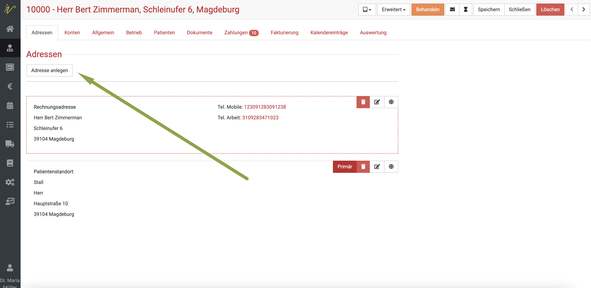

Nun öffnet sich die Eingabeseite. Am Feld **Typ** bei Adresse können Sie mit Klick auf den **Dropdownpfeil** ein Untermenü öffnen und
dort aus verschiedenen Typen wählen.

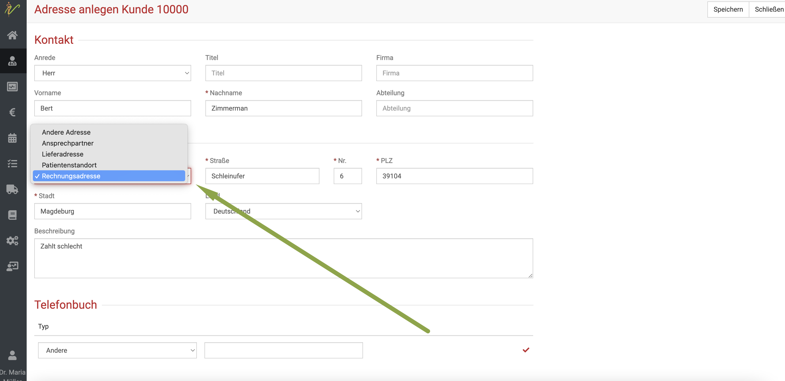

KLicken Sie nach Eingabe aller Daten auf **Speichern** oben rechts. Nun taucht die neu angelegte Adresse am Kunden mit auf.

### Adressen nachträglich berarbeiten

Wenn Sie die Liste der Adressen sehen, können Sie rechts an der Adresse eine kleine Symbolleiste sehen. 

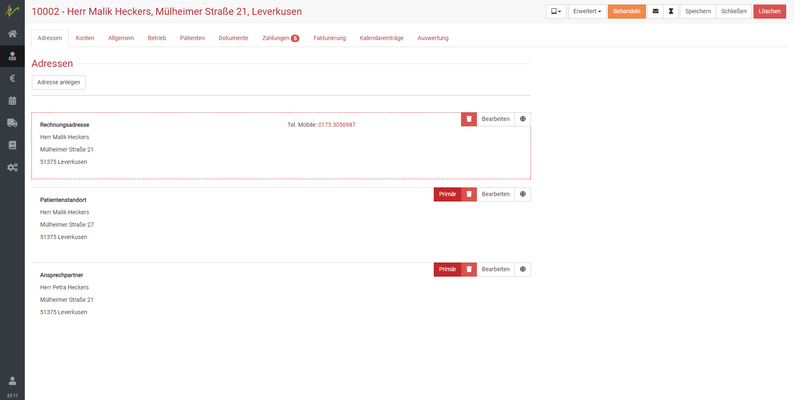

* Button **Primär**: wenn Sie diesen Button an einer Adresse klicken, wird diese Adresse zur Hauptadresse  
* **Stift-Symbol**: damit können Sie die Adresse bearbeiten  
* **Müllereimer-Symbol**: damit können Sie die Adresse löschen  
* **Weltkugel-Symbol**: öffnet die Karte mit dieser Adresse

### Konten  

Klicken Sie auf der Bearbeitungseite eines ausgewählten Kunden auf **Konten**, um die Bankdaten des Kunden zu erfassen, z.B. um Rechnungen mittels SEPA-Basislastschrift einzuziehen.

Klicken Sie auf den Button **Bankverbindung anlegen**, um eine neue Bankverbindung zu erfassen. Klicken Sie auf den Button **Bearbeiten** oder das **Mülleimer-Symbol** neben der Bankverbindung, um eine Kontoverbindung zu bearbeiten bzw. zu löschen.     

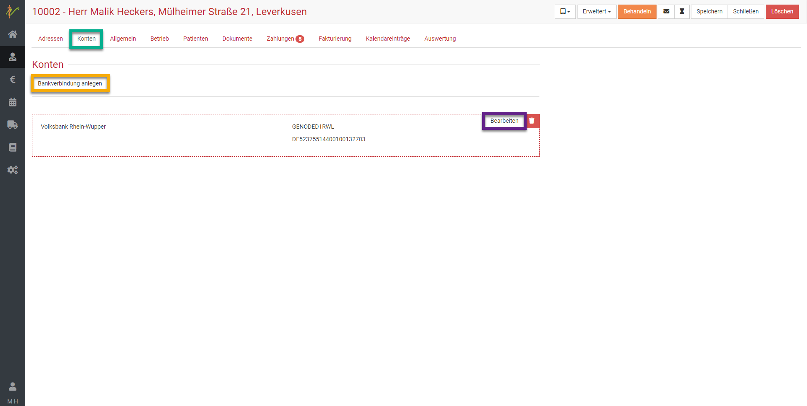
  
### Allgemein  

Hier können verschiedene Verwaltungsinformationen zum Kunden bearbeitet werden. 

**Zahlungsbedingung:** Wählen Sie für den Kunden eine Vorgabe-Zahlungsbedingung, so wird diese bei künftigen Rechnungen automatisch übernommen. Vor der Buchung einer Rechnung können Sie die Zahlungsbedingung auf der Rechnung noch ändern. 

**Rabatt:** Hier können Sie für jeden einzelnen Kunden einen Rabatt in Prozent hinterlegen, der auf die gesamte Rechnungssumme gewährt wird. 

**Preisgruppen:** Sollten Sie mit verschiedenen Preis- bzw. Kundengruppen in debevet für Ihre Produkte (z.B. Medikamente, Futter, Dienstleistungen) arbeiten, so weisen Sie dem Kunden eine Preisgruppe zu. Ist keine gesetzt, wird der Standardpreis für die jeweiligen Produkte genommen. 

**Umsatzsteuer-ID:** Im Bereich Steuerinformationen können Sie die Umsatzsteuer-ID des Kunden erfassen. Diese ist verpflichtend, sollten Sie ins europäische Ausland liefern (oder leisten) und keine Umsatzsteuer ausweisen. In der Druckausgabe der Rechnungen an diesen Kunden, kann debevet diese ID dann automatisch ausgeben, sofern gewünscht. 

### Kunden E-Mail Adresse hinterlegen und validieren

**E-Mail:** Wenn Sie Dokumente (Rechnungen, Abgabebelege, Impferinnerungen, Briefe u.v.m.) über die integrierte Mailfunktion von debevet senden, so wird die hier hinterlegte Emailadresse verwendet.

:::caution Achtung

Die Mailadresse kann nur dann zum Versand genutzt werden, wenn Sie den Haken bei "Emailversand an den Kunden erlaubt" auf aktiv gesetzt haben. Sie haben aber auch die 
Möglichkeit, stattdessen komplett die Validierung der Mailadresse zu nutzen.

:::

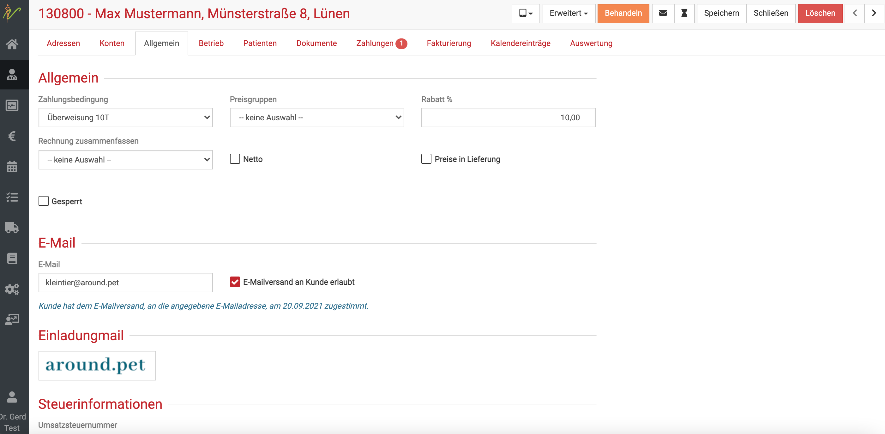  

Wenn Sie auf diese manuelle Bestätigung mit dem Haken verzichten wollen und stattdessen die Mailadresse durch den Kunden verifizieren lassen wollen (so 
können Sie vermeiden, dass evtl. falsche Mailadressen durch Tippfehler etc. enstehen können), gehen sie wie folgt vor: 

1. Klicken Sie auf **Administration** und dann **Einstellungen**
2. Klicken Sie auf den Reiter **Kunde** und setzen dort den Haken bei **Email-Versand an Kunde erlaubt sperren**
3. Klicken Sie auf **Speichern**

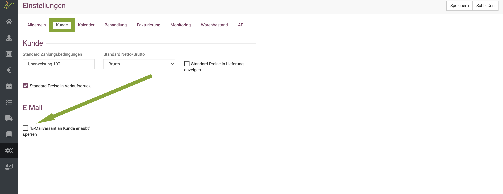  

Am Kunden ist nun das Feld zur Erlaubnis des Emailversandes grau. Die Verifzierung der Mailadresse stoßen Sie wie folgt an:

1. Öffnen Sie den Kunden
2. Klicken Sie auf **Erweitert** und dann **Email validieren**  

Der Kunde bekommt nun die Bestätigungsmail und muss diese bestätigen. 

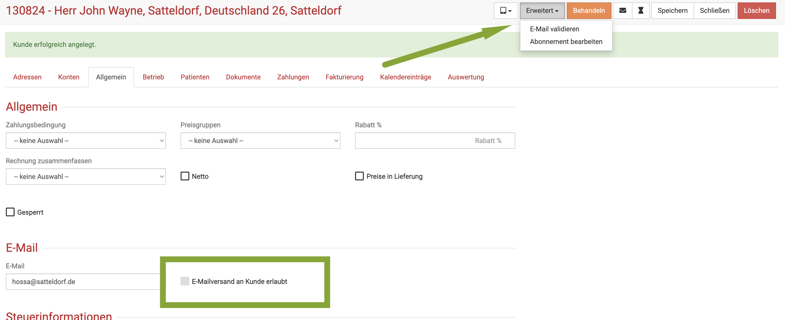   

## Mehrere Mailadressen pro Kunde  

Immer mehr Anfragen erreichten uns, dass Kunden, vor allem im Großtiersektor, sich wünschen, die Verschreibungen an eine gesonderte
Mailadresse zu erhalten. Deswegen haben wir im Februar 2025 diese Funktion hinzugefügt.  

Um einem Kunden z.B. seine Verschreibungen oder andere Dokumente an eine andere Mailadresse zu senden,
können Sie diese nun am Kunden direkt hinterlegen.   

:::caution Achtung:  
Wie auch der Anmerkung in dem Sektor zu entnehmen ist, können diese Mailadressen nicht einzeln validiert werden. Die Validierung
betrifft immer nur die "Haupt Mailadresse", welche auch zum Rechnungsversand weiter genutzt wird.    

:::   

Klicken Sie am Kunden auf den Reiter "Allgemein".  Dort finden Sie einen Haken "Mehrere Email-Adressen verwenden". Setzen Sie diesen aktiv
und tragen Sie die Mailadressen für die jeweiligen Verschreibungen/Dokumente ein, dann werden diese an diesem Kunden verwendet.  

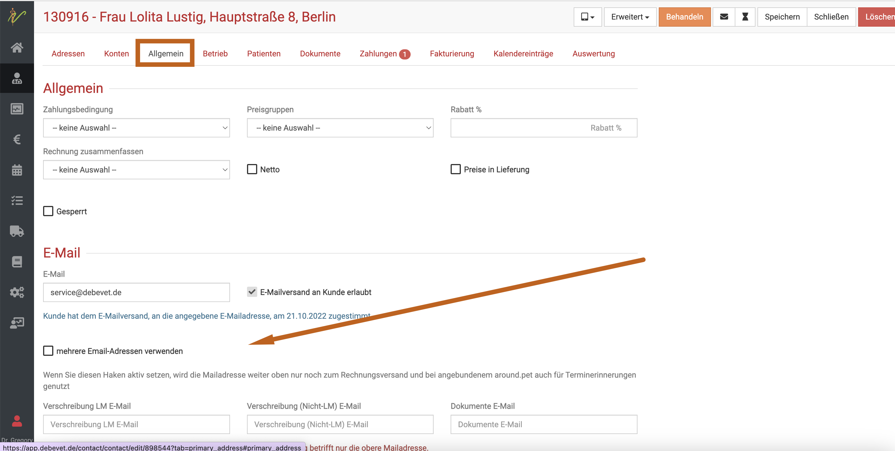

## Auf gelöschte Kunden zugreifen

Gelöschte Kunden noch einmal aufzurufen kann nötig werden, wenn beispielsweise doch noch in Nachhinein Fehler bei der Abrechnung gefunden werden und diese noch korrigiert oder Rechnungen verändert werden müssen.  
Um einen gelöschten Kunden zu finden und anzuzeigen, gehen Sie wie folgt vor:  

Klicken Sie auf **Kunden** und klicken dann den Dropdown Pfeil neben dem Suchenfeld.  

   
Aktivieren Sie den Haken und bestätigen Sie Ihre Auswahl mit Klick auf das Lupensymbol.  

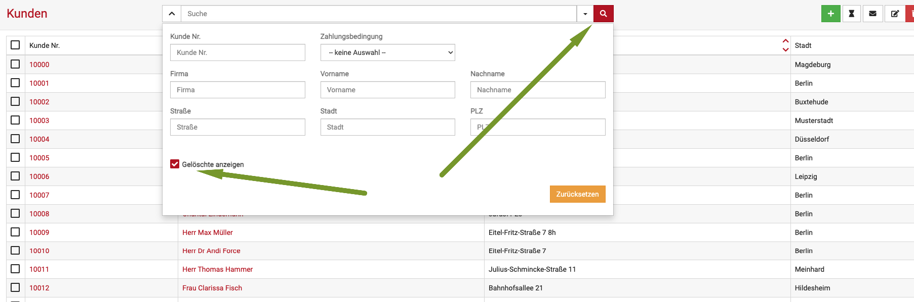
  

Nun können Sie die gelöschten Kunden sehen, diese werden in der Übersicht rot hinterlegt.   

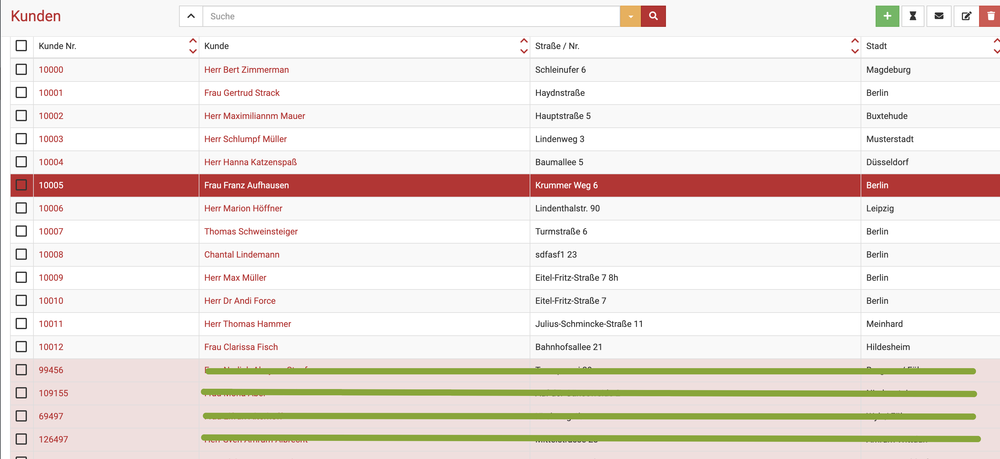

:::tip Tipp  

Diese Funktion zum Anzeigen gelöschter Dateien können Sie im gesamten debevet nutzen.    

:::   

## Adressen verwalten  

Sie haben in debevet grundsätzlich die Möglichkeit, in Ihrem Adressbuch generell Adressen anzulegen, zu suchen und zu bearbeiten.  

Wenn Sie dies nicht an den Sektionen **Kunden** oder **Lieferanten** machen möchten, können Sie auch das Adressbuch nutzen. 

Klicken Sie dazu auf **Praxis** und dann **Adressen**.   

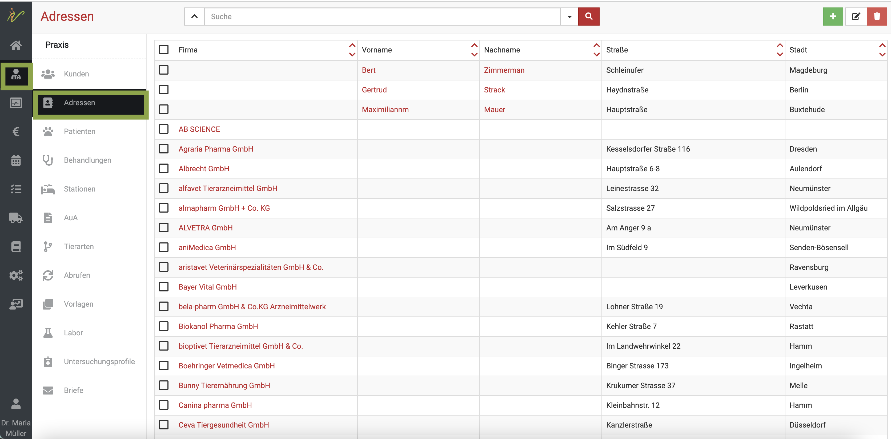

