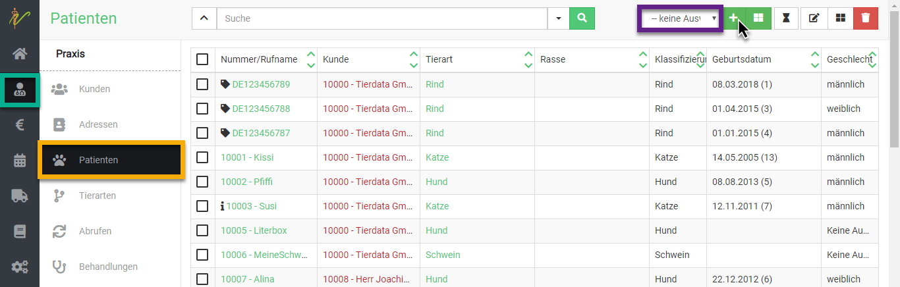
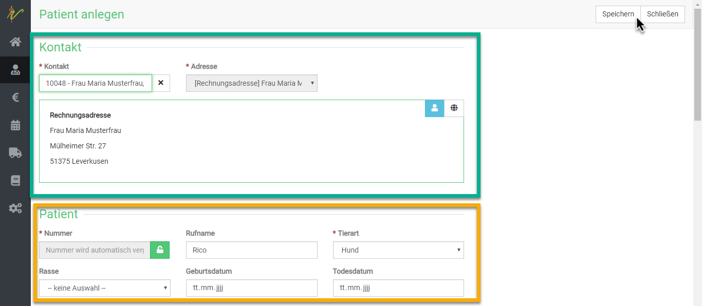

# Patientenverwaltung in debevet

Um zu Ihrer Patientenübersicht zu gelangen, klicken Sie links auf das **Personensymbol** (Praxis) und dann auf **Patienten**.  

Hier können Sie Patienten suchen, anlegen, ändern oder löschen. Außerdem gelangen Sie über die Bearbeitungsseite eines Patienten zu
Informationen und Daten, die zum jeweils ausgewählten Patienten in Beziehung stehen, wie z. B. Gewicht oder andere Dokumente.  

## Neuen Patienten anlegen 

Um in Ihrer Patientenliste einen neuen Patienten anzulegen, wählen Sie zunächst mit der Dropdownliste die Tierart aus und  klicken Sie nun rechts oben auf das **Plussymbol**. 
Nun gelangen Sie zur Maske zur Eingabe 
eines neuen Patienten.  

Bei **Kontakt** wählen Sie den Besitzer des Patienten. Hierzu wählen Sie entweder einen bereits vorhandenen Kunden, oder legen diesen 
über das **Plussymbol** direkt an.   
Geben Sie anschließend alle Daten zum Patienten ein und klicken Sie dann oben rechts auf **Speichern**.   

     

  
