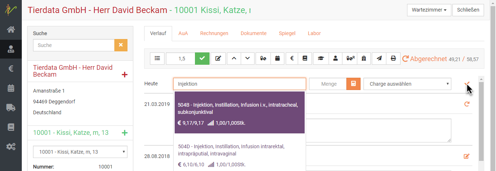

# Patienten behandeln  

Um einen Patienten zu behandeln, suchen sie diesen beispielsweise in der Patientenliste. Klicken Sie **Praxis** und dann **Patienten**.
Klicken sie dann oben rechts auf den orangenen Button **Behandeln**.  

  

Alternativ können Sie auch unter **Praxis** und **Kunden** den Besitzernamen suchen und dann oben **Behandeln** klicken,
allerdings müssen Sie in dem Fall dann noch aus der Dropdown Liste seiner Tiere das korrekte Tier wählen.  

  

  

## Einträge in die Kartei/ Befundung

Zu jedem Behandlungstag in der Kartei befindet sich als erstes das Freitextfeld "Befundung".
Diese Feld dient der internen Dokumentation und wird nicht in die Rechnung übernommen.

Das Feld selbst kann mit der Maus durch Ziehen am Kasten unten rechts vergrößert werden. Beim Aufruf der Kartei passt
es sich automatisch der Länge des erfassten Textes an. 

Um händisch Ihre Anmerkungen und Texte einzutragen, können Sie diese in das Feld **Befundung** eintragen. Um den Eintrag 
zu speichern drücken Sie rechts das **Plus Symbol**. Dies ist nicht zwingend nötig, bietet aber etliche Vorteile.  

* Falls mehrere Behandler/Ärzte eine Notiz hinzufügen wollen, wird getrennt gelistet, wer etwas geschrieben hat 
* Falls Sie noch Einträge ergänzen wollen, auch später, und diese zu vorherigen Behandlungen hinzufügen wollen, werden alte 
Einträge nicht überschrieben 

### Eintrag hinzufügen 

Wenn Sie nun z.B. den einen Eintrag mit dem **Plus Symbol** gespeichert haben, und ein anderer Behandler etwas ergänzen will,
muss darauf geachtet werden, dass dann oben der korrekte Arzt ausgewählt ist. Es kann dann ein weiterer Eintrag gemacht werden,
diese werden dann in der Darstellung untereinander gelistet.  

Natürlich können Sie mit einem Klick rechts auf das **Stiftsymbol** den Eintrag immer wieder bearbeiten oder mit dem
**Mülleimer Symbol** löschen.  

  

### Eintrag für anderen Benutzer erstellen  

Mit dieser Funktion könnnen Sie Karteikarteneinträge für andere Kollegen aus dem Praxisteam vornehmen. Der Eintrag wird
dann mit Namen des anderen in der Kartei geführt, aber deutlich signalisiert, dass dieser den Eintrag nicht selbst 
vorgenommen hat.  

Für die Anwendung dieser Funktion gibt es meist zwei gängige Beispiele:  
* Sie nutzen kurz den Computer, an dem eigentlich Ihr Kollege arbeitet  
* Ein Mitarbeiter möchte im Namen eines anderen einen Eintrag hinterlegen   

Sichern Sie hierzu zunächst evtl. noch nicht gesicherte Einträge durch Klick auf das **Plus Symbol** am Eintrag der Befundung.   

Wählen Sie dann oben mit dem Dropdown den Namen aus, unter dem Sie den Eintrag vornehmen wollen/sollen.  

Schreiben Sie dann den Eintrag und sichern diesen erneut mit dem **Plus Symbol**.  

In der Übersicht sehen Sie dann anhand einer blau hinterlegten Farbe des Namens am Eintrag, dass dieser von jemand anderem stammt.  

  

## Leistungen/Medikamente hinzufügen 

Um nun einzugeben, was abgerechnet werden soll, schreiben Sie die Bezeichung in das Feld **Behandlungseingabe** neben *heute*.  

Aus der Liste Ihrer Produkte werden dann direkt die entsprechenden Posten (Vorschau bis zu 5 Stück) aufgelistet und Sie können diese auswählen. 

  

Dabei können Sie Dienstleistungen, Medikamente oder alles weitere aus Ihren angelegten/importieren Produkten nutzen.  

### Gebührenfaktor  

In diesem Feld finden Sie beim Betreten der Kartei den Gebührenfaktor, der gemäß **Administration** → **Einstellungen:** Faktor
für Ihre Praxis hinterlegt ist.

Sie können diesen Vorgabewert Ihrer Praxis im Bedarfsfall herauf- bzw. heruntersetzen.
Alle Leistungen, die von Ihnen in die Kartei aufgtenommen werden, werden jeweils mit dem aktuellen Gebührenfaktor, 
der zum Zeitpunkt des Eintrags hier steht, multipliziert.  

   

