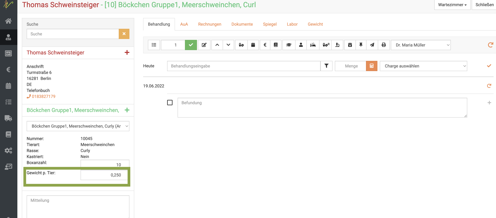

# Patienten in Gruppen behandeln  

Vor allem im Großtiersektor und oder Tierheimen kann die Behandlung in Gruppen nötig sein. Hierfür nutzt debevet sogenannte **Boxen**. 
Mit dieser Funktion können mehrere Tiere auf einmal behandelt werden. Hierfür müssen diese allerdings demselben Besitzer (Kunden) gehören.

Dabei kann unterschieden werden in:   

1. normale Boxen  (ausgewählte Patienten, mit Name bzw. Nummer)
2. anonyme Boxen (Nur Anzahl der Tiere, ohne Kennzeichnung, häufig bei Schweinen/Hühnern genutzt)    

## Boxen erstellen   

Um eine Box zu erstellen, gibt es mehrere Wege. 

### *1. Über die Patientenliste mit bereits vorhandenen Patienten*  

Klicken Sie **Praxis** und dann **Patienten**. Geben Sie in die Suche den Namen des Kunden (Patientenbesitzers) ein und drücken 
Sie die **Entertaste** oder klicken auf das **Lupensymbol**.  

Nun setzen Sie die Checkboxen bei allen Tieren, die in eine Box gruppiert werden sollen. Natürlich geht das nur mit gleichen Tierarten!  

  

KLicken Sie nun oben rechts auf das **schwarze Boxensymbol**. Nun werden die markierten Tiere in einer Box zusammen gefasst.  

  

Um einen besseren Überblick zu haben, sollten/können Sie nun bei **Stallbezeichnung** einen eindeutigen Namen für diese Box eingeben.

Bestätigen Sie diesen dann mit **Speichern**. Anschließend können Sie den **Behandeln** Button klicken und die Gruppe genauso wie ein Einzeltier behandeln.  

  

### *2. Über die Patientenliste mit neuen Tieren*  

Klicken Sie in der Patientenliste oben rechts den **Dropdown-Pfeil** und wählen Sie die **Tierart**, aus der die Box bestehen soll.  

Anschließend klicken Sie das **grüne Boxen-Symbol*.  

   

Nun wählen Sie in der sich öffnenden Maske einen Kunden als **Kontakt** aus, indem Sie seinen Namen in das Feld bei Kontakt schreiben. 
Ihnen wird dann direkt eine Auswahl der passenden Kunden angezeigt. Alternativ klicken Sie das *Plus-Symbol** um einen neuen Kunden
anzulegen.  

Geben Sie nun alle benötigten Werte ein und setzen eine Stallbezeichnung.  

Um Tiere hinzuzufügen, geben Sie deren Nummer/Namen unten an und klicken dann rechts auf den **Haken**.   

  

Es wird direkt ein weiteres Tier mit der Folgenummer angelegt. Natürlich können Sie es auch anders benennen. 

:::caution Achtung   

Die Eingabe dieses Tieres muss auch über den Klick auf den **Haken** gesetzt werden!   

:::  

Klicken Sie, wenn Sie alle Tiere für die Box angelegt haben auf **Speichern** oben rechts.  

  

## Anonyme Boxen  

Wenn Sie nur eine anonyme Gruppe von Tieren erstellen wollen, aktivieren Sie die Checkbox beim Erstellen der Box bei **anonyme Box**.  

  

Bei **Boxenanzahl** setzen Sie nun einfach die Anzahl Tiere ein, die in dieser Gruppe zusammen gefasst sein sollen. 

Geben Sie der Gruppe einen Namen und setzen Tierart und Rasse wie gewünscht.  

:::caution Achtung  

Bedenken Sie, dass es bei **Tierarten** auch untergeordnete Tierarten geben kann. Dies sind beispielsweise bei **Heimtiere, sonstige** dann
beispielsweise Meerschweinchen, Hamster etc. Diese "Angebote" können sie auch selbst setzen (Unter **Praxis** - **Tierarten**).  

:::  

## Boxen behandeln  

Wenn Sie in einer Patientenliste (der gesamten oder an einem Kunden) nun das Symbol für Boxen sehen, wissen Sie, dass dies eine Gruppe von Tieren ist.  
Sie können auf den Namen/Bezeichnung der Gruppe klicken und dann **Behandeln**, um diese zu behandeln.  

   

### Gewicht pro Tier 

Bei der Berechnung der Medikamentenabgabe ist es wichtig, ein Gewicht pro Tier zu haben. Falls diese Gewichte nicht bereits bei der Rasse der Tierart 
hinterlegt sind, können Sie dies direkt an der Box am Patienten in der Behandlung eingeben.  

Klicken Sie hierzu in der Behandlung unten links an der Box in das Feld **Gewicht pro Tier** und geben Sie das Gewicht in kg ein.  

   

:::tip  Tipp  

Bei der Erstellung von AUA Belegen ist das Gewicht sehr wesentlich. Um Zeit zu sparen, empfiehlt es sich, die Gewichte direkt an den 
Tierarten/Rassen zu hinterlegen.  

:::  

