# Untersuchungsprofile nutzen   

Sie möchten verschiedene Untersuchungen, die Sie häufig nutzen, ideal, schnell und übersichtlich dokumentieren können?
Hierfür bietet debevet Ihnen die Möglichkeit, eigene Untersuchungsprofile anzulegen. Dabei können Sie sogar Normwerte selbst hinterlegen
und in der Auswertung dann direkt den Vergleich zu den Normwerten sehen.

Beispiele, für was das häufig angewendet wird sind:  
* Eigene Laborauswertungen ohne Laborgerät (Blutausstrich, Urin etc.)  
* Chiropraktische Befundung 
* Neurologischer Untersuchungsgang 
* Kotuntersuchungen

## Neues Untersuchungsprofil anlegen  

Um ein eigenes, neues Untersuchungsprofil zu hinterlegen, klicken Sie **Praxis** und dann **Untersuchungsprofile**.  

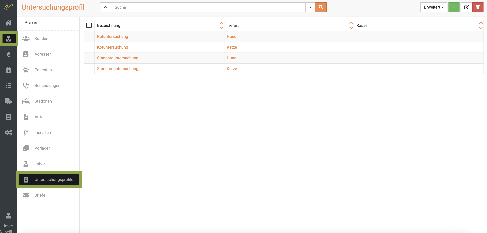  

Klicken Sie oben rechts auf das **grüne Plus-Symbol**, um ein neues Profil anzulegen. 
Geben Sie den Namen des Profils bei **Bezeichnung** ein und wählen sie dann zuerst die **Tierart** (Pflicht!). 

Wenn Sie im Feld Bezeichnung beginnen zu tippen, schlägt debevet Ihnen automatisch Untersuchungen für die aktuelle 
Tierart vor, die bereits hinterlegt sind. Wählen Sie den Vorschlag aus, wird dieser übernommen. Gibt es keinen passenden 
Vorschlag, so können Sie die Angaben hier erfassen und die Untersuchung wird dem System für die aktuelle Tierart hinzugefügt. 
Dies soll ermöglichen, dass ein und dieselbe Untersuchungen zum einen in mehreren Profilen verwendet werden kann und zum 
anderen nicht doppelt erfasst wird, was später auch systematische Auswertungen und Vergleiche von Ergebnissen ermöglichen soll.

Im Feld unten bei **Untersuchung** geben Sie bei **Bezeichnung** ein, welchen Paramenter/welche Untersuchung genau Sie hier setzen wollen.
(z.B. "Konstistenz").

Nun können Sie bei **Ergebnistyp** mit dem **Dropdownpfeil** wählen, welche Form der Parameter Sie einfügen wollen.  

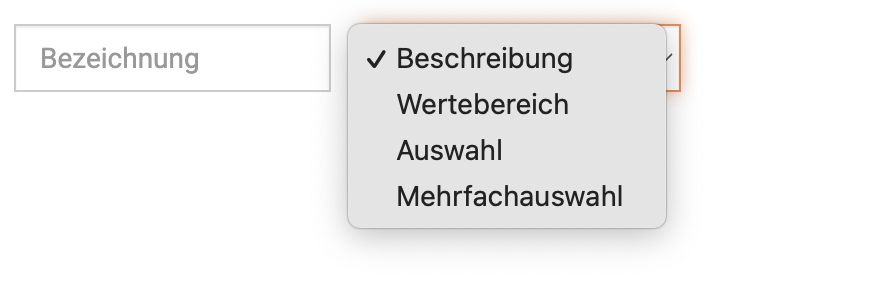

Zur Verfügung stehen Ihnen verschiedene Varianten:

## *1. Beschreibung*  

Wenn Sie Beschreibung auswählen, können Sie dann dort in dem angewendeten Untersuchungsprofil freien Text eingeben.  

## *2. Wertebereich*  

Bei allen Profilen, in denen Sie Werte eingeben wollen, müssen Sie hier den Normbereich mit Minimum- und Maximumwerten eingeben. 
Außerdem setzen Sie die Einheit fest. Geben Sie einen Teil der gewünschten Einheit ein, z.B. Milliliter (ml), schlägt die Liste Ihnen direkt die
bereits vorhandenen Einheiten vor. So werden doppelt-angelegte vermieden.  

Wenn Sie eine andere Einheit nutzen wollen, können Sie diese einfach eintippen. 
Bestätigen Sie Ihre Eingabe des Wertebereichs mit dem Klick auf den **Haken** rechts!  

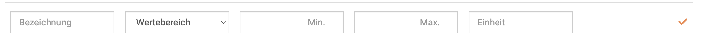

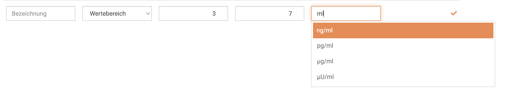  

## *3. Auswahl* 

Wenn Sie den Parameter auf Auswahl setzen, dann ist dies ein Single-Choice, also ein 'entweder-oder' Feld. Die gewünschten 
Checkboxen, die es dann geben soll, listen Sie untereinander auf im Feld, welches dann erscheint. (Drücken Sie immer die Entertaste nach jeder Eingabe).  

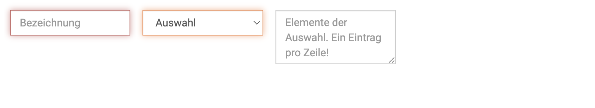

## *4. Mehrfachauswahl*

Natürlich können Sie auch multiple Choice Felder als Checkboxen anlegen. Wählen Sie hierzu 'Mehrfachauswahl' und geben 
dann wieder die einzelenden, gewünschten Felder untereinander an (Entertaste nutzen nach jeder Eingabe).   
  
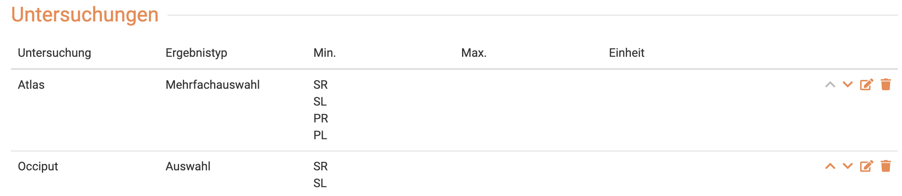  

Beenden Sie die Erfassung durch Klick auf **Speichern** oben rechts.  

## Untersuchungsprofile bearbeiten  

Wenn Sie ein Profil ändern oder ergänzen möchten, können Sie dies jederzeit tun. Klicken Sie auf **Praxis** und dann **Untersuchungsprofile** 
und wählen das gewünschte Profil an, indem Sie auf den Namen des Profils klicken.  
Führen Sie nun Ihre Änderungen durch und klicken anschließend auf **Speichern**.  

## Untersuchungen und Einheiten der Profile

Um in die globale Liste an Untersuchungsbezeichnungen oder die Einheiten zu gelangen, klicken Sie **Praxis** und dann
**Untersuchungsprofile**. Klicken Sie dann oben rechts auf **Erweitert**.  

Nun können Sie zwischen 'Untersuchungen' und 'Einheiten' wählen.   

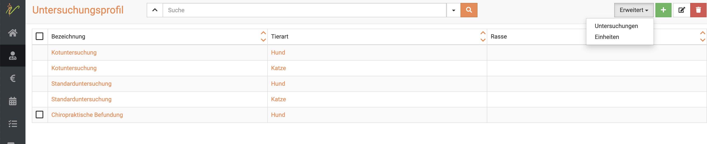  

In beiden Bereichen können Sie nun die globale Liste um den gewünschten Parameter ergänzen. Natürlich können auch bereits angelegete
noch verändert/bearbeitet/gelöscht werden.

Um etwas zu verändern oder zu löschen, markieren Sie die gewünschte **Checkbox* und klicken dann oben rechts zum Bearbeiten das 
**Stiftsymbol** und zum Löschen das **Mülltonnensymbol**. 

## Untersuchungsprofil am Patienten nutzen  

Die nun angelegten Untersuchungsprofile können Sie ab sofort an Ihren Patienten nutzen.  

Klicken Sie hierzu am Patienten in der Behandlung auf das **Mikroskop-Symbol** und dann auf **Untersuchung**. 

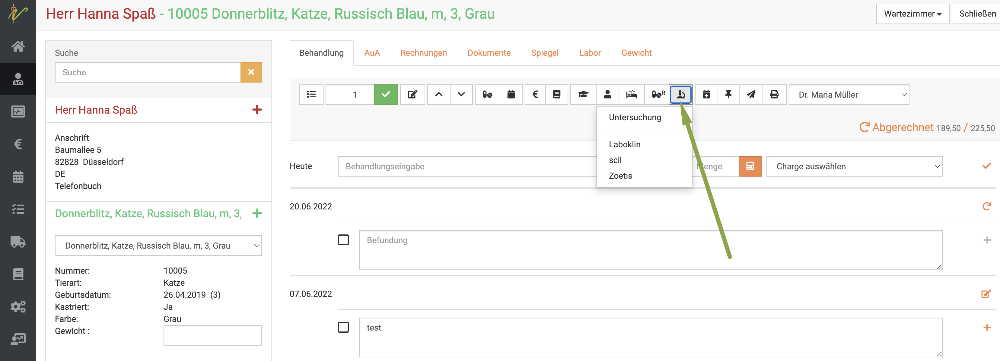  

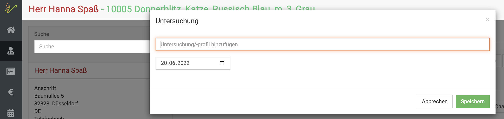  

Geben Sie hier nun den gewünschten Namen des Profils ein. Das gewünschte Profil öffnet sich und Sie können nun alle Parameter 
eingeben. Klicken sie dann unten auf **Speichern**.  

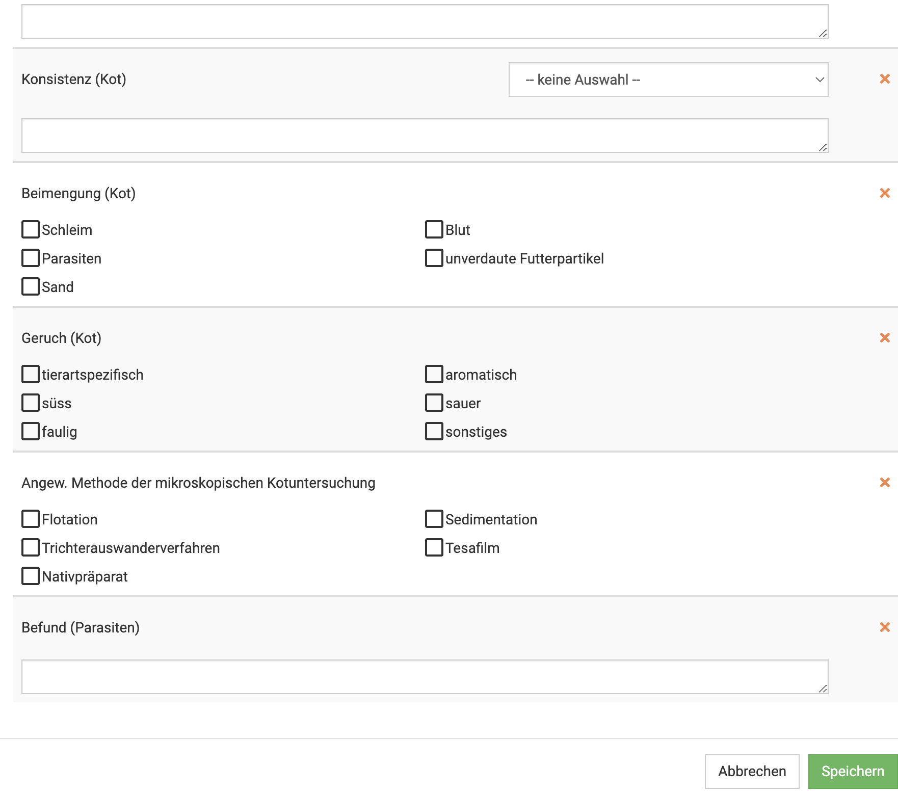  

Anschließend sehen Sie Ihre Ergebnisse in der Befundung der Behandlung.  

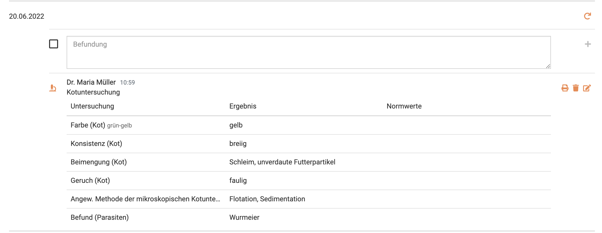  

:::tip Tipp  

Besonders praktisch: Wenn sie nun auf das kleine Druckersymbol rechts an dieser Befundung klicken, können Sie direkt wählen
zwischen *senden* und *drucken*. So können Sie dem Tierhalter direkt den Befund übermitteln!  

::: 

Natürlich kann der Befund auch noch nachträglich über das **Stiftsymbol** bearbeitet oder über das **Mülltonnensymbol** gelöscht 
werden.

