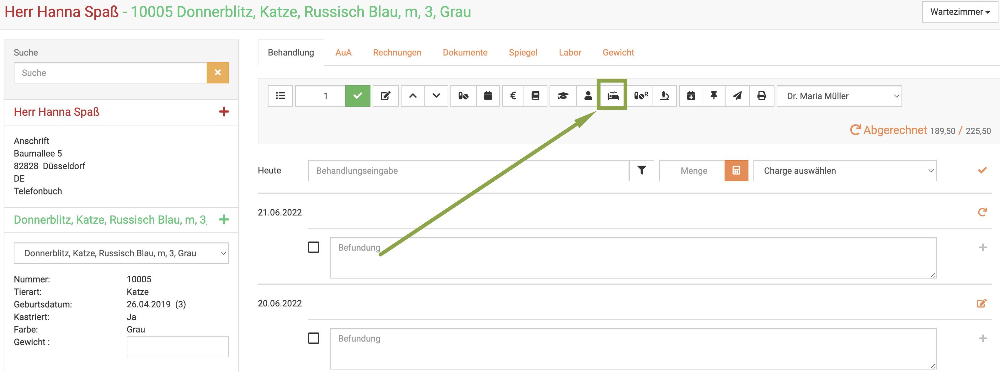
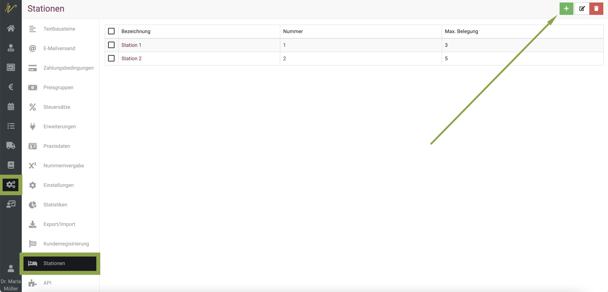
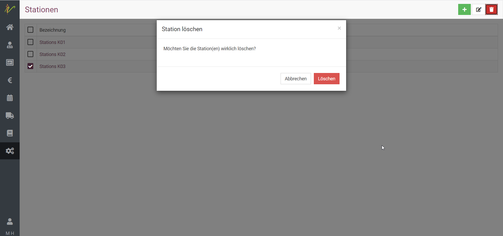
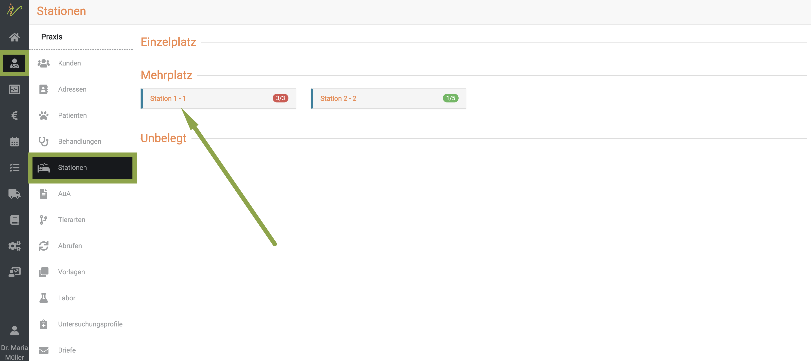
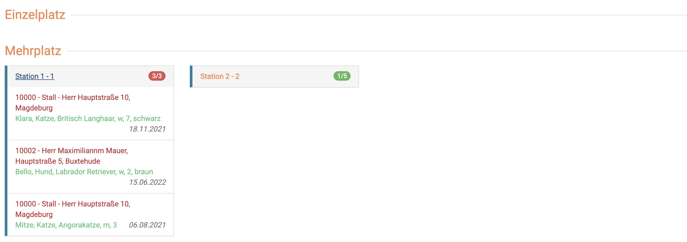
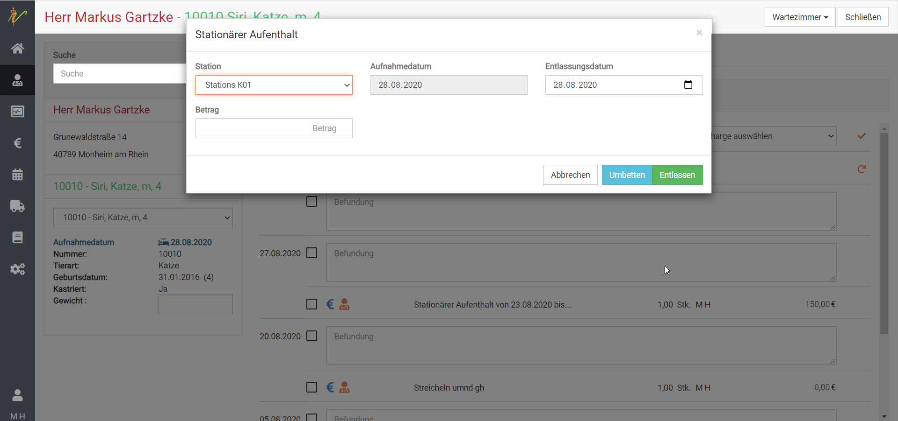

# Stationäre Aufnahme  

## Patienten stationär aufnehmen 

Um eine stationäre Aufnahme eines Patienten zu veranlassen, klicken Sie in der Behandlung des Patienten auf das **Bett-Symbol**.  

   

Auf der sich nun öffnenden Maske können Sie die Daten der Aufnahme angeben. Ändern Sie das Aufnahmedatum, 
sollte die Aufnahme nicht am heutigen Tag erfolgt sein oder erfolgen. 

Wählen Sie in der Liste oben Links die Station die dem Patienten zugewiesen wird. Haben Sie noch keine Stationen erfasst, 
können Sie dies über **Administration** - **Stationen** vornehmen.  

## Stationen anlegen  

Zur Einrichtung von Stationen in Ihrer Praxis/Klinik klicken Sie **Administration** - **Stationen**.
Sie sehen die ungefilterte Liste Ihrer Stationen. Klicken Sie nun auf das **grüne Plus-Symbol**, um auf die Seite zur Eingabe 
einer neuen Station zu gelangen. Geben Sie den Namen ein und klicken Sie dann auf **Speichern**. 

:::caution Achtung  

Sie müssen beim Anlegen der Station angeben, mit wie vielen Plätzen die jeweilige Station belegt werden kann/darf.

:::  

  

### Stationen bearbeiten  

Um den Namen oder künftige Details einer Station zu bearbeiten, drücken Sie auf den Link in der Spalte Bezeichnung. 
Sie gelangen auf die Bearbeitungsseite der Station.  Geben Sie die gewünschten Änderungen ein und klicken wieder auf **Speichern**.  

### Stationen suchen  

Klicken Sie auf **Administration**, dann auf **Stationen**. Das System listet alle Stationen auf. Tippen Sie in das Suchfenster 
wie bei einer Suchmaschine Begriffe ein, die auf die gesuchte Station passen und drücken Sie die **Entertaste** oder 
klicken Sie auf das **Lupen-Symbol**.  

### Mehrere Stationen bearbeiten oder löschen  

Um mehrere Stationen zu bearbeiten, wählen Sie zunächst die jeweiligen **Checkboxen** in der Liste an. Drücken Sie nun das **Stiftsymbol** oben rechts, 
um die ausgewählten Stationen zu bearbeiten.

Nutzen Sie die **Pfeile < und >**, um beim Bearbeiten zwischen den einzelnen Stationen zu wechseln.

Um eine Station zu löschen, drücken Sie das **Mülleimer-Symbol**.  

  

## Stationsübersicht  

Um alle Stationen und deren Belegung direkt zu sehen, klicken Sie nun unter **Praxis** auf **Stationen**. 
Sie sehen zunächst einen Überblick der belegten Stationen. Um dort die Details zu sehen und dann direkt zum Patienten springen zu
können, klicken Sie auf die Bezeichnung der Station.  

  

Die Ansicht klappt nun auf und Sie können mehr Details zu den Tieren und den Besitzern sehen.  

  

:::tip Tipp  

Sie können in diesem Bereich mit Klick auf den Kunden-Namen direkt zu den Besitzerdaten springen und mit Klick auf den Tiernamen
direkt zum Patienten.  

:::  

## Patienten umlegen oder entlassen

Klicken Sie auf das Stationssymbol im Menü der Kartei. Vorraussetzung für eine Entlassung ist selbstverständlich, 
dass der Patient sich aktuell in stationärer Behandlung befindet.

Geben Sie in das Feld für das **Entlassungsdatum** das Datum der Entlassung ein, sofern dies vom heutigen Tage abweicht. 
Im Feld **Betrag** können Sie den Rechnungsbetrag für den stationären Aufenthalt erfassen.

In der Behandlungsrechnung des Patienten finden Sie diesen Betrag abschließend ohne Multiplikation mit Ihrem Gebührenfaktor 
mit der Bezeichnung: **Stationärer Aufenthalt von DD.MM.YYYY bis DD.MM.YYYY**, wobei die Datumsgrenzen automatisch übernommen werden. 
Zusätzlich können Sie für die Abrechnung noch einen weiteren Text hinzufügen.

Klicken Sie abschließend auf den Button **Entlassen**.

Soll der Patient auf eine andere Station verlegt werden, so ändern Sie oben links in der **Stationsliste** die Station und klicken Sie 
abschließend auf den Button **Umbetten**.   

