# Patientenverwaltung in debevet

Um zu Ihrer Patientenübersicht zu gelangen, klicken Sie links auf das **Personensymbol** (Praxis) und dann auf **Patienten**.  

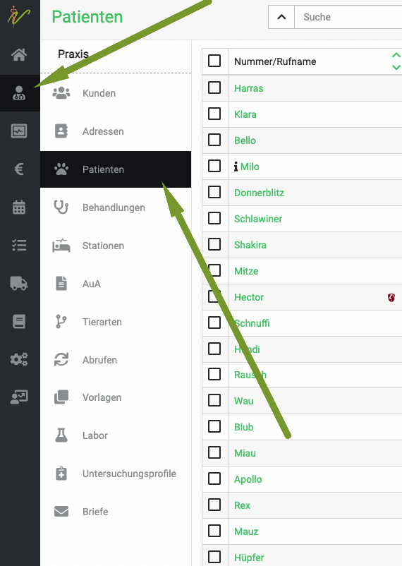

Hier können Sie Patienten suchen, anlegen, ändern oder löschen. Außerdem gelangen Sie über die Bearbeitungsseite eines Patienten zu
Informationen und Daten, die zum jeweils ausgewählten Patienten in Beziehung stehen, wie z. B. Gewicht oder andere Dokumente.  

## Neuen Patienten anlegen 

Um in Ihrer Patientenliste einen neuen Patienten anzulegen, wählen Sie zunächst mit der Dropdownliste die Tierart aus und  klicken Sie nun rechts oben auf das **Plussymbol**. 
Nun gelangen Sie zur Maske zur Eingabe 
eines neuen Patienten.  

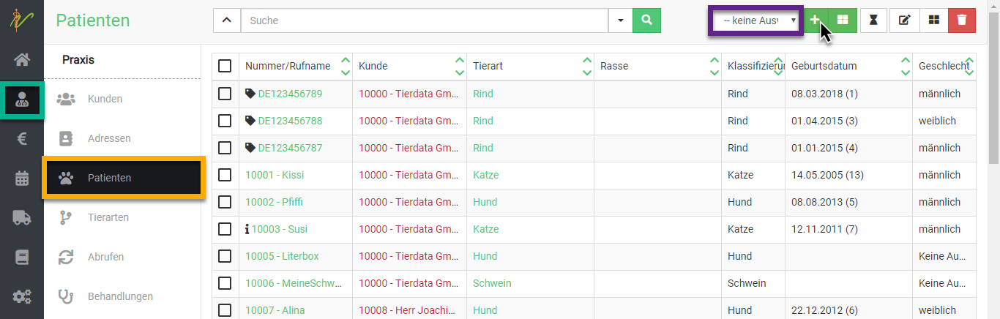

Bei **Kontakt** wählen Sie den Besitzer des Patienten. Hierzu wählen Sie entweder einen bereits vorhandenen Kunden, oder legen diesen 
über das **Plussymbol** direkt an.   
Geben Sie anschließend alle Daten zum Patienten ein und klicken Sie dann oben rechts auf **Speichern**.   

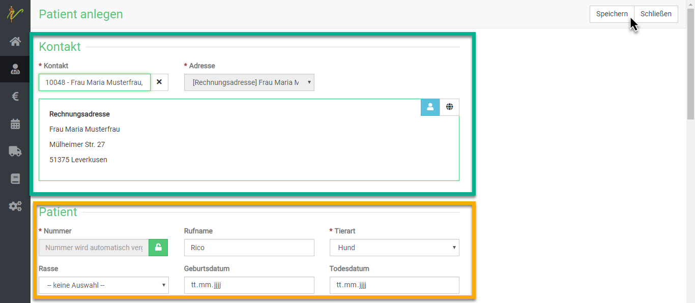

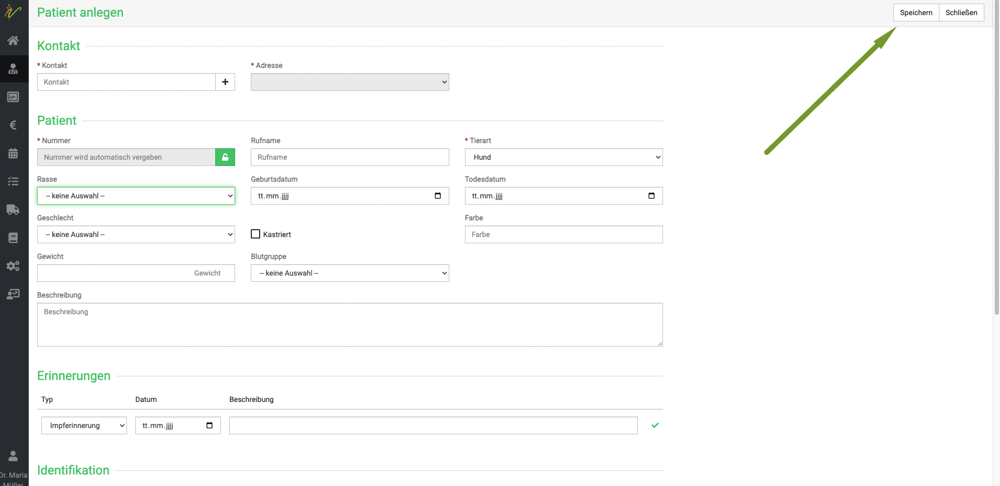       

**Alternativer Weg:** Sie können auch zunächst einen Kunden anlegen (Siehe Sektion Kunden), um erst die Besitzerdaten anzulegen.
KLicken Sie dann auf den orangenen Button **Behandeln**.

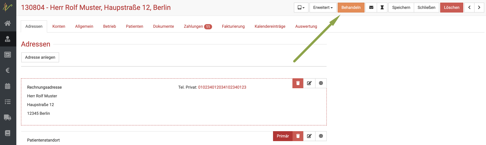  

Klicken Sie dann unten links bei **Patient** auf das **Plus Symbol**. 

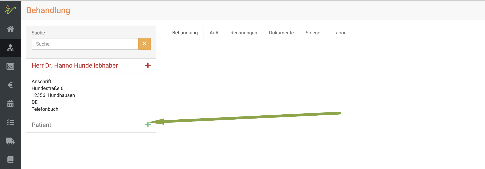  

Es öffnet sich eine Eingabemaske, in der Sie Schritt für Schritt die Daten eingeben können. Klicken Sie anschließend auf **Speichern**.  

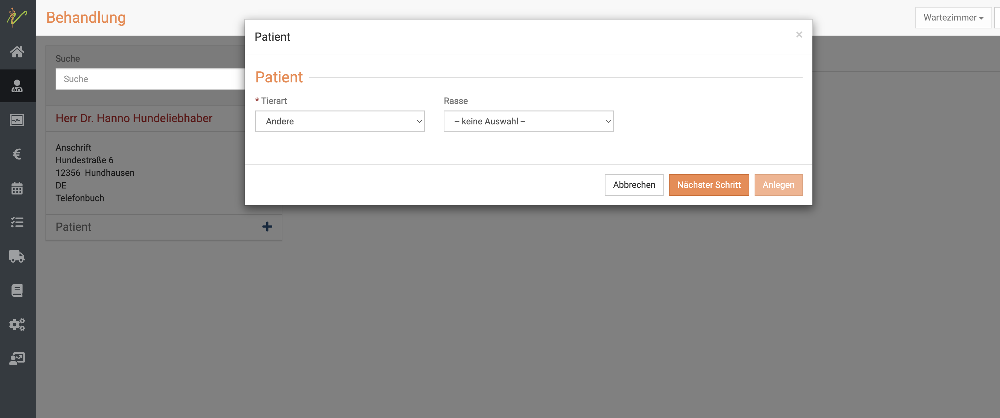  

## Zwischen Patienten desselben Besitzers wechseln  

Um ein anderes Tier desselben Besitzers zu behandeln, klicken Sie (wenn mehrere Tiere anlegt sind) auf den Dropdown Pfeil
links unten neben dem grünen Namen des gerade aktiven Patienten.   

Nun erscheint eine Liste aller Patienten dieses Kunden/Besitzers. Wählen Sie das gewünschte weitere Tier, dass Sie behandeln wollen.  

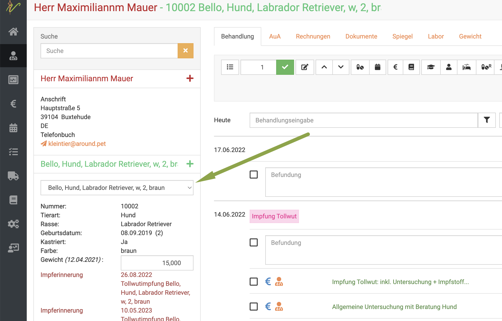

## Patienten suchen und finden  

Klicken Sie auf **Praxis**, dann auf **Patienten**. Das System listet alle Patienten auf. Tippen Sie in das Suchfenster wie bei
einer Suchmaschine Begriffe ein, die auf den gewünschten Patienten passen und drücken Sie die **Entertaste** oder klicken Sie
auf das **Lupensymbol**.  

  

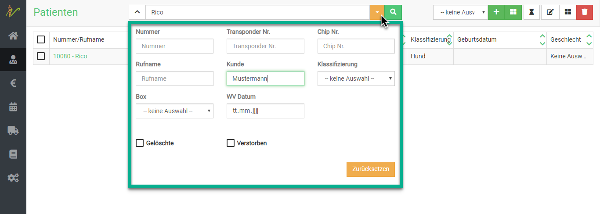  

Wenn Sie neben dem Eingabefeld für die Schnellsuche oben auf den Pfeil nach unten (Dropdown Pfeil) klicken, können
Sie auch nach gezielten Parametern bzw. weiteren Suchbegriffen filtern.  

### Suchfilter zurücksetzen

Wenn Sie eine Suche ausgeführt haben, ist die Patientenliste gefiltert, was dadurch angezeigt wird, dass der **Pfeil nach
unten** neben den der Schnellsuche gelb ist. Klicken Sie auf den **Pfeil nach unten** und dann auf **Zurücksetzen**, um die 
Patientenliste wieder ungefiltert angezeigt zu bekommen.  

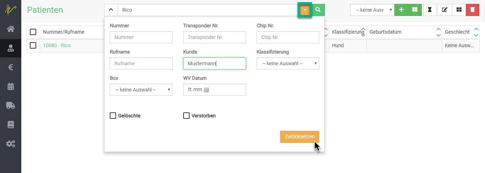  

## Patienten bearbeiten und weitere Details  

Klicken Sie auf **Praxis** und auf **Patienten**. Klicken Sie in der Liste Ihrer Patienten auf den Link in der Spalte **Nummer **
oder **Rufname**, um auf die Bearbeitungsseite des Patienten zu gelangen.
  
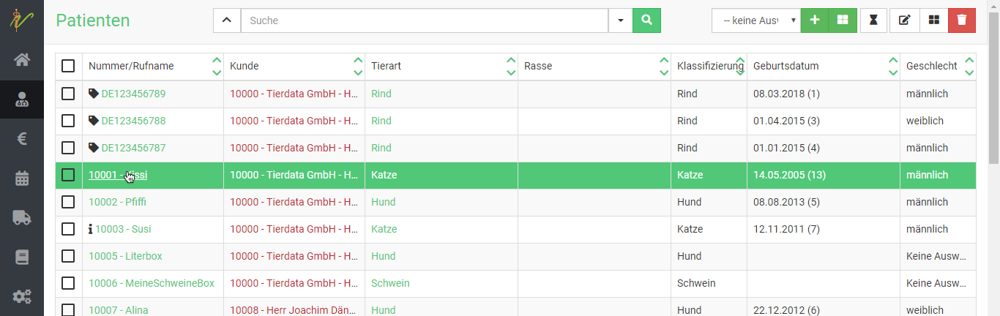  

## Dokumente hinzufügen 

Klicken Sie auf der Bearbeitungsseite des Patienten oben auf **Dokumente**. Hier können Sie alle mit diesem Patienten 
verknüpften Dokumente einsehen. Um ein neues Dokument hinzuzufügen, drücken Sie das **Upload-Symbol** und navigieren dann 
zu der gewünschten Datei auf Ihrem Rechner/Handy/Tablet. Drücken Sie danach auf **Hochladen**.  

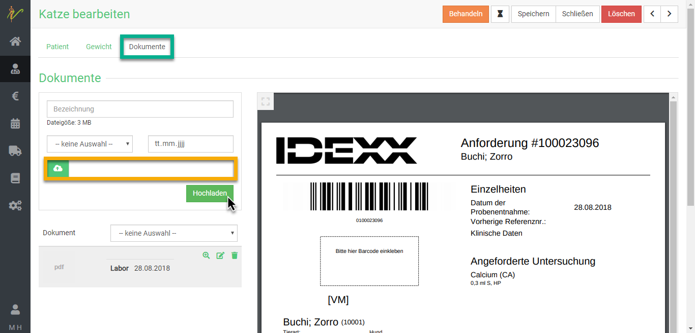    

:::tip Tipp  

Übersichtlicher, vor allem bei mehreren Dokumenten wird es, wenn Sie **vor dem Hochladen** eine Bezeichnung des Dokumentes eintragen. 
Außerdem können Sie angeben, um was für einen Typ Dokument es sich handelt. Wählen Sie dazu über dem Hochladen- Feld mit dem Pfeil aus 
den Möglichkeiten den Dokumententyp. Wenn Sie wollen, können Sie auch das Datum hinterlegen.

:::

## Dokumente am Patienten einsehen  

Wenn Sie einen Patienten für die Behandlung aufgerufen haben, können Sie jederzeit die für ihn hinterlegten Dokumente einsehen. KLicken 
Sie dazu auf den Reiter **Dokumente** in der Behandlungsansicht.  

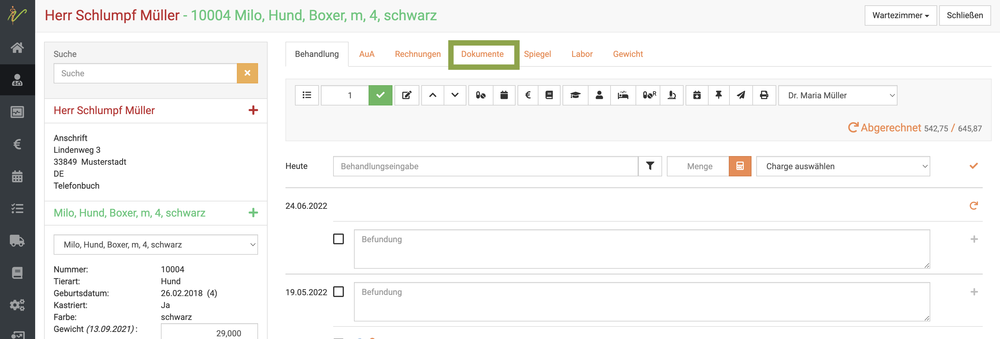  

Natürlich können Sie nun auch direkt weitere Dokumente hochladen, indem Sie auf das **Upload-Symbol** klicken.  

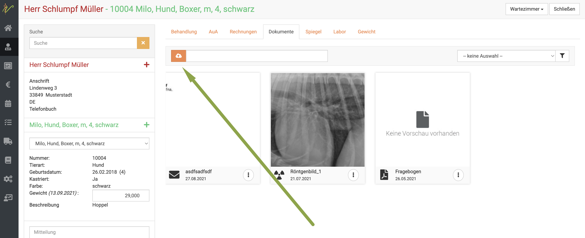  

Außerdem können Sie sich, wenn ein Patient bereits sehr viele Dokumente hinterlegt hat, diese in der Ansicht nach Typus filtern.  
Klicken Sie hierfür zunächst auf den **Dropdownpfeil** rechts und wählen dann einen Typus aus. KLicken Sie anschließend auf das **Filtersymbol**.  

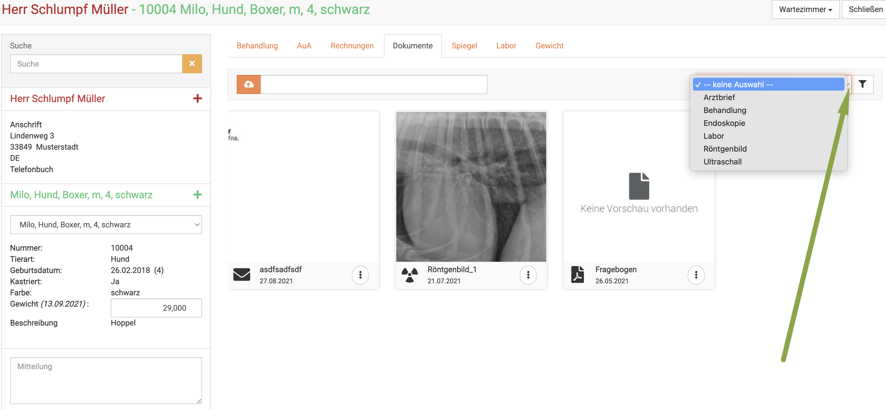  

:::tip Tipp  

Das Filtern nach Typus funktioniert natürlich nur dann, wenn Sie dem jeweiligen Dokument beim Hochladen auch bereits einen Typ zugewiesen 
haben.  

:::  

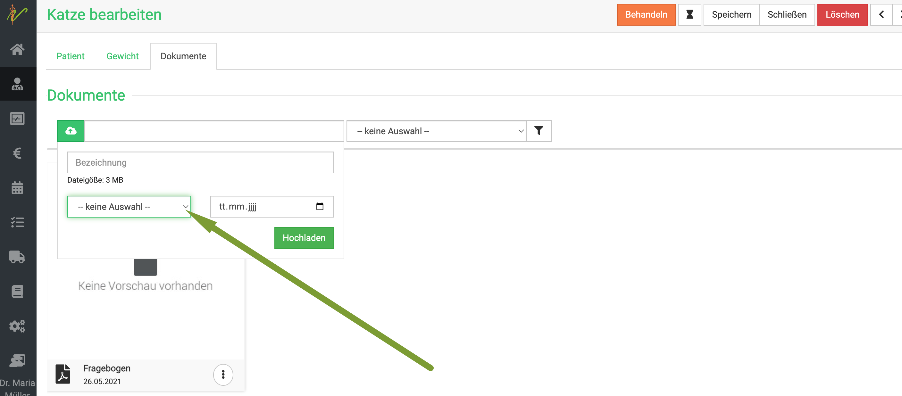   

## Patienten ins Wartezimmer setzen  

Wählen Sie zunächst die jeweiligen Patienten aus, indem Sie die **Kästchen** vor dem Rufnamen anklicken. Klicken Sie nun
rechts oben auf das **Sanduhrsymbol**, um die ausgewählten Patienten in das Wartezimmer zu setzen.  

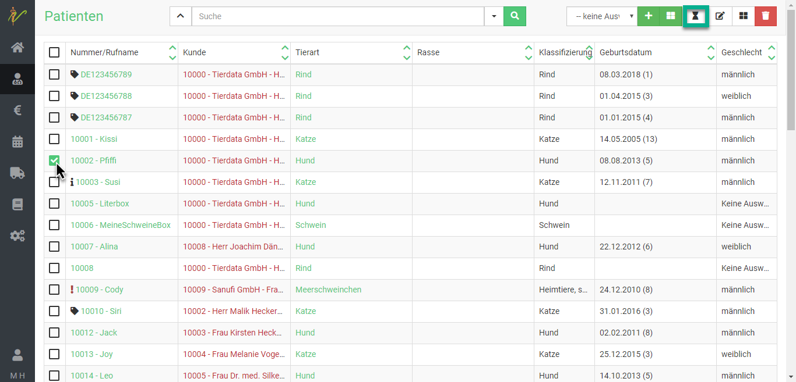  

## Mehrere Patienten bearbeiten oder löschen

Um mehrere Patienten zu bearbeiten, wählen Sie zunächst die jeweiligen **Checkboxen** in der Liste an. Drücken Sie nun das
**Stiftsymbol** oben rechts, um die ausgewählten Patienten zu bearbeiten.

Nutzen Sie die Pfeile < und >, um beim Bearbeiten zwischen den einzelnen Patienten zu wechseln.

Um sie zu löschen, drücken Sie das **Mülltonnensymbol**.  

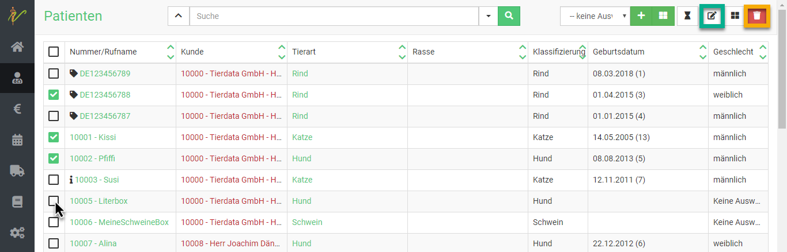   

## Gelöschte Patienten anzeigen  

Eventuell kann es nötig sein, bereits gelöschte Patienten erneut anzuzeigen oder im Nachhinein doch noch einmal eine alte Rechnung
zu stornieren und korrigiert zu erstellen. In der Standard Patientenübersicht sind die gelöschten Patienten (ebenso wie bei den Kunden) 
**nicht** angezeigt. So können Sie diese wieder sichtbar machen:   

Klicken Sie auf **Praxis** und auf **Patienten**. Klicken Sie dann oben bei der Suche auf den Dropdown Pfeil (Pfeil nach unten).   
Wählen Sie in der Eingabemaske die Checkbox *gelöschte anzeigen**.   

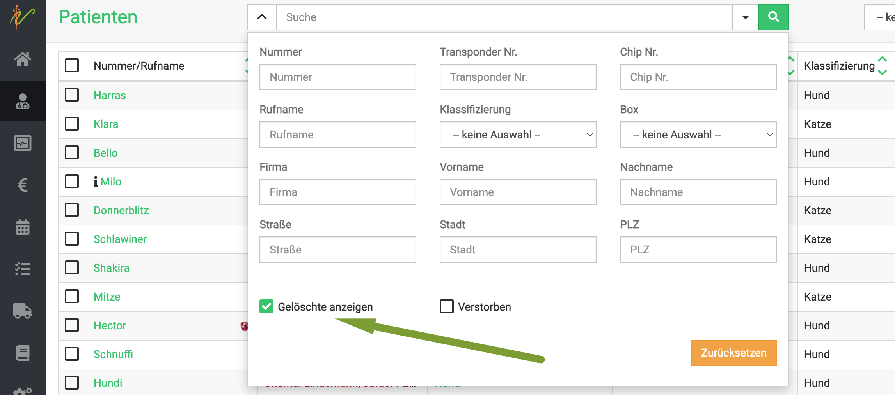  

Um die Auswahl zu bestätigen, klicken Sie das **Lupensymbol** oder drücken die **Entertaste**.  

In der Liste sehen Sie nun die gelöschten Patienten als rot hinterlegt.  

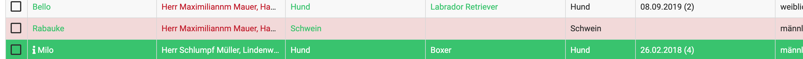  

### Gelöschte Patienten wieder herstellen  

Um einen gelöschten Patienten wieder herzustellen, wählen Sie diesen in der wie zuvor beschrieben angezeigten Liste aus, indem 
Sie auf den Tiernamen oder die Patientennummer klicken. Nun sehen Sie oben rechts den Button **Wiederherstellen**. 

Klicken Sie diesen, damit der Patient wieder als aktiver Patient, der bearbeitet werden kann, erscheint.  

Anschließend können auch wieder Behandlungen angelegt werden, Rechnungen storniert werden oder andere Veränderungen vorgenommen werden.  

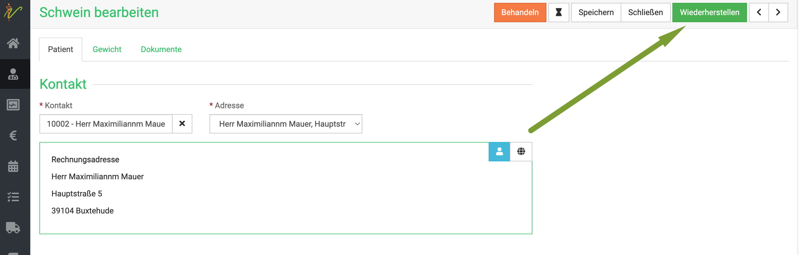

## Patienten einem anderen Besitzer übertragen

Falls das Tier verkauft, vererbt oder abgegeben wurde, soll das Tier/ der Patient an einen neuen Besitzer übertragen werden. Es handelt sich also 
um einen Besitzerwechsel. Sie möchten also ein bereits bestehendes Tier/Patienten einem neuen oder bereits bestehenden Besitzer/Kunden zuordnen.

Öffnen Sie zunächst die Kartei des Patienten, indem Sie auf **Praxis** und dann **Patienten** klicken. Suchen Sie den Patienten mit seinem Namen und klicken dann in der 
Liste auf seinen Namen. 

Klicken Sie nun bei **Kontakt** den Namen des Besitzers mit Klick auf das **X** weg.  

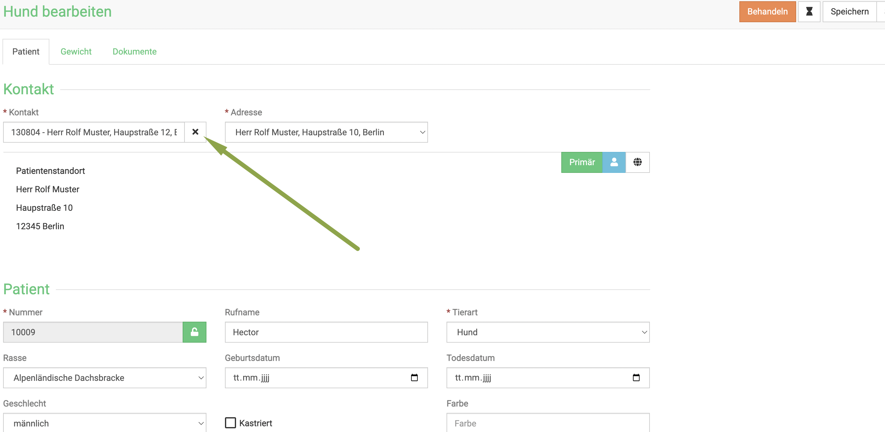  

Nun tippen Sie in das Feld den neuen Besitzernamen ein. (Ggf. legen Sie diesen vorher unter **Kunden** an). Die Suche von debevet schlägt direkt alle Treffer vor,
wählen Sie dann den neuen Besitzer und klicken Sie auf **Speichern**.  

:::danger ACHTUNG 

Nur ab diesem Punkt erstellte Behandlungen werden mit der Adresse des neuen Besitzers abgerechnet! Wenn es noch Behandlungen/Rechnungen 
gibt, die nicht bezahlt sind, werden diese NICHT dem neuen Besitzer zugeordnet. Dort erscheint dann beim Erstellen noch die ALTE Besitzeradresse!

Wenn die alten Posten dem neuen Besitzer zugeordnet werden sollen, muss die alte Rechnung storniert/ die Posten erneut eingegeben werden und dann abgerechnet werden!  

:::  

