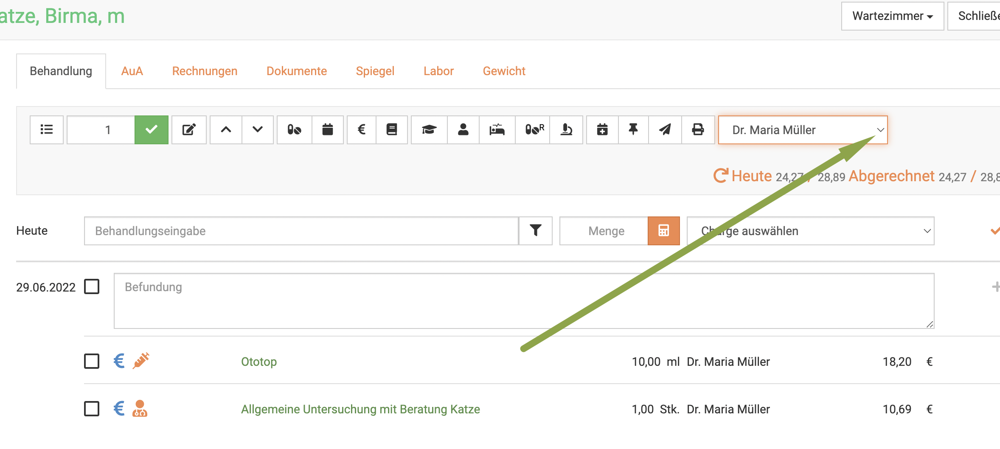

# Patienten behandeln  

Um einen Patienten zu behandeln, suchen sie diesen beispielsweise in der Patientenliste. Klicken Sie **Praxis** und dann **Patienten**.
Klicken sie dann oben rechts auf den orangenen Button **Behandeln**.  

  

Alternativ können Sie auch unter **Praxis** und **Kunden** den Besitzernamen suchen und dann oben **Behandeln** klicken,
allerdings müssen Sie in dem Fall dann noch aus der Dropdown Liste seiner Tiere das korrekte Tier wählen.  

  

  

## Einträge in die Kartei/ Befundung

Zu jedem Behandlungstag in der Kartei befindet sich als erstes das Freitextfeld "Befundung".
Diese Feld dient der internen Dokumentation und wird nicht in die Rechnung übernommen.

Das Feld selbst kann mit der Maus durch Ziehen am Kasten unten rechts vergrößert werden. Beim Aufruf der Kartei passt
es sich automatisch der Länge des erfassten Textes an. 

Um händisch Ihre Anmerkungen und Texte einzutragen, können Sie diese in das Feld **Befundung** eintragen. Um den Eintrag 
zu speichern drücken Sie rechts das **Plus Symbol**. Dies ist nicht zwingend nötig, bietet aber etliche Vorteile.  

* Falls mehrere Behandler/Ärzte eine Notiz hinzufügen wollen, wird getrennt gelistet, wer etwas geschrieben hat 
* Falls Sie noch Einträge ergänzen wollen, auch später, und diese zu vorherigen Behandlungen hinzufügen wollen, werden alte 
Einträge nicht überschrieben 

### Eintrag hinzufügen 

Wenn Sie nun z.B. den einen Eintrag mit dem **Plus Symbol** gespeichert haben, und ein anderer Behandler etwas ergänzen will,
muss darauf geachtet werden, dass dann oben der korrekte Arzt ausgewählt ist. Es kann dann ein weiterer Eintrag gemacht werden,
diese werden dann in der Darstellung untereinander gelistet.  

Natürlich können Sie mit einem Klick rechts auf das **Stiftsymbol** den Eintrag immer wieder bearbeiten oder mit dem
**Mülleimer Symbol** löschen.  

  

### Eintrag für anderen Benutzer erstellen  

Wenn Sie mit Ihrem Nutzerlogin eingeloggt sind, ist dies der "Haupt-Eintragende". 

:::tip Tipp

Die Auswahlmöglichkeiten werden Ihnen nur dann gegeben, wenn Sie vorher mehrere Benutzer anlegt haben.  

:::

Mit dieser Funktion könnnen Sie Karteikarteneinträge für andere Kollegen aus dem Praxisteam vornehmen. Der Eintrag wird
dann mit Namen des anderen in der Kartei geführt, aber deutlich signalisiert, dass dieser den Eintrag nicht selbst 
vorgenommen hat.  

Für die Anwendung dieser Funktion gibt es meist zwei gängige Beispiele:  
* Sie nutzen kurz den Computer, an dem eigentlich Ihr Kollege arbeitet  
* Ein Mitarbeiter möchte im Namen eines anderen einen Eintrag hinterlegen   

Sichern Sie hierzu zunächst evtl. noch nicht gesicherte Einträge durch Klick auf das **Plus Symbol** am Eintrag der Befundung.   

Wählen Sie dann oben mit dem Dropdown den Namen aus, unter dem Sie den Eintrag vornehmen wollen/sollen.  

Schreiben Sie dann den Eintrag und sichern diesen erneut mit dem **Plus Symbol**.  

:::caution Achtung! 

In der Übersicht sehen Sie dann anhand einer blau hinterlegten Farbe des Namens am Eintrag, dass dieser von jemand anderem stammt.  

  

  

::: 

Natürlich könnte auf dieselbe Art ein anderer Nutzer "auf die Schnelle" mit Ihrem Account mit seinem Namen einen Eintrag erstellen. Gekennzeichnet ist 
es dann nur so, als hätten Sie als eingeloggter Nutzer diesen Eintrag gemacht, dieser wäre also blau. 

## Leistungen/Medikamente hinzufügen 

Um nun einzugeben, was abgerechnet werden soll, schreiben Sie die Bezeichung in das Feld **Behandlungseingabe** neben *heute*.  

Aus der Liste Ihrer Produkte werden dann direkt die entsprechenden Posten (Vorschau bis zu 5 Stück) aufgelistet und Sie können diese auswählen. 

  

Dabei können Sie Dienstleistungen, Medikamente oder alles Weitere aus Ihren angelegten/importieren Produkten nutzen. 

### Nur lagernde Produkte suchen  

Sie finden die gesuchten Medikamente nicht, oder finden die Ansicht zu unübersichtlich? Sie können sich, wenn Sie Warenbestände bereits angelegt haben,
nur Ihre Lagernden Produkte anzeigen lassen. Dies geht entweder global (also für immer, bis auf erneut Änderung) oder nur für die eine Behandlungsansicht.

 **Global:** 
 Klicken Sie dazu auf **Administration**, dann **Einstellungen** und dann den Reiter **Behandlung**

Dann setzen Sie den Haken bei "nur lagernde Produkte suchen" und klicken anschließend oben rechts auf **Speichern**. 

**Nur für eine Behandlung:**  

Um nur dieses eine Mal, in der aktuellen Eingabe nur lagernde Produkte anzuzeigen, klicken Sie rechts neben der Behandlungseingabe auf
das **Filtersymbol** und setzen dann den Haken bei "nur lagernd". In der nächsten Behandlung werden Ihnen wieder alle Produkte angezeigt.  

### Symbole an den Medikamenten  

Wenn Sie ein Medikament eingeben, wird Ihnen eine Vorschau an Treffern angezeigt. Um bei verschiedenen Packungsgrößen die korrekte zu wählen, 
erklären wir hier kurz die kleinen Symbole:

Das Symbol mit den vier Strichen zeigt die Packungsgröße und Einheit an, in diesem Beispiel einmal 30 und einmal 60, jeweils eine Tablette als Einheit.

Das Symbol mit dem Warenkorb zeigt, wie viel Sie von dem Produkt aktuell in Ihrem Lagerbestand haben, in diesem Beispiel Null.   

## Diagnose anlegen und einfügen  

Geben Sie die Diagnose im Feld "**Behandlungseingabe** ein. Die Diagnose/Vorstellungsrgrund 
wird auch auf die Rechnung gedruckt  (Pflicht laut GOT!).

Wenn die Diagnose bereits bekannt ist, wird diese Ihnen in der Liste mit vorgeschlagen. Diagnosen sind dabei PINK farbend. 

Klicken Sie die Diagnose an und diese wird in PINK über dem Behandlungsfeld angezeigt.

Wenn die gewünschte Diagnose nicht vorhanden ist, lernen Sie im nächsten Schritt, wie Sie diese mit einem Klick anlegen.

Um eine Diagnose anzulegen,  gibt es zwei Wege:  

**1. Direkt in der Behandlung**   

Klicken Sie oben auf das **Doktorhut-Symbol**, um eine neue Diagnose anzulegen.
Nun öffnet sich ein Popup-Fenster, in dem Sie die Diagnose eingeben können. Das Feld "Nummer" lassen Sie bitte leer.  

Leider sind die Diagnosen zur Zeit noch an Tierarten gebunden, Sie müssen
die Klassifizierung hinterlegen. Die Diagnose muss dann evtl für verschiedene Tierarten erneut angelegt werden.

 

  

KLicken Sie auf **Anlegen**.   

**2. Über den Diagnose-Katalog**  

Alternativ können Sie Diagnosen direkt im Katalog mit Diagnosen anlegen. Klicken Sie dazu auf **Warenwirtschaft** und dann
**Diagnosen**. 

Mit dem Klick auf das grüne Plussymbol öffnet sich eine Maske, in der Sie den Namen der Diagnose eingeben können. Das Feld "Nummer" 
kann leer bleiben, dieses wird automatisch gesetzt. Leider sind die Diagnosen zur Zeit noch an Tierarten gebunden, Sie müssen
die Klassifizierung hinterlegen. Die Diagnose muss dann evtl für verschiedene Tierarten erneut angelegt werden.

  

   

### Aktionen an Diagnosen hinterlegen  

Sie können an bestimmte Diagnosen eine Aktion hinterlegen. Ein Beispiel dafür sind die Impferinnerungen, hierzu gibt es bereits einen 
extra Artikel in diesem Handbuch:   

[Impferinnerung an Diagnose binden](https://handbuch.debevet.de/docs/Administration/Impferinnerungen#variante-1-die-nutzung-von-diagnosen-zum-automatischen-erstellen-einer-impferinnerung)
   
Sie können aber auch Kastrationen oder Euthanasie des Tieres als automatische Aktion hinterlegen. Im Falle von der Auswahl 
"Kastration" als Aktion, wird das Tier nach Einfügen dieser Diagnose automatisch in den Status "kastriert" überführt.  

Bei Euthanasie wird automatisch das Datum als Todesdatum eingefügt. 

   

:::caution Achtung:  

Diesen Reiter "Aktion" können Sie erst sehen, wenn Sie die Diagnose angelegt und gespeichert haben!  

:::   

## Diagnosen löschen  

Wenn Sie einige Diagnosen aus Versehen doppelt angelegt haben oder unnötige Diagnosen wieder löschen möchten, klicken Sie auf **Warenwirtschaft** und
dann **Diagnosen**. 

Setzen Sie nun eine Checkbox vor die Diagnosen, die Sie löschen wollen und klicken dann rechts oben auf das **Mülleimer-Symbol**.  

### Gebührenfaktor / GOT Satz

In diesem Feld finden Sie beim Betreten der Kartei den Gebührenfaktor, der gemäß **Administration** → **Einstellungen:** Faktor
für Ihre Praxis hinterlegt ist.

Sie können diesen Vorgabewert Ihrer Praxis im Bedarfsfall in der Behandlung herauf- bzw. heruntersetzen. 

Alle Leistungen, die von Ihnen in die Kartei aufgenommen werden, werden jeweils mit dem aktuellen GOT-Satz,
der zum Zeitpunkt des Eintrags hier steht, multipliziert. 

:::caution Achtung   

Die Eingabe muss durch einen Klick auf den Haken neben dem Faktor aktiv gesetzt werden.   

:::  

Möchten Sie nur einzelne Posten im Faktor erhöhen, markieren Sie diese mit der Checkbox, ändern dann den Gebührenfaktor und klicken den grünen Haken. 

   

So können an einem Kunden unterschiedliche GOT Sätze verwendet werden, entweder ein GOT-Posten für alle Positionen, oder verschiedene 
Sätze für verschiedene Positionen. 

## Behandlungen suchen und finden  

Klicken Sie auf **Praxis**, dann auf **Behandlungen**. Das System listet alle Behandlungen auf. Tippen Sie in das Suchfenster
wie bei einer Suchmaschine Begriffe ein, die auf den gewünschte Behandlung passen und drücken Sie die **Entertaste** oder klicken
Sie auf das **Lupensymbol**.   

  

### Suche filtern 

Wenn Sie neben dem Eingabefeld für die Schnellsuche oben auf den Pfeil nach unten klicken, können Sie auch nach gezielten
Parametern bzw. weiteren Suchbegriffen filtern.  

 

### Suchenfilter zurücksetzen  

Wenn Sie eine Suche ausgeführt haben, ist die Behandlungsliste gefiltert, was dadurch angezeigt wird, dass der **Pfeil nach 
unten** neben den der Schnellsuche *gelb* ist. Klicken Sie auf den Pfeil nach unten und dann auf **Zurücksetzen**, um die
Behandlungsliste wieder ungefiltert angezeigt zu bekommen.  

  

## Befunde/ Einträge verschieben /rückdatieren

Evtl. fällt Ihnen auf, dass Sie eine Befunddokumentation vergessen haben oder noch etwas zu einem Tag in der Vergangenheit nachtragen wollen.
Um dies zu ermöglichen, können Sie alle Einträge und Behandlungen verschieben. 
Um einen Eintrag zu ergänzen, den Sie verschieben wollen, schreiben Sie diesen und sichern ihn mit Klick auf das **Plus Symbol**. 

  

Bereits vorhandene Einträge an einen anderen Tag zu verschieben (oder den eben erstellten) klappt dann wie folgt:  

Klicken Sie auf das **Stift Symbol** rechts neben dem Eintrag.   

  

Klicken Sie nun das **Kalender Symbol** und wählen den gewünschten Tag, auf den die Behandlung verschoben werden soll. KLicken 
Sie danach auf das kleine **Disketten Symbol** rechts.   

  

Nun taucht Ihr Eintrag an dem gewünschten Tag auf.  

  

:::tip Tipp  

Hierbe wird NUR der Befundungstext verschoben. Um auch Leistungen und andere abgerechnete Posten zurückzudatieren, führen Sie 
den nächsten Schritt durch. 
:::  

## Behandlungsdatum ändern / rückdatieren

Um Abrechnungeposten zurückzudatieren, tragen Sie diese zunächst am aktuellen Tag ein. Aktivieren Sie nun 
die Checkboxen der gewünschten Posten und clicken dann oben auf das **Kalendersymbol**. 
Dort wählen Sie dann das gewünschte Datum und bestätigen dieses mit Klick auf den **grünen Haken**.  

## Einträge/ Behandlungsposten löschen  

Sie haben etwas falsches eingetragen und müssen oder wollen es löschen? Klicken Sie dazu auf das **Mülleimer Symbol** neben dem
entsprechenden Posten rechts. Bestätigen Sie dann die Löschung.   

   

:::tip Tipp  

Bei bereits abgerechneten Behandlungen müssen Sie zuerst die Rechnung stornieren, bevor Sie Posten löschen können. Wie das geht,
erfahren Sie hier:  
[Rechnungen löschen](/docs/Fakturierung/Rechnungen#rechnungen-korrigieren-stornieren-löschen)  

:::  

## Einträge sortieren   

Sie wollen, dass die Abrechnungsposten auf der Rechnung in einer bestimmten Reihenfolge erscheinen? Sie können diese beliebig verschieben.
Markieren Sie vorn am gewünschten Posten die **Checkbox** und nutzen Sie dann oben in der Leiste die **Pfeile nach oben und unten**, um die Reihenfolge
beliebig zu ändern.   

  

## Medikamente als Abgabe oder Anwendung  

Um bei einem oder mehreren Medikamenten auszuwählen, ob es in einer Behandlung verwendet wurde, oder abgegeben wurde,
wählen Sie zunächst die **Checkboxen** der gewünschten Medikamente an. Drücken Sie nun oben rechts auf das **Pillensymbol**.

    

:::tip Tipp  

Anhand der kleinen Symbole links vom Medikament können Sie erkennen, ob es als Abgabe **(Pillensymbol)** oder Behandlung
**(Spritzensymbol)** gebucht/eingetragen ist.  

:::  

## Brief/Mail an den Patienten anlegen  

Klicken Sie oben rechts auf das **Briefsymbol**, um dem Kunden einen Brief zu schreiben.  

In der sich öffnenden Maske können Sie nun Inhalte frei eingeben, oder im Dropdownmenü rechts **Vorlagen** nutzen.  

:::tip Tipp  

Diese Funktion kann für Berichte oder Einverständniserklärungen nützlich sein.  

:::  

### Brief-Vorlagen erstellen/bearbeiten  

Um die Vorlagen für die Brief Funktion zu nutzen und neue Vorlagen zu erstellen, klicken Sie **Administation** und dann 
**Testbausteine**. Dort wählen Sie dann **Vorlagen**.  

  

Oben rechts wählen Sie dann im Dropdown **Brief** aus und klicken dann auf das **grüne Plus-Symbol**.  Nun  können Sie den 
Text eingeben und die gewünschten Variablen einsetzen. Nach dem Speichern steht diese Vorlage nun bei der Brieffunktion zur Auswahl.

:::info Videotipp  

<iframe width="560" height="315" src="https://www.youtube.com/embed/dUxQwRO3O_A" title="YouTube video player" frameborder="0" 
allow="accelerometer; autoplay; clipboard-write; encrypted-media; gyroscope; picture-in-picture" allowfullscreen></iframe>  

:::  

Sie können sich diverse Vorlagen erstellen, um diese im Praxisalltag ausgedruckt oder via Mail zu nutzen. Gängige Beispiele sind: 

* Überweisung an eine Klinik 
* Rücküberweisung an Kollegen  
* Euthanasiebescheinigungen für Vorlage beim Ordnungsamt/ Stadt  
* Einwilligungserklärungen Narkose  
* Bericht an den Patientenbesitzer 

## Behandlungsverlauf drucken 

Wenn Sie den Verlauf einer Behandlung einsehen oder übersichtlich übermitteln oder ausdrucken möchten, können Sie dies sehr einfach erledigen.

Wenn Sie sich in der Behandlung des gewünschten Patienten befinden, klicken Sie in der Werkzeugleiste oben auf das **Drucker-Symbol**. 

  

Nun bekommen Sie die Möglichkeit zu wählen, was alles mit gedruckt werden soll. 

Wenn Sie nur die Befunde und Diagnosen drucken wollen, schauen Sie den nächsten Unterpunkt an. 

## Diagnosen und Befunde/ Dokumentation drucken  

Ob für eine Überweisung an einen Kollegen, eine Klinik oder nur für den Besitzer: Sie haben die Möglichkeit, nur die
Befundungen, die Sie notiert haben und die Diagnosen zu drucken.   

Klicken Sie hierzu in der Behandlung oben auf den Reiter  **Spiegel**.  

  

Nun können Sie den Zeitraum setzen, für den Sie die Befundungen ausdrucken möchten, bei keiner Auswahl wird alles gewählt.

Klicken Sie anschließend rechts auf das **Drucker-Symbol** , um den Spiegel als pdf zu erhalten. 

:::tip Tipp: 

Hier bieten wir keine direkte Mailoption, wenn sie die pdf per Mail verschicken wollen, laden Sie diese zunächst herunter und
nutzen dann Ihr Mailprogramm, um dem Kunden diese als Anhang zu senden.  

:::

