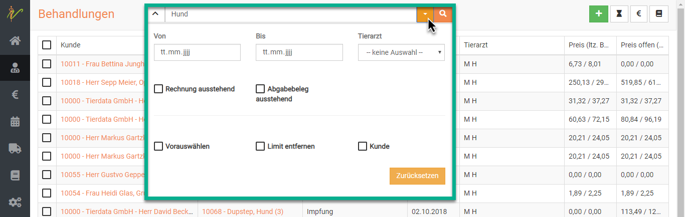

# Patienten behandeln  

Um einen Patienten zu behandeln, suchen sie diesen beispielsweise in der Patientenliste. Klicken Sie **Praxis** und dann **Patienten**.
Klicken sie dann oben rechts auf den orangenen Button **Behandeln**.  

  

Alternativ können Sie auch unter **Praxis** und **Kunden** den Besitzernamen suchen und dann oben **Behandeln** klicken,
allerdings müssen Sie in dem Fall dann noch aus der Dropdown Liste seiner Tiere das korrekte Tier wählen.  

  

  

## Einträge in die Kartei/ Befundung

Zu jedem Behandlungstag in der Kartei befindet sich als erstes das Freitextfeld "Befundung".
Diese Feld dient der internen Dokumentation und wird nicht in die Rechnung übernommen.

Das Feld selbst kann mit der Maus durch Ziehen am Kasten unten rechts vergrößert werden. Beim Aufruf der Kartei passt
es sich automatisch der Länge des erfassten Textes an. 

Um händisch Ihre Anmerkungen und Texte einzutragen, können Sie diese in das Feld **Befundung** eintragen. Um den Eintrag 
zu speichern drücken Sie rechts das **Plus Symbol**. Dies ist nicht zwingend nötig, bietet aber etliche Vorteile.  

* Falls mehrere Behandler/Ärzte eine Notiz hinzufügen wollen, wird getrennt gelistet, wer etwas geschrieben hat 
* Falls Sie noch Einträge ergänzen wollen, auch später, und diese zu vorherigen Behandlungen hinzufügen wollen, werden alte 
Einträge nicht überschrieben 

### Eintrag hinzufügen 

Wenn Sie nun z.B. den einen Eintrag mit dem **Plus Symbol** gespeichert haben, und ein anderer Behandler etwas ergänzen will,
muss darauf geachtet werden, dass dann oben der korrekte Arzt ausgewählt ist. Es kann dann ein weiterer Eintrag gemacht werden,
diese werden dann in der Darstellung untereinander gelistet.  

Natürlich können Sie mit einem Klick rechts auf das **Stiftsymbol** den Eintrag immer wieder bearbeiten oder mit dem
**Mülleimer Symbol** löschen.  

  

### Eintrag für anderen Benutzer erstellen  

Wenn Sie mit Ihrem Nutzerlogin eingeloggt sind, ist dies der "Haupt-Eintragende". 

:::tip Tipp

Die Auswahlmöglichkeiten werden Ihnen nur dann gegeben, wenn Sie vorher mehrere Benutzer anlegt haben.  

:::

Mit dieser Funktion könnnen Sie Karteikarteneinträge für andere Kollegen aus dem Praxisteam vornehmen. Der Eintrag wird
dann mit Namen des anderen in der Kartei geführt, aber deutlich signalisiert, dass dieser den Eintrag nicht selbst 
vorgenommen hat.  

Für die Anwendung dieser Funktion gibt es meist zwei gängige Beispiele:  
* Sie nutzen kurz den Computer, an dem eigentlich Ihr Kollege arbeitet  
* Ein Mitarbeiter möchte im Namen eines anderen einen Eintrag hinterlegen   

Sichern Sie hierzu zunächst evtl. noch nicht gesicherte Einträge durch Klick auf das **Plus Symbol** am Eintrag der Befundung.   

Wählen Sie dann oben mit dem Dropdown den Namen aus, unter dem Sie den Eintrag vornehmen wollen/sollen.  

Schreiben Sie dann den Eintrag und sichern diesen erneut mit dem **Plus Symbol**.  

:::caution Achtung! 

In der Übersicht sehen Sie dann anhand einer blau hinterlegten Farbe des Namens am Eintrag, dass dieser von jemand anderem stammt.  

  

  

::: 

Natürlich könnte auf dieselbe Art ein anderer Nutzer "auf die Schnelle" mit Ihrem Account mit seinem Namen einen Eintrag erstellen. Gekennzeichnet ist 
es dann nur so, als hätten Sie als eingeloggter Nutzer diesen Eintrag gemacht, dieser wäre also blau. 

## Leistungen/Medikamente hinzufügen 

Um nun einzugeben, was abgerechnet werden soll, schreiben Sie die Bezeichung in das Feld **Behandlungseingabe** neben *heute*.  

Aus der Liste Ihrer Produkte werden dann direkt die entsprechenden Posten (Vorschau bis zu 5 Stück) aufgelistet und Sie können diese auswählen. 

  

Dabei können Sie Dienstleistungen, Medikamente oder alles weitere aus Ihren angelegten/importieren Produkten nutzen.  

### Gebührenfaktor  

In diesem Feld finden Sie beim Betreten der Kartei den Gebührenfaktor, der gemäß **Administration** → **Einstellungen:** Faktor
für Ihre Praxis hinterlegt ist.

Sie können diesen Vorgabewert Ihrer Praxis im Bedarfsfall herauf- bzw. heruntersetzen.
Alle Leistungen, die von Ihnen in die Kartei aufgenommen werden, werden jeweils mit dem aktuellen Gebührenfaktor,
der zum Zeitpunkt des Eintrags hier steht, multipliziert. 

:::caution Achtung   

Die Eingabe muss durch einen Klick auf den Haken neben dem Faktor aktiv gesetzt werden.   

:::  

Möchten Sie nur einzelne Posten im Faktor erhöhen, markieren Sie diese mit der Checkbox, ändern dann den Gebührenfaktor und klicken den grünen Haken. 

   

## Behandlungen suchen und finden  

Klicken Sie auf **Praxis**, dann auf **Behandlungen**. Das System listet alle Behandlungen auf. Tippen Sie in das Suchfenster
wie bei einer Suchmaschine Begriffe ein, die auf den gewünschte Behandlung passen und drücken Sie die **Entertaste** oder klicken
Sie auf das **Lupensymbol**.   

  

### Suche filtern 

Wenn Sie neben dem Eingabefeld für die Schnellsuche oben auf den Pfeil nach unten klicken, können Sie auch nach gezielten
Parametern bzw. weiteren Suchbegriffen filtern.  

 

### Suchenfilter zurücksetzen  

Wenn Sie eine Suche ausgeführt haben, ist die Behandlungsliste gefiltert, was dadurch angezeigt wird, dass der **Pfeil nach 
unten** neben den der Schnellsuche *gelb* ist. Klicken Sie auf den Pfeil nach unten und dann auf **Zurücksetzen**, um die
Behandlungsliste wieder ungefiltert angezeigt zu bekommen.  

  

## Behandlung /Einträge verschieben 

Evtl. fällt Ihnen auf, dass Sie einen Eintrag vergessen haben oder noch etwas zu einem Tag in der Vergangenheit nachtragen wollen.
Um dies zu ermöglichen, können Sie alle Einträge und Behandlungen verschieben. 
Um einen Eintrag zu ergänzen, den Sie verschieben wollen, schreiben Sie diesen und sichern ihn mit Klick auf das **Plus Symbol**. 

  

Bereits vorhandene Einträge an einen anderen Tag zu verschieben (oder den eben erstellten) klappt dann wie folgt:  

Klicken Sie auf das **Stift Symbol** rechts neben dem Eintrag.   

  

Klicken Sie nun das **Kalender Symbol** und wählen den gewünschten Tag, auf den die Behandlung verschoben werden soll. KLicken 
Sie danach auf das kleine **Disketten Symbol** rechts.   

  

Nun taucht Ihr Eintrag an dem gewünschten Tag auf.  

  

:::tip Tipp  

An den Einträgen hinzugefügte Leistungen/Medikamente werden mit verschoben, so dass Sie gesamte Behandlungen verschieben können.  

:::  

## Behandlungsdatum ändern

Alternativ können Sie auch die Checkboxen der gewünschten Posten aktivieren und dann oben auf das **Kalendersymbol** klicken. Dort 
wählen Sie dann das gewünschte Datum und bestätigen dieses mit Klick auf den **grünen Haken**.  

## Einträge/ Behandlungsposten löschen  

Sie haben etwas falsches eingetragen und müssen oder wollen es löschen? Klicken Sie dazu auf das **Mülleimer Symbol** neben dem
entsprechenden Posten rechts. Bestätigen Sie dann die Löschung.   

   

:::tip Tipp  

Bei bereits abgerechneten Behandlungen müssen Sie zuerst die Rechnung stornieren, bevor Sie Posten löschen können. Wie das geht,
erfahren Sie hier:  
[Rechnungen löschen](/docs/Fakturierung/Rechnungen#rechnungen-korrigieren-stornieren-löschen)  

:::  

## Einträge sortieren   

Sie wollen, dass die Abrechnungsposten auf der Rechnung in einer bestimmten Reihenfolge erscheinen? Sie können diese beliebig verschieben.
Markieren Sie vorn am gewünschten Posten die **Checkbox** und nutzen Sie dann oben in der Leiste die **Pfeile nach oben und unten**, um die Reihenfolge
beliebig zu ändern.   

  

## Medikamente als Abgabe oder Anwendung  

Um bei einem oder mehreren Medikamenten auszuwählen, ob es in einer Behandlung verwendet wurde, oder abgegeben wurde,
wählen Sie zunächst die **Checkboxen** der gewünschten Medikamente an. Drücken Sie nun oben rechts auf das **Pillensymbol**.

    

:::tip Tipp  

Anhand der kleinen Symbole links vom Medikament können Sie erkennen, ob es als Abgabe **(Pillensymbol)** oder Behandlung
**(Spritzensymbol)** gebucht/eingetragen ist.  

:::  

## Diagnosen oder Dienstleistungen anlegen

Klicken Sie oben auf das **Doktorhut-Symbol**, um eine neue Diagnose anzulegen.

Um eine neue Dienstleistung anzulegen, klicken Sie auf das **Personen-Symbol**.

Geben Sie die benötigten Daten in die Felder ein und drücken danach Anlegen. 

  

## Brief/Mail an den Patienten anlegen  

Klicken Sie oben rechts auf das **Briefsymbol**, um dem Kunden einen Brief zu schreiben.  

In der sich öffnenden Maske können Sie nun Inhalte frei eingeben, oder im Dropdownmenü rechts **Vorlagen** nutzen.  

:::tip Tipp  

Diese Funktion kann für Berichte oder Einverständniserklärungen nützlich sein.  

:::  

### Brief-Vorlagen erstellen/bearbeiten  

Um die Vorlagen für die Brief Funktion zu nutzen und neue Vorlagen zu erstellen, klicken Sie **Administation** und dann 
**Testbausteine**. Dort wählen Sie dann **Vorlagen**.  

  

Oben rechts wählen Sie dann im Dropdown **Brief** aus und klicken dann auf das **grüne Plus-Symbol**.  Nun  können Sie den 
Text eingeben und die gewünschten Variablen einsetzen. Nach dem Speichern steht diese Vorlage nun bei der Brieffunktion zur Auswahl.

