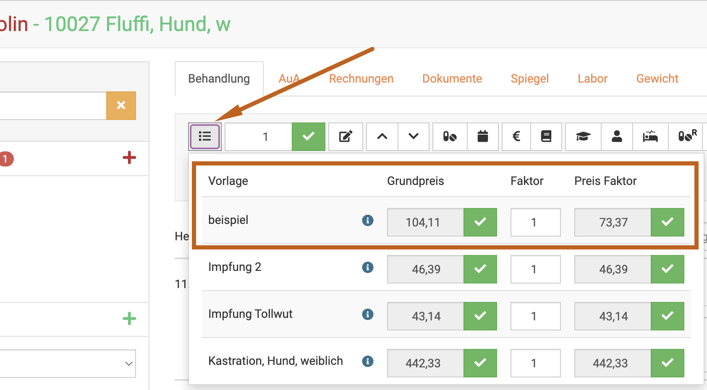
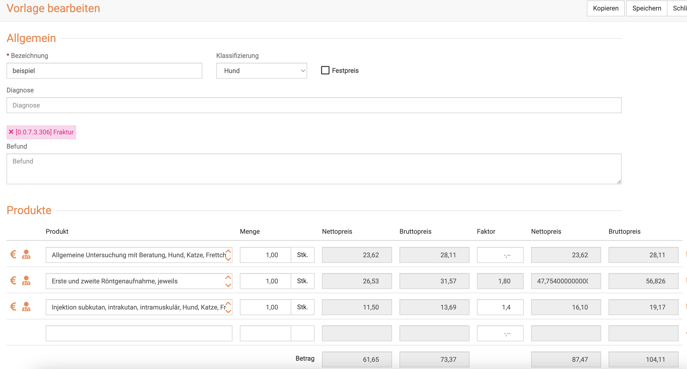
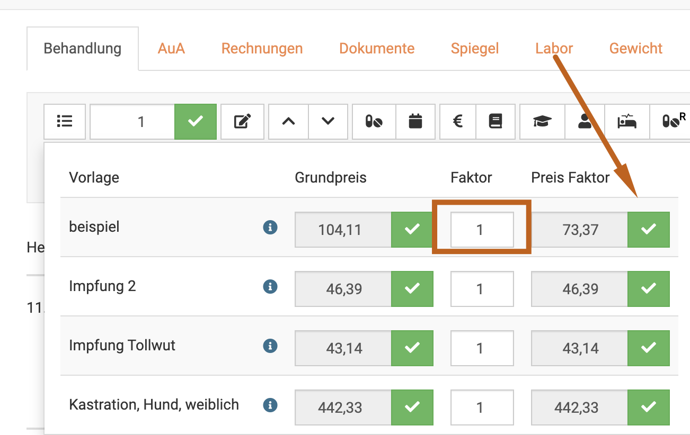
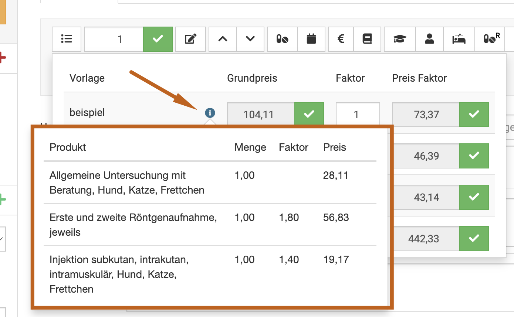
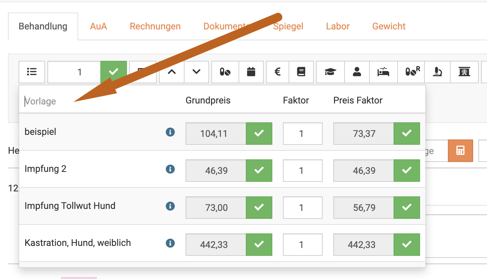
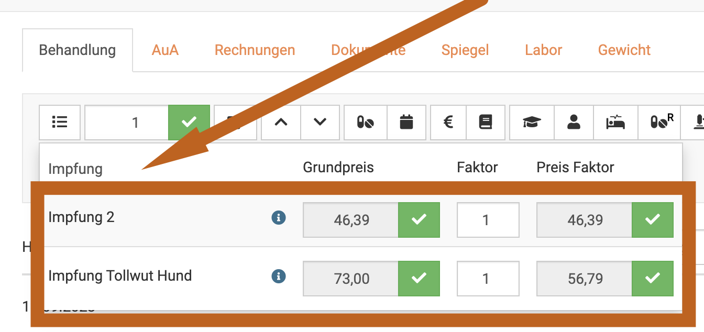

# Behandlungsvorlagen / Standardbehandlung

Die debevet Software bietet Ihnen die Möglichkeit, individuelle Vorlagen bzw. Standardbehandlungen zu erstellen für häufige Behandlungen.  

Was kann so eine Vorlage?  

Ganz einfach erklärt setzt die Vorlage mit einem Klick alle Abrechnungsposten ein, die in dieser Behandlung genutzt werden.  
Dabei können Sie also frei gestalten, welche Posten Sie hineinbringen wollen (diese können ja jederzeit in jeder Behandlung ergänzt oder verändert werden). 

Gängige Beispiele hierfür sind:   
* Impfungen 
* Kastrationen 
* generell individuell angelegte Posten  

## Eine Vorlage erstellen  

Klicken Sie im Hauptmenü auf **Praxis** und wählen Sie den Untermenüpunkt **Vorlagen**. Sie sehen die ungefilterte Liste 
Ihrer Vorlagen. Klicken Sie nun auf das grüne **Plussymbol**, um auf die Seite zur Eingabe einer neuen Vorlage zu gelangen.   

  

Nun öffnet sich die Eingabemaske für die Vorlage.  

  

Nun können Sie in jeder Zeile ein Produkt eingeben. Wenn Sie beginnen zu tippen, werden Ihnen automatisch passende Posten 
aus der Liste Ihrer Produkte vorgeschlagen. Diese können Sie auswählen, damit wird diese direkt in die Liste gesetzt.  

Möchten Sie eine Position wieder löschen, klicken Sie rechts das **Mülleimer-Symbol** neben dem Posten.

Wenn Sie fertig sind, klicken Sie oben rechts auf **Speichern**.   

### Faktor wählen in einer Vorlage  

Um Ihnen mehr Möglichkeiten zur Nutzung der Vorlagen einzuräumen, wurde im September 2023 die Funktion der Faktorisierung in den Vorlagen 
in der debevet Software hinzugefügt. 

Sie können also nun auch Vorlagen für Notfalldienste oder "Tierschutz" (falls erwünscht, z.B. alles im einfachen Satz) erstellen.
Sie sehen in der Vorlage nach dem hinzufügen eines Produktes den Grundpreis im einfachen Satz. In der Spalte "Faktor" haben Sie immer die Möglichkeit,
einen abweichenden Faktor **nur für diese Vorlage** zu hinterlegen.   

Sollte ein Produkt bereits einen abweichenden Faktor hinterlegt haben, wird dieser direkt nach dem Auswählen des Produkts für diese Vorlage 
bereits im Feld "Faktor" eingetragen, ist aber individuell veränderbar. 

Die Summe der Preise wird immer direkt bei jeder Veränderung (Faktor, Anzahl, hinzufügen oder löschen von Produkten) live angezeigt.  

:::info Videotipp

Hier haben wir noch eine Videoanleitung zum Erstellen und Anwenden einer Vorlage:

<iframe width="560" height="315" src="https://www.youtube.com/embed/B4SU4DMhxTk?si=NAFUu056JVmz5tHd" title="YouTube video player
" frameborder="0" allow="accelerometer; autoplay; clipboard-write; encrypted-media; gyroscope; picture-in-picture; web-share" allowfullscreen></iframe>

:::  

  

## Vorlagen bearbeiten oder löschen 

Klicken Sie in der Liste Ihrer Vorlagen auf den Link in der Spalte Bezeichnung oder Klassifizierung, um auf die 
Bearbeitungsseite der Vorlage zu gelangen. 

Wenn Sie direkt mehrere Vorlagen bearbeiten wollen, setzen Sie die **Checkboxen** an den gewünschten Vorlagen aktiv.  

Klicken Sie dann auf das **Stiftsymbol** oben rechts zum bearbeiten, oder dsa **Mülltonnen-Symbol** zum löschen.  

  

## Vorlagen verwenden / anwenden  

Um eine Vorlage nun in einer Behandlung zu nutzen, klicken Sie in der Behandlung oben auf das Symbol mit den **drei Strichen**.  

Sie sehen nun eine Vorschau Ihrer Vorlagen und den Basispreisen sowie dem Preis zum einfachen Satz. 

Der links angezeigte Preis ist dabei der Preis, wie er in der Vorlage, samt den dort abweichend hinterlegten Faktoren entsteht.
Der rechts angezeigte Preis wäre der, der mit allen Positionen zum einfachen Satz entstehen würde. 

Um die Vorlage zum "normalen" Preis einzufügen, klicken Sie den grünen Haken links.
Um einen anderen Faktor für die gesamte Vorlage zu nutzen, können Sie im Feld "Faktor" eine andere, gewünschte Zahl eingeben und anschließend
den grünen Haken rechts setzen.

Die Vorlage "beispiel" sieht wie folgt aus: (hier sehen Sie die abweichenden Faktoren, die erklären, warum die beiden Vorschaupreise 
voneinander abweichen)

In dem Feld "Faktor" können Sie auf Wunsch die gesamte Vorlage (bzw. alle Posten, die eine tierärztliche Leistung darstellen) im Faktor
verändern (Beispiel: Notdienst, Tierschutz auf Wunsch einfachen Satz etc.)

  

:::tip Tipp:   

Wenn Sie "schnell" noch einmal nachschauen wollen, welche Leistungen in der Vorlage enthalten sind, fahren Sie mit dem Mauszeiger über das 
Info-Icon. Ihnen wird direkt eine Vorschau der Leistungen in der Vorlage angezeigt.  

   

:::   

Mit dem Klick auf den grünen Haken fügt die debevet Software nun direkt alle Posten der Vorlage in Ihre Behandlung ein, 
inklusive evtl. hinterlegter Diagnose und/oder Befunden. 

### Vorlagen suchen 

Sie haben eine sehr umfangreiche Liste mit Vorlagen und es ist unübersichtlich beim Anwenden einer Vorlage? 

Sie können nach dem Klick auf das Vorlagen-einfügen-Symbol in das Feld klicken wie hier gezeigt:  

  

Nun tippen Sie mindestens 3 Buchstaben ein, um die Auswahl der Vorlagen nach Ihrer Wahl zu beschränken, in diesem Beispiel habe ich
nach "Impfung" gesucht (Impf hätte auch gereicht).  

  

So ersparen Sie sich langes suchen und scrollen und können sehr schnell die gewünschte Vorlage einfügen.

## Vorlagen mit inventurpflichtigen Medikamenten nutzen  

Es ist natürlich auch möglich, direkt inventurpflichtige Medikamente in einer Vorlage zu verwenden, so dass diese automatisch mit verwendet werden. Allerdings 
kommt es bei der Nutzung von mehreren aktiven Chargen zu einem "Konflikt", da die debevet Software nicht wissen kann, welcher der aktiven Chargen genutzt wird.

In diesem Fall erscheint ein Popup Fenster, welches erneut abfragt, welche Charge Sie nun nutzen wollen/werden. 

Wählen Sie dort durch einen Klick die korrekte Charge und klicken Sie dann speichern. Nun ist die Vorlage inklusive der korrekten Charge verwendet und die Inventur 
wird korrekt, da die Anzahl der verwendeten Medikamente abgezogen werden kann. 

