# Behandlungsvorlagen / Standardbehandlung

Die debevet Software bietet Ihnen die Möglichkeit, individuelle Vorlagen bzw. Standardbehandlungen zu erstellen für häufige Behandlungen.  

Was kann so eine Vorlage?  

Ganz einfach erklärt setzt die Vorlage mit einem Klick alle Abrechnungsposten ein, die in dieser Behandlung genutzt werden.  
Dabei können Sie also frei gestalten, welche Posten Sie hineinbringen wollen (diese können ja jederzeit in jeder Behandlung ergänzt oder verändert werden). 

Gängige Beispiele hierfür sind:   
* Impfungen 
* Kastrationen 
* generell individuell angelegte Posten  

## Eine Vorlage erstellen  

Klicken Sie im Hauptmenü auf **Praxis** und wählen Sie den Untermenüpunkt **Vorlagen**. Sie sehen die ungefilterte Liste 
Ihrer Vorlagen. Klicken Sie nun auf das grüne **Plussymbol**, um auf die Seite zur Eingabe einer neuen Vorlage zu gelangen.   

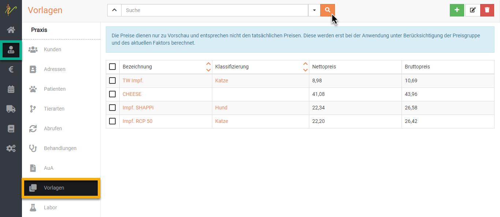  

Nun öffnet sich die Eingabemaske für die Vorlage.  

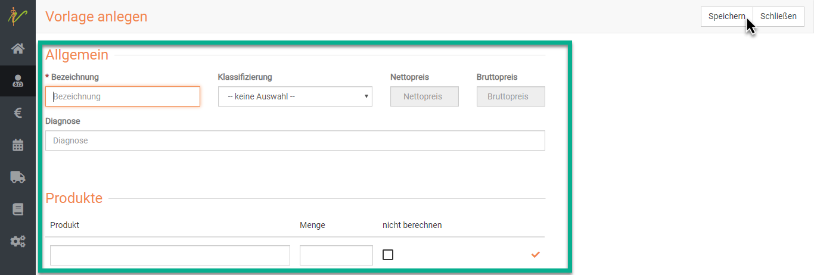  

Nun können Sie in jeder Zeile ein Produkt eingeben. Wenn Sie beginnen zu tippen, werden Ihnen automatisch passende Posten 
aus der Liste Ihrer Produkte vorgeschlagen. Diese können Sie auswählen, damit wird diese direkt in die Liste gesetzt.  

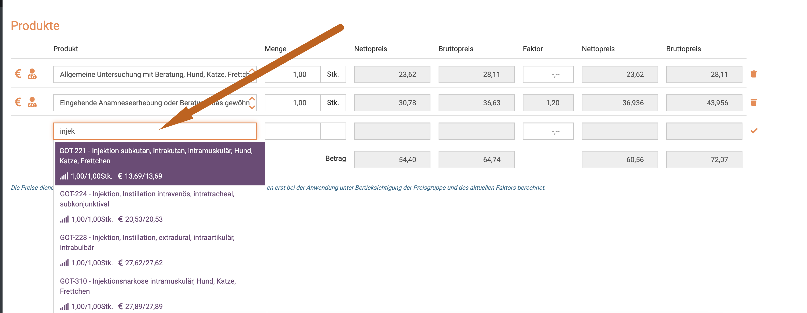

Möchten Sie eine Position wieder löschen, klicken Sie rechts das **Mülleimer-Symbol** neben dem Posten.

Wenn Sie fertig sind, klicken Sie oben rechts auf **Speichern**.   

### Faktor wählen in einer Vorlage  

Um Ihnen mehr Möglichkeiten zur Nutzung der Vorlagen einzuräumen, wurde im September 2023 die Funktion der Faktorisierung in den Vorlagen 
in der debevet Software hinzugefügt. 

Sie können also nun auch Vorlagen für Notfalldienste oder "Tierschutz" (falls erwünscht, z.B. alles im einfachen Satz) erstellen.
Sie sehen in der Vorlage nach dem hinzufügen eines Produktes den Grundpreis im einfachen Satz. In der Spalte "Faktor" haben Sie immer die Möglichkeit,
einen abweichenden Faktor **nur für diese Vorlage** zu hinterlegen.   

Sollte ein Produkt bereits einen abweichenden Faktor hinterlegt haben, wird dieser direkt nach dem Auswählen des Produkts für diese Vorlage 
bereits im Feld "Faktor" eingetragen, ist aber individuell veränderbar. 

Die Summe der Preise wird immer direkt bei jeder Veränderung (Fakto, Anzahl, hinzufügen oder löschen von Produkten) live angezeigt.  

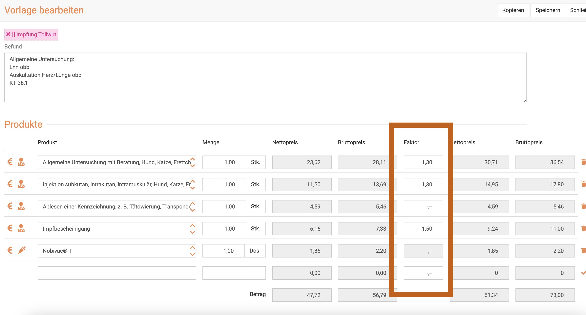

:::info Videotipp

Hier haben wir noch eine Videoanleitung zum Erstellen einer Vorlage:

<iframe width="560" height="315" src="https://www.youtube.com/embed/6wOK1ifyh8g" title="YouTube video player" frameborder="0"
allow="accelerometer; autoplay; clipboard-write; encrypted-media; gyroscope; picture-in-picture" allowfullscreen></iframe>   

:::  

## Vorlagen suchen  

Klicken Sie auf **Praxis**, dann auf **Vorlagen**. Das System listet alle Vorlagen auf. Tippen Sie in das **Suchfenster** wie bei
einer Suchmaschine Begriffe ein, die auf die gewünschte Vorlage passen und drücken Sie die **Entertaste** oder klicken Sie auf das **Lupensymbol**. 

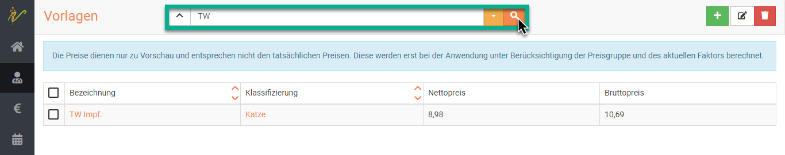  

Wenn Sie neben dem Eingabefeld für die Schnellsuche oben auf den **Dropdownpfeil** klicken, können Sie auch nach 
gezielten Parametern bzw. weiteren Suchbegriffen filtern.  

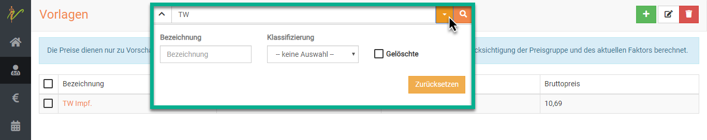  

### Suchenfilter zurücksetzen  

Wenn Sie eine Suche ausgeführt haben, ist die Vorlagenliste gefiltert, was dadurch angezeigt wird, dass der Pfeil nach
unten neben den der Schnellsuche *gelb* ist. Klicken Sie auf den Pfeil nach unten und dann auf **Zurücksetzen**, um die Vorlagenliste 
wieder ungefiltert angezeigt zu bekommen.  

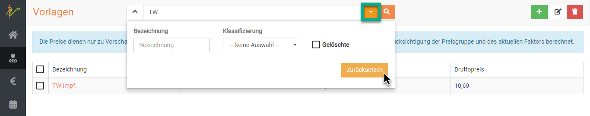  

## Vorlagen bearbeiten oder löschen 

Klicken Sie in der Liste Ihrer Vorlagen auf den Link in der Spalte Bezeichnung oder Klassifizierung, um auf die 
Bearbeitungsseite der Vorlage zu gelangen. 

Wenn Sie direkt mehrere Vorlagen bearbeiten wollen, setzen Sie die **Checkboxen** an den gewünschten Vorlagen aktiv.  

Klicken Sie dann auf das **Stiftsymbol** oben rechts zum bearbeiten, oder dsa **Mülltonnen-Symbol** zum löschen.  

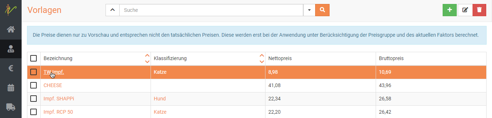  

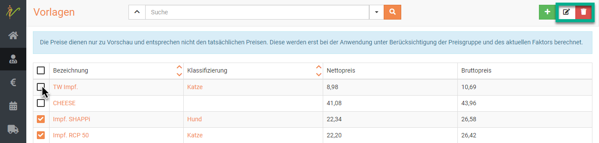

## Vorlagen verwenden / anwenden  

Um eine Vorlage nun in einer Behandlung zu nutzen, klicken Sie in der Behandlung oben auf das Symbol mit den **drei Strichen**.  

Dort klicken Sie auf **Vorlage wählen**, wählen Ihre gewünschte Vorlage und dann den **grünen Button Anwenden**.  

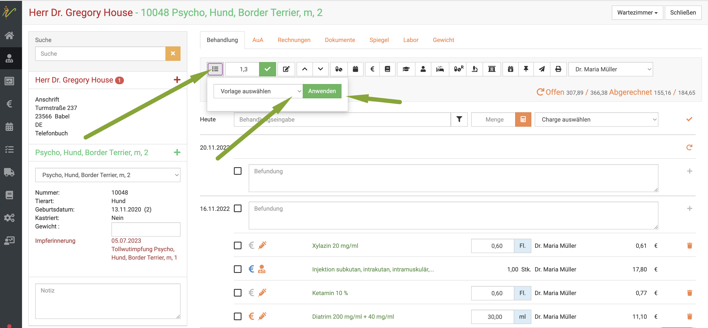

Die debevet Software fügt nun direkt alle Posten der Vorlage in Ihre Behandlung ein, inklusive evtl. hinterlegter Diagnose. 

## Vorlagen mit inventurpflichtigen Medikamenten nutzen  

Es ist natürlich auch möglich, direkt inventurpflichtige Medikamente in einer Vorlage zu verwenden, so dass diese automatisch mit verwendet werden. Allerdings 
kommt es bei der Nutzung von mehreren aktiven Chargen zu einem "Konflikt", da die debevet Software nicht wissen kann, welcher der aktiven Chargen genutzt wird.

In diesem Fall erscheint ein Popup Fenster, welches erneut abfragt, welche Charge Sie nun nutzen wollen/werden. 

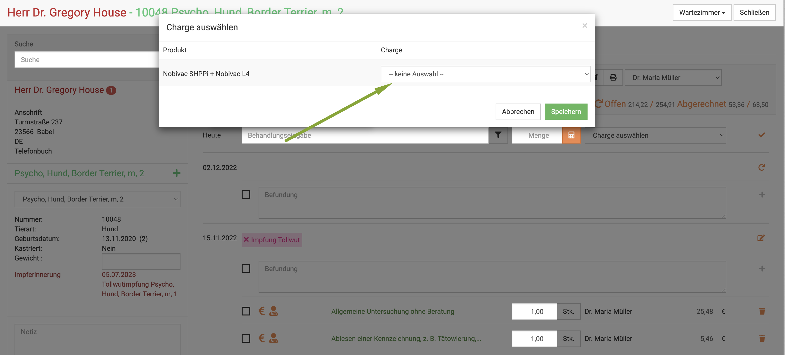

Wählen Sie dort durch einen Klick die korrekte Charge und klicken Sie dann speichern. Nun ist die Vorlage inklusive der korrekten Charge verwendet und die Inventur 
wird korrekt, da die Anzahl der verwendeten Medikamente abgezogen werden kann. 

