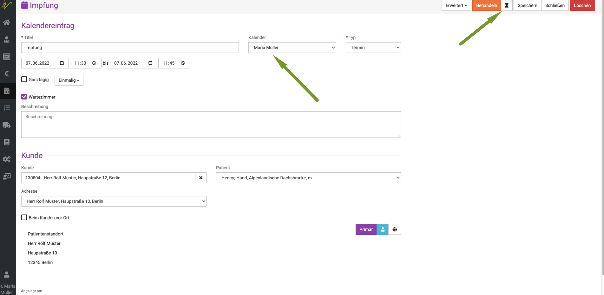

# Wartezimmer 

Die Nutzung des Wartezimmers in debevet bietet viele Funktionen, die den Ablauf im Praxisalltag erleichtern.

Im **Wartezimmer** erhalten Sie einen Überblick über die wartenden Kunden.

Es informiert Sie übersichtlich über die tagesaktuellen Sprechstundentermine, den behandelnden Tierarzt und den Status
der einzelnen Kunden bzw. Patienten (z.B. wartend, in Behandlung, fertig bzw. abzurechnen).

Zudem können Sie Mitteilungen über einen Patienten/Kunden in der Behandlung dort anzeigen lassen.

## Funktionen des Wartezimmers

Diese Funktionen stehen Ihnen zur Verfügung:

* **Sanduhr:** Der Patient wir dem Wartezimmer hinzugefügt.
* **Häkchen:** Der Patient wurde behandelt.
* **Pfeil nach unten:** Verschieben Sie diesen Patienten eine Position nach unten bzw. hinten.
* **Pfeil nach oben:** Verschieben Sie diesen Patienten eine Position nach oben bzw. vorne.
* **Stern:** Der Patient wird mit "Erledigt" markiert.
* **Euro:** Der Patient wird mit "Abrechnen" markiert.
* **Kreuz:** Löschen Sie diesen Patienten aus dem Wartezimmer.

## Patienten ins Wartezimmer setzen

Der Patient wird aus der Kundenkartei über das Sanduhr-Symbol in das Wartezimmer geschoben. Sie rufen den Kunden über **Praxis** und **Patienten** auf, 
indem Sie ihn in die Suche eingeben und **Enter** drücken oder das **Lupensymbol** klicken.

Aktivieren Sie nun die **Checkbox** und klicken anschließend das **Sanduhr-Symbol** oben rechts. Der Patient und sein Besitzer sitzen nun im Wartezimmer.  

Anhand der Farbe des Kästchens im Wartezimmer können Sie den Status erkennen. **Grau bedeutet wartend**. 

Sie können auch direkt aus dem Terminkalender den Kunden annehmen und dort über das gleiche Symbol in das Wartezimmer hinzuzufügen.

In dem Fall kommt der Betreff kommt aus dem Titel des Kalendereintrages und die Mitteilung wird aus der Behandlungsansicht dargestellt.

:::caution Achtung:

Wenn Sie einen Kunden aus dem Terminkalender in das Wartezimmer setzen, wird automatisch als "Tierarzt" der Tierarzt in der Übersicht
angezeigt, auf dessen Namen der Kalender läuft! Wenn Sie also verschiedene Ärzte nutzen, funktioniert diese Übersicht nur dann korrekt,
wenn der Patiententermin auch im passenden Kalender war.

:::

Hier im Beispiel ist der Termin im Kalender von Maria Müller eingetragen. Somit erscheint der Patient dann im Wartezimmer in der Übersicht auch
für diesen Tierarzt. Wenn Sie in Ihrer Praxis also im Wartezimmer bereits Zuweisungen nutzen wollen, muss die Mitarbeiterin, die den Kunden ins Wartezimmer
setzt, diesen in den passenden Kalender setzten, bevor Sie ihn ins Wartezimmer schiebt.

## Patienten aus dem Wartezimmer behandeln  

Als behandelnder Tierarzt können Sie nun ganz einfach einen Patienten/Kunden aus dem Wartezimmer annehmen. Klicken Sie einfach im Wartezimmer auf dem Dashboard auf den
Haken ganz rechts in der Zeile des Patienten.

  

Im Wartezimmer ist das Kästchen nun **orange**. So kann jeder direkt sehen, dass dieser Patient in Behandlung befindlich ist und nicht mehr wartet. 

## Patienten zum Abrechnen kennzeichnen

Wenn Sie als behandelnder Tierarzt mit dem Patienten fertig sind, können Sie diesen mit Klick oben rechts auf **Wartezimmer** und dann
**Abrechnen** zurück ins Wartezimmer schicken. 

Das Kästchen im Wartezimmer ist nun **blau** und zeigt Ihren Mitarbeitern, dass dieser Kunde nun abgerechnet werden kann.  

Alternativ kann direkt auf dem Dashboard im Wartezimmer das **Euro-Symbol** genutzt werden, um den Patienten zum Abrechnen zu kennzeichnen.  

## Heutige Behandlungen

**Heutige Behandlungen** gibt Ihnen einen Überblick über die heutigen Behandlungen, in denen es noch abzurechnende Posten gibt.
Von dort aus können Sie den Patienten direkt abrechnen.

Am einfachsten nutzen das €-Symbol unter "Heutige Behandlungen", um den Kunden abzurechnen.

Nach der Abrechnung ist der Patient aus dem Wartezimmer und "Heutige Behandlungen" verschwunden.

## Patienten abschließen/ erledigen  

Wenn die Abrechnung der offenen Posten erfolgt ist, sollten Sie den Patienten als **erledigt** kennzeichnen. Die einfachste Variante hierfür bietet
das **Stern-Symbol** im Wartezimmer auf dem Dashboard. 

  

Das Kästchen vor dem Patienten ist nun **grün**. 

## Patienten aus dem Wartezimmer entfernen

Haben Sie Ihre Behandlung in der debevet-Patientenakte eingetragen, erscheint der Eintrag automatisch unter Heutige Behandlungen.
Sie können den Kunden nun entweder aus dem Wartezimmer löschen, indem Sie das x klicken, oder bis zum gewünschten Zeitpunkt in der Wartezimmer-Übersicht stehen lassen.

  

### Wartezimmer leeren 

Wenn alle Patienten auf **grün** stehen und somit erledigt sind, können Sie auch alle Patienten aus dem Wartezimmer entfernen. Klicken Sie
hierfür den roten Button **Wartezimmer leeren**. Es werden ALLE Patienten entfernt, weshalb wir dies nur empfehlen, wenn alle Patienten erledigt sind. 

Sie müssen den roten Button dann erneut klicken, um zu **bestätigen**.  

