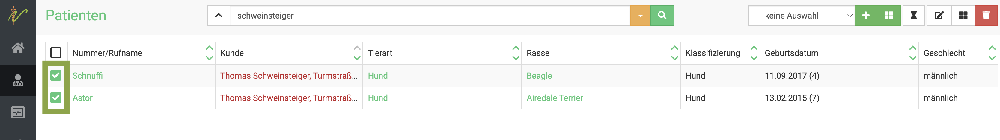
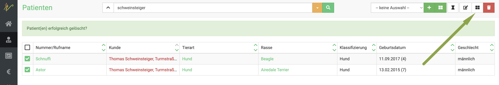
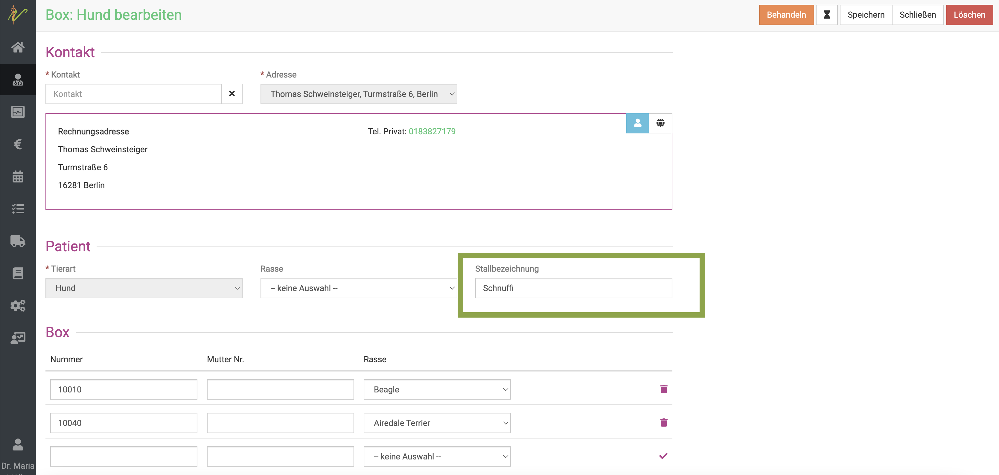
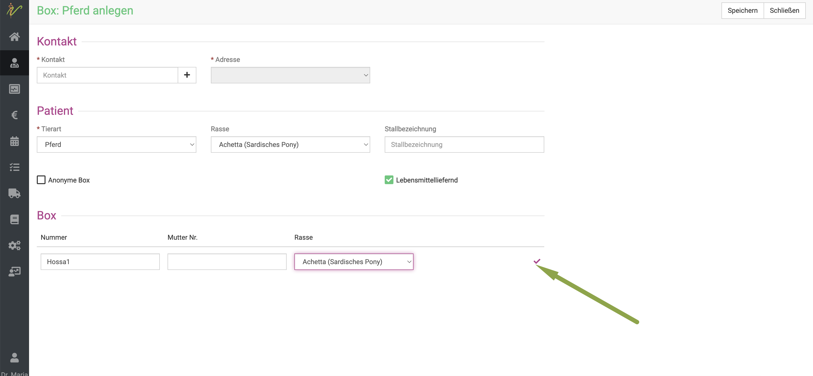
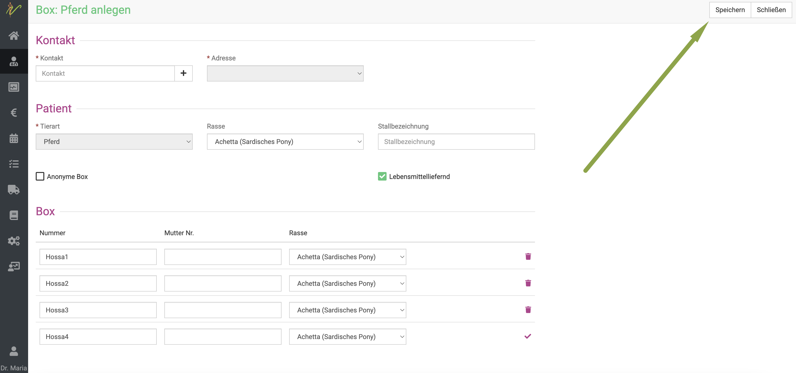
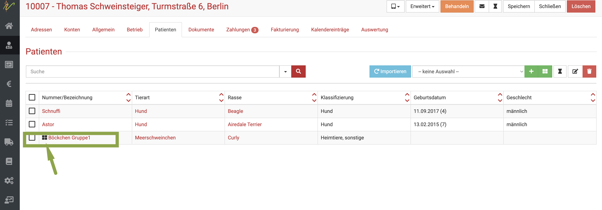

# Patienten in Gruppen behandeln  

Vor allem im Großtiersektor und oder Tierheimen kann die Behandlung in Gruppen nötig und sinnvoll sein. Hierfür nutzt debevet sogenannte **Boxen**. 
Mit dieser Funktion können mehrere Tiere auf einmal behandelt werden. Hierfür müssen diese allerdings demselben Besitzer (Kunden) gehören.

Dabei kann unterschieden werden in:   

1. normale Boxen  (ausgewählte Patienten, mit Name bzw. Nummer)
2. anonyme Boxen (Nur Anzahl der Tiere, ohne Kennzeichnung, häufig bei Schweinen/Hühnern genutzt)    

## Boxen erstellen   

Um eine Box zu erstellen, gibt es mehrere Wege. 

Grundsätzlich unterscheidet man zwischen **anonymen Boxen** und **nicht anonymen Boxen**. Bei anonymen Boxen wird nur eine Gruppe erstellt, ohne zu wissen,
welche Einzeltiere darin sind (also ohne Namen oder Ohrmarke bzw. Chipnummer).

### *1. Tiere aus der HIT-Liste eines Landwirtes in Box zusammenfassen 

Wenn Sie einen Betrieb als dessen zugelassener und bei der HIT hinterlegter Tierarzt betreuen, können Sie wie unter Monitoring beschrieben den Tierbestand abrufen.
Ein typisches Anwendungsbeispiel wäre nun, eine Gruppe von 10 Tieren gemeinsam mit Trockenstellern versorgen zu wollen. Seit dem 1.1.2023 dürfen Sie dies nicht mer in einer 
anonymen Box, sondern müssen mit den Ohrmarken eine nicht anonyme Box erstellen. 
Bitten Sie den Landwirt, Ihnen die Ohrmarken der betreffenden Tiere mit der Tierkennung (5 Ziffern) vorzulesen.

Sie öffnen am Kunden unter dem Reiter **Patienten** eine neue Box mit dem Klick auf das grüne Boxensymbol (wählen Sie die Tierart).  

   

Benennen Sie nun die Box, z.B. Trockensteller" und geben unten in das Feld die 5 Ziffern der Ohrmarke ein. De debevet Software schlägt Ihnen dann direkt das passende
Tier vor. Wählen Sie dies mit anklicken und verfahren nun nach und nach mit den gewünschten Tieren immer wieder genauso.

Klicken Sie dann oben rechts auf **Speichern** und behandeln Sie diese Box nun. 

:::tip Tipp: 

Wenn Sie nächstes mal eine andere Gruppe Tiere trockenstellen wollen, können Sie die Box erneut öffnen, die Tiere raus löschen und neue Tiere eintragen.
Auf dem AUA Beleg waren ja die korrekten Ohrmarken einegtragen.
Klicken Sie zum herauslöschen von Tieren aus der Box in der Box Ansicht einfach auf das **Mülleimer-Symbol**. 

  

:::

### *2. Über die Patientenliste mit bereits vorhandenen Patienten*  

Klicken Sie **Praxis** und dann **Patienten**. Geben Sie in die Suche den Namen des Kunden (Patientenbesitzers) ein und drücken 
Sie die **Entertaste** oder klicken auf das **Lupensymbol**.  

Nun setzen Sie die Checkboxen bei allen Tieren, die in eine Box gruppiert werden sollen. Natürlich geht das nur mit gleichen Tierarten!  

  

KLicken Sie nun oben rechts auf das **schwarze Boxensymbol**. Nun werden die markierten Tiere in einer Box zusammen gefasst.  

  

Um einen besseren Überblick zu haben, sollten/können Sie nun bei **Stallbezeichnung** einen eindeutigen Namen für diese Box eingeben.

Bestätigen Sie diesen dann mit **Speichern**. Anschließend können Sie den **Behandeln** Button klicken und die Gruppe genauso wie ein Einzeltier behandeln.  

  

### *3. Über die Patientenliste mit neuen Tieren*  

Klicken Sie in der Patientenliste oben rechts den **Dropdown-Pfeil** und wählen Sie die **Tierart**, aus der die Box bestehen soll.  

Anschließend klicken Sie das **grüne Boxen-Symbol*.  

   

Nun wählen Sie in der sich öffnenden Maske einen Kunden als **Kontakt** aus, indem Sie seinen Namen in das Feld bei Kontakt schreiben. 
Ihnen wird dann direkt eine Auswahl der passenden Kunden angezeigt. Alternativ klicken Sie das *Plus-Symbol** um einen neuen Kunden
anzulegen.  

Geben Sie nun alle benötigten Werte ein und setzen eine Stallbezeichnung.  

Um Tiere hinzuzufügen, geben Sie deren Nummer/Namen unten an und klicken dann rechts auf den **Haken**.   

  

Es wird direkt ein weiteres Tier mit der Folgenummer angelegt. Natürlich können Sie es auch anders benennen. 

:::caution Achtung   

Die Eingabe dieses Tieres muss auch über den Klick auf den **Haken** gesetzt werden!   

:::  

Klicken Sie, wenn Sie alle Tiere für die Box angelegt haben auf **Speichern** oben rechts.  

  

## Anonyme Boxen  

Wenn Sie nur eine anonyme Gruppe von Tieren erstellen wollen, aktivieren Sie die Checkbox beim Erstellen der Box bei **anonyme Box**.  

  

Bei **Boxenanzahl** setzen Sie nun einfach die Anzahl Tiere ein, die in dieser Gruppe zusammen gefasst sein sollen. 

Geben Sie der Gruppe einen Namen und setzen Tierart und Rasse wie gewünscht.  

:::caution Achtung  

Bedenken Sie, dass es bei **Tierarten** auch untergeordnete Tierarten geben kann. Dies sind beispielsweise bei **Heimtiere, sonstige** dann
beispielsweise Meerschweinchen, Hamster etc. Diese "Angebote" können sie auch selbst setzen (Unter **Praxis** - **Tierarten**).  

:::  

## Boxen behandeln  

Wenn Sie in einer Patientenliste (der gesamten oder an einem Kunden) nun das Symbol für Boxen sehen, wissen Sie, dass dies eine Gruppe von Tieren ist.  
Sie können auf den Namen/Bezeichnung der Gruppe klicken und dann **Behandeln**, um diese zu behandeln.  

   

### Gewicht pro Tier 

Bei der Berechnung der Medikamentenabgabe ist es wichtig, ein Gewicht pro Tier zu haben. Falls diese Gewichte nicht bereits bei der Rasse der Tierart 
hinterlegt sind, können Sie dies direkt an der Box am Patienten in der Behandlung eingeben.  

Klicken Sie hierzu in der Behandlung unten links an der Box in das Feld **Gewicht pro Tier** und geben Sie das Gewicht in kg ein.  

   

:::tip  Tipp  

Bei der Erstellung von AUA Belegen ist das Gewicht sehr wesentlich. Um Zeit zu sparen, empfiehlt es sich, die Gewichte direkt an den 
Tierarten/Rassen zu hinterlegen.  

:::  

## Boxen nachträglich bearbeiten  

Natürlich können Sie bei einer bereits erstellen Box/Gruppe von Tieren noch im Nachhinein Tiere löschen, die Anzahl der Tiere verändern
oder Tiere hinzufügen.  

### Tiere löschen und hinzufügen bei normaler Box

KLicken Sie **Praxis** und dann **Patienten**. In der Liste klicken Sie nun auf die **Bezeichnung** der gewünschten, zu bearbeitenden Box
neben dem Boxsymbol.  

  

Nun gelangen Sie auf die Bearbeitungsseite der Box. Sie können Tiere löschen, indem Sie neben dem zu löschenden Tier 
auf das **Mülleimersymbol** klicken.  

Um ein neues Tier hinzuzufügen, geben Sie die Daten des Tieres in die untere, freie Zeile ein und klicken danach den **Haken**. 
Nur so wird die Eingabe bestätigt.

Klicken Sie anschließend auf **Speichern** oben rechts.

  

Alternativ können Sie die Anzahl der Tiere auch direkt in der Behandlung ändern. Wählen Sie dazu die gewünschte Box im Dropdown Menü in der
Behandlung, links bei **Patient**.  

  

In dieser Sektion können Sie nun auf das **orangene Zahlensymbol** klicken, um Tiere zu löschen (**Mülleimersymbol**) oder hinzufügen
(**Eingabe in leere Zeile und Haken klicken**).

:::caution Achtung  

Hier in der Behandlung können Sie über diesen "Kurzen Weg" nur bereits angelegte Tiere hinzufügen! Komplett neue Tiere können Sie nur über
die Patientenliste hinzufügen.

:::  

  

### Anzahl der Tiere ändern in anonymer Box

Wenn Sie an einer anonymen Box die Anzahl der Tiere ändern wollen, können Sie dies in der **Patientenliste** ebenso. KLicken sie auf 
die Bezeichnung der gewünschten Box. Nun können Sie die Anzahl der Tiere ändern und dann **Speichern**.

Sie können in Boxen die Anzahl der Tiere auch direkt an der Behandlung ändern. Wählen Sie dazu in der Behandlung aus der Patientenliste
mit dem Dropdown Pfeil die gewünschte Box. Nun haben Sie zwei Möglichkeiten:   

1. Geben Sie links die geänderte Tierzahl direkt an der Liste ein

  

2. Klicken Sie direkt an der Box bei **Patient** links die orangene Zahl an, um dort die gewünschte neue Anzahl Tiere anzugeben  

  

## Einzelne Tiere aus der Behandlung herausnehmen 

:::caution Achtung  

Diese Funktion gibt es nur bei **nicht anonymen Boxen**.  

::: 

Wenn Sie bei der Behandlung einen Posten eingeben, um diesen abzurechnen, werden zunächst immer alle Tiere gewählt.
Um ein (odere mehrere) Tier(e) davon auszunehmen, klicken Sie auf die **orangene Zahl** am entsprechenden Behandlungsposten.  

  

Nun öffnet sich eine Maske, in der Sie mit Klick auf das **Link Symbol** einzelne Tiere von diesem **einen** Behandlungsposten 
ausnehmen können.  

  

Anschließend sehen Sie am Behandlungsposten anhand der **orangenen Zahl**, dass hier ein Tier weniger behandelt wurde.  

   

## Abgabemengen berechnen  

Die debevet Software bietet Ihnen die Möglichkeit, die Abgabemenge für die Gruppe direkt zu berechnen. Geben Sie dazu den Namen des Präparates ein
und klicken Sie dann auf das **Rechnersymbol**.   

  

Hier können Sie nun alle wichtigen Daten eingeben, die auch auf dem AUA-Beleg erscheinen müssen. 

Außerdem wird die Gesamtmenge berechnet, inklusive der Möglichkeit, Restmengen darzustellen. Dabei bezieht der Rechner sich auf die
Daten, die in den Produkten als Packungsgrößen angegeben sind.  

Klicken Sie anschließend rechts aus den **Haken**, um die passende Menge der Behandlung hinzuzufügen.  

Neben der berechneten benötigten Menge werden auch noch die auf die volle Packungsmenge auf- und abgerundete Menge angegeben. 
Auch die Restmenge die übrig bleiben würde, wenn Sie die aufgerundete Menge verwenden, wird angezeigt. Wenn Sie sich dazu entscheiden,
auf die nächste volle Packung abzurunden, wird die Menge pro Tier neu berechnet. Klicken Sie hierzu einfach wieder auf das Taschenrechner-Symbol.

:::tip Tipp  

Wenn Sie das Medikament nicht anwenden, sondern abgeben möchten (oder umgekehrt), klicken Sie auf das **Spritzensymbol** oder **Pillenymbol**,
um das entsprechend zu ändern.  

  

::: 

