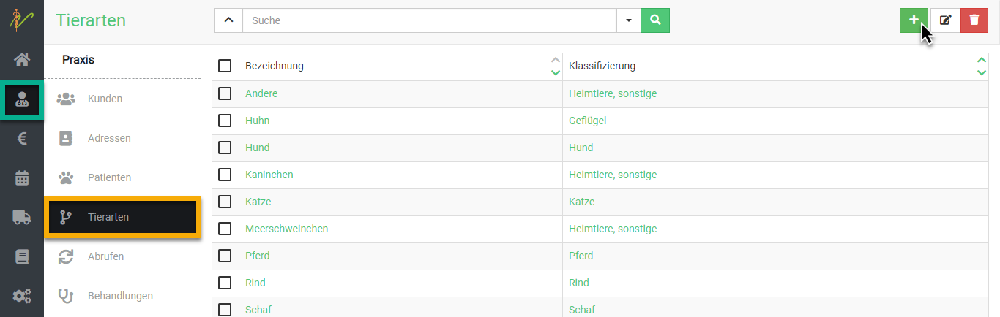
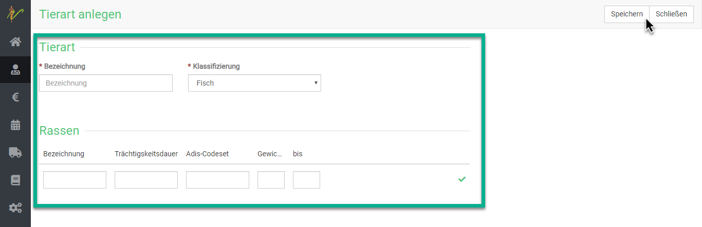
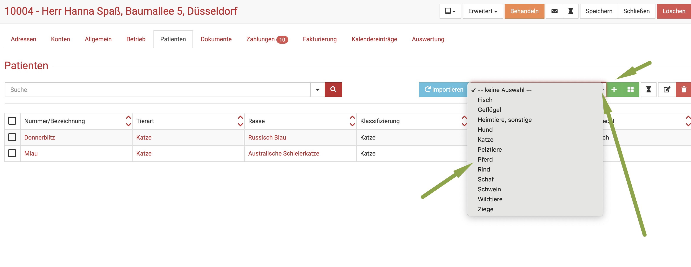
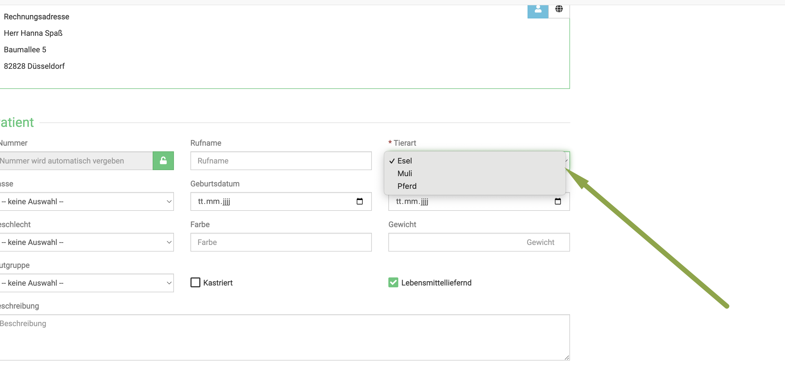
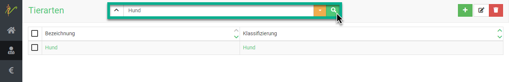
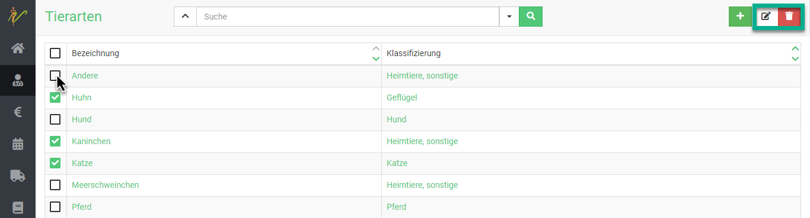
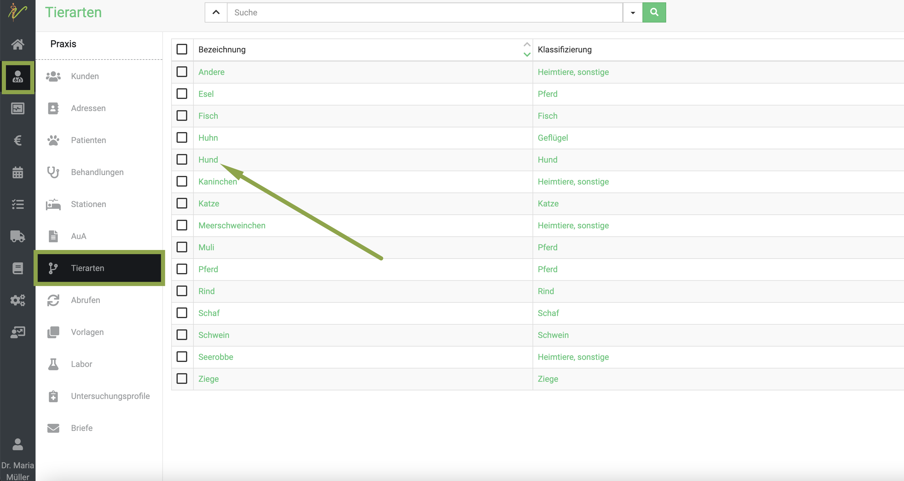
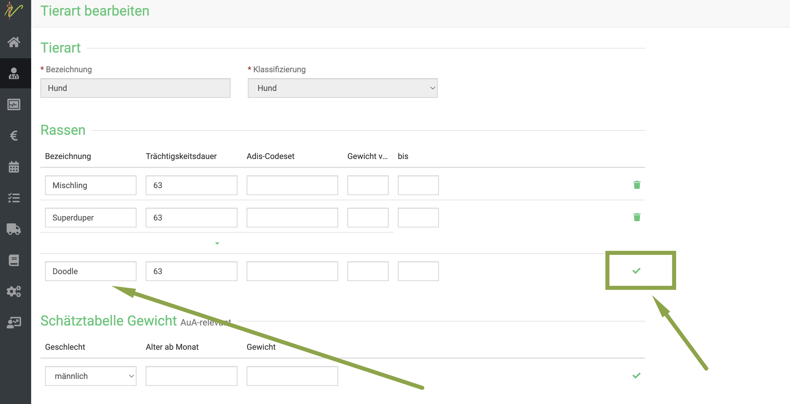

## Tierarten verwalten  

debevet stellt viele Tierarten und Rassen mit zahlreichen Details bereits zur Verfügung. Die vorhandenen Einträge können 
Sie nach Belieben erweitern oder verändern.  

:::caution Achtung  

Es ist nicht möglich, die durch die GOT vorgegebenen Standard-Tierarten zu löschen. Somit ist es nicht möglich, dass Ihnen nur einige wenige
Tierarten zur Verfügung stehen.  

::: 

 ## Neue Tierart anlegen

Klicken Sie im Hauptmenü auf **Praxis** und wählen Sie den Untermenüpunkt **Tierarten**. Sie sehen die ungefilterte Liste Ihrer 
Tierarten. Klicken Sie oben rechts auf das **grüne Plus-Symbol**, um auf die Seite zur Eingabe einer neuen Tierart zu gelangen.   

  

Geben Sie in der Eingabeseite die gewünschten Informationen ein und speichern Sie die neue Tierart anschließend, indem Sie auf **Speichern** klicken.  

  

:::caution Achtung  

Legen Sie Tierarten wie z.B. Esel, Muli beispielsweise als KLassifizierung von Pferden an, Meerschweinchen, Hamster oder Reptilien z.B. als 
Klassifizierung von "Sonstige".  
Dies bedeutet aber, dass Sie beim Anlegen eines neuen Patienten zunächst die Tierart"Gruppe" auswählen müssen und erst dann die 
eigentliche Tierart (Klassifizierung) setzen können.  

::: 

## Klassifizierungen nutzen  

Nehmen wir an, Sie haben unter Tierart Pferd die Klassifizierung Esel und Muli angelegt. Wenn Sie nun einen neuen Patienten anlegen,
wählen Sie zunächst Tierart Pferd, bevor Sie auf das **grüne Plus-Symbol** klicken. (Da Sie das Muli/den Esel in dieser Tierart
als Klassifizierung anlegt haben).    

  

:::caution  Achtung  

In der nächsten Seite wird nun bei Tierart automatisch evtl. die zuletzt hinzugefügte Klassifizierung als Tierart eingesetzt. 
Achten Sie also darauf, hier die Tierart immer noch einmal korrekt zu setzen.  

:::

  

## Tierarten suchen und finden

Klicken Sie auf **Praxis** und dann auf **Tierarten**. Das System listet alle Tierarten auf. Tippen Sie in das Suchfenster wie
bei einer Suchmaschine Begriffe ein, die auf die gewünschte Tierart passen und drücken Sie die **Entertaste** oder klicken Sie auf das
**Lupen-Symbol**.  Natürlich können Sie den Suchenfilter ebenso wie gewohnt nutzen und zurücksetzen.

  

## Tierarten bearbeiten  

Klicken Sie in der Liste Ihrer Tierarten auf die Schrift in der Spalte **Bezeichnung**, um auf die Bearbeitungsseite der Tierart zu gelangen. 

Natürlich können sie auch mehrere Tierarten bearbeiten oder löschen. Wählen Sie hierfür zunächst die jeweiligen **Checkboxen** in der Liste an. 
Drücken Sie nun das **Stift-Symbol** oben rechts, um die ausgewählten Tierarten zu bearbeiten.

Nutzen Sie die Pfeile < und > um beim bearbeiten zwischen den einzelnen Tierarten zu wechseln.

Um sie zu löschen, drücken Sie das **Mülltonnensymbol**.  

## Neue Rassen anlegen  

Natürlich können Sie auch weitere Rassen anlegen, die in der Standardliste nicht enthalten sind.  

KLicken Sie dazu auf **Praxis** und **Tierarten** und dann auf die Schrift in der Spalte Bezeichnung, unter welcher Tierart Sie 
eine neue Rasse anlegen wollen.  

  

Tragen Sie nun in die untere Reihe im freien Feld unter "Rassen" die gewünschte Rasse ein. Sie können noch weitere Daten wie Gewichte,
Trächtigkeitsdauer etc. hinterlegen. 

Bestätigen Sie Ihre Eingabe zunächst mit Klick auf den **grünen Haken** und klicken anschließen oben rechts auf **Speichern**.  

:::caution Achtung  

Wenn Sie den grünen Haken nicht klicken, sind die Daten nicht übernommen!  

::: 

:::tip Tipp  

Besonders im Nutztiersektor ist es sinnvoll, hier die Gewichte bestimmter Rassen zu hinterlegen. Sie sparen damit später bei entsprechender
Auwahl dieser Rassen bei Ihren betreuten Betrieben den Schritt, die Gewichte jedes mal eingeben zu müssen.   

:::   

:::info Videotipp  
Hierzu haben wir eine Videoanleitung erstelt:  

<iframe width="560" height="315" src="https://www.youtube.com/embed/JsIVulhbZB0" title="YouTube video player" frameborder="0" 
allow="accelerometer; autoplay; clipboard-write; encrypted-media; gyroscope; picture-in-picture" allowfullscreen></iframe>  

:::  

