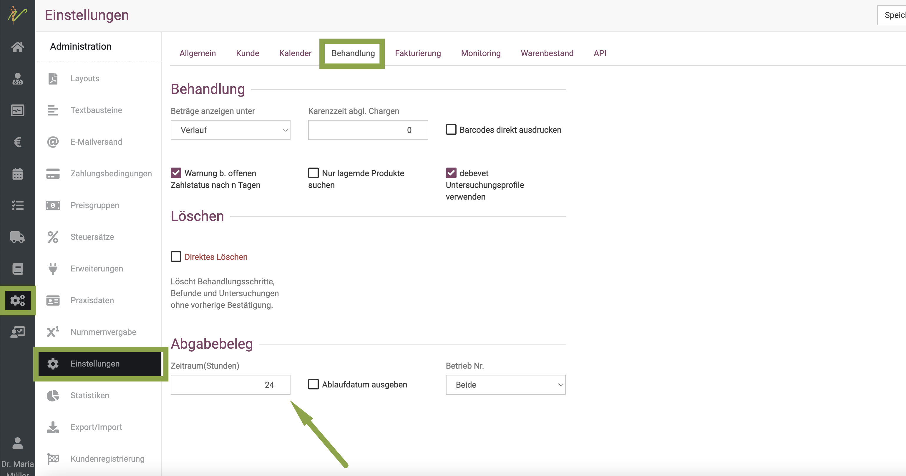
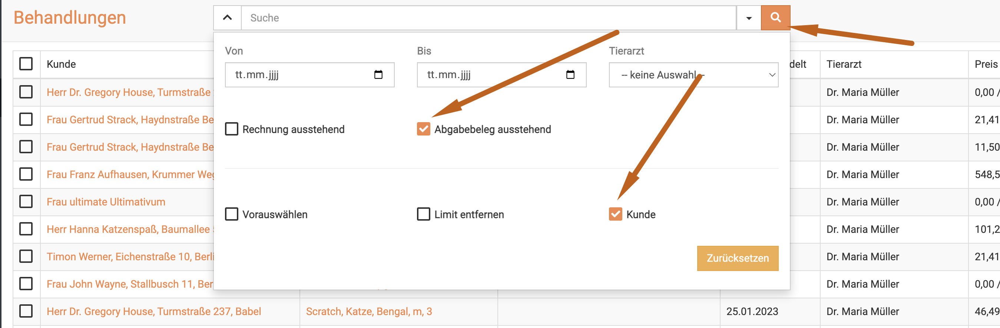

# Verschreibungen für Kleintiere/Pferde   

Die neuen Verschreibungen ab dem 1.1.2025, die auch für nicht lebensmittelliefernde Tiere (nicht LM Tiere) Pflicht sind, bekommen hier eine
eigene Beschreibung, da wir diese aus Gründen der unterschiedlichen Art der Meldung der Antibiotikeanwendung/-abgabe getrennt handhaben 
müssen. 

Ab 2026 müssen zwar auch für nicht LM Tiere die Antibiotikamengen gemeldet werden, doch erfolgt die Meldung dort auf einer anderen Basis (anonym, nur
Verbrauchsmengen, ohne Betriebs/VVO Nummern etc.).    

:::caution Achtung: 

Bitte achten Sie deshalb sehr strikt darauf, die Nicht LM Verschreibungen mit dem anderen Symbol zu 
erstellen als bisher für den Großtiersektor!!!    

:::    

Bitte denken Sie daran, dass die Barsoi aktuell die Darreichungsform und Konzentration nicht mitliefert, diese Bedingung wird nur 
dann erfüllt, wenn Sie diese Daten manuell am Produkt hinterlegen. Selbiges gilt für die Wirkstoffe, diese werden zwar mit der "großen" Barsoi geliefert,
aber sind oftmals nicht vollständig oder korrekt, wir raten deshalb zur Überprüfung.

### Ablaufdatum für Verschreibungen setzen

Sie können festlegen, nach welcher Zeit Verschreibung erstellt sein muss.

Klicken Sie hierzu auf **Administration** und dann **Einstellungen**. Dort klicken Sie in den Reiter **Behandlungen**.
Dort finden Sie die Zeit in Stunden, die Sie als Ablaufdatum frei bestimmen können.

### Verschreibung für nicht LM Tiere erstellen

Um eine Verschreibung für ein Tier oder eine Gruppe von Tieren zu erstellen, müssen Sie sich in der Behandlungsmaske des Tieres/ der Gruppe befinden.

Wenn Sie das Medikament nun oben neben **Heute** eingeben und auf den Mengenrechner klicken, können Sie dort direkt die Mengen
eingeben. Außerdem können Sie dort die Anweisung je nach Anwendungsfall wählen. KLicken Sie dazu auf den **Dropdown-Pfeil** neben
**Anweisung**.

:::tip Tipp:  
Wenn Sie für mehrere Tiere/Gruppen eines Kunden gesammelte Verschreibung erstellen möchten, schauen Sie weiter unten hier im Text.

:::

Nun müssen Sie mit einem der drei grünen Haken wählen, ob Sie von der berechneten, benötigten Menge:
* die genau berechnete Menge abgeben wollen
* die Menge zur nächsten Packungsgröße aufrunden wollen
* die Menge zur nächsten Packungsgröße abrunden wollen

Nach klicken von einem der drei **grünen Haken** wird die Menge übernommen.

Nun müssen Sie noch den **orangenen Haken** klicken,
um die Menge in diese Behandlung zu übernehmen.

:::danger ACHTUNG

Die Anweisungsanwendungen werden nicht übernommen, wenn Sie nicht erst einen grünen Haken, sondern direkt den orangenen klicken!

:::

:::caution Achtung

Die Anweisungsanwendungen werden nur auf der Verschreibung angezeigt, wenn Sie
1. diese am Produkt hinterlegt haben
2. hier oder im nächsten Schritt die Anweisung auch auswählen
3. mit dem **grünen Haken** wählen, welche Menge Sie abgeben wollen!

Alternativ können Sie auch hier in der "Rechnermaske" oder aber wie im nächsten Schritt beschrieben
die Anweisung jedes mal manuell hinterlege.

Wie Sie die Anwendungsanweisungen am Produkt/Medikament hinterlegen, erfahren Sie hier:

[Anwendungsanweisungen](/docs/Warenwirtschaft/Produkte#anwendungsanweisungen)

:::

Sie können auch die Anweisung noch im nächsten Schritt auswählen.  Um in diesem Schritt einfach manuell eine Anweisung einzugeben,
wählen Sie keine Anweisung, sondern tragen die Daten manuell ein:

Um nun die Verschreibung für die **nicht LM Tiere** zu erstellen, wählen Sie nun die **Checkboxen** der gewünschten Medikamente an.
Drücken Sie anschließend oben auf das **Listensymbol**.

:::caution Achtung

Achten Sie darauf, dass die korrekte Form gewählt ist, ob **Abgabe**(Pillensymbol) oder **Anwendung**(Spritzensymbol). Die Verschreibungen
werden nur für Abgabemedikamente erstellt im nicht LM Sektor.

:::

  

Nun wird Ihnen der Entwurf angezeigt. Wenn Sie zuvor nicht aus den Anwendungsanweisungen schon eine Option gesetzt haben, müssen
Sie dies nun hier machen. Klicken Sie dazu noch einmal auf das **Stift-Symbol** neben dem Medikament.

  

Klicken Sie in der sich öffnenden Maske den **Dropdown-Pfeil** bei **Anweisungen**. Wählen Sie dort dann die gewünschte Anweisung.

   

Sie sehen direkt, dass die Felder ausgefüllt werden. Klicken Sie dann unten **Übernehmen**. Alternativ können die Felder manuell
gefüllt werden.

Wenn Sie oben rechts auf **Verschreibung anlegen** klicken, wird die Verschreibung erstellt.

  

Nun sehen Sie den fertige Verschreibung und können diesen entweder drucken oder direkt mit Klick auf das **Mail-Symbol** an 
den Kunden mailen. Das dies nicht Pflicht ist, raten wir davon ab, die Verschreibungen zu verschicken, es sei denn, Sie wollen diese 
für den Kunden als "Anleitung" nutzen.

  

:::danger ACHTUNG

Bitte beachten Sie, dass die hier dargestellte Verschreibung nicht rechtskonform ist! Sie selbst müssen alle Daten (Konzentration, Darreichungsform, 
Anwendungen) an den Medikamenten hinterlegen, damit diese korrekt auf der Verschreibung dargestellt werden!

Pflichtangaben aktuell: Name des Kunden und des Tieres, wenn vorhanden auch Identifikation,Name des Medikaments, Darreichungsform, 
Applikationssart, abgegebene Menge, Dauer der Anwendung wenn keine Dauergabe. Evtl. Warnhinweise oder Umwidmung/Prophylaxe oder Metaphylaxe. 
   
Letztere empfehlen wir, im Hinweisfeld beim Bearbeiten/Erstellen der Vrschreibun hinzuzufügen.  

Beachten Sie die zukünftigen und aktuellen Regeln bitte selbständig! Diese Anleitung erfolgt ohne Gewähr!

:::

### Verschreibungen suchen

Ihre Liste mit nicht LM-Verschreibungen finden Sie unter **Praxis** und dann **Verschreibung(nicht LM)**. Sie sehen dort die gesamte
Liste Ihrer nicht LM-Verschreibungen.

Tippen Sie in das Suchfenster wie bei einer Suchmaschine Begriffe ein, die zur gewünschten Verschreibung
passen und drücken Sie die **Entertaste** oder klicken Sie auf das **Lupen-Symbol**.

  

Nun werden Ihnen alle Ergebnisse aufgelistet, die zu Ihrer Suche passen.

Mit einem Klick auf die Verschreibungsnummer können Sie die gewünschte Verschreibung öffnen.

### Suchenfilter zurücksetzen

Das die Liste aktuell mit einem Suchergebnis gefiltert ist, erkennen Sie daran, dass der **Dropdown-Pfeil** oben neben dem
Suchenfeld *gelb* ist.

Um die Liste wieder ungefiltert anzeigen zu lassen, klicken Sie auf den **Dropdown-Pfeil** und klicken dann auf **Zurücksetzen**.

### Verschreibungn drucken, versenden, löschen

Wählen Sie die gewünschten Verschreibungen aus, indem Sie die Checkboxen vor den Verschreibungs-Nummern anwählen. Um die gewünschte
Aktion auszuführen, drücken Sie nun die jeweiligen Symbole oben rechts: zum Drucken das **Drucker-Symbol**, zum Verschicken
das **Brief-Symbol** und zum Löschen das **rote Mülleimer-Symbol**.  

### Mehrere Verschreibungen bearbeiten, senden, löschen

Um mehrere Verschreibungen zu bearbeiten, wählen Sie zunächst die jeweiligen **Checkboxen** in der Liste an.
Drücken Sie nun das **Stift-Symbol** oben rechts, um die ausgewählten Verschreibungen zu bearbeiten. Achten Sie dabei darauf, dass
natürlich eine Bearbeitung nur dann noch möglich ist, wenn die Verschreibung noch im Entwurf Stadium befindlich ist.

Nutzen Sie die Pfeile < und > um beim Bearbeiten zwischen den einzelnen Verschreibungen zu wechseln.  

Um sie zu löschen, drücken Sie das **Mülleimer-Symbol**.

### Ausstehende Verschreibungen anzeigen (für nicht LM Tiere noch nicht verfügbar!!!)

Die debevet Software bietet die Möglichkeit, alle noch nicht erstellten Verschreibungen anzeigen zu lassen und direkt zu erstellen.

Klicken Sie dazu **Praxis** und dann **Behandlungen**. Klicken Sie dann den **Dropdownpfeil** neben der Suchenleiste.

Dort setzen Sie den Haken auf **Verschreibung (nicht LM) ausstehend** und drücken die **Entertaste** oder klicken das **Lupen-Symbol**.

Nun werden Ihnen die noch ausstehenden Verschreibungen, bzw. Behandlungen, bei denen die Verschreibung noch nicht erstellt wurde, aufgelistet.

Um für einen oder mehrere nun die Verschreibung zu erstellen, aktivieren Sie die gewünschten **Checkboxen** und klicken dann
oben rechts auf das **Listen-Symbol**.

:::tip Tipp

Wenn Sie direkt mehrere angewählt haben, können Sie  mit den Pfeilen oben rechts <  > von Verschreibung zu Verschreibung wechseln.

:::

### Sammel Verschreibung erstellen

Sie haben mehrere Tiere bzw. Tiergruppen behandelt und möchten nicht für jede Gruppe einzeln Verschreibung erstellen, sondern einen
gesammelten?
Die Vorgehensweise ist dieselbe, wie im Schritt "ausstehehende Verschreibungen anzeigen", nur, dass Sie in der erweiterten Suche auch
den Haken "Kunde" setzen müssen.
Wenn Sie anschließend die Verschreibungen erstellen, sind diese gesammelt für alle Tiere dieses Kunden.

