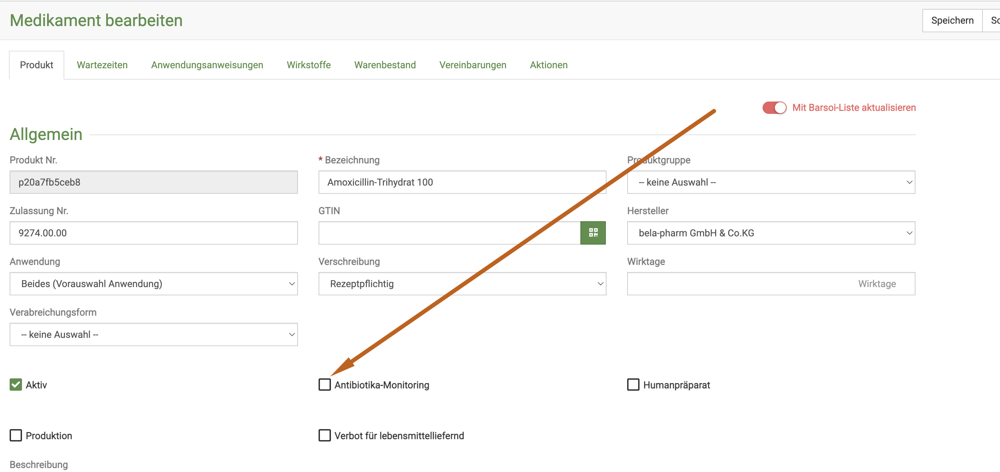
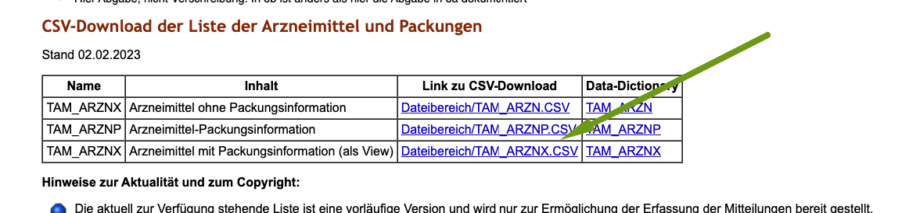
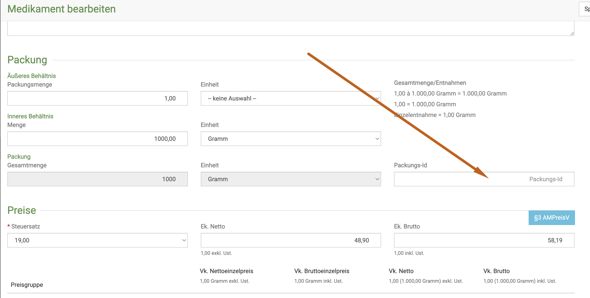
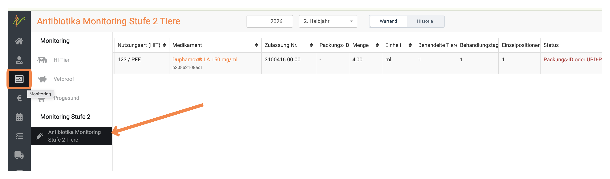
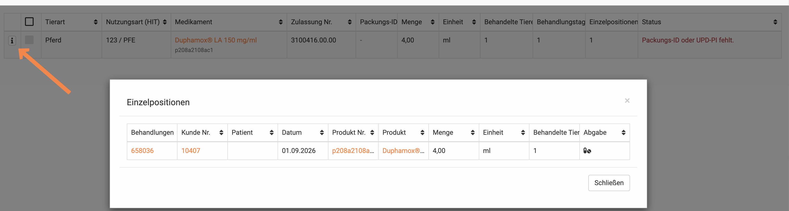
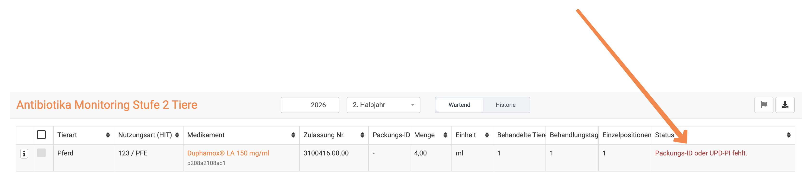

# Antibiotika Meldung bei weiteren Tierarten ab 2026

Verpflichtendes Antibiotikamonitoring ab 01.01.26 : Erweiterung auf weitere Tierarten

Ab dem 1.01.2027 muss rückwirkend für 2026 der Verbrauch von Antibiotika für folgende Tierarten  (sogenannte Stufe 2)
erfolgen:   

* Pferde (inklusive Nicht-Schlachttiere)   

* Schafe und Ziegen  

* Gänse und Enten  

* Kaninchen zur Lebensmittelgewinnung  

* Fische der Arten  

Atlantischer Lachs ,Regenbogenforelle, Goldbrasse, Wolfsbarsch, Karpfen

Für diese Tierarten gilt: 

Die Datenerhebung erfolgt unabhängig von Nutzungsart oder Bestandsgröße und ist für jedes einzelne Tier erforderlich.
Eine Meldepflicht dieser Daten ist aktuell ab Januar 2027 vorgesehen. (rückwirkend)

Ab dem 1.1.2030 wird die Meldung über den Antibiotika-Verbrauch auch bei  Hunden und Katzen Pflicht.   

Diese muss allerdings bereits rückwirkend für das Jahr 2029 erfolgen.  

## Was brauche ich, um zu melden?  

Sie benötigen die Zugangsdaten zur HI-Tier als Tierarzt, diese besteht aus einer Nummer und einem Passwort. Diese können Sie bei der HIT 
anfordern.   

Ihre Zugangsdaten bei der HIT müssen Sie in der Erweiterung HIT bei debevet einmalig hinterlegen und die Schnittstelle aktivieren.  

Die Anleitung dazu finden Sie hier:  

[HIT aktivieren](https://handbuch.debevet.de/docs/Nutztiere/Monititoring#hi-tier-anbindung-einrichten)   

## Kann ich im debevet jetzt schon melden?  

Ab September 2026 bieten wir die Möglichkeit, diese Tierarten bereits zu melden mit ihren Antibiotikaverbräuchen.

## Welche Daten müssen gemeldet werden?  

Anders als bei nun zu meldenden Tierarten werden wir NICHT über die Verschreibungen melden.  
Das liegt an einer anderen Anforderung, denn die Daten der weiteren Tierarten und deren Antibiotika (AB) Verbräuche werden anonym, also ohne Besitzerdaten gemeldet. 

## Welche Daten muss ich am Produkt angeben? 

Damit in der Verbrauchsliste der Verbrauch der Produkte angezeigt wird, müssen Sie an allen Produkten, die antibiotische Wirkstoffe
enthalten, den Haken "Antibiotika-Monitoring" setzen.  

   

Außerdem empfehlen wir bereits jetzt, sich mit dem Thema "Packungs ID" auseinander zu setzten. Die Packungs ID wird derzeit NICHT
über die Barsoi mitgeliefert und muss manuell hinterlegt werden.   

Diese können Sie auf der HITier Seite in einer Liste finden.

[HIT Liste TAM](https://www.hi-tier.de/Entwicklung/Konzept/Sonstiges/TAM002.htm#download)  

Außerdem finden sich auch in der Liste vom BVL etliche Daten: 

[BVL Medikamtenliste](https://www.bvl.bund.de/SharedDocs/Downloads/05_Tierarzneimittel/Liste_der_mitteilungspflichtigen_Arzneimittel.html?nn=17226560)

Öffnen Sie diese Liste als CSV und suchen Sie die passende Packung/Medikament. Die Packungs-Id finden Sie in einer 
gesonderten Spalte. (TAMA_PID) Tragen Sie diese dann am Produkt in debevet ein. (Es handelt sich nur um eine einstellige Zahl!).  

Derzeit arbeitet die Barsoi an der Einpflegung von UPM Nummern- in wie fern diese die Meldung bei der HIT dann einfacher ermöglichen,
bleibt abzuwarten.   

An jedem Produkt kann diese Packungs ID nun hinterlegt werden:  

  

Sobald diese Daten hinterlegt sind, gehen nach jeder Anwendung der passenden Tierarten alle Anwendungen und Abgaben dieser Produkte automatisch 
in die Meldeliste- unabhängig davon, ob eine Verschreibung erstellt wurde. 

## Verbrauchsliste Antibiotika einsehen  

Um Ihren Verbrauch einzusehen, klicken Sie auf "Monitoring" und dann "AB Monitoring Stufe 2 Tiere"
  

Hier finden Sie die Verbräuche, WENN der Haken gesetzt war. 

:::danger: Achtung! 

Bitte setzen Sie dringend jetzt schon alle Haken an den Antibiotika-Produkten, damit der Verbrauch erfasst werden kann!

:::  

Die Liste zeigt nach Tierart die Verbräuche an, mit einem Klick auf das "i"" können Details zur Behandlung eingesehen werden.   

## Meldungen durchführen   

Um nun einzelne oder alle je nach Halbjahr zu melden, markieren Sie eine oder mehrere Positionen und klicken oben rechts auf "Melden".   
Fehlende Informationen am Produkt werden Ihnen direkt in der Liste angezeigt und müssen durch Sie selbst ergänzt werden.  

Die Checkbox ist in diesem Fall ausgegraut und kann nicht aktiviert werden, bevor die Informationen ergänzt werden. 

Das kann z.B. so aussehen: 

   

Sie können dann direkt auf den Produktnamen klicken, um in das betreffende Produkt zu gelangen und die Informationen dort ergänzen.   

Anschließend kann das Produkt gemeldet werden.  
