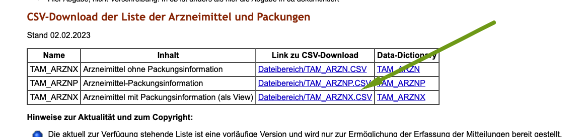

# Antibiotika Meldung bei nicht lebensmittelliefernden Tieren  

Ab dem 1.1.2030 wird die Meldung über den Antibiotika-Verbrauch auch bei nicht LM Tieren wie Hunden, Katzen, nicht LM Pferden etc. 
Pflicht.   

Diese muss allerdings bereits rückwirkend für das Jahr 2029 erfolgen.  

## Was brauche ich, um zu melden?  

Sie benötigen die Zugangsdaten zur HI-Tier als Tierarzt, diese besteht aus einer Nummer und einem Passwort.  

## Kann ich im debevet jetzt schon melden?  

Nein, bisher haben wir keine Lösung zur Meldung der nicht LM Tier Daten entwickelt.Geplant ist dies für ca. April 2029.  

## Welche Daten müssen gemeldet werden?  

Anders als bei den LM Tieren werden wir NICHT über die Verschreibungen melden. Das liegt an einer anderen Anforderung, denn die 
Daten der nicht LM Antibiotika (AB) Verbräuche werden anonym, also ohne Besitzerdaten gemeldet. 

Aktuell haben wir bereits eine Liste über Ihre Antibiotika Verbräuche eingerichtet, um diese bereits zu "sammeln" und dann evtl. sogar direkt
über diese Liste melden zu können. Eine Klärung mit der HIT und unseren Entwicklern ist in Arbeit.  

## Welche Daten muss ich am Produkt angeben? 

Damit in der Verbrauchsliste der Verbrauch der Produkte angezeigt wird, müssen Sie an allen Produkten, die antibiotische Wirkstoffe
enthalten, den Haken "Antibiotika-Monitoring" setzen.  

   

Außerdem empfehlen wir bereits jetzt, sich mit dem Thema "Packungs ID" auseinander zu setzten. Die Packungs ID wird derzeit NICHT
über die Barsoi mitgeliefert und muss manuell hinterlegt werden.   

Diese können Sie auf der HITier Seite in einer Liste finden.

[HIT Liste TAM](https://www.hi-tier.de/Entwicklung/Konzept/Sonstiges/TAM002.htm#download)  

Außerdem finden sich auch in der Liste vom BVL etliche Daten: 

[BVL Medikamtenliste](https://www.bvl.bund.de/SharedDocs/Downloads/05_Tierarzneimittel/Liste_der_mitteilungspflichtigen_Arzneimittel.html?nn=17226560)

Öffnen Sie diese Liste als CSV und suchen Sie die passende Packung/Medikament. Die Packungs-Id finden Sie in einer 
gesonderten Spalte. (TAMA_PID) Tragen Sie diese dann am Produkt in debevet ein. (Es handelt sich nur um eine einstellige Zahl!).  

Derzeit arbeitet die Barsoi an der Einpflegung von UPM Nummern- in wie fern diese die Meldung bei der HIT dann einfacher ermöglichen,
bleibt abzuwarten.   

An jedem Produkt kann diese Packungs ID nun hinterlegt werden:  

  

Sobald wir weitere Informationen haben, werden wir diese hier ergänzen. 

Aber wenn Sie diese Daten bereits jetzt hinterlegen, wird die Meldung wesentlich einfacher vonstatten gehen können und Sie werden 
nicht mit HIT Fehlermeldungen überhäuft, wenn wir die Meldung aktiv schalten.  

## Verbrauchsliste Antibiotika einsehen  

Um Ihren Verbrauch einzusehen, klicken Sie auf "Monitoring" und dann "AB Monitoring nicht LM".  

   

Hier finden Sie die Verbräuche, WENN der Haken gesetzt war. 

:::danger: Achtung! 

Bitte setzen Sie dringend jetzt schon alle Haken an den Produkten, damit der Verbrauch erfasst werden kann!  Stand Jan 2024 ist, dass
wir es aktuell noch nicht "nachträglich" abbilden können!

:::