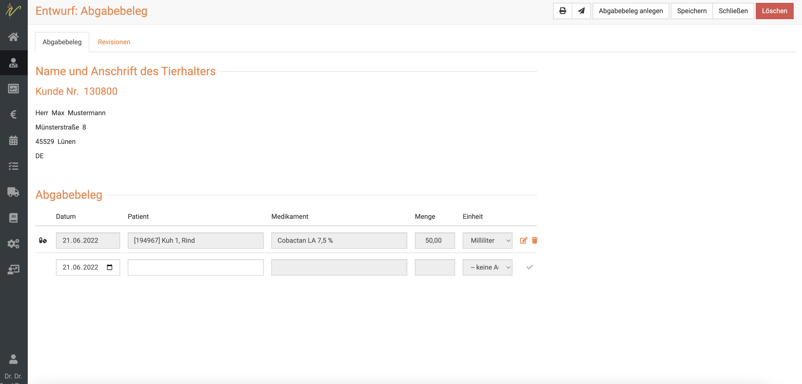
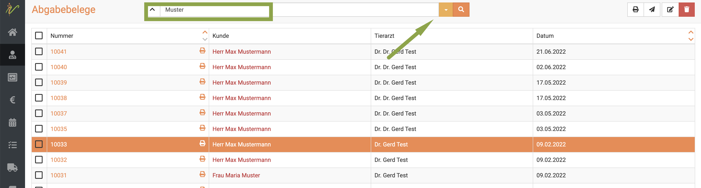
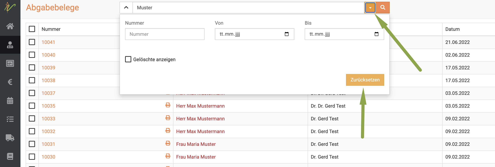
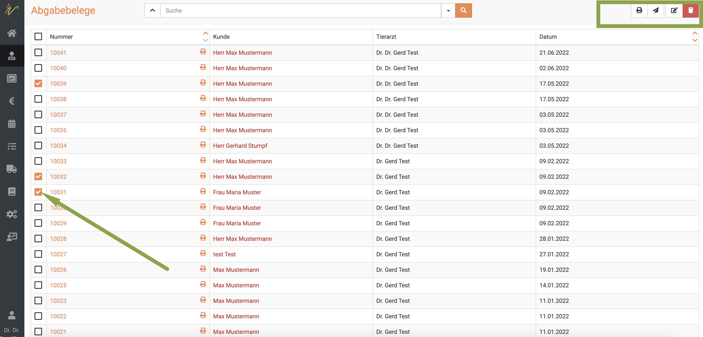
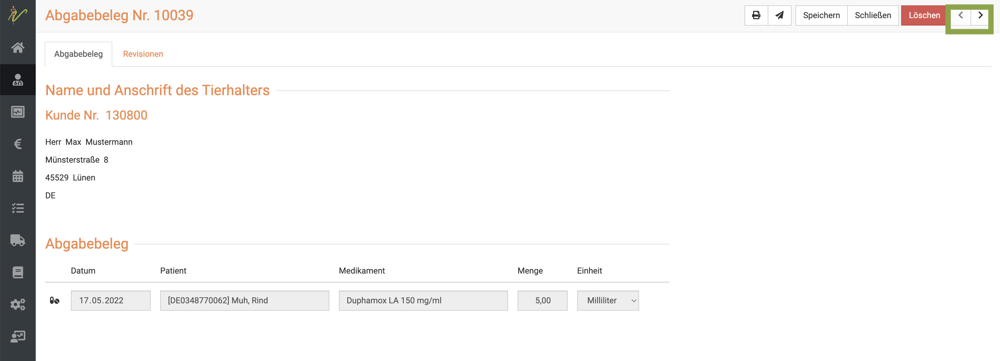
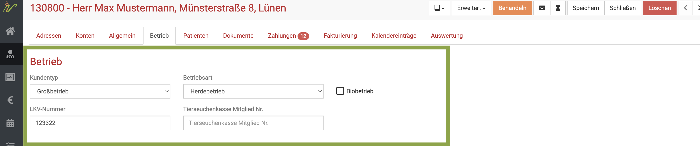
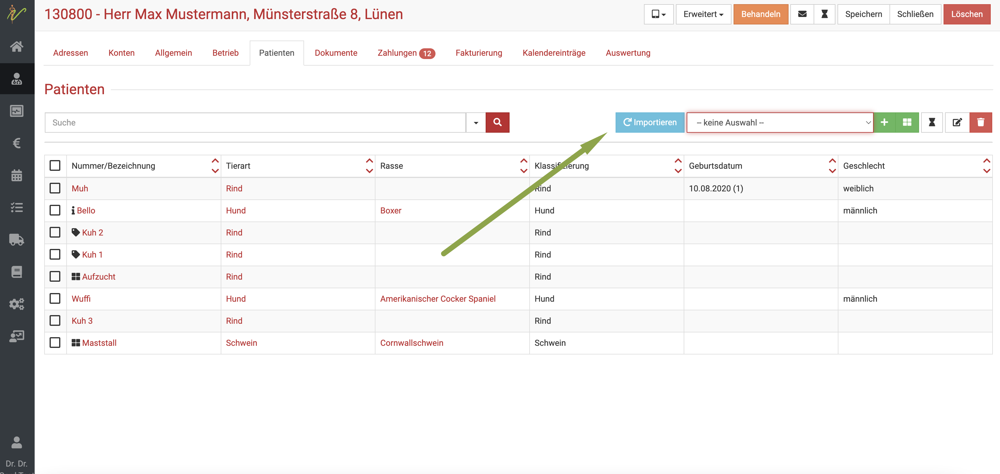
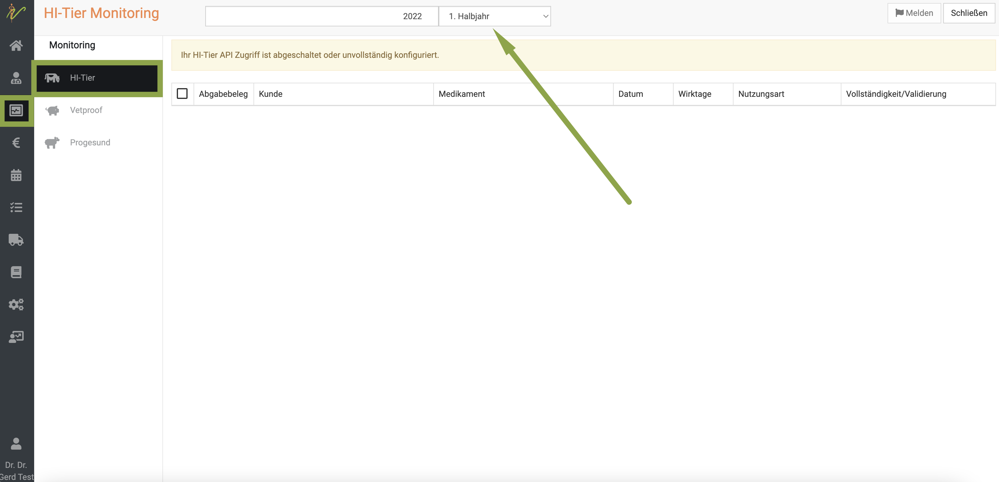
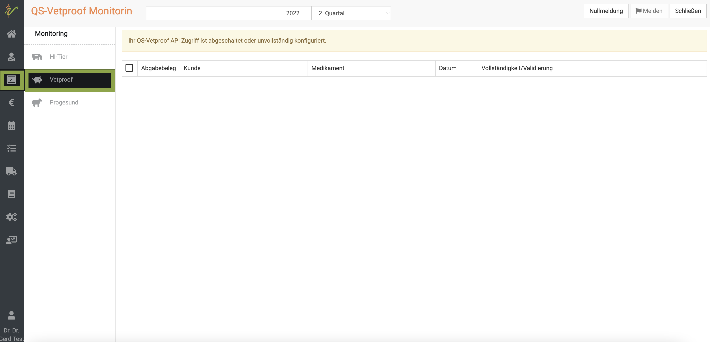
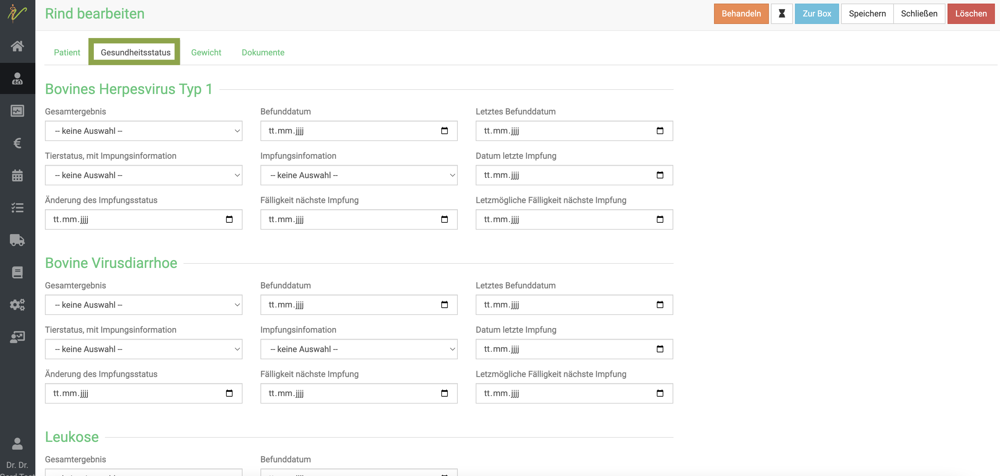

# Nutztiere/Großtiere behandeln

Da es für die Behandlung von Nutztieren doch einige Vorschriften und Besonderheiten gibt, die debevet Ihnen sehr erleichtern
kann, haben wir diese Hilfesektion extra für die Nutztier-/Großtierkollegen von Ihnen eingerichtet. 

## AUA Belege verwalten   

Hier können Sie AuA-Belege suchen, ändern, löschen oder drucken. Außerdem können Sie nach verschiedenen Datenbanken 
wie HI-Tier oder QS-Vetproof filtern.  

### AUA Beleg erstellen  

Um einen AUA-Belege für ein Tier oder eine Gruppe von Tieren zu erstellen, müssen Sie sich in der Behandlungsmaske des Tieres/ der Gruppe befinden.  

Wählen Sie zunächst die **Checkboxen** der gewünschten Medikamente an. Drücken Sie nun oben auf das **Buchsymbol**.  

  

Nun wird Ihnen die Vorschau angezeigt, wenn Sie oben rechts auf **Abgabebeleg anlegen** klicken, wird der Beleg erstellt. 

Nun sehen Sie den fertigen Beleg und können diesen entweder drucken oder direkt mit Klick auf das **Mail-Symbol** an den Landwirt mailen.  

  

:::danger ACHTUNG  

Bitte beachten Sie, dass der hier dargestellte Beleg nicht rechtskonform ist! Sie selbst müssen alle Daten (Wartezeiten, Anwendungen) 
an den Medikamenten hinterlegen, damit diese korrekt auf dem AUA dargestellt werden! 

Pflichtangaben aktuell: eindeutige Identifizierung TA, Landwirt und Tier, Applikationsart, Menge, Chargennummer, Wartezeiten
wenn Abgabe auch das Intervall. Beachten Sie die zukünftigen und aktuellen Regeln bitte selbständig!  

:::  

### AUA Belege suchen  

Ihre Abgabebeleg-Liste finden Sie unter **Praxis** und dann **AUA**. Sie sehen dort die gesamte Liste Ihrer Abgabebelege.  

  

Tippen Sie in das Suchfenster wie bei einer Suchmaschine Begriffe ein, die zum gewünschten AuA-Beleg 
passen und drücken Sie die **Entertaste** oder klicken Sie auf das **Lupen-Symbol**.  

  

Nun werden Ihnen alle Ergebnisse aufgelistet, die zu Ihrer Suche passen.  

Mit einem Klick auf die Belegnummer können Sie den gewünschten Beleg öffnen.  

### Suchenfilter zurücksetzen  

Das die Liste aktuell mit einem Suchergebnis gefiltert ist, erkennen Sie daran, dass der **Dropdown-Pfeil** oben neben dem Suchenfeld *gelb* ist.  

Um die Liste wieder ungefiltert anzeigen zu lassen, klicken Sie auf den **Dropdown-Pfeil** und klicken dann auf **Zurücksetzen**.  

  

### AUA Belege drucken, versenden, löschen  

Wählen Sie die gewünschten Belege aus, indem Sie die Checkboxen vor den Beleg-Nummern anwählen. Um die gewünschte 
Aktion auszuführen, drücken Sie nun die jeweiligen Symbole oben rechts: zum Drucken das **Drucker-Symbol**, zum Verschicken
das **Brief-Symbol** und zum Löschen das **rote Mülleimer-Symbol**.  

  

### Mehrere Belege bearbeiten, senden, löschen    

Um mehrere AuA-Belege zu bearbeiten, wählen Sie zunächst die jeweiligen **Checkboxen** in der Liste an.
Drücken Sie nun das **Stift-Symbol** oben rechts, um die ausgewählten AuA-Belege zu bearbeiten.

Nutzen Sie die Pfeile < und > um beim Bearbeiten zwischen den einzelnen AuA-Belege zu wechseln.

Um sie zu löschen, drücken Sie das **Mülleimer-Symbol**.  

  

### Antibiotika-Monitoring  

:::caution Achtung  

Für die Meldung von Antibiotika ist es erforderlich, dass das jeweilige Präparat unter
**Warenwirtschaft** → **Produkte** für das Antibiotika-Monitoring gekennzeichnet ist, also im gleichnamigen Feld ein Haken gesetzt ist.  

:::

## Gruppen behandeln  

## HI-Tier Anbindung einrichten 

Um die direkte Übermittlung der Daten sowohl für den Tier-Import als auch der Behandlungen und Anwendungen zu nutzen, müssen Sie
zunächst Ihre Praxisdaten, die Sie von HI-Tier bekommen haben, in Ihrem Account hinterlegen.

Klicken Sie dazu auf **Praxis** und dann **Einstellungen**. Dort gibt es den Reiter **Monitoring**. Dort können Sie die Zugangsdaten hinterlegen. 
Außerdem können Sie die Checkboxen setzen, welche Daten übermittelt werden sollen/müssen.
Klicken Sie dann auf **Speichern**.

  

## QS-Vetproof Anbindung einrichten

Um die direkte Übermittlung der Daten für QS-Vetproof zu nutzen, müssen Sie
zunächst Ihre Praxisdaten, die Sie von QS-Vetproof bekommen haben, in Ihrem Account hinterlegen.

Klicken Sie dazu auf **Praxis** und dann **Einstellungen**. Dort gibt es den Reiter **Monitoring**- Dort können Sie die Daten hinterlegen.  
Klicken Sie dann auf **Speichern**.

Bitte beachten Sie die Anleitung weiter  zum Hinterlegen der Betriebsdaten. Besonders die Angaben im oberen Feld "Betrieb" sind
für das QS-Vetproof von Bedeutung!

## Daten des Betriebes eingeben

Zu jedem Betrieb, den Sie betreuen, müssen Sie die Daten des Betriebes eingeben, damit die Übertragung der Daten funktionieren kann.
Klicken Sie dazu auf den Kunden (oder legen diesen neu an) und klicken dann auf den Reiter **Betrieb**.

Hier müssen nun die Daten des gewünschten Systems und die Daten des Betriebes generell eingegeben werden. Klicken Sie dann auf **Speichern**.

:::caution Achtung

Meldungen an HIT sind nur dann machbar, wenn der Landwirt Sie als behandelnden Tierarzt bei HIT freigegeben hat!! Denken Sie daran, auch die
Vollmacht darüber immer zu dokumentieren!

:::

## HI-Tier/ QS-Vetproof Daten abrufen/importieren  

Wenn sie beispielsweise einen neuen Betrieb zur Betreuung übernehmen oder generell Daten Ihrer betreuten Betriebe abrufen möchten, klicken Sie auf **Praxis** 
und dann **Abrufen**. Markieren sie die gewünschten, zu aktualisierenden Betriebe und klicken Sie dann oben rechts **Importieren**.  

  

(Liste hier leer, da keine real-Daten genutzt!!!)  

### Daten von nur einem einzelnen Betrieb abrufen  

Wenn Sie den Kunden aufrufen, können Sie auch direkt und schnell NUR seine Betriebsdaten importieren (vorausgesetzt, alles ist wie beschrieben eingerichtet 
und Sie sind von ihm freigegeben). KLicken Sie dazu am gewünschten Kunden auf den Reiter **Patienten** und dann den blauen Button **importieren**.  

## HI-Tier Meldungen durchführen  

Um Ihre Abgabebelege und Meldungen an HI-Tier zu übermitteln, klicken Sie **Monitoring** und dann das gewünschte System. 
Wählen Sie oben den Zeitraum aus, für den Sie übermitteln möchten. Nun sehen Sie eine Liste aller noch nicht über und klicken dann auf **Melden**.  

  

( Bitte beachten Sie, dass wir keine realen Daten angegeben haben und deswegen eine Fehlermeldung in den Screenshots erscheint).   

## QS-Vetproof Meldungen durchführen  

Um Ihre Abgabebelege und Meldungen an QS-Vetproof zu übermitteln, klicken Sie **Monitoring** und dann das gewünschte System.
Wählen Sie oben den Zeitraum aus, für den Sie übermitteln möchten. Nun sehen Sie eine Liste aller noch nicht über und klicken dann auf **Melden**.  

Wenn Sie keine Belege zu übermitteln haben, können Sie eine **Nullmeldung** durchführen.  

  

## Daten einzelner Tiere 

### Kenn-Nummer/ Lebensnummer 

Eigentlich bekommen Sie die Daten eines Tieres IMMER über den Import der Daten eines Betriebes. Sollte dieses aus irgendeinem 
Grunde einmal nicht korrekt sein, können Sie die Daten am Tier ändern.  
Klicken Sie dazu in der Patientenliste auf den Namen/Bezeichnung des Tieres. Das Feld zur Eingabe der Lebensnummer ist eigentlich gesperrt (grau 
hinterlegt). Durch einen Klick auf das **Schloß-Symbol** kann der Bereich entsperrt und verändert werden.  
Klicken Sie anschließend oben rechts auf **Speichern**.

### Gesundheitsstatus Rinder  

Bei Rindern haben Sie die Möglichkeit, die Daten zu Impfungen und Erkrankungsstatus in Bezug auf folgende Krankheiten zu hinterlegen/abzurufen:   

* Bovines Herpesvirus Typ 1  
* Bovine Virusdiarrhoe  
* Leukose  
* Brucellose   

Wählen Sie dazu den Patienten aus der Patientenliste des Besitzers und klicken dann den Reiter **Gesundheitsstatus**.  

  

Denken Sie daran, Änderungen immer zu **Speichern**.

