# Monitoring  

Hier erklären wir die Nutzung der Monitoring     Optionen   mit HI-Tier und QS-Vetproof  für den Nutztiersektor. Diese Funktionen 
stehen vollumfänglich in dieser Form im Paket Nutztier bei debevet zur Verfügung. Die Pakete Klinik und Praxis haben nur eine 
"abgespeckte" HIT Version für Level 2 und später Level 3 Tiere.  

## HI-Tier Anbindung einrichten

Um die Antibiotkameldungen, den Tier-Import und andere Funktionen von HI-Tier zu nutzen, müssen Sie
zunächst Ihre Praxisdaten, die Sie von HI-Tier bekommen haben in Ihrem Account hinterlegen.

Klicken Sie dazu auf **Administrations** (Zahnräder)  und dann **Erweiterungenn**.   

Dort gibt es die Überschrift **Monitoring**. Dort wählen Sie die Kachel "HITier" , klicken "Anlegen". 
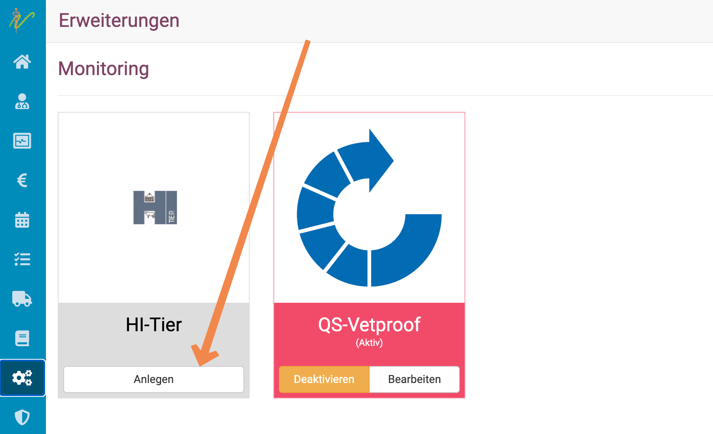  

Nun geben Sie Ihre Daten ein.  

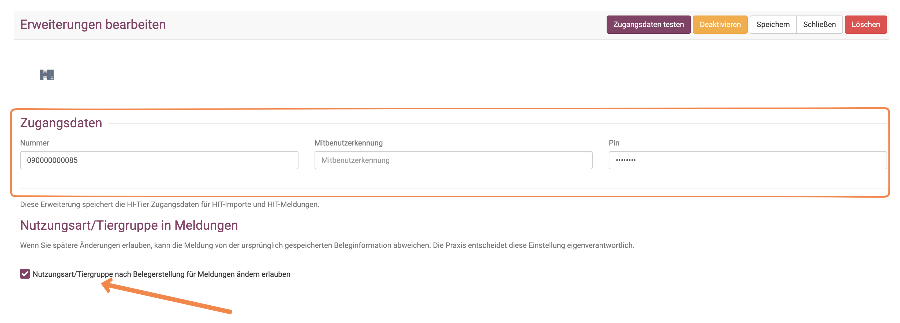
  
Sie können an der Checkboxen auf eigene Verantwortung wählen, ob Sie bei späterem Melden die jeweils aktuelle Nutzungsart, oder die 
beim Erstellen gewählte Nutzungsart übermitteln wollen.  ("Nutzungsart/Tiergruppe nach Belegerstellung für Meldungen ändern erlauben")

Dies kann genutzt werden, um zu Vermeiden, dass durch Nutzerfehler falsch gesetzte Nutzungsarten eine Meldung verhindern. Dies ist rechtlich
ein wenig eine Grauzone und wird deswegen explizit nur durch proaktives Handeln ihrerseits ermöglicht   

### Altersgrenzen für Nutzungsarten festlegen  

Da es im Praxisalltag durchaus passieren kann, dass man ein Tier, welches man als Nutzungsart z.B. "Aufzuchtkalb" angelegt hatte,
2 Jahre später evtl. erneut behandelt, aber dann vergisst, die Nutzungsart auf beispielsweise "Milchkuh" zu setzen, haben wir ein Warnsystem eingebaut. 

In der Tabelle in der Erweiterung können Sie nun selbst anlegen, ab welchem Alter Sie eine Warnung für die Tiere erhalten wollen. Sie könnten sogar
hinterlegen, in welche Nutzungsart mit einem einfachen Klick dann überführt werden würde.  

Wir empfehlen aber, die Spalte eher leer zu lassen, weil es im Alltag oftmals verschiedene "Karrierezweige" gibt. Ohne eine vorausgefüllte
Variable in "Vorschlag zur Änderung" wird nur eine Warnung erscheinen, wenn das Tier das von Ihnen hinterlegte Alter überschritten hat. 

Klicken Sie dann auf **Speichern**.

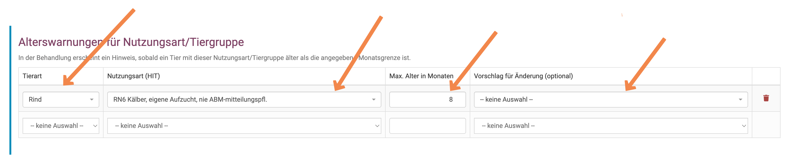

Die Warnung würde dann ohne einen "Änderungs-Automatismus" so aussehen: 

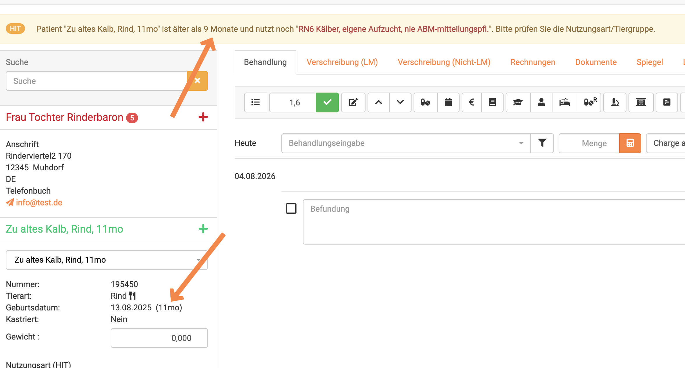

## QS-Vetproof Anbindung einrichten

Um die direkte Übermittlung der Daten für QS-Vetproof zu nutzen, müssen Sie
zunächst Ihre Praxisdaten, die Sie von QS-Vetproof bekommen haben, in Ihrem Account hinterlegen.

Klicken Sie dazu auf **Administrations** (Zahnräder)  und dann **Erweiterungenn**.

Dort gibt es den Reiter **Monitoring**. Dort wählen Sie die "Vetproof" , klicken "Anlegen" und geben Ihre Daten ein.

Sie können außerdem mit den Checkboxen bestimmen, welche Daten Sie übermitteln möchten.

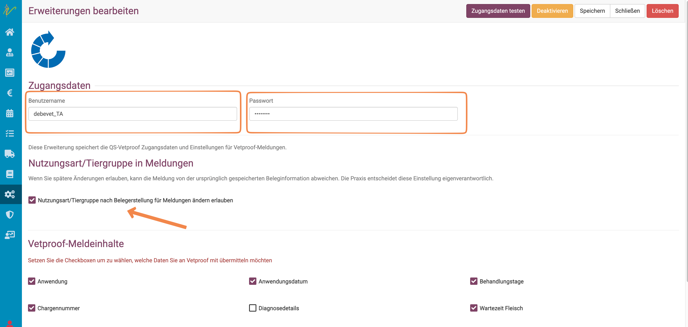  

Bitte beachten Sie. dass Sie eine Checkbox aktivieren können, die es Ihnen erlauben wird, im Nachhinein noch die Tiergruppe zu verändern,
auch wenn der Beleg bereits erstellt ist. Dies wird dazu führen, dass Sie bei fehlerhaften oder fehlenden Angaben auf dem Beleg bzgl. der Tiergruppe
diese am Tier nachträglich setzen können. Gemeldet wird dann mit der "aktuellen" Tiergruppe, nicht mit der auf dem Beleg. Mehr dazu erfahren Sie
im Bereich der Meldungen an sich. (weiter unten)

### Altersgrenzen für Tiergruppen festlegen

Da es im Praxisalltag durchaus passieren kann, dass man ein Tier, welches man als Tiergruppe z.B. "Aufzuchtkalb" angelegt hatte,
2 Jahre später evtl. erneut behandelt, aber dann vergisst, die Nutzungsart auf beispielsweise "Milchkuh" zu setzen, haben wir ein Warnsystem eingebaut.

In der Tabelle in der Erweiterung können Sie nun selbst anlegen, ab welchem Alter Sie eine Warnung für die Tiere erhalten wollen. Sie könnten sogar
hinterlegen, in welche Tiergruppe mit einem einfachen Klick dann überführt werden würde.

Wir empfehlen aber, die Spalte eher leer zu lassen, weil es im Alltag oftmals verschiedene "Karrierezweige" gibt. Ohne eine vorausgefüllte
Variable in "Vorschlag zur Änderung" wird nur eine Warnung erscheinen, wenn das Tier das von Ihnen hinterlegte Alter überschritten hat.
  
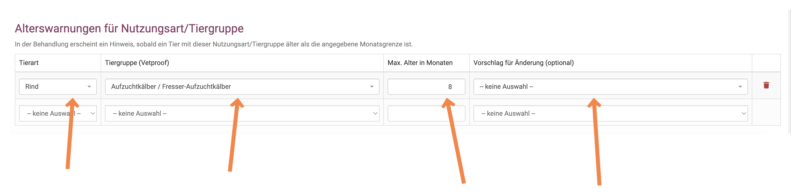

Klicken Sie dann auf **Speichern**.

## Daten des Betriebes eingeben

Zu jedem Betrieb, den Sie betreuen, müssen Sie die Daten des Betriebes eingeben, damit die Übertragung der Daten funktionieren kann.
Klicken Sie dazu auf den Kunden (oder legen diesen neu an) und klicken dann auf den Reiter **Betrieb**.

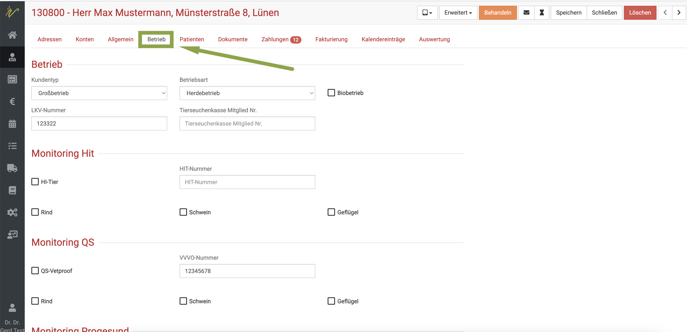

Hier müssen nun die Daten des gewünschten Systems und die Daten des Betriebes generell eingegeben werden. Klicken Sie dann auf **Speichern**.
Die Daten im obersten Feld **Betrieb** sind nur für Vetproof notwendig, für die HIT werden sie nicht benötigt.

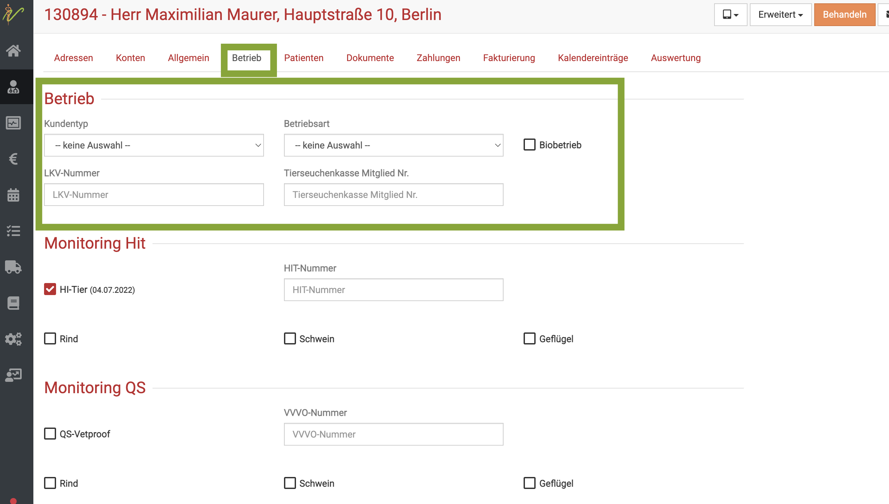

Achten Sie darauf, die Checkboxen zu aktivieren, sowie die Kundendaten (VVO Nr. HIT nr.) korrekt zu hinterlegen, damit alles reibungslos funktioniert.   

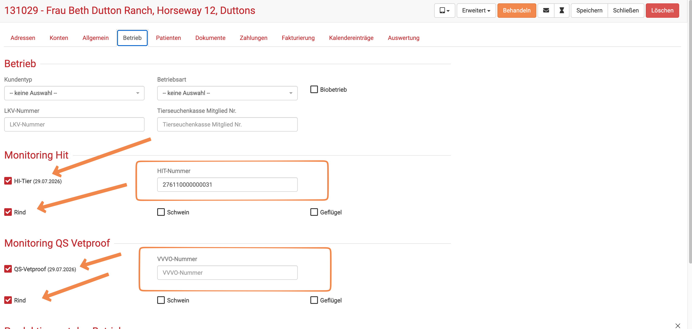  

Als Besonderheit ist hier für die QS Vetproof zu erwähnen, dass es nötig ist, die Produktionsart des Betriebes korrekt zu hinterlegen.
Diese muss genau mit der in Vetproof hinterlegten übereinstimmen, da es ansonsten zu Fehlern kommt.  

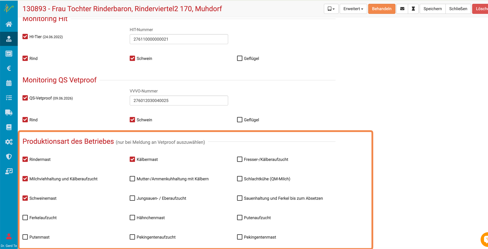

## HI-Tier/ QS-Vetproof Daten abrufen/importieren

Wenn sie beispielsweise einen neuen Betrieb zur Betreuung übernehmen oder generell Daten Ihrer betreuten Betriebe abrufen möchten, klicken Sie auf **Praxis**
und dann **Abrufen**. Markieren sie die gewünschten, zu aktualisierenden Betriebe und klicken Sie dann oben rechts **Importieren**.

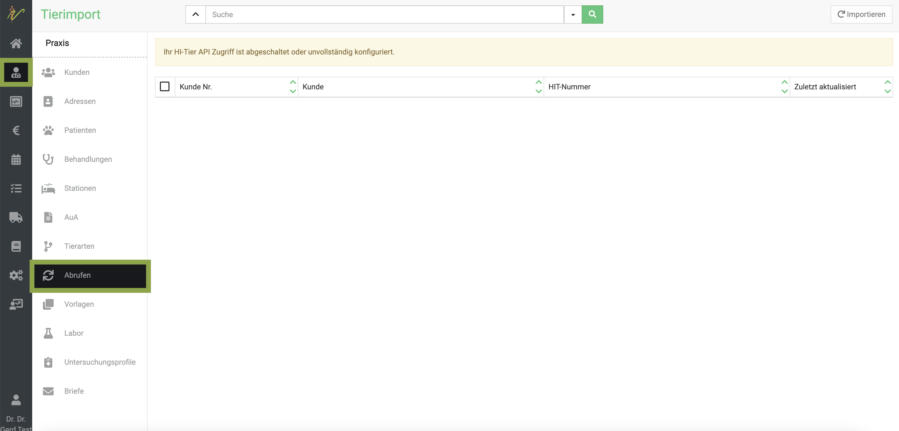

(Liste hier leer, da keine real-Daten genutzt!!!)

### Daten von nur einem einzelnen Betrieb abrufen

Wenn Sie den Kunden aufrufen, können Sie auch direkt und schnell NUR seine Betriebsdaten importieren (vorausgesetzt, alles ist wie beschrieben eingerichtet
und Sie sind von ihm freigegeben). KLicken Sie dazu am gewünschten Kunden auf den Reiter **Patienten** und dann den blauen Button **importieren**.

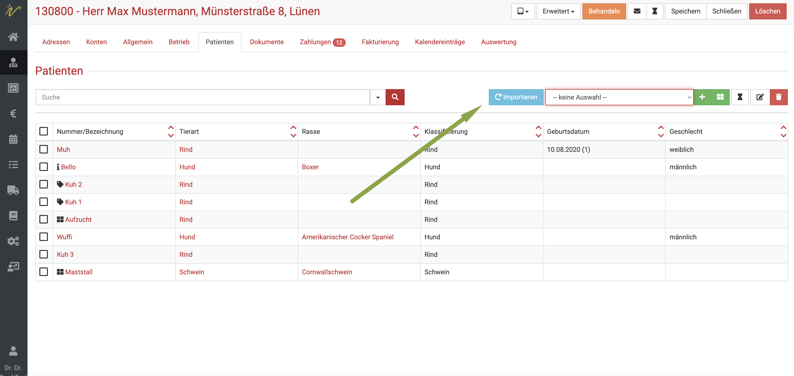

## HI-Tier Meldungen durchführen

Um Ihre Abgabebelege und Meldungen an HI-Tier zu übermitteln, klicken Sie **Monitoring** und dann das gewünschte System.
Wählen Sie oben den Zeitraum aus, für den Sie übermitteln möchten. 
Sie können oben wählen zwischen den zu meldenden (wartend) und der Historie der bereits gemeldeten Belege.   

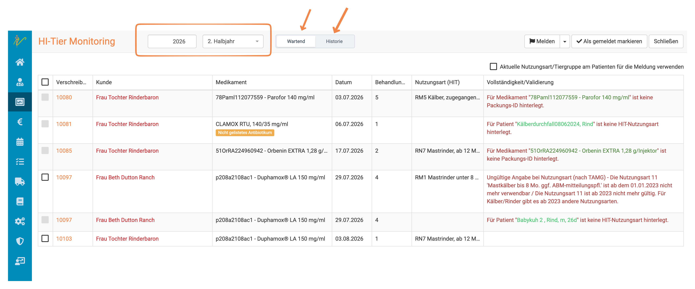

:::caution Achtung: 

Wir empfehlen, die Meldung monatlich durchzuführen, nicht nur alle 6 Monate!  

::: 

Sie können nun alle oder einzelne Belege mit der Checkbox markieren und anschließend oben rechts auf "Melden" klicken.   

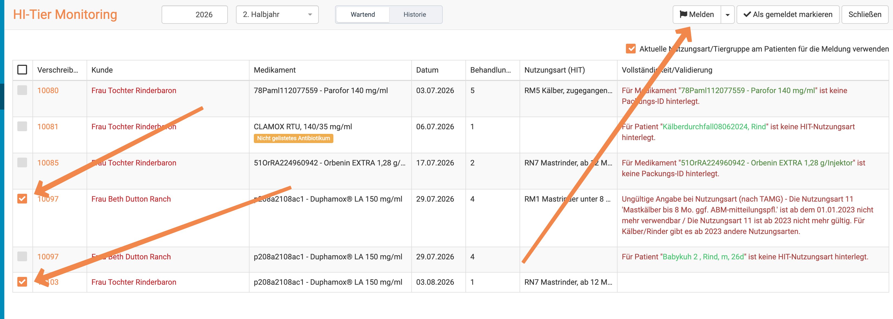

Wenn bei den zu meldenden Belegen Daten fehlen oder nicht passen, werden Ihnen die Fehler nach dem Melden am jeweiligen Beleg angezeigt.   

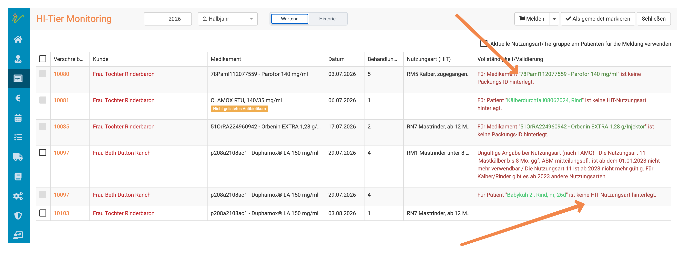  

### Aktuelle Nutzungsart melden  

Wie bereits beim Einrichten der Schnittstelle erwähnt, können Sie in Ihrer Praxis erlauben, dass die aktuelle (also im Nachhinein veränderte)
Nutzungsart für die Meldung verwendet wird. Da dies rechtlich ein wenig eine Grauzone sein kann, müssen Sie dies aber doppelt verifizieren. 
Sie müssen dies in der Schnitstellen-Erweiterung einmal erlauben. Ist dies erfolgt, sehen Sie unter dem Button "Melden" die Option, dies
dort erneut zu gestatten. 

Wird auch diese Checkbox aktiviert, kann die jeweils aktuell gesetze Nutzungsart gemeldet werden, auch wenn beim Erstellen des Beleges
evtl. eine andere genutzt wurde. Dies geschieht immer ausdrücklich auf eigene Verantwortung!

Wir empfehlen, parallel darüber nachzudenken, das Aufdrucken der Nutzungsart evtl zu deaktivieren.  (Dies geht im Einstellungsbereich 
bei den Verschreibungen)  

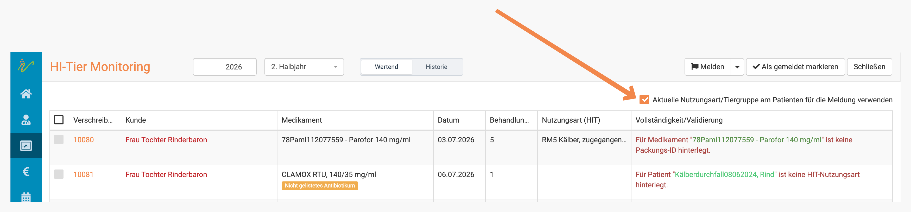

### Meldungen für nicht gelistete Antibiotika  

Um sogenannte "nicht gelistete" Antibiotika zu melden, gibt es ein paar Besonderheiten. Die HIT schreibt vor, dass diese mit einer # 
gemeldet werden müssen.  
Wir haben im devevet eine Lösung gesetzt, wie Sie selbst die nicht gelisteten Antibiotika kennzeichnen können und müssen, um diese 
korrekt zu melden. 

Gehen Sie dazu an das Produkt und wählen aus der Dropdownliste am Feld Antibiotikamonitoring "nicht gelistetes Antibiotikum".  

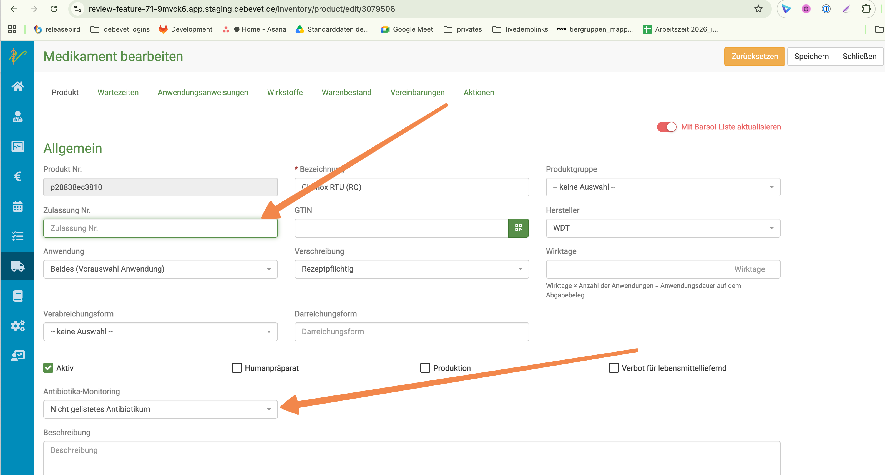   

Bezüglich der Zulassungsnummer gibt es je nach Medikament mehrere Optionen:  

* Melden ohne Zulassungsnummer: die HIT gestattet, dass diese dann ohne Rückfrage direkt meldbar sind   
* Melden mit dem Eintrag "nicht gelistet" (Worte, geschrieben) im Feld "Zulassungsnummer": die HIT stellt eine Rückfrage, die Sie bestätigen
müssen (wie dies geht erfahren Sie ein wenig weiter unten)  

:::caution  

Wenn Sie auch an vetproof melden, muss das nicht gelistete Antibiotikum eine Zulassungsnumme mit Länderkennung haben.(z.B. RO212342435) Da dies wiederum 
bei der Meldung zur HIT Probleme erzeugen würde, haben wir bei den nicht gelisteten eine Unterdrückung dieser Nummer bei der Meldung an die 
HIT im Hintergrund programmiert, um die Meldung an beide Schnittstellen zu ermöglichen. 
:::  

Bitte beachten Sie dies beim Nutzen des Produktes. Von Diskussionen dazu bitten wir abzusehen oder diese mit HIT zu führen.    

Um Rückfragen der HIT Schnittstelle zu "bestätigen", setzen Sie den Haken an der Checkbox der/des passenden Beleges und klicken 
nun den Dropdownpfeil neben "Melden". Dort wählen Sie dann "Rückfragen bestätigen".   

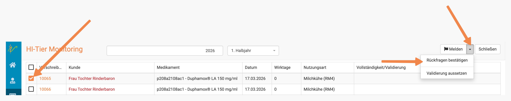  

## QS-Vetproof Meldungen durchführen

Um Ihre Abgabebelege und Meldungen an QS-Vetproof zu übermitteln, klicken Sie **Monitoring** und dann das gewünschte System.
Wählen Sie oben den Zeitraum aus, für den Sie übermitteln möchten.  Die Logik der Vetproof Meldungen ist im Aufbau und Feedback 
genauso aufgebaut und nutzbar wie in der HIT. 

Sie können sich also sowohl die noch zu meldenden (wartend) als auch bereits gemeldeten Belege (Historie) anzeigen lassen pro Halbjahr. 

Aus den Wartenden kann gemeldet werden und die Anzeige am Beleg zeigt fehlende oder feehlerhafte Daten. 
 
Markieren Sie entweder alle oder die gewünschten Belege durch aktiverieren der Checkbox und klicken dann auf **Melden**.

Wenn Sie keine Belege zu übermitteln haben, können Sie eine **Nullmeldung** durchführen.

### Meldungen rückgängig machen  

Sollten aus diversen Gründen Meldungen, die Sie bereits abgesendet haben, fehlerhaft sein, so können Sie diese "zurückholen".  

Klicken Sie dazu auf die "Historie" und setzen den Haken in der Checkbox des betreffenden Beleges auf "aktiv". Klicken Sie nun  
auf "Meldung zurücknehmen".  

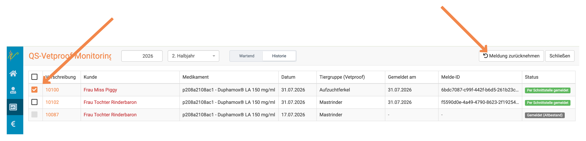  

Der gemeldete Beleg wird nun zurück in die Liste der wartenden Belege gestellt. So kann er dann nach Änderung erneut gemeldet werden. 
Bedenken Sie, dass Sie für die meisten Änderungen evtl. den Beleg neu erstellen müssen!

### Fehlermeldungen Vetproof  

Wenn bestimmte Daten fehlen, die zur Übermittlung benötigt werden, wird dies direkt in der Liste der Belege angezeigt. Diese 
Erklärungen sind eigentlich selbsterklärend und müssen dann entsprechend ergänzt werden, damit die Meldung erfolgen kann.  

Allerdings gibt es auch Fehlermeldungen, die erst beim Melden durch die Schnittstelle von vetproof zurückgegeben werden. Wir bemühen uns, diese
hier zu listen, um Sie zu erklären.  

Eine der häufigsten Meldungen ist die, dass das System den Tierarzt nicht kennt:   

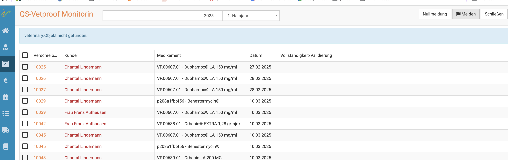   

Dies entsteht immer dann, wenn der Alias im Vetproof nicht mit dem Namen des Tierarztes, wie er im debevet angelegt ist, übereinstimmt.   

Bitte loggen Sie sich im Vetproof ein und prüfen den Tierarzt, der den Beleg erstellt hat und den dort hinterlegten Alias:  
 
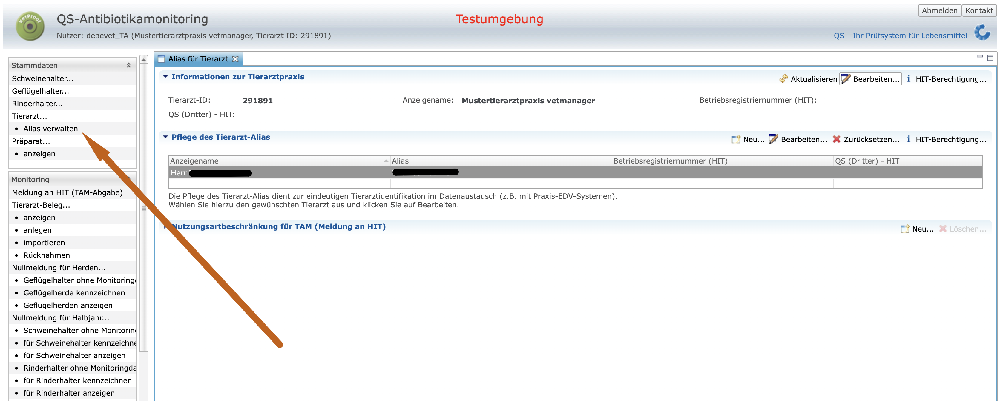  

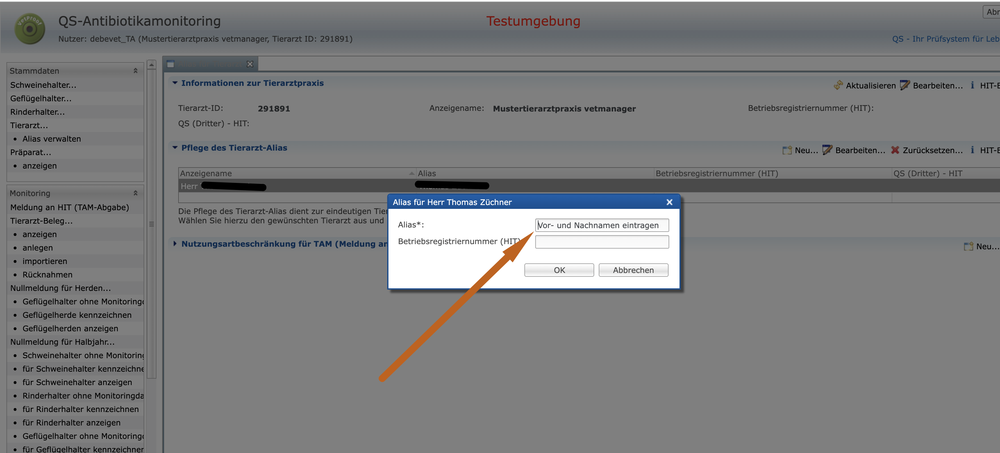  

Vor- und Nachname müssen genau so hinterlegt sein, wie im debevet. Eigentlich wird das automatisch so übermittelt, aber teilweise 
wurden entweder am Benutzer andere oder fehlende Daten hinterlegt, oder aber bereits der Alias im Vetproof durch den Nutzer verändert.  

Mit der Umstellung auf die neue Vetproof Schnittstelle im März 2025 wird es leider unumgänglich, dass diese Daten korrekt übereinstimmen.   

Eine weitere häufige Fehlermeldung ist die, dass die "location number" nicht gefunden werden kann:   

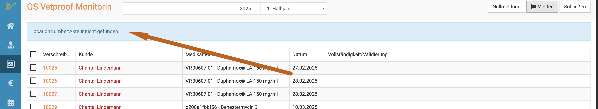     

In diesem Falle ist der angelegte Landwirt nicht in Ihrem Vetproof Account bekannt, bzw. Sie nicht als Tierarzt für diesen Account freigegeben. 
Loggen Sie sich bitte einmal im Vetproof ein und suchen den Kunden. Evtl. sprechen Sie mit dem Landwirt, ob er Sie freigegeben hat, ob seine 
VVO Nummer korrekt ist und prüfen all diese Daten erneut.  

Ebenso kann es sein, dass die Kombination aus Produktionsart des Landwirtes nicht zu der Nutzungsart des Tieres passt.(dann kommt ebenfalls 
die Fehlermeldung "location not found")

Eine weitere Fehlermeldung betrifft die Problematik, dass "usage duration" nicht größer sein darf als "application duration". Dafür bekamen wir von 
Vetproof folgende Hinweise: 

"Es gibt zwei Datenfelder:
„applicationDuration“ bedeutet Anwendungsdauer (Dauer der Anwendung inkl. Wirktage in Tagen) „usageDuration“ bedeutet Behandlungstage (tatsächlichen Behandlung in Tagen)
Die Anwendungsdauer „applicationDuration“ ist ein Pflichtfeld in der QS-Antibiotikadatenbank (und deshalb anzugeben).
Eine Angabe von NULL oder 0 ist nicht zulässig (als Wertebereich ist 1-99 Tage zulässig)
Außerdem gilt: Anwendungsdauer kann niemals kleiner als Behandlungstage sein.
Die Behandlungstage „usageDuration“ sind optional.
Das Feld Behandlungstage wird aber für die Weiterleitung zu HIT benötigt.  

## Daten einzelner Tiere

### Kenn-Nummer/ Lebensnummer

Eigentlich bekommen Sie die Daten eines Tieres IMMER über den Import der Daten eines Betriebes. Sollte dieses aus irgendeinem
Grunde einmal nicht korrekt sein, können Sie die Daten am Tier ändern.  
Klicken Sie dazu in der Patientenliste auf den Namen/Bezeichnung des Tieres. Das Feld zur Eingabe der Lebensnummer ist eigentlich gesperrt (grau
hinterlegt). Durch einen Klick auf das **Schloß-Symbol** kann der Bereich entsperrt und verändert werden.  
Klicken Sie anschließend oben rechts auf **Speichern**.

### Gesundheitsstatus Rinder

Bei Rindern haben Sie die Möglichkeit, die Daten zu Impfungen und Erkrankungsstatus in Bezug auf folgende Krankheiten zu hinterlegen/abzurufen:

* Bovines Herpesvirus Typ 1
* Bovine Virusdiarrhoe
* Leukose
* Brucellose

Wählen Sie dazu den Patienten aus der Patientenliste des Besitzers und klicken dann den Reiter **Gesundheitsstatus**.

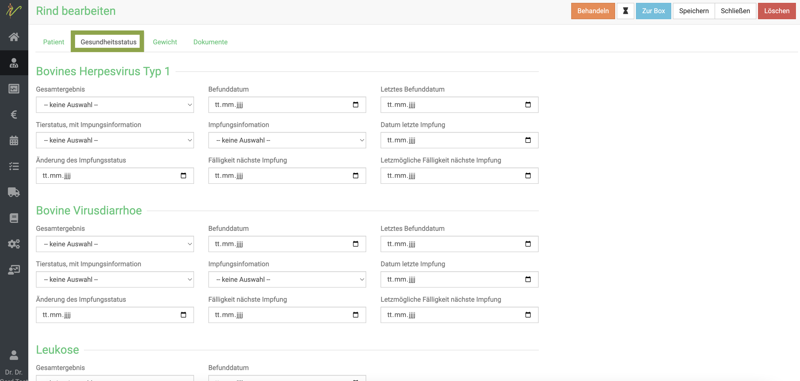

Denken Sie daran, Änderungen immer zu **Speichern**.

## Nutzungsarten und Tiergruppen   

Genrell nutzt die HIT die sogenannten Nutzungsarten und die Vetproof sogenannte Tiergruppen. 
Nicht in jeder Kombination sind diese "nutzbar". Es gibt eine gesetzliche Liste, welche Kombinationen machbar sind und wie diese
kombiniert werden könnten. 

Wir haben im debevet diese Kombinationen bereits komplett bei der Programmierung mit bedacht, so dass es nicht machbar ist, komplett
falsche Kombinationen zu nutzen. 

Wenn sie nur die HIT als Erweiterung nutzen, bekommen Sie automatisch an den Patienten auch NUR die Nutzungsarten als Option gezeigt. 
Sobald allerdings die Vetproof dazu aktiviert ist, sind an den Tieren beide zu setzen, also sowohl die Nutzungsart als auch die Tiergruppe. 
 
Wenn Sie also einen Patienten erstellen oder importieren, müssen Sie dies manuell setzen. Dabei können immer nur die gesetzlich erlaubten
Komnbinationen gesetzt werden. Die Liste der Kombinationen können Sie sich jederzeit im debevet anzeigen lassen am Patienten:  

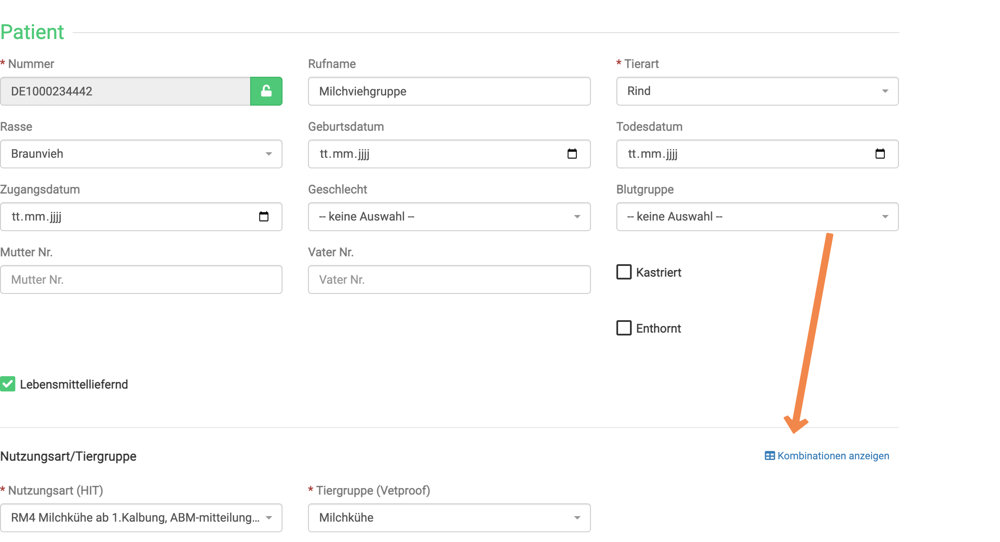  

Diese basiert auf der gesetzlichen Grundlage. Von Diskussionen mit uns darüber bitten wir abzusehen, wir setzen nur die Vorgaben um.  

Anbei der Link:   (seit 2023 so gültig)

https://www.bauernverband-st.de/wp-content/uploads/2023/02/Anlage-7-Tieraerzte_Anpassungen-fuer-Tierarzneimittelgesetz-Tiergruppen.pdf 

An jedem Patienten finden sich also im Falle von Nutzung beider Monitoring Schnittstellen nun je ein Feld für jede der Schnittstellen.   

Wenn Sie eines setzen, wird bei 100% sicherem Mapping das jeweils passende andere automatisch gesetzt. Gibt es mehrere Optionen für 
das passende, werden nur noch diese freigegeben zur Auswahl  (die anderen sind grau und nicht wählbar).   

In folgendem Screenshot sehen Sie dies anhand des Beispiels von zugegangenen Kälbern:  

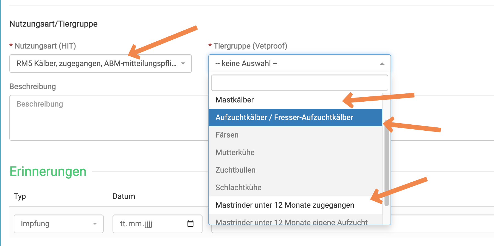  

Nachdem wir dieses Upate eingeführt haben, wird unser Programm Sie fragen, ob Sie Ihre bestehenden Patienten, die ja bereits eine Tiergruppe haben
(da wir ja bis Aug. 2026 diese genutzt haben) automatisch mappen soll.  

Wir bitten zu beachten, dass es laut der Liste so ist, dass JEDE Tiergruppe 100% sicher einer Nutzungsart zuzuordnen ist. Wenn Sie
nun das automatische Mapping durchführen, wird die Nutzungsart also direkt automatisch passend gesetzt. 

Sollten Sie aber FALSCHE Tiergruppen gesetzt haben, kann dies dann fehlerhafte Nutzungsarten bedeuten. Sie haben die Möglichkeit,
das Mapping nicht zu nutzen und bei jedem Tier später manuell zu prüfen. Es bleibt Ihre Entscheidung, was der bessere Weg ist. 

:::caution Bitte beachten!  

Bei importierten Tieren werden Sie nicht direkt beim Import aufgefordert, die Nutzungsart zu setzen. Lediglich beim Behandeln erscheint dann eine 
Erinnerung, dass diese noch fehlt. Sollten Sie die Nutzungsart als verpflichtend gesetzt haben, wird auch die Behandlungs gesperrt.  

:::   

 
### Nutzungsart/Tiergruppe verpflichtend setzen  

Da viele Großtierärzte den Wunsch geäußert haben, dass sie evtl. im Alltag übersehen, ob eine Nutzungsart bzw. Tiergruppe hinterlegt 
wurde, haben wir es Ihnen als Option eingebaut, dass Sie sich selbst das als "Pflichtfeld" einstellen können.  

Wir haben dies nun "mehrstufig" umgesetzt, um Ihnen ein wenig freie Entscheidung zu ermöglichen, wie streng Sie dies kontrollieren wollen. 

Im Bereich "Administration" (Zahnräder) und dort "Einstellungen" findet sich der Reiter "Monitoring".  

In diesem können Sie zwei Checkboxen aktivieren, die das Verhalten bei fehlender Nutzungsart beeinflussen.  

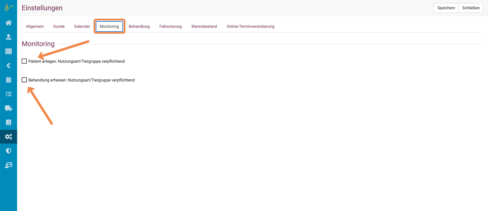  

**1. Option:**  Patient anlegen: Nutzungsart/Tiergruppe verpflichtend
  
Dies bedeutet, dass Sie bei aktiver Checkbox keinen Patienten mehr anlegen können, bei dem die Nutzungsart (plus bei genutzer Vetproof auch 
Tiergruppe) nicht gesetzt ist.   

**2. Option:** Behandlung erfassen: Nutzungsart/Tiergruppe verpflichtend  

Das bedeutet, dass Sie Tiere ohne Nutzungsart oder Boxen mit Tieren ohne Nutzungsart GAR nicht behandeln können. Die Behandlung ist dann 
komplett gesperrt, bis eine Nutzungsart gesetzt wird.  

Eine Warnung, wenn diese fehlt, zeigen wir IMMER an, aber ohne die zweite Checkbox ist das Behandeln möglich.  

Ob und wie Sie diese Optionen nutzen, um eine Art "Sicherheitssystem" einzubauen, bestimmen Sie also selbst.  

Mit diesem "Sicherheitsnetz" würden Sie eine Behandlung starten und dann folgende Fehlermeldung sehen:   

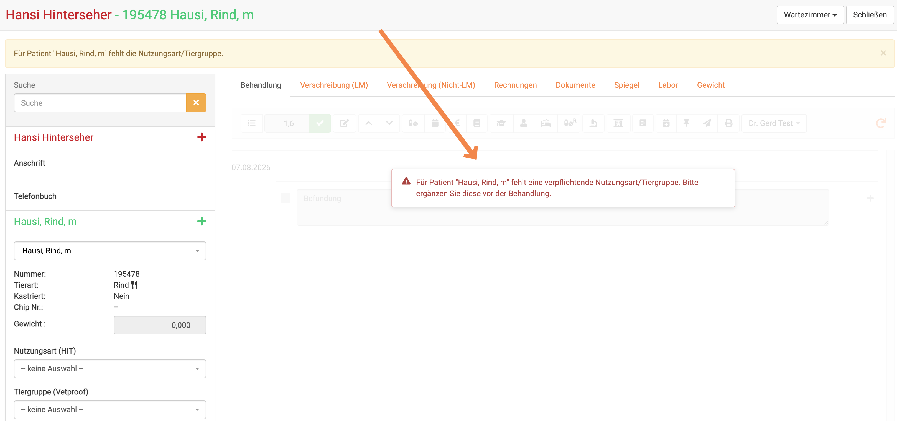

### Warnungen/Fehlermeldungen bei fehlenden Nutzungsarten  

Um Sie vor Fehlern besser zu schützen, sind ab sofort Warnungen eingebaut, wenn Nutzungsarten fehlen. (sowohl in Einzeltieren aus Boxen, als auch
bei Einzeltieren generell). Die Behandlung ist dennoch möglich, wenn Sie nicht oben genannte Checkbox aktiv gesetzt haben.  

Bei Boxen kann nun schneller und einfacher eine Nutzungsart auf alle enthaltenen Tiere übernommen werden. 

Das ist sowohl bei bestehenden Tieren, als auch bei neu erstelten Boxen aus beispielsweise importierten Tieren möglich. 

Ich zeige hier die Schritte, wenn ich aus bestehenden Bestandstieren eine Box bilde, die Nutzugnsarten aber teilweise fehlen oder
unterschiedlich sind:   

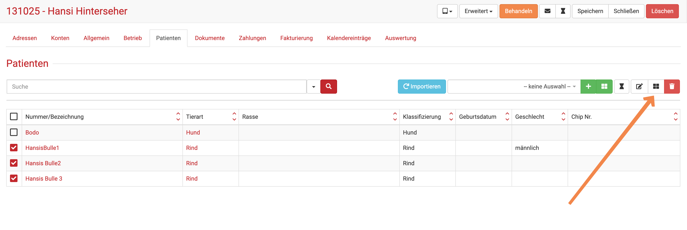  

Neu eingebaut wurde, dass Sie in der Box auch die Nutzungsarten der einzelnen Tiere direkt sehen, und Unterschiede somit schneller einzusehen sind. 
Da dies aber an großen Boxen dennoch mühsam ist, kann nun mit 2 Optionen eine einheitliche "Gruppensetzung" erfolgen: 

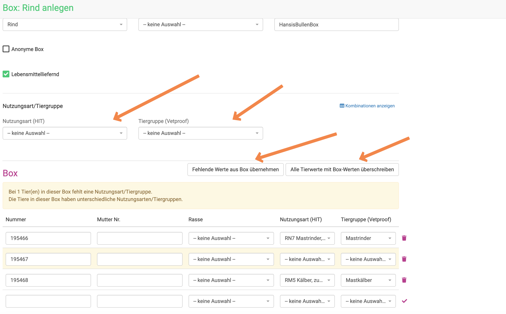   

Sie setzen zunächst die gewünschte Nutzungsart der Box.  

Nun können entweder auf alle Tiere, bei denen die Werte fehlen diese Werte eingefügt werden oder aber ALLE Tiere direkt 
mit den "neuen" Werten "überschrieben" werden. 

:::caution Achtung!  

Dabei wird dann an jedem der Einzeltiere dauerhaft die Nutzungsart verändert!  

:::   

