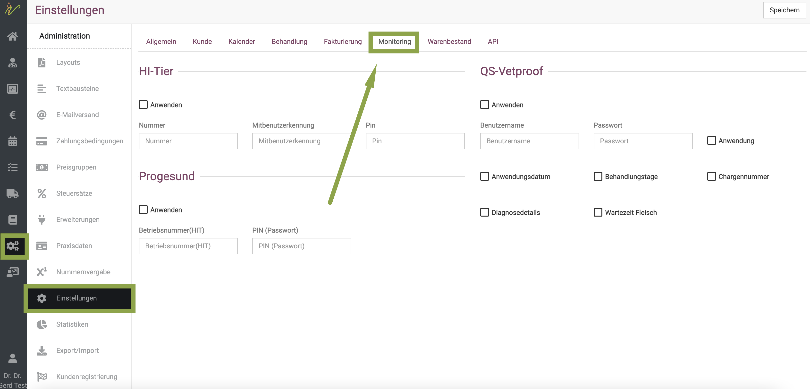

# Monitoring  

Hier erklären wir die Nutzung der Monitoring Optionen mit HI-Tier und QS-Vetproof. 
Die Angaben am Kunden am Reiter "Betrieb" und der Sektion "Betrieb" sind für die HIT Schnittstelle nicht wichtig, sondern nur für
QS(Vetproof).

## HI-Tier Anbindung einrichten

Um die direkte Übermittlung der Daten sowohl für den Tier-Import als auch der Behandlungen und Anwendungen zu nutzen, müssen Sie
zunächst Ihre Praxisdaten, die Sie von HI-Tier bekommen haben, in Ihrem Account hinterlegen.

Klicken Sie dazu auf **Praxis** und dann **Einstellungen**. Dort gibt es den Reiter **Monitoring**. Dort können Sie die Zugangsdaten hinterlegen.
Außerdem können Sie die Checkboxen setzen, welche Daten übermittelt werden sollen/müssen.

Wenn Sie Bestände aus der HI-Tier abrufen möchten oder sogar Antibiotika-Anwendungen und Abgaben an HI-Tier melden möchten,
so kreuzen Sie die Checkbox in diesem Bereich an und geben Sie in den entsprechenden Feldern Ihre Zugangsdaten zur HI-Tier ein. 
Sollten Sie keine Mitbenutzer-Nummer besitzen, so lassen Sie dieses Feld bitte leer.

Klicken Sie dann auf **Speichern**.

## QS-Vetproof Anbindung einrichten

Um die direkte Übermittlung der Daten für QS-Vetproof zu nutzen, müssen Sie
zunächst Ihre Praxisdaten, die Sie von QS-Vetproof bekommen haben, in Ihrem Account hinterlegen.

Klicken Sie dazu auf **Praxis** und dann **Einstellungen**. Dort gibt es den Reiter **Monitoring**- Dort können Sie die Daten hinterlegen.  
Klicken Sie dann auf **Speichern**. 

Sie können außerdem mit den Checkboxen bestimmen, welche Daten Sie übermitteln möchten.

  

## Daten des Betriebes eingeben

Zu jedem Betrieb, den Sie betreuen, müssen Sie die Daten des Betriebes eingeben, damit die Übertragung der Daten funktionieren kann.
Klicken Sie dazu auf den Kunden (oder legen diesen neu an) und klicken dann auf den Reiter **Betrieb**.

Hier müssen nun die Daten des gewünschten Systems und die Daten des Betriebes generell eingegeben werden. Klicken Sie dann auf **Speichern**.
Die Daten im obersten Feld **Betrieb** sind nur für Vetproof notwendig, für die HIT werden sie nicht benötigt.

:::caution Achtung

Meldungen an HIT sind nur dann machbar, wenn der Landwirt Sie als behandelnden Tierarzt bei HIT freigegeben hat!! Denken Sie daran, auch die
Vollmacht darüber immer zu dokumentieren!

:::

## HI-Tier/ QS-Vetproof Daten abrufen/importieren

Wenn sie beispielsweise einen neuen Betrieb zur Betreuung übernehmen oder generell Daten Ihrer betreuten Betriebe abrufen möchten, klicken Sie auf **Praxis**
und dann **Abrufen**. Markieren sie die gewünschten, zu aktualisierenden Betriebe und klicken Sie dann oben rechts **Importieren**.

(Liste hier leer, da keine real-Daten genutzt!!!)

### Daten von nur einem einzelnen Betrieb abrufen

Wenn Sie den Kunden aufrufen, können Sie auch direkt und schnell NUR seine Betriebsdaten importieren (vorausgesetzt, alles ist wie beschrieben eingerichtet
und Sie sind von ihm freigegeben). KLicken Sie dazu am gewünschten Kunden auf den Reiter **Patienten** und dann den blauen Button **importieren**.

## HI-Tier Meldungen durchführen

Um Ihre Abgabebelege und Meldungen an HI-Tier zu übermitteln, klicken Sie **Monitoring** und dann das gewünschte System.
Wählen Sie oben den Zeitraum aus, für den Sie übermitteln möchten. Nun sehen Sie eine Liste aller noch nicht über und klicken dann auf **Melden**.

:::caution Achtung: 

Wir empfehlen, die Meldung monatlich durchzuführen, nicht nur alle 6 Monate!  

::: 

( Bitte beachten Sie, dass wir keine realen Daten angegeben haben und deswegen eine Fehlermeldung in den Screenshots erscheint).

## QS-Vetproof Meldungen durchführen

Um Ihre Abgabebelege und Meldungen an QS-Vetproof zu übermitteln, klicken Sie **Monitoring** und dann das gewünschte System.
Wählen Sie oben den Zeitraum aus, für den Sie übermitteln möchten.  

Nun sehen Sie eine Liste aller noch nicht übermittelten Belege. Markieren Sie entweder alle oder die gewünschten
durch aktiverieren der Checkbox und klicken dann auf **Melden**.

Wenn Sie keine Belege zu übermitteln haben, können Sie eine **Nullmeldung** durchführen.

   

### Fehlermeldungen Vetproof  

Wenn bestimmte Daten fehlen, die zur Übermittlung benötigt werden, wird dies direkt in der Liste der Belege angezeigt. Diese 
Erklärungen sind eigentlich selbsterklärend und müssen dann entsprechend ergänzt werden, damit die Meldung erfolgen kann.  

Allerdings gibt es auch Fehlermeldungen, die erst beim Melden durch die Schnittstelle von vetproof zurückgegeben werden. Wir bemühen uns, diese
hier zu listen, um Sie zu erklären.  

Eine der häufigsten Meldungen ist die, dass das System den Tierarzt nicht kennt:   

   

Dies entsteht immer dann, wenn der Alias im Vetproof nicht mit dem Namen des Tierarztes, wie er im debevet angelegt ist, übereinstimmt.   

Bitte loggen Sie sich im Vetproof ein und prüfen den Tierarzt, der den Beleg erstellt hat und den dort hinterlegten Alias:  
 
  

  

Vor- und Nachname müssen genau so hinterlegt sein, wie im debevet. Eigentlich wird das automatisch so übermittelt, aber teilweise 
wurden entweder am Benutzer andere oder fehlende Daten hinterlegt, oder aber bereits der Alias im Vetproof durch den Nutzer verändert.  

Mit der Umstellung auf die neue Vetproof Schnittstelle im März 2025 wird es leider unumgänglich, dass diese Daten korrekt übereinstimmen.   

Eine weitere häufige Fehlermeldung ist die, dass die "location number" nicht gefunden werden kann:   

     

In diesem Falle ist der angelegte Landwirt nicht in Ihrem Vetproof Account bekannt, bzw. Sie nicht als Tierarzt für diesen Account freigegeben. 
Loggen Sie sich bitte einmal im Vetproof ein und suchen den Kunden. Evtl. sprechen Sie mit dem Landwirt, ob er Sie freigegeben hat, ob seine 
VVO Nummer korrekt ist und prüfen all diese Daten erneut.  

## Daten einzelner Tiere

### Kenn-Nummer/ Lebensnummer

Eigentlich bekommen Sie die Daten eines Tieres IMMER über den Import der Daten eines Betriebes. Sollte dieses aus irgendeinem
Grunde einmal nicht korrekt sein, können Sie die Daten am Tier ändern.  
Klicken Sie dazu in der Patientenliste auf den Namen/Bezeichnung des Tieres. Das Feld zur Eingabe der Lebensnummer ist eigentlich gesperrt (grau
hinterlegt). Durch einen Klick auf das **Schloß-Symbol** kann der Bereich entsperrt und verändert werden.  
Klicken Sie anschließend oben rechts auf **Speichern**.

### Gesundheitsstatus Rinder

Bei Rindern haben Sie die Möglichkeit, die Daten zu Impfungen und Erkrankungsstatus in Bezug auf folgende Krankheiten zu hinterlegen/abzurufen:

* Bovines Herpesvirus Typ 1
* Bovine Virusdiarrhoe
* Leukose
* Brucellose

Wählen Sie dazu den Patienten aus der Patientenliste des Besitzers und klicken dann den Reiter **Gesundheitsstatus**.

Denken Sie daran, Änderungen immer zu **Speichern**.