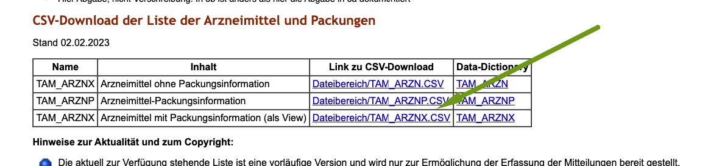

# Antibiotika Meldungen

Ab dem 1.01.2023 ist es Pflicht, dass Tierärzte die Verbrauchsmengen von Antibiotika melden müssen. Hierzu gibt es auf der Seite 
des BVL eine Reihe von Tipps, sowie Angaben, welche Felder und wie diese Daten übermittelt werden müssen.

Die Meldungen sollen halbjährlich erfolgen und sind damit zu Ende Juni 2023 das erste Mal nötig.

Die debevet Software wurde schon entsprechend angepasst, die Nutzungsarten wurden entsprechend angepasst, außerdem bieten wir (Stand April 2023) 
ein Feld für die "Packungs ID" an. Wir setzten jede Information, die uns zur Verfügung steht, sofort um. 

Aktuell wird leider diese ID noch nicht von der Barsoi mitgeliefert, was bedeutet, das diese bei uns im Programm von Ihnen einmalig händisch
hinterlegt werden muss. 

Die Barsoi PLUS liefert einen großen Teil Wartezeiten, Wirkstoffe und Einheiten, alles, was von dieser Liste mitgeliefert wird,
können wir auch im debevet abbilden. Bitte haben Sie Verständnis, dass Fehler, fehlende Inhalte etc. nicht in unserer Hand liegen. Wenden
Sie sich in diesen Fällen bitte direkt an Barsoi.

Hier finden Sie mehr Informationen, was genau alles beachtet werden muss, welche Felder und Informationen für die "neuen" Meldungen benötigt werden:

https://www.bvl.bund.de/DE/Arbeitsbereiche/05_Tierarzneimittel/01_Aufgaben/05_AufgAntibiotikaResistenz/02_ErfassungVerbrauchsmengen/ErfassungVerbrauchsmengen_node.html   

Die HITier wird die hauptsächliche Schnittstelle für diese Meldung werden, so wie es aktuell aussieht. Hier stehen leider weiterhin für unsere 
Entwickler immer noch nicht alle Daten und Informationen zur Verfügung. Alle Ansprüche können Sie hier nachlesen, diese erfüllt auch debevet aktuell.  

Somit können wir zum aktuellen Stand eine voll digitalisierte Meldung durchführen! 

https://www1.hi-tier.de/infoTA.html

https://www.hi-tier.de/Entwicklung/Konzept/Sonstiges/TAM002.htm#download

## Die Packungs ID   

Aktuell muss die Packungs-ID manuell eingetragen werden. Diese können Sie auf der HITier Seite in einer Liste finden.   

[HIT Liste TAM](https://www.hi-tier.de/Entwicklung/Konzept/Sonstiges/TAM002.htm#download)   

Außerdem finden sich auch in der Liste vom BVL etliche Daten:

[BVL Medikamtenliste](https://www.bvl.bund.de/SharedDocs/Downloads/05_Tierarzneimittel/Liste_der_mitteilungspflichtigen_Arzneimittel.html?nn=17226560)

Öffnen Sie diese Liste als CSV und suchen Sie die passende Packung/Medikament. Die Packungs-Id finden Sie in einer gesonderten Spalte. (TAMA_PID)
Tragen Sie diese dann am Produkt in debevet ein. (Es handelt sich nur um eine einstellige Zahl!).   

