# AUA Belege 

Hier können Sie AuA-Belege suchen, ändern, löschen oder drucken/versenden. 

### Ablaufdatum für AUA Belege setzen

Sie können festlegen, nach welcher Zeit der AUA Beleg erstellt sein muss.

Klicken Sie hierzu auf **Administration** und dann **Einstellungen**. Dort klicken Sie in den Reiter **Behandlungen**.
Dort finden Sie die Zeit in Stunden, die Sie als Ablaufdatum frei bestimmen können.

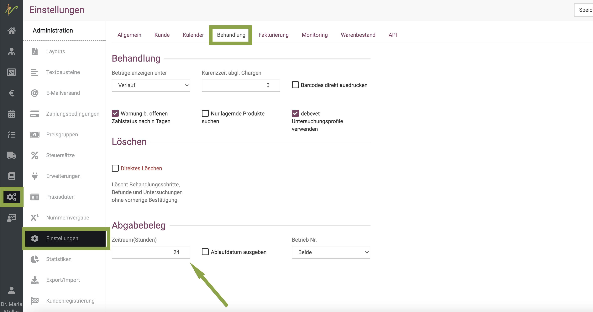

### AUA Beleg erstellen

Um einen AUA-Belege für ein Tier oder eine Gruppe von Tieren zu erstellen, müssen Sie sich in der Behandlungsmaske des Tieres/ der Gruppe befinden.

Wenn Sie das Medikament nun oben neben **Heute** eingeben und auf den Mengenrechner klicken, können Sie dort direkt die Mengen
eingeben. Außerdem können Sie dort die Anweisung je nach Anwendungsfall wählen. KLicken Sie dazu auf den **Dropdown-Pfeil** neben
**Anweisung**.

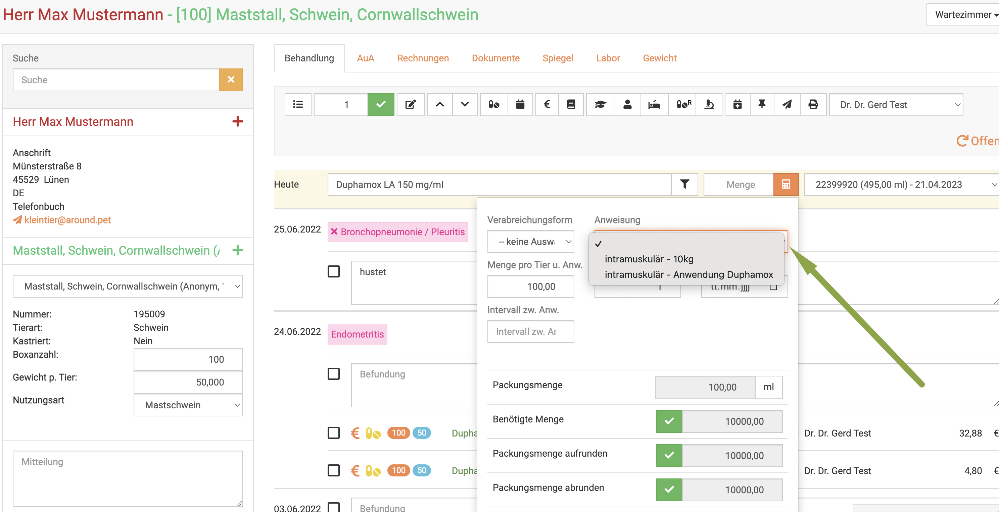

:::caution Achtung

Die Anweisungsanwendungen werden nur auf dem AUA Beleg angezeigt, wenn Sie
1. diese am Produkt hinterlegt haben
2. hier oder im nächsten Schritt die Anweisung auch auswählen   

Wie Sie die Anwendungsanweisungen hinterlegen, erfahren Sie hier:   

[Anwendungsanweisungen](/docs/Warenwirtschaft/Produkte#anwendungsanweisungen)

:::

Sie können auch die Anweisung noch im nächsten Schritt auswählen.

Wählen Sie nun die **Checkboxen** der gewünschten Medikamente an. Drücken Sie nun oben auf das **Buchsymbol**.

:::caution Achtung

Achten Sie darauf, dass die korrekte Form gewählt ist, ob **Abgabe**(Pillensymbol) oder **Anwendung**(Spritzensymbol).

:::

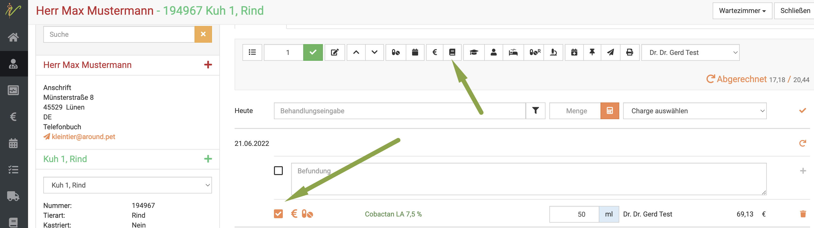

Nun wird Ihnen der Entwurf angezeigt. Wenn Sie zuvor nicht aus den Anwendungsanweisungen schon eine Option gesetzt haben, müssen
Sie dies nun hier machen. Klicken Sie dazu noch einmal auf das Stiftsymbol neben dem Medikament.

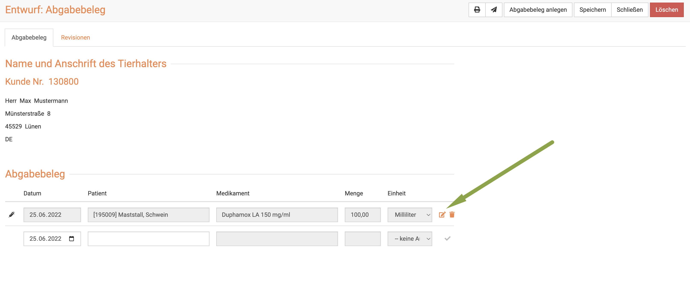

Klicken Sie in der sich öffnenden Maske den *Dropsown-Pfeil** bei **Anweisungen**. Wählen Sie dort dann die gewünschte Anweisung.

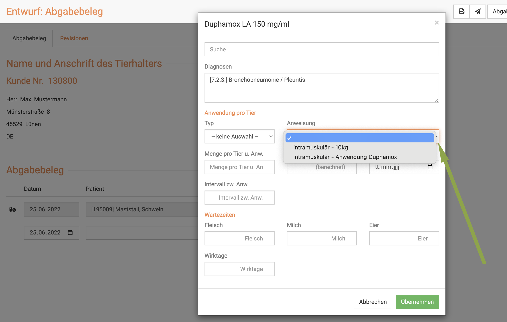

Sie sehen direkt, dass die Felder ausgefüllt werden. Klicken Sie dann unten **Übernehmen**.

Wenn Sie oben rechts auf **Abgabebeleg anlegen** klicken, wird der Beleg erstellt.

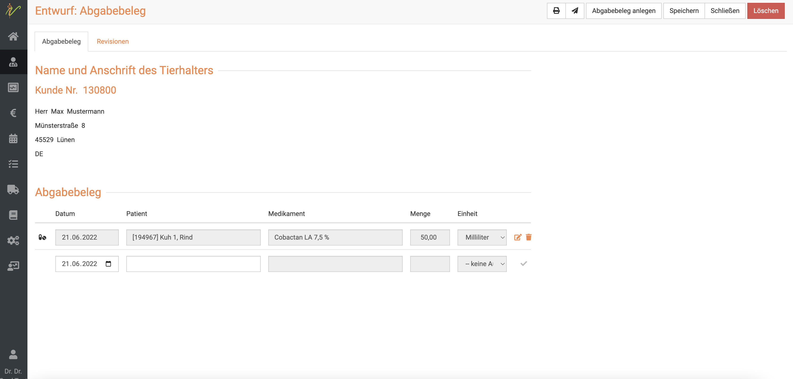

Nun sehen Sie den fertigen Beleg und können diesen entweder drucken oder direkt mit Klick auf das **Mail-Symbol** an den Landwirt mailen.

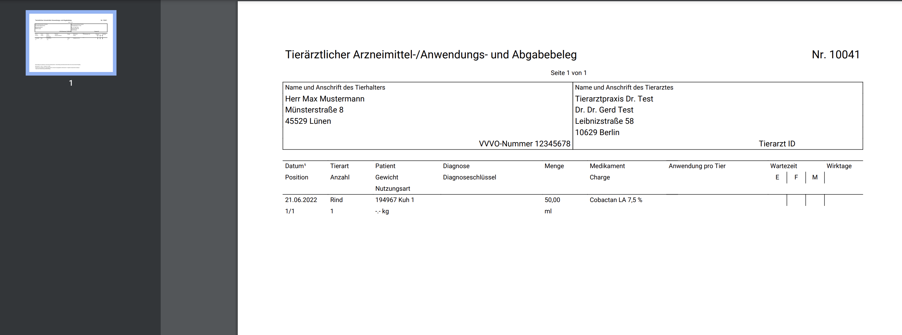

:::danger ACHTUNG

Bitte beachten Sie, dass der hier dargestellte Beleg nicht rechtskonform ist! Sie selbst müssen alle Daten (Wartezeiten, Anwendungen)
an den Medikamenten hinterlegen, damit diese korrekt auf dem AUA dargestellt werden!

Pflichtangaben aktuell: eindeutige Identifizierung TA, Landwirt und Tier, Applikationsart, Menge, Chargennummer, Wartezeiten
wenn Abgabe auch das Intervall. Beachten Sie die zukünftigen und aktuellen Regeln bitte selbständig!

:::

### AUA Belege suchen

Ihre Abgabebeleg-Liste finden Sie unter **Praxis** und dann **AUA**. Sie sehen dort die gesamte Liste Ihrer Abgabebelege.

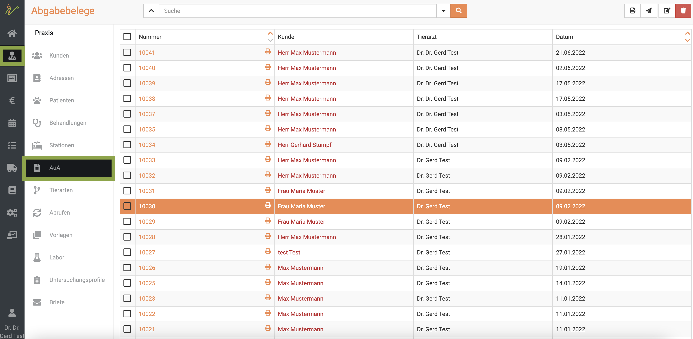

Tippen Sie in das Suchfenster wie bei einer Suchmaschine Begriffe ein, die zum gewünschten AuA-Beleg
passen und drücken Sie die **Entertaste** oder klicken Sie auf das **Lupen-Symbol**.

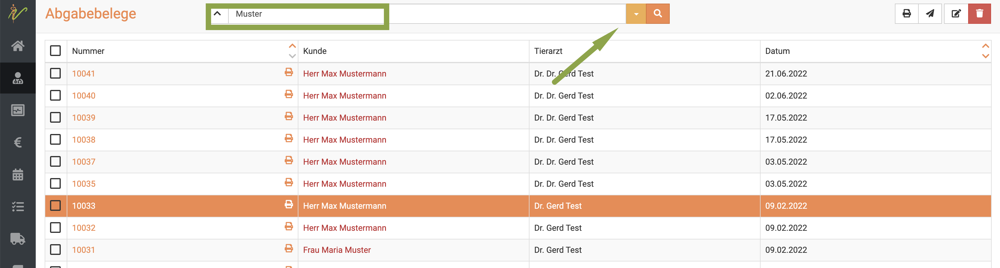

Nun werden Ihnen alle Ergebnisse aufgelistet, die zu Ihrer Suche passen.

Mit einem Klick auf die Belegnummer können Sie den gewünschten Beleg öffnen.

### Suchenfilter zurücksetzen

Das die Liste aktuell mit einem Suchergebnis gefiltert ist, erkennen Sie daran, dass der **Dropdown-Pfeil** oben neben dem Suchenfeld *gelb* ist.

Um die Liste wieder ungefiltert anzeigen zu lassen, klicken Sie auf den **Dropdown-Pfeil** und klicken dann auf **Zurücksetzen**.

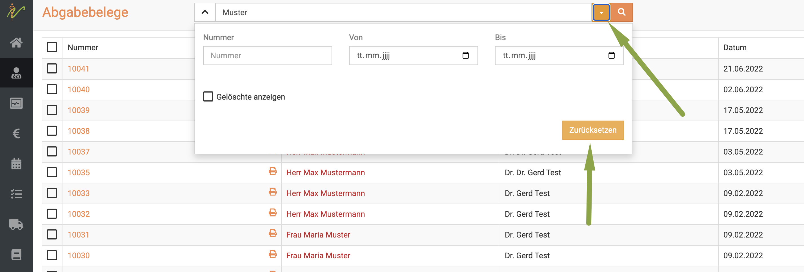

### AUA Belege drucken, versenden, löschen

Wählen Sie die gewünschten Belege aus, indem Sie die Checkboxen vor den Beleg-Nummern anwählen. Um die gewünschte
Aktion auszuführen, drücken Sie nun die jeweiligen Symbole oben rechts: zum Drucken das **Drucker-Symbol**, zum Verschicken
das **Brief-Symbol** und zum Löschen das **rote Mülleimer-Symbol**.

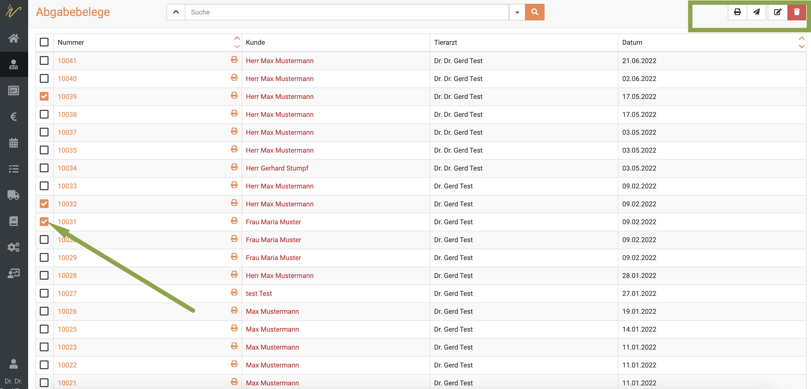

### Mehrere Belege bearbeiten, senden, löschen

Um mehrere AuA-Belege zu bearbeiten, wählen Sie zunächst die jeweiligen **Checkboxen** in der Liste an.
Drücken Sie nun das **Stift-Symbol** oben rechts, um die ausgewählten AuA-Belege zu bearbeiten.

Nutzen Sie die Pfeile < und > um beim Bearbeiten zwischen den einzelnen AuA-Belege zu wechseln.

Um sie zu löschen, drücken Sie das **Mülleimer-Symbol**.

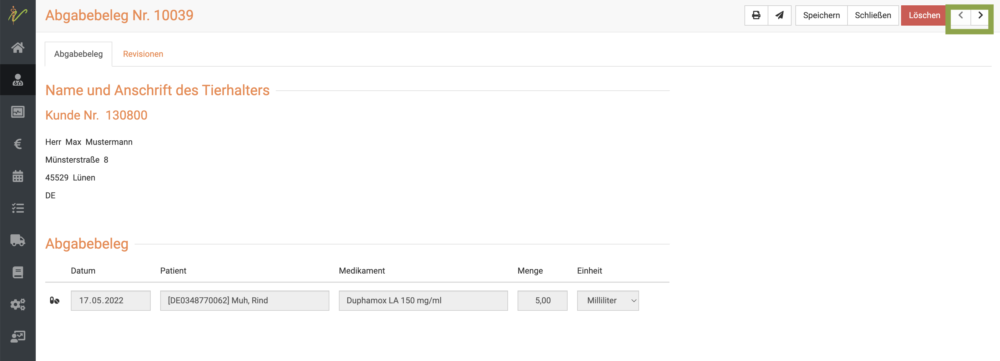

### Ausstehende AUA Belege anzeigen

Die debevet Software bietet die Möglichkeit, alle noch nicht erstellten AUA Belege anzeigen zu lassen und direkt zu erstellen.

Klicken Sie dazu **Praxis** und dann **Behandlungen**. Klicken Sie dann den **Dropdownpfeil** neben der Suchenleiste.

Dort setzen Sie den Haken auf **Abgabebeleg ausstehend** und drücken die **Entertaste** oder klicken das **Lupen-Symbol**.

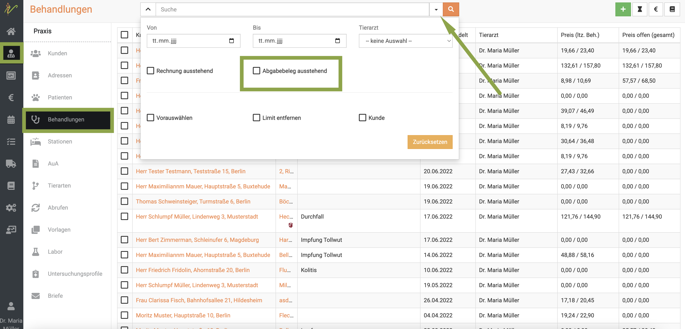

Nun werden Ihnen die noch ausstehenden Belege, bzw. Behandlungen, bei denen der AUA Beleg noch nicht erstellt wurde, aufgelistet.

Um für einen oder mehrere nun den AUA Beleg zu erstellen, aktivieren Sie die gewünschten **Checkboxen** und klicken dann
oben rechts auf das **Buch-Symbol**.

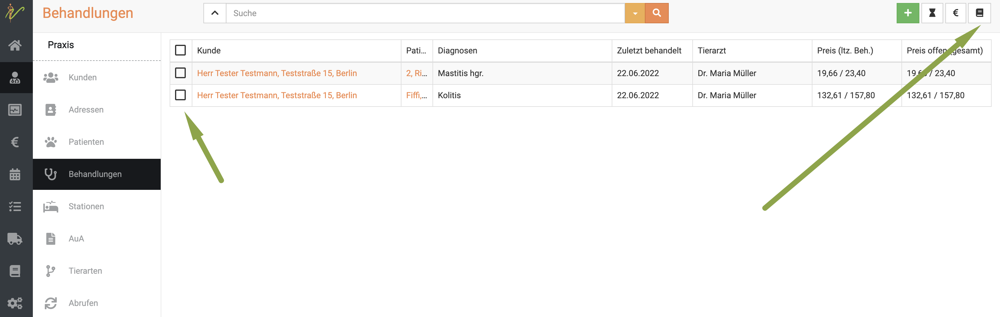

:::tip Tipp

Wenn Sie direkt mehrere angewählt haben, können Sie  mit den Pfeilen oben rechts <  > von Beleg zu Beleg wechseln.

:::

### Antibiotika-Monitoring

:::caution Achtung

Für die Meldung von Antibiotika ist es erforderlich, dass das jeweilige Präparat unter
**Warenwirtschaft** → **Produkte** für das Antibiotika-Monitoring gekennzeichnet ist, also im gleichnamigen Feld ein Haken gesetzt ist.

:::
