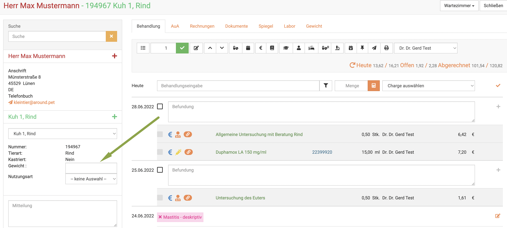
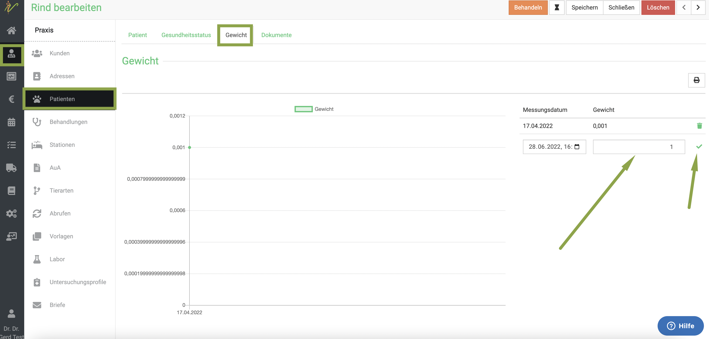
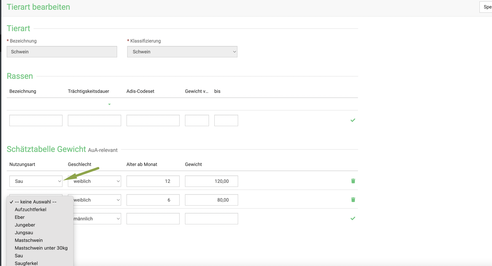
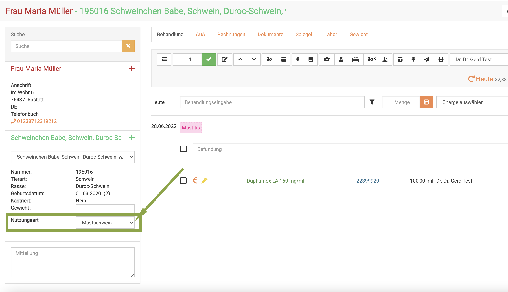
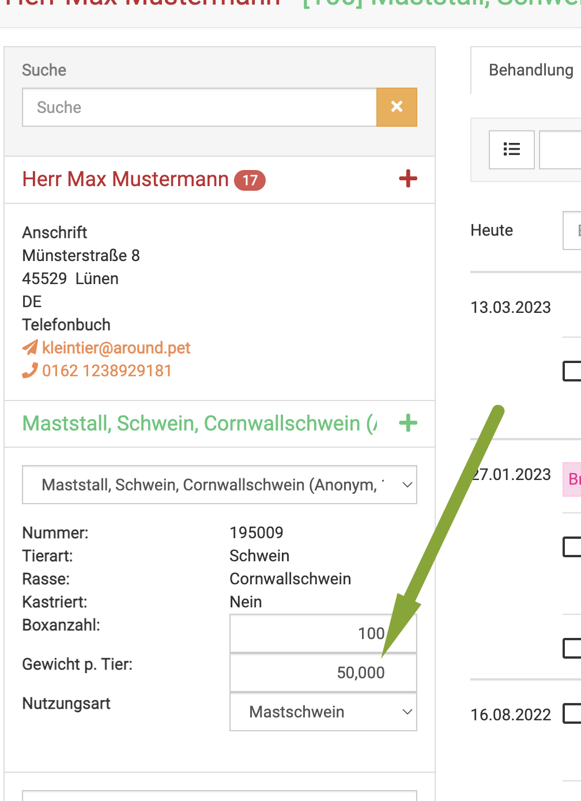
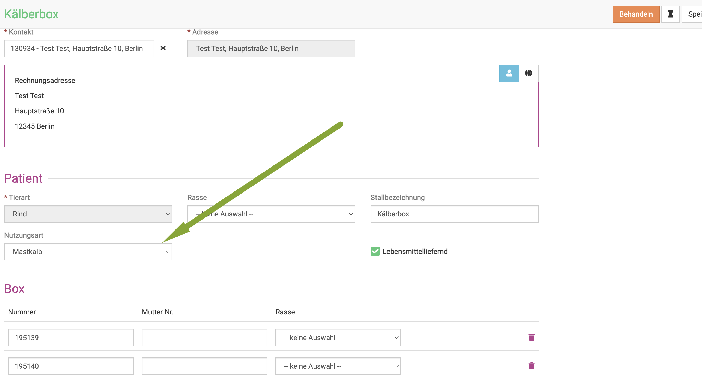
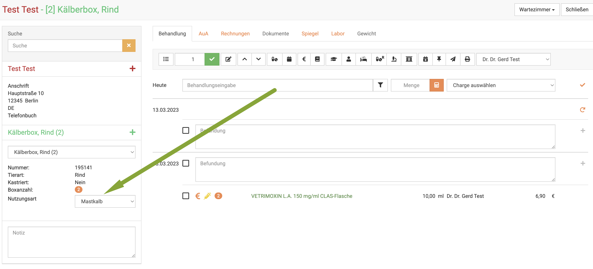
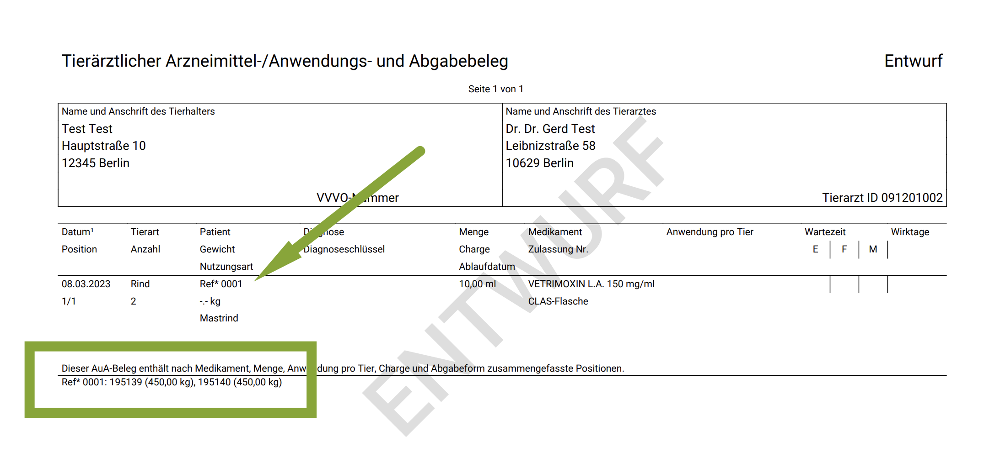

# Gewichte im Nutztiersektor

Für Erstellung der AUA Belege bei der Abgabe/Anwendung ist es wichtig für Sie, Schätzgewichte für die Tiere zu haben.  

Bitte beachten Sie, dass beim Import aus der HIT nicht automatisch Gewichte an den Nutzungarten hinterlegt werden. (Selbst, wenn Sie Gewichte 
an den jeweiligen Nutzungsarten hinterlegt haben, Stand März 2023)

## Gewicht anlegen Rind/Schwein  

Um die Gewichte zu hinterlegen, gibt es mehrere Wege:

### 1. Direkt beim Behandeln

Um hier schnell ein Gewicht bei einem einzelnen Tier (oder bei einer Box das Gewicht pro Tier) zu hinterlegen, können Sie dies
direkt links unten in der Patientenkartei eintragen.  

   

### 2. Beim Anlegen des Patienten

Wenn Sie auf **Praxis** und dann **Patienten** klicken, können Sie sowohl beim neuen Erstellen, als auch beim Bearbeiten eines Patienten 
das Gewicht beim Patienten hinterlegen. 

Öffnen Sie den gewünschten Patienten und klicken Sie dann den Reiter **Gewicht**.

Dort sehen Sie rechts eine Liste mit Gewichtsverlauf, wobei Sie ein neues Gewicht eintragen können und dann den **grünen Haken** klicken
um dieses einzugeben. KLicken Sie anschließend oben rechts auf **Speichern**.  

  

### 3. Pauschale Gewichte pro Nutzungsart anlegen  

Nützlich, um dauerhaft Zeit zu sparen ist es, bei den Nutzungsarten die Gewichte zu hinterlegen.  
Um diese Funktion zu nutzen, klicken Sie **Patienten** und dann **Tierarten**. 

Nun können Sie an der gewählten Tierart verschiedene Parameter eingeben, wie diese für die betreuten Betriebe Sinn machen.  

Wenn Sie nur pauschale Gewichte nach der Nutzungsart anlegen wollen, wählen Sie in der Sektion "Schätztabelle Gewicht" mit Klick 
auf den **Dropdown-Pfeil** bei "Nuztungsart" und wählen dann die gewünschte Option.   

Wählen Sie das Geschlecht, geben das Gewicht ein und klicken dann unbedingt rechts auf den **grünen Haken** zur Eingabe. (auch in der letzten Zeile,
die Sie eingeben wollen!).  

  

Wenn Sie nun in der Behandlung eines Tieres unten links eine Nutzungsart wählen, ist direkt das passende Gewicht gesetzt.
So sparen Sie sich den Schritt des Gewicht-eingebens.  

  

:::caution Achtung  

Obwohl dann am Tier in dieser Ansicht das Feld bei "Gewicht" leer ist, wird beim Anlegen des AUA Beleges ein Gewicht eingetragen.  

:::

### 4. Gewicht für eine Box hinterlegen  

Für anonyme Boxen ist es sehr einfach, ein Schätzgewicht pro Tier einzutragen. Dieses können Sie direkt in der Behandlung eingeben wie bei einem Einzeltier:

  

Für nicht-anonyme Boxen müssen Sie den Weg über die Nutzungsarten gehen. Sie können die gewünschten Tiere einfach in einer nicht anonymen Box gruppieren. 

Achten Sie dabei darauf, dass Sie die Tiere so gruppieren, dass diese alle in eine Nutzungsart fallen. Die Nutzungsarten legen Sie ja selbst an,
dabei kann das Gewicht aus dieser Liste nur dann korrekt übernommen werden, wenn die Faktoren  

* Geschlecht  
* Alter   

der Gruppe (Box) auch zueinander passt.   

Der Grund hierfür liegt darin, dass es nicht möglich wäre, auf einem Gruppen-AUA Beleg verschiedene Gewichte für jedes Tier einer Gruppe darzustellen.   

Handelt es sich beispielweise um eine Gruppe männlicher Mastkälber, die ein gewisses Alter nicht überschreiten, können Sie diese in die entsprechende Nutzungsart 
einordnen (nachdem Sie die Nutzungsarten Tabelle ausgefüllt haben).  Dies kann an der Patientenansicht oder in der Behandlungsansicht ausgewählt werden.  

  

   

Auf dem AUA-Beleg für diese nicht anonyme Gruppe/Box wird oben eine Referenzierung angezeigt, welche weiter unten dann mit den Gewichten erläutert wird.   

:::tip Tipp: 

Wenn die Tiere älter werden und somit in eine andere Nutzungsart fallen, können Sie ganz einfach die Nutzungsart ändern. Damit wird dann auch das Gewicht der 
Gruppe geändert. (Eben enstprechend der von Ihnen angelegten Werte für das entsprechende Alter).   

:::  

