# Rechnungen 

Hier finden Sie alle wichtigen Punkte zum Thema Rechnungen, Gutschriften und Angebote.

## Rechnungen erstellen  

Um Behandlungen abzurechnen, markieren Sie mit einem Klick auf den Haken oben alle **Checkboxen** des Behandlungstages.
Anschließend klicken Sie oben auf das **Euro Symbol**, um die Posten in die Rechnung zu bringen.

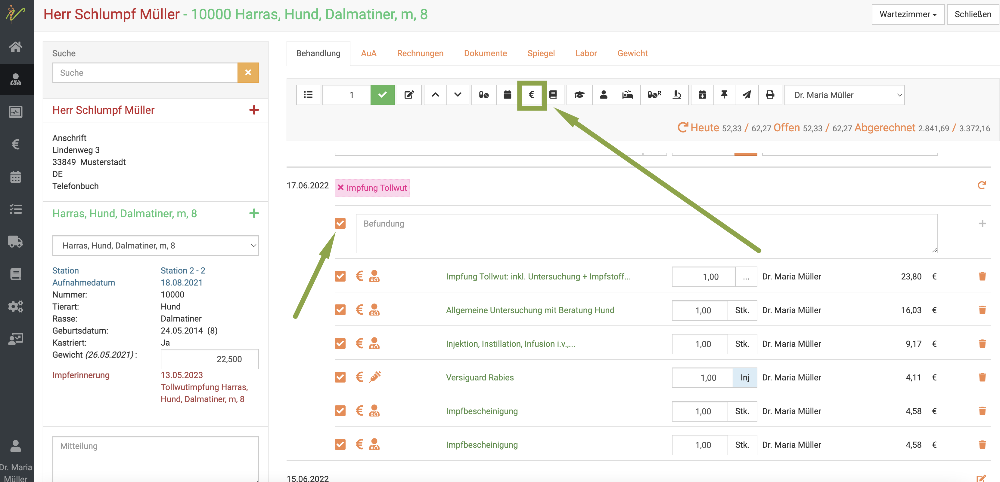

:::tip Tipp  

Wenn Sie keine Checkboxen setzen, werden ALLE noch nicht abgerechneten Posten des Patienten, auch aus der Vergangenheit, mit auf die Rechnung gesetzt.  

:::

## Zahlungsart wählen  

Wenn Sie in der nun automatisch geöffneten Rechnungsansicht den Dropdownpfeil bei **Zahlungsart** klicken, können Sie die für Ihre Praxis hinterlegen
Zahlungsarten auswählen. Klicken Sie anschließend auf **Speichern**.  

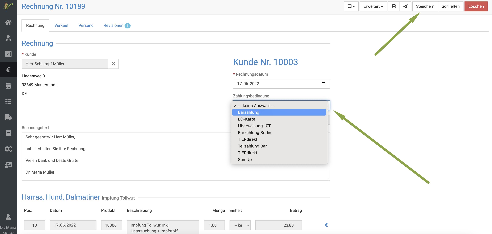     

:::tip Tipp  

So lange die Rechnung noch nicht gebucht ist, können Sie die Zahlungsart noch ändern!  

:::  

## Rechnung direkt an den Kunden mailen  

Wenn Sie am Kunden eine Email Adresse hinterlegt und den Haken bei "Email Versand erlauben" gesetzt haben, können Sie nun auf das
**Mail Symbol** oben klicken und damit die Rechnung direkt an den Kunden mailen, um die Umwelt zu schonen und Papier zu sparen.  

## Rechnung drucken  

Natürlich können Sie die Rechnung auch direkt drucken, wenn der Tierhalter dies wünscht. Klicken Sie dazu auf das **Drucker Symbol**.  

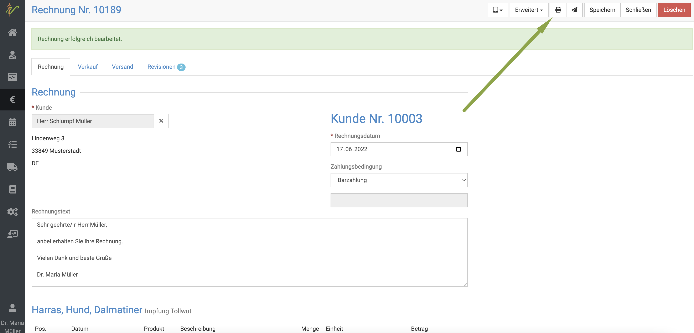

## Rechnung buchen  

Um die Rechnung zu buchen, klicken Sie oben auf **Erweitert** und dann **Rechnung buchen**.   

  

Nun ist die Rechnung festgeschrieben und muss für weitere Veränderungen zuerst storniert und dann neu erstellt werden!

## Rechnungen korrigieren/ stornieren

Um Rechnungen zu korrigieren, müssen Sie diese immer zunächst stornieren und dann neu ausstellen.

Zunächst öffnen Sie die gewünschte, zu stornierende Rechnung. Dafür gibt es zwei Wege:

* Klicken Sie auf **Fakturierung** (Euro Symbol) und dann **Rechnungen** und suchen dort nach der Rechnung (z.B. über Kundenamen) und 
klicken dann auf die Rechnungsnummer, um zur Rechnungsansicht zu gelangen    
* Klicken Sie in der Behandlung an der gewünschten Rechnung am Behandlungstag das **blaue Rechnungssymbol** (Brief)  

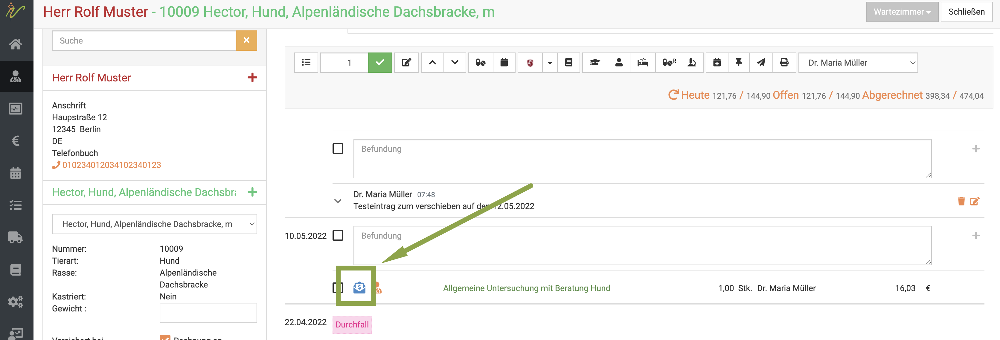

Nun öffnet sich die Rechnungsansicht. In der Rechnungsansicht klicken Sie nun oben rechts **Erweitert** und wählen im 
Dropdown dann **Rechnung stornieren**.  

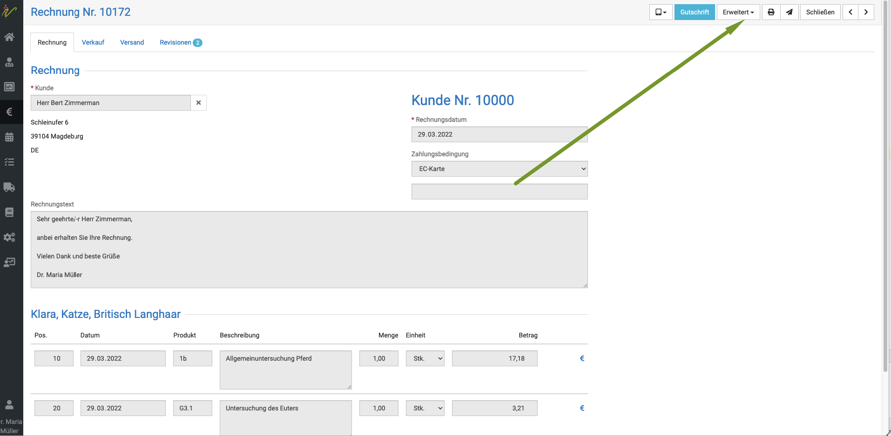  

Es öffnet sich ein Fenster, in dem Sie die Stornierung nun bestätigen müssen.  

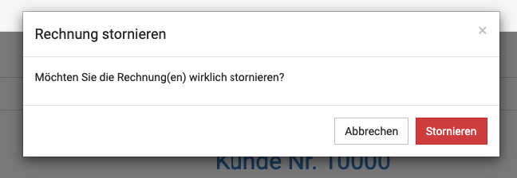  

Anschließend klicken Sie in der Ansicht oben rechts noch einmal den roten Button **Löschen**.
Bestätigen Sie die Löschung.  

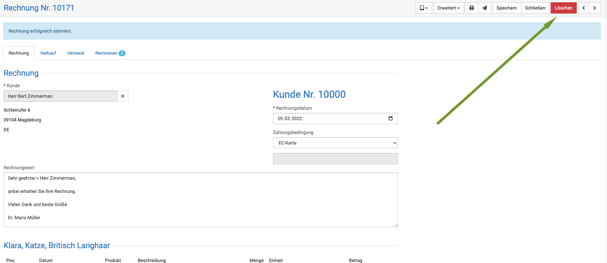  
 
Wenn Sie nun erneut in die Behandlung wechseln, indem Sie oben rechts auf **Schließen** klicken, sind die Behandlungs/Medikamtenposten, die Sie
abgerechnet hatten, wieder freigegeben, um verändert oder einzeln gelöscht zu werden.  

## Reverse-Charge Rechnungen  

Die Kollegen unter Ihnen, die in Grenzgebieten arbeiten, benötigen evtl. diese Funktion, wenn Ihren Kunden eine internationale 
Umsatzsteuer ID haben, damit Sie die Rechnungen ohne Mehrwertsteuer ausstellen können und der Kunde die Mwst. dann in seinem eigenen Land angeben kann. 

:::danger ACHTUNG  

Bitte beachten Sie, dass die Rechnungen nur dann korrekt sind, wenn Sie selbst Ihre Umsatzsteuer ID in den Praxisdaten hinterlegt haben,
so dass diese auf Ihren Rechnungen mit aufgedruckt wird.  

:::

## Steuer ID am Kunden hinterlegen

Zunächst müssen Sie den Kunden aufrufen. Klicken Sie dann den Reiter **Allgemein** und tragen dann die Umsatzsteuer ID des Kunden
im passenden Feld ein. Anschließend müssen Sie mit Klick auf den **Haken** die Eingabe übernehmen. Erst danach oben rechts auf **Speichern** klicken.  

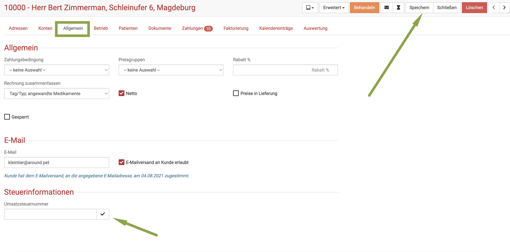

:::danger ACHTUNG   

Bedenken Sie, dass Sie vor Ausstellung von Reverse Charge Rechnungen verpflichtet sind, jede Umsatzsteuer ID Ihres Kunden selbst auf 
Gültigkeit zu prüfen! Hierfür gibt es spezielle Online Portale.  

:::  

### Reverse-Charge Textbaustein anlegen  

Damit der entsprechende Vermerk wie vorgeschrieben auf die Rechnung gedruckt wird, müssen Sie diesen zunächst in den Textbausteinen anlegen.
Klicken Sie auf **Administration**(Zahnradsymbol) und dann **Textbausteine**.  

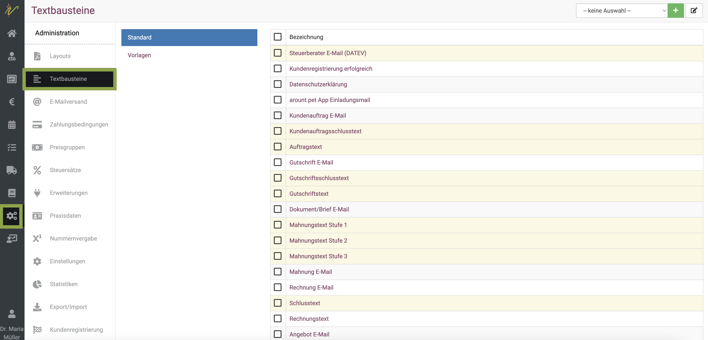  

Scrollen Sie dann herunter und klicken auf die Schrift "Reverse-Charge-Verfahren". Dort fügen Sie nun den Text ein, den Sie nutzen wollen.
Hier ein Beispieltext (ohne Haftung für gesetzliche Korrektheit):   

*Der Rechnungsausweis erfolgt ohne Umsatzsteuer, da vorliegend der Wechsel der Steuerschuldnerschaft (Reverse-Charge-Verfahren) 
greift. Die Umsatzsteuer ist vom Leistungsempfänger anzumelden und abzuführen.*   

Anschließend müssen Sie noch einen **Platzhalter** einfügen, damit die Umsatzsteuer ID des Kunden automatisch in die Rechnung eingefügt wird.  

Wählen Sie dazu rechts aus der Liste **Variablen** den Punkt **Kunde Ust.-ID**. Der PLatzhalter wird dann oben hinzugefügt. 
Klicken Sie dann auf **Speichern**.  

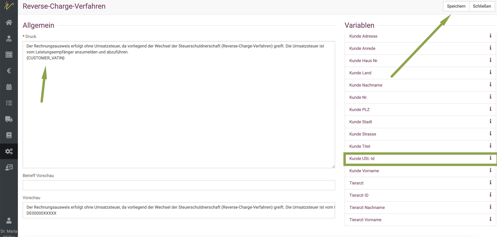   

## Reverse-Charge Rechnung erstellen  

Um die Rechnung nun als Reverse-Charge Rechnung zu erstellen, erstellen Sie die Rechnung wie gewohnt mit Klick auf das **Euro--Symbol**.   

Allerdings müssen Sie nun zunächst auf den Reiter **Verkauf** klicken. 

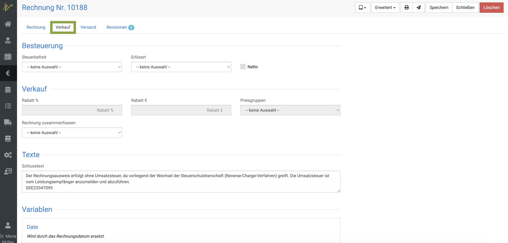  

HIer wählen Sie nun am Dropdown **Steuerbefreit** den Punkt **Reverse-Charge_Verfahren**.

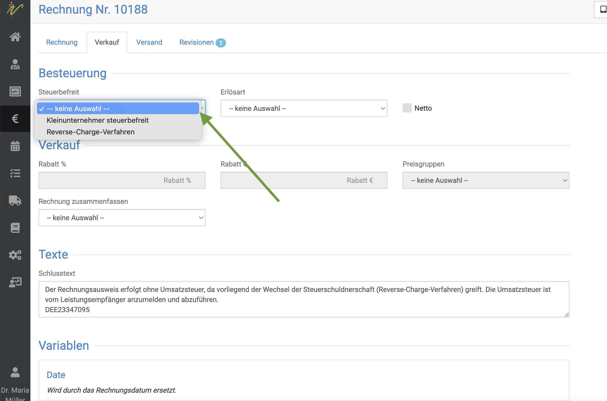

Dann wählen Sie am Dropdown **Erlösart** den Punkt **innergemeinschaftliche Lieferung**.  

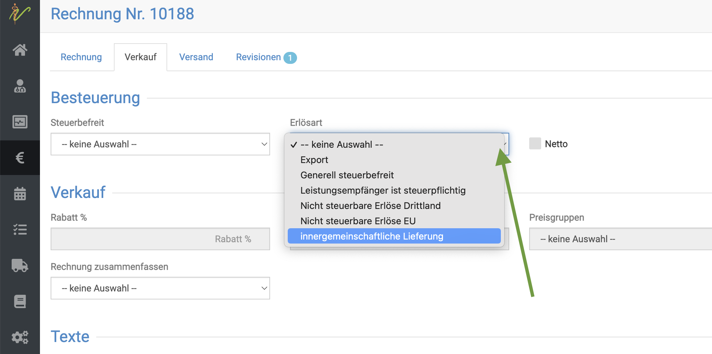  

Klicken Sie auf **Speichern** und fahren mit der Abrechnung/Zahlung nun wie gewohnt fort.

