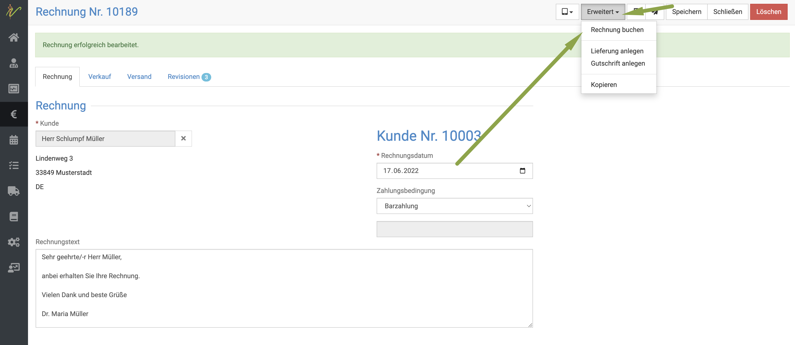
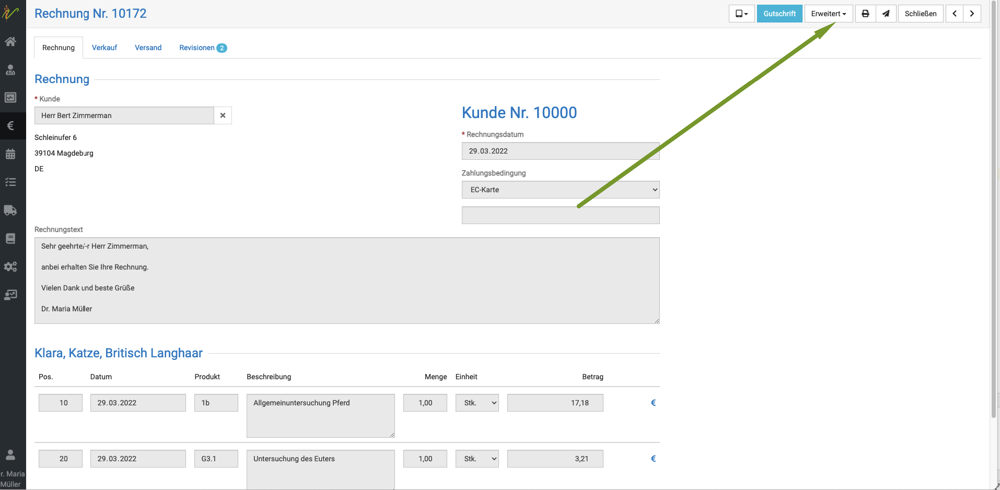
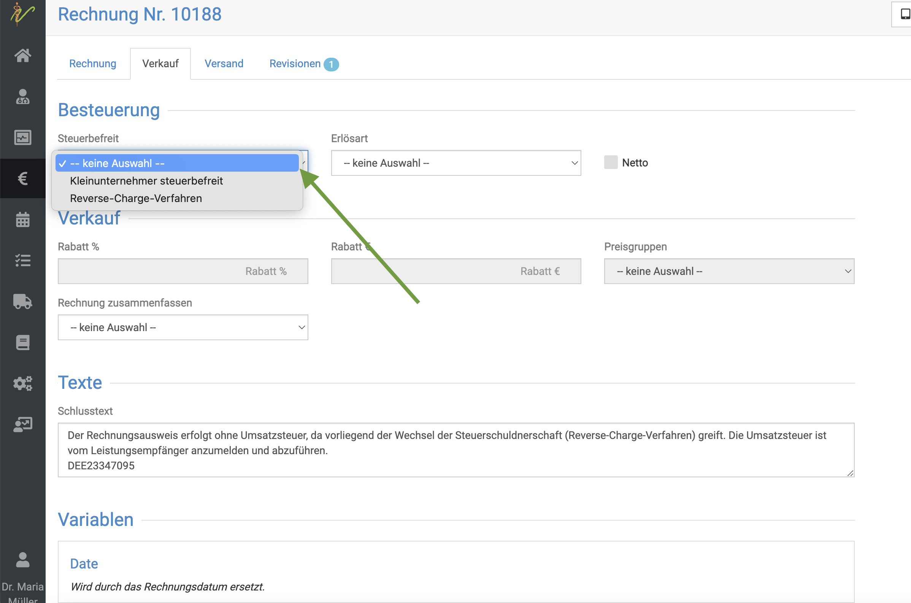

 # Rechnungen 

Hier finden Sie alle wichtigen Punkte zum Thema Rechnungen, Gutschriften und Kostenschätzungen

## Rechnungen erstellen  

Um Behandlungen abzurechnen, markieren Sie mit einem Klick auf den Haken oben alle **Checkboxen** des Behandlungstages.
Anschließend klicken Sie oben auf das **Euro Symbol**, um die Posten in die Rechnung zu bringen.

:::tip Tipp  

Wenn Sie keine Checkboxen setzen, werden ALLE noch nicht abgerechneten Posten des Patienten, auch aus der Vergangenheit, mit auf die Rechnung gesetzt.  

:::    

## Rechnungen als Entwurf erstellen lassen  

Wenn Sie debevet noch nicht lange nutzen oder evtl. Ihre Rechnungen noch einmal kontrolliert werden sollen vor dem endgültigen Versand, haben 
Sie die Möglichkeit, jede Rechnung zunächst als Entwurf zu erstellen. So ist die Rechnung zwar erstellt, aber es können noch Posten verändert oder 
storniert sowie hinzugefügt werden, bevor die Rechnung revisionssicher erstellt wird.  

Um diese Funktion zu nutzen, gehen Sie wie folgt vor:   
1. Klicken Sie auf **Administration**, dann **Einstellungen** und wählen den Reiter **Fakturierung**.    

  

2. Scrollen Sie herunter bis zum Feld "Rechnungsstellung"   
3. Setzen Sie dort den Haken bei "Beh. Rechnung als Entwurf"  

  

Wennn Sie nun eine Rechnung am Patienten erstelen, wird diese nicht direkt fest erstellt, sondern Sie sehen oben einen Button 
"Rechnung anlegen". So können Sie, bevor Sie diesen Button klicken, alles noch einmal in Ruhe kontrollieren und verändern.   

   

Der Vorteil bei der Nutzung des Entwurfstadiums ist, dass bei Fehlern/Korrekturen noch keine Rechnungsnummer "verbraucht" wurde. Gerade
in der Nutzung bei Neueinstieg in debevet empfiehlt sich dies, um nicht unnötige "Lücken" im Rechnungsnummernkreis zu erzeugen, wenn
etwas fehlt oder noch ergänzt werden soll.   

### Ändern des Rechnungsentwurfes    

Häufig kommen Fragen, wie der Rechnungsentwurf dann noch einmal verändert werden kann. Da dieser auch das "Euro Symbol blau färbt", sind die 
Behandlungsposten dann nicht zu verändern oder zu löschen. Dafür muss der Rechnungsentwurf zunächst gelöscht werden.   

Klicken Sie dazu in der Ansicht des Entwurfs oben rechts auf "Löschen".   
  
   

Nun können Sie zurück in die Behandlungskartei des gewünschten Patienten und dort Posten ergänzen, löschen oder verändern. 
Anschließend kann ein neuer Entwurf erstellt werden.

## Einzelne Posten nicht in Rechnung stellen 

Eventuell möchten Sie einen Verbrauch (Beispiel Narkose Injektion etc.) zwar dokumentieren, aber die Beträge und Mengen nicht auf der Rechnung anzeigen 
und auch nicht abrechnen. 
In diesem Fall können Sie einmal auf das **orangene Euro-Symbol** des Postens klicken, nachdem Sie diesen eingetragen haben. Das Euro-Symbol wird dann **grau**. 

  

Der Posten wird nun weder in Rechnung gestellt, noch erscheint der Posten auf der Rechnung. Für Sie selbst bleibt er aber als Dokumentation in der Patientenkartei!

## Posten nicht berechnen und auf der Rechnung auflisten  

Sie möchten etwas nicht in Rechnung stellen, dem Besitzer aber klar machen, dass Sie es ihm "geschenkt" haben? Sie möchten also etwas mit 0,00 Euro in der Rechnung 
aufführen?
Beispiele hierfür wären:
* KLeinste Verbrauchsmarterialien, die Sie nicht berechnen wollen, aber klar machen wollen, dass es dennoch erhalten wurde
* Futtermessbecher
* Beratung via Telefon, wenn Sie diese nicht abrechnen, aber dennoch klar machen wollen, dass es eine Leistung war

Wir empfehlen, für diese Positionen dann "Null Euro Produkte" anzulegen und diese in die Behandlung dann wie alles andere mit einzugeben. 

:::caution Hinweis:  

Bitte denken Sie daran, dennoch die 19% Mwst. zu hinterlegen, damit es nicht zu Buchungsfehlern auf buchhalterischer Seite unserer Software kommt!  

:::

## Zahlungsart wählen  

Wenn Sie in der nun automatisch geöffneten Rechnungsansicht den Dropdownpfeil bei **Zahlungsart** klicken, können Sie die für Ihre Praxis hinterlegen
Zahlungsarten auswählen. Klicken Sie anschließend auf **Speichern**.  

     

:::tip Tipp  

So lange die Rechnung noch nicht gebucht ist, können Sie die Zahlungsart noch ändern!  

:::  

## Rechnung direkt an den Kunden mailen  

Wenn Sie am Kunden eine Email Adresse hinterlegt und den Haken bei "Email Versand erlauben" gesetzt haben, können Sie nun auf das
**Mail Symbol** oben klicken und damit die Rechnung direkt an den Kunden mailen, um die Umwelt zu schonen und Papier zu sparen.

## Rechnung drucken  

Natürlich können Sie die Rechnung auch direkt drucken, wenn der Tierhalter dies wünscht. Klicken Sie dazu auf das **Drucker Symbol**.  

## Rechnung buchen  

Um die Rechnung zu buchen, klicken Sie oben auf **Erweitert** und dann **Rechnung buchen**. Um generell Zahlungen erfassen zu können, 
muss diese sogenannte Buchung absolviert werden. Dies kann manuell einzeln geschehen, oder aber automatisisert beim drucken oder mailen (siehe weiter unten).

  

Nun ist die Rechnung festgeschrieben und muss für weitere Veränderungen zuerst storniert und dann neu erstellt werden!  

:::info Information:   

"Buchen" bedeutet in debevet, dass die Rechnung im Hintergrund buchhalterisch kontiert wird, je nach den Einstellungen der 
Buchhaltungserweiterung. Dies hat nicht zwingend per se etwas mit dem Zahlungsstatus zu tun, oder mit dem "Einbuchen" einer Zahlung! 
Es geht dabei lediglich um buchhalterische Vorgänge, eine sogenannte Vorkontierung, die im Hintergrund stattfindet.   

:::    

### Stadien und Farbcodes bei Rechnungen / Buchungsstatus   

In der Rechnungsübersicht sehen Sie verschiedene Farbcodes, die wir zur Vereinfachung eingeführt haben. 
**Das Stadium "rot" bedeutet:**    
"zu buchen" - in diesem Stadium stehen logischerweise auch Entürfe, ebenso wie Rechnungen, die Sie noch nicht gebucht haben. (Siehe Info
weiter oben, buchen hat NICHTS mit der Zahlungseingabe zu tun!)  

**Das Stadium "gelb" bedeutet:**   
"gebucht" aber noch nicht vollständig bezahlt. Das kann eine Teilzahlung oder keine Zahlung bedeuten. Die gängige Voreinstellung der 
Buchhaltungserweiterung setzt z.B. Zahlungen mit Zahlart "Überweisung" in dieses Stadium. Ist eine Rechnung "gelb", können auch 
Zahlungen bzw. Teilzahlungen dann an dieser erfasst werden.

**Das Stadium "grün" bedeutet:**   
"erledigt"- die Rechnung ist buchhalterisch gebucht und bezahlt. In der gängigen Voreinstellung der Buchhaltungserweiterunhg werden z.B. 
Rechnungen mit der Zahlart "bar" oder "EC" direkt beim Prozess des Buchens auf "erledigt" gesetzt, da diese ja dann auch direkt bezahlt sind.

### Probleme bzw. Fehlermeldung bei der Buchung 

Teilweise kann es vorkommen, dass Sie beim Verbuchen der Rechnungen eine Fehlermeldung bekommen. Dies tritt vor allem dann auf, wenn 
* ein Posten 0.00% Mwst hat
* ein Posten mit 0.00 Euro eingetragen ist  

Dies kommt dann vor, wenn Sie selbst angelegte Produkte nutzen, bei denen Sie entweder keinen Preis hinterlegt haben oder keine Mwst.  

Um die Rechnungsposten zu prüfen, gehen Sie bitte wie folgt vor:  

Gehen Sie in die Detailansicht der enstprechenden Rechnung. Hierfür gibt es mehrere Wege:
* Klicken Sie Rechnungen und dann in der Spalte "Rechnungsnummer" auf die Rechnungsnummer 

  

* Klicken Sie in der Behandlung auf ein beliebiges blaues Euro Symbol an einem der Abrechnungsposten   

   

Nun öffnet sich die Detailansicht der Rechnung. Hier gibt es erneut ein **blaues Euro-Symbol** an jedem der Abrechnungsposten. 
Klicken Sie auf dieses, um die Ansicht zu erweitern, und den Mehrwertsteuersatz des jeweiligen Postens zu sehen. 

  

  

Wenn Sie nun am Mwst. Satz auf den Dropdownpfeil klicken, können Sie diesen ändern. Klicken Sie dann anschließend oben rechts auf **Speichern**. 
Anschließend kann die Rechnung verbucht werden.

  

Sollten Sie Rechnungen mit 0,00 Euro Posten enthalten haben, müssen Sie zunächst die Rechnung stornieren, das Produkt verändern oder
aus der Behandlung löschen und dann erneut eintragen. Die Rechnung muss dann erneut erstellt werden und sollte nun problemlos verbucht werden.

## Rechnungen automatisch buchen lassen  

Wenn Sie den Schritt sparen möchten, Rechnungen manuell auf "gebucht" setzten zu müssen, können Sie debevet so einstellen, dass direkt
mit Versand oder Druck jede Rechnung automatisch auf "gebucht" gesetzt wird.   

Klicken Sie hierzu **Administration** und dann **Einstellungen**. Klicken Sie dann den Reiter **Fakturierung** und setzen dort ganz unten den
Haken bei **Buchung verpflichtend**. (Abschnitt "Druck")  

    

## Symbole in der Rechnungsübersicht / Rechnungsliste     

Unsere Symbole in der Rechnungsliste geben Ihnen verschiedene Infos:  
Wurde die Rechnung bereits gemailt, gedruckt? 
Wann wurde die Rechnung gemailt/gedruckt?  
Wurde die Rechnung bereits an die Verrechnungsstelle abgetreten?

Die "Farbcodes" der Rechnungen wurden bereits unter dem Abschnitt des Buchens erklärt. Außerdem finden Sie auch noch die Symbole  

**Drucker:** Hellgrau, wenn noch nicht gedruckt, blau, wenn gedruckt, mit Mouseover ist dann die Zeit und das Datum des Drucks sichtbar  
**Papierflieger:** Hellgrau, wenn noch nicht gemailt, grüm, wenn mailt, mit Mouseover ist dann die Zeit und das Datum des Versands sichtbar  
**Briefumschlag:** Abtretungssymbol an die Verrechnungsstellen. Wenn eine Rechnung bereits abgetreten wurde, ist dort das Symbol der entsprechenden 
Verrechnungsstelle zu sehen.   

## Rechnungsposten zusammenfassen  

Sie haben am Kunden direkt die Möglichkeit, seine Rechnungen zusammenzufassen. So werden die Rechnungen gekürzt, um nicht zu lange
und unübersichtliche Rechnungen zu erstellen.  

Klicken Sie unter **Praxis** und **Kunden** auf den Namen des Kunden, so dass Sie in die Detailansicht seiner Daten gelangen. Klicken Sie nun den Reiter **Allgemein**.

Hier können Sie beispielsweise dem Kunden auch eine Preisgruppe zuordnen oder ihm einen festen Rabatt eintragen (in Prozent). Auch die Zahlungsbedingungen des Kunden 
können Sie hier einzeln ändern (abweichend von den global für Ihre Praxis gesetzen).  

Um die Rechnungen zusammen zu fassen, klicken Sie den **Dropdown-Pfeil** bei "Rechnung zusammenfassen". Nun können Sie aus drei Optionen wählen:  

* Nur angewandte Medikamente 
* Tag/Typ 
* Tag/Typ, angewandte Medikamente  

:::tip Tipp  

Denken Sie daran, dass diese Option selbstverständlich VOR der Erstellung der Rechnung gewählt sein muss.  

:::  

:::info Beispiele:  

Hier haben wir die Darstellung der verschiedenen Zusammenfassungen für Sie einmal nachgestellt, damit Sie sich besser vorstellen können, was gemeint ist.

1. Eine Rechnung, in der nichts zusammengefasst ist: [KLICK](../../static/img/Rechnungen/rechnung_nicht_zusammen.pdf)
2. Dieselbe Rechnung, in der die angewandten Medikamente (Abkürzung "M") zusammengefasst sind: [KLICK](../../static/img/Rechnungen/angewandte_medis_zusammengefasst.pdf)
2. Dieselbe Rechnung, wenn Tag/Typ zusammengefasst ist: [KLICK](../../static/img/Rechnungen/tag_typ_zusammengefasst.pdf)
3. Dieselbe Rechnung, wenn Tag/Typ und angewandte Medikamente zusammengefasst sind: [KLICK](../../static/img/Rechnungen/tagtypangewandtemedis_zusammengefasst.pdf)
  
:::  

## Sammelrechnungen erstellen / Mehrere Tiere eines Besitzers auf eine Rechnung

Sie möchten für einen Kunden bzw. Besitzer für mehrere Tiere bzw. Patienten eine einzige Rechnung erstellen, also alle offenen Posten +auf einer Sammelrechnung drucken? 
Sie möchten bei einem (oder mehreren) Kunden alle noch nicht abgerechneten Posten abrechnen. 

Hierfür gibt es zwei Wege: 

### 1. Über den Kunden unter "Auswertungen"

Klicken Sie hierzu in Ihrer Behandlung direkt auf den Kundennamen links.   

Alternativ rufen Sie den Kunden über die Kundeliste auf.  

  

Nun klicken Sie auf den Reiter "Auswertungen".  
Dort sehen Sie einen Überblick über die offenen Posten der verschiedenen Tiere und die gesamten offenen Posten.  

Klicken Sie auf den **grünen Button "Abrechnen"**. Es öffnet sich direkt die Rechnungsvorschau, in der Sie wie gewohnt die Zahlungsbedingung
setzen können und die Rechnung dann speichern und versenden/drucken können. 

Der Unterschied ist nun nur, dass alle offenen Posten verschiedener Tiere auf der Rechnung stehen.

### 2. Über die Behandlungen

Klicken Sie hierzu auf **Praxis** und dann **Behandlungen**.

Sie sehen die ungefilterte Liste Ihrer Behandlungen. Klicken Sie nun neben der Suchleiste auf den Dropdown Pfeil, um die Behandlungsliste zu filtern.
Wählen Sie die Checkboxen bei **Rechnung ausstehend**, um alle Behandlungen bzw. Karteien anzuzeigen in denen für denen
noch nicht fakturierte Positionen existieren.

Wenn Sie zusätzlich die Checkbox **Kunde** ankreuzen, werden die Beträge der noch nicht fakturierten Behandlungen bzw.
Karteien eines Kunden summiert. Drücken Sie nun **Enter** oder klicken das **Lupen-Symbol**, um den Filter anzuwenden.

Wählen Sie nun die Checkboxen der gewünschten Behandlungen (Wenn Sie den Haken bei Kunde gesetzt hatten, sind diese bereits an dem Kunden
zusammen gefasst und Sie müssen die Checkbox des Kunden anhaken) an und drücken oben rechts auf das **€-Symbol**, um die gewählten
Behandlungen abzurechnen. 

Die Rechnungen werden erzeugt und liegen anschließend unter **Fakturierung** - **Rechnungen** vor.

## Rechnungen korrigieren/ stornieren/ löschen

Um Rechnungen zu korrigieren, müssen Sie diese immer zunächst stornieren und dann neu ausstellen.  

:::caution Achtung   
Wenn die Rechnung bereits gezahlt ist, muss bei der Nutzung der debevet Buchhaltung zunächst die Zahlung storniert werden (Collmex macht
dies automatisch im Hintergrund). Deswegen leitet in diesem Fall das Programm Sie zunächst in den Beleg-Sektor, in dem Sie dann den Zahlungsbeleg stornieren 
müssen.   
Die Anleitung dazu finden Sie hier: 
[Belege löschen](https://handbuch.debevet.de/docs/Buchhaltung/Belege#belege-stornierenl%C3%B6schen=)

:::  

Wenn die Rechnung nicht bezahlt ist, gehen Sie wie folgt vor:  

Zunächst öffnen Sie die gewünschte, zu stornierende Rechnung. Dafür gibt es zwei Wege:

* Klicken Sie auf **Fakturierung** (Euro Symbol) und dann **Rechnungen** und suchen dort nach der Rechnung (z.B. über Kundenamen) und 
klicken dann auf die Rechnungsnummer, um zur Rechnungsansicht zu gelangen    
* Klicken Sie in der Behandlung an der gewünschten Rechnung am Behandlungstag das **blaue Rechnungssymbol** (Brief)  

Nun öffnet sich die Rechnungsansicht. In der Rechnungsansicht klicken Sie nun oben rechts **Erweitert** und wählen im 
Dropdown dann **Rechnung stornieren**.  

  

Es öffnet sich ein Fenster, in dem Sie die Stornierung nun bestätigen müssen.  

  

Anschließend klicken Sie in der Ansicht oben rechts noch einmal den roten Button **Löschen**.
Bestätigen Sie die Löschung.  

  
 
Wenn Sie nun erneut in die Behandlung wechseln, indem Sie oben rechts auf **Schließen** klicken, sind die Behandlungs/Medikamtenposten, die Sie
abgerechnet hatten, wieder freigegeben, um verändert oder einzeln gelöscht zu werden.

### Fehlermeldung "enthält inventurpflichtige Positionen und muss in eine Lieferung überführt werden"  

Diese Meldung erhalten Sie beim Löschen einer Rechnung, wenn in dieser inventurpflichtige Medikamente (oder anderes Zubehör, welches Sie selbst auf
inventurpflichtig gesetzt haben) enthalten ist. Die debevet Software möchte Ihnen damit helfen, zu bedenken, dass die ursprünglich berechneten, inventurpflichten 
Posten weiterhin im Warenbestand "abgezogen" sind, also "fehlen".   

Wenn Sie nur eine andere Kleinigkeit in der Rechnung korrigieren und diese dann erneut ausstellen, können Sie diesen Hinweis ignorieren.

Sollten die Medikamten aber gar nicht mit abgegeben worden sein, müssen Sie diese manuell in der Behandlung des Patienten löschen (orangenes Mülleimer-Symbol),
damit diese dem Warenbestand wieder zugeführt werden. Somit sind diese wieder "in eine Lieferung überführt" (der Ausdruck kann "Lieferung" ist hier evtl. irreführend).   

### Gelöschte Rechnungen anzeigen  /Stornorechnung drucken

Um sich gelöschte/stornierte Rechnungen anzeigen zu lassen, klicken Sie auf **Fakturierung**(Euro-Symbol) und dann **Rechnungen**. 
Klicken Sie den Dropdown-Pfeil neben dem Suchenfeld. Setzten Sie dann den Haken bei **Gelöschte anzeigen** und bestätigen mit der **Entertaste** oder Klick auf 
das **Lupen-Symbol**. 

Nun sehen Sie rot hinterlegt die stornierten Rechnungen. Diese können Sie genauso drucken/herunterladen wie alle anderen Rechnungen auch.

:::danger ACHTUNG  

Gelöschte Rechnungen können und DÜRFEN nicht wieder herstellt werden! Deswegen gibt es diese Funktion nicht. Wenn Sie die Rechnung nun doch
genauso benötigen, wie ursprünglich ausgestellt, müssen Sie diese NEU ausstellen. Dabei wird zwangsläufig eine neue Rechnungsnummer erteilt, dies
ist gesetzlich vorgeschrieben.

:::  
## Steuerfreie Rechnungen   

Es gibt verschiedene Gründe der steuerfreien Berechnung, die wir hier versuchen, zu erklären.   
Dabei stellen unsere Erklärungen keinerlei "Garantie" dar, wir bitten immer dringend um Rücksprache mit Ihrem eigenen Steuerberater.  

Ausnahme sind die Kleinunternehmer Regelungen, diese haben hier im Handbuch einen eigenen Sektor, in diesem Abschnitt geht es nur um "Ausnahmen von der Normalität".  

1. Porto: Da Sie selbst keine Mwst. auf Porto zahlen müssen, berechnen viele Tierärzte beim Versand von Dingen diesen Posten 
ebenfalls portofrei. Dies ist aber nicht korrekt, bitte klären Sie dies mit dem Steuerberater.
Als Tierarzt sollte dieser Posten als Auslage mit 19% Mwst. (Ausnahme: Futterversand) berechnet werden.  

2. Reverse Charge:  Diese gilt immer dann, wenn Sie im B2B Sektor (also an Unternehmer mit einer Umsatzsteuer ID) aus dem Ausland (Ausnahme USA!) berechnen. Wie Sie diese korrekt nutzen, erfahren Sie hier:   
Infos dazu finden Sie weiter unten auf dieser Seite.  

3. Mitglieder der NATO: Wenn diese das "VAT Formular" vorlegen, werden diese ebenfalls steuerfrei abgerechnet. Dabei handelt
es sich jedoch nicht um ein Reverse Charge Verfahren. Bitte fragen Sie unbedingt Ihren Steuerberater, auf welche Buchhaltungskonten 
wir diese Erlöse buchen sollen. Wir helfen Ihnen gern, das korrekt einzurichten, aber benötigen die Aussage des STB. Weitere Infos zur
Erstellung dieser Rechnungen finden Sie weiter unten.

## Reverse-Charge Rechnungen  

Die Kollegen unter Ihnen, die in Grenzgebieten arbeiten, benötigen evtl. diese Funktion, wenn Ihren Kunden eine internationale 
Umsatzsteuer ID haben, damit Sie die Rechnungen ohne Mehrwertsteuer ausstellen können und der Kunde die Mwst. dann in seinem eigenen Land angeben kann. 

:::danger ACHTUNG  

Bitte beachten Sie, dass die Rechnungen nur dann korrekt sind, wenn Sie selbst Ihre Umsatzsteuer ID in den Praxisdaten hinterlegt haben,
so dass diese auf Ihren Rechnungen mit aufgedruckt wird.  

Die rechtlich korrekte Darstellung mit Nutzung der NETTO Preise kann unser Programm nur dann erzeugen, wenn Sie alle hier genannten Schritte absolvieren!

:::  

## Steuer ID am Kunden hinterlegen

Zunächst müssen Sie den Kunden aufrufen. Klicken Sie dann den Reiter **Allgemein** und tragen dann die Umsatzsteuer ID des Kunden
im passenden Feld ein. Anschließend müssen Sie mit Klick auf den **Haken** die Eingabe übernehmen. Erst danach oben rechts auf **Speichern** klicken.  

:::danger ACHTUNG   

Bedenken Sie, dass Sie vor Ausstellung von Reverse Charge Rechnungen verpflichtet sind, jede Umsatzsteuer ID Ihres Kunden selbst auf 
Gültigkeit zu prüfen! Hierfür gibt es spezielle Online-Portale.  
Sie müssen hier selbst manuell den blauen Haken anklicken, erst wenn dann blau unter der ID steht, dass diese von Ihnen bestätigt wird, funktioniert unser Reverse Charge
System inkl. des Textes korrekt.   

:::  

Setzen Sie außerdem an diesem Kunden den Haken "netto", eine korrekte Einstellung sieht dann so aus: 

## Reverse-Charge Textbaustein anlegen  

Damit der entsprechende Vermerk wie vorgeschrieben auf die Rechnung gedruckt wird, müssen Sie diesen zunächst in den Textbausteinen anlegen.
Klicken Sie auf **Administration**(Zahnradsymbol) und dann **Textbausteine**.  

  

Scrollen Sie dann herunter und klicken auf die Schrift "Reverse-Charge-Verfahren". Dort fügen Sie nun den Text ein, den Sie nutzen wollen.
Hier ein Beispieltext (ohne Haftung für gesetzliche Korrektheit):   

*Der Rechnungsausweis erfolgt ohne Umsatzsteuer, da vorliegend der Wechsel der Steuerschuldnerschaft (Reverse-Charge-Verfahren) 
greift. Die Umsatzsteuer ist vom Leistungsempfänger anzumelden und abzuführen.*   

Anschließend müssen Sie noch einen **Platzhalter** einfügen, damit die Umsatzsteuer ID des Kunden automatisch in die Rechnung eingefügt wird.  

Wählen Sie dazu rechts aus der Liste **Variablen** den Punkt **Kunde Ust.-ID**. Der PLatzhalter wird dann oben hinzugefügt. 
Klicken Sie dann auf **Speichern**.  

   

## Reverse-Charge Buchhaltungskonten einrichten  

Damit die netto Preise am Kunden genutzt werden, und die Rechnung korrekt im Reverse-Charge Verfahren erstellt werden kann,
benötigt unser Programm in der Buchhaltungserweiterung die passenden Konten. 
Sprechen Sie bitte mit Ihrem Steuerberater, welchen Kontenrahmen Sie nutzen und auf welches Konto diese Umsätze gebucht und ob 
diese getrennt kontiert werden sollen. 

Klicken Sie dann auf **Administration** und **Erweiterung**, um dort an der von Ihnen genutzten Buchhaltungserweiterung auf **Bearbeite**
zu klicken. 

Wählen Sie in der untersten Spalte der Konten zunächst am Dropdownmenü der Versteuerung "innergemeinschaftliche Lieferung" aus. 

  

    

Nun wird das Feld "Ust.frei" weiß und lässt sich bearbeiten. Dort tragen Sie bitte das passende Buchhaltungskonto ein und klicken 
anschließend auf den Haken am Ende der Zeile. Anschließend können Sie oben rechts "Speichern".   

 

:::caution Achtung:

Bitte klären Sie mit Ihrem Steuerberater, ob und auf welche Konten getrennt kontiert werden soll (Tierärztliche Leistungen, abgegebene
Medikamente, angewandte Medikamente, Sonstiges). In diesem Fall müssen entsprechend viele Konten für die innergemeinschaftliche Lieferung
angelegt werden.

:::

## Reverse-Charge Rechnung erstellen  

Um die Rechnung nun als Reverse-Charge Rechnung zu erstellen, erstellen Sie die Rechnung wie gewohnt mit Klick auf das **Euro--Symbol**.   

Allerdings müssen Sie nun zunächst auf den Reiter **Verkauf** klicken. 

  

HIer wählen Sie nun am Dropdown **Steuerbefreit** den Punkt **Reverse-Charge_Verfahren**.

Dann wählen Sie am Dropdown **Erlösart** den Punkt **innergemeinschaftliche Lieferung**.  

  

Klicken Sie auf **Speichern** und fahren mit der Abrechnung/Zahlung nun wie gewohnt fort.   

## Steuerfreie Rechnung an US- Bürger/ NATO erstellen   

Bitte beachten Sie, dass Sie ebenso wie im Bereich "Reverse Charge" die Buchhaltungskonten für diese steuerfreie Verbuchung anlegen müssen. 
Wie empfehlen die Auswahl nicht steuerbarer Erlös Drittland" im Sektor "steuerbefreit".   Wer getrennt kontiert, muss für alle Bereiche
(TÄ leistungen, abgegebene, angewandte Medikamente und Sonstiges) die Konten hinterlegen.   

Um die Rechnung nun als "NATO" Rechnung zu erstellen, erstellen Sie die Rechnung wie gewohnt mit Klick auf das **Euro--Symbol**.

Allerdings müssen Sie nun zunächst auf den Reiter **Verkauf** klicken.

Dann wählen Sie am Dropdown **Erlösart** den Punkt **nicht steuerbarer Erlös Drittland**.

Klicken Sie auf **Speichern**.   

Überlegen Sie und fragen Sie Ihren Steuerberater, ob ein "Nachsatz" erforderlich ist, falls ja, wie z.B.  
**Umsatzsteuerbefreit nach Art. 67 Abs. 3 NATO-ZAbk**  
Fall ja, fügen sie diesen im Feld "Schlusstext hinzu" und speichern erneut.    

Fahren Sie anschließend mit der Abrechnung wie gewohnt fort. Die Rechnung ist nun mit 0% Mwst. ausgestellt.

## Rechnung als bezahlt setzen / Zahlung erfassen

Damit der Rechnungsstatus auf "bezahlt" gesetzt wird, vor allem bei Rechnungen, die überwiesen werden, müssen Sie diesen selbst setzen.  
Wenn Sie die Buchhaltugnserweiterungen Collmex oder lexware nutzen, können Sie dort Ihr Konto mit HBCI direkt online anbinden und Zahlungen werden
dann nach Abruf der Umsätze automatisch als "bezahlt" gesetzt.

:::caution Achtung  

Wir empfehlen, in den Einstellungen der Buchhaltung die Rechnungen bei Zahlung via EC-Karte und Barzahlung so einzustellen, dass diese 
direkt auf "Erledigt" gesetzt werden. Damit stehen diese dann automatisch auf "bezahlt".  

:::  

Klicken Sie auf **Fakturierung** und dann **Rechnungen**. In der Rechnungsliste können Sie anhand der farbigen Symbole direkt sehen,
welche Rechnungen "gebucht" sind (gelbes Symbol), welche "noch zu buchen" sind (rotes Symbol) und welche bereits bezahlt sind (grünes Symbol).  

  

Wenn Sie es so eingestellt haben, dass nur die Zahlungen via Überweisung auf "gebucht (und nicht "erledigt") gesetzt sind, können Sie sich 
diese nun in der Suche heraus filtern, um effizienter zu arbeiten.  

Klicken Sie hierzu auf den **Dropdown-Pfeil** neben dem Suchenfeld. Setzen Sie dann in der Auswahl bei **Zahlungsbedingung** z.B. auf 
"Überweisung 10 Tage".  

  

Auch können Sie den Filter setzen auf Status "gebucht". Nun klicken Sie eine bereits gebuchte Rechnung (gelbes Symbol) an und öffnen diese durch Klick auf die Rechnungsnummer.  

  

Anschließend klicken Sie oben rechts auf **Erweitert** und wählen dort **Zahlung erfassen**.  

  

Nun wählen Sie, wo diese Zahlung eingegangen ist (meistens dann ja Bankkonto). Klicken Sie dann den **grünen Button Zahlung erfassen** und die Rechnung ist
dann auf "erledigt/bezahlt" gesetzt.  

## Teilzahlung/ Anzahlung erfassen  

Sollte es vorkommen, dass ein Kunde nur einen Teil der Rechnung bezahlen kann und den Rest überweisen oder später zahlen möchte, 
so empfehlen wir, mit einer Teilzahlung wie folgt umzugehen:   

Erstellen Sie eine Zahlungsbedingung "Teilzahlung", in der Sie den Rechnungstext (dieser wird am Ender der Rechnung eingeblendet) 
entsprechend Ihren Wünschen anpassen. Wir empfehlen dabei einen allgemeinen Text wie beispielsweise: 
"Die Rechnung wurde teilgezahlt, die restliche Summe ist binnen xx fällig."       

Wie Sie Zahlungsbedingungen anlegen, erfahren Sie hier: 

[Zahlungsbedingngen anlegen](https://handbuch.debevet.de/docs/Administration/Administration#zahlungsbedingungen-anlegen)

Wie Sie die offene Summe dann eintragen, erklären wir in den folgenden Schritten.  

Beachten Sie bitte, dass Sie auch in der Buchaltungserweiterung diese Zahlungsbedingung einrichten müssen. Wir empfehlen hier, die Einstellungen
von "Überweisung" zu übernehmen.

1. Erstellen Sie die Rechnung mit der Zahlungsbedingung **"Teilzahlung"**  
2. In der Rechnungsvorschau klicken Sie auf den Reiter "Verkauf"    

3. Dort tragen Sie in den Rechnungsschlusstext ein, welche Summe noch offen ist, bzw. welche gezahlt wurde.   

4. 

5. Buchen Sie die Rechnung und erfassen eine Zahlung
6. Erfassen Sie die Zahlung, wie Sie erfolgte mit der Summe, die geleistet wurde
(z.B. bar, 23,11, wenn Gesamtsumme 90,00 Euro und der Kunde 23,11 Euro bezahlt in bar) Die debevet Software fragt dann nach, ob es sich um eine Teilzahlung handelt, oder 
Sie den Rest erlassen wollen (Skonto).    

   

  

Wenn Sie hier Teilzahlung wählen, wird dies so am Kunden hinterlegt.

:::caution Achtung: 

Die Summe der Rechnung wird nicht geändert- aber in der Übersicht der offenen Zahlungen am Kunden können Sie sehen, dass es eine Teilzahlung gab und welche Summe noch 
offen ist. 

  

::: 

## Offene Rechnungen - offene Posten am Kunden

Leider ist es mit der Zahlungsmoral mancher Kunden nicht immer ideal gestellt, was leider eine Notwendigkeit erzwingt, direkt 
sehen zu können, ob beim Kunden offene Zahlungen vorliegen.

Um direkt in der Behandlung (und nicht nur in der Übersicht der Zahlungen am Kunden) eine Warnung zu sehen, müssen Sie diese zunächst in den Einstelungen aktivieren.

Klicken Sie **Administration** und dann **Einstellungen**. Dort wählen Sie den Reiter **Behandlung**  

  

Setzen Sie das Häkchen bei **Warnung b. offenem Zahlstatus**. Klicken Sie anschließend oben rechts auf **Speichern**.  

Klicken Sie nun auf den Reiter **Fakturierung**. Dort können Sie die Zahl an Tagen einstellen, nach denen diese Warnung angezeigt werden soll. 

Wenn Sie nun ein Tier behandeln, wird Ihnen am Kundennamen links eine rote Zahl angezeigt, welche patientenübergreifend offene Rechnungen anzeigt.  

    

## Offene Posten der Praxis /Außenstände   

Um einsehen zu können, welche Summen in Ihrer Praxis noch nicht beglichen sind, empfehlen wir eher nicht, die Darstellung des 
Kontos "Forderungen" zu nutzen, sondern unsere Anzeige "offene Posten/Außenstände".  

Um sich diese anzeigen zu lassen, gehen Sie bitte wie folgt vor:  

Klicken Sie "Administration" (Zahnrädchen) und dann "Einstellungen". Sie sehen direkt die Möglichkeiten, welche 
Dashlets Sie auf dem Dashboard angezeigt haben möchten.  

Setzen Sie den Haken bei "Offene Posten/Außenstände" auf "aktiv", um diese Anzeige zu sehen.    

:::caution Achtung:  
Nur bereits gebuchte Rechnungen werden in dieser Kalkulation mit einbezogen!    

:::   

## Darstellungen der Rechnungen (brutto/ netto)  

Egal, ob Sie eine Nettorechnung oder Bruttorechnung erstellen: 
Die Rechnungssumme ist immer identisch. Der Unterschied zwischen Brutto Netto Rechnung bezieht sich nur auf die Darstellung der einzelnen Rechnungspositionen.

Bei einer **Nettorechnung** werden alle Rechnungspositionen mit Nettopreis angeführt. Daraus ergibt sich der Nettogesamtbetrag der Rechnung – 
also der Rechnungsbetrag OHNE Umsatzsteuer. Von ihm ausgehend wird dann in einem zweiten Schritt durch Hinzurechnung der Umsatzsteuer von 19 % oder 7 % der Bruttobetrag ermittelt.

Erstellen Sie eine **Bruttorechnung**, werden alle Rechnungspositionen sind mit Bruttopreis angeführt. Zentral ist hier der Gesamtbruttobetrag
– also der Rechnungsbetrag MIT Umsatzsteuer. Im Anschluss wird dann die Umsatzsteuer herausgerechnet und separat ausgewiesen. 

Dabei ist es in Deutschland üblich, dass eine Rechnung an einen Endkunden/Verbraucher immer als **Bruttorechnung** dargestellt wird (sogenannte B2C Rechnungen).   

Wenn Sie einzelne Kunden haben, die ein Unternehmen führen/eine Firma als Rechnungsadresse hinterlegt ist, sollten Sie diesen eine **Nettorechnung**
ausstellen (Sogenannte B2B Rechnung), damit der Nettobetrag direkt ersichtlich ist. 

Wir empfehlen also als **globale Einstellung** unter **Administration**, **Einstellungen** am Reiter **Kunde** die Einstellung
auf "brutto" zu setzen. Alle Kunden, die eine GbR sind oder anders firmieren, können Sie dann einzeln am Kunden am Reiter **Allgemein** 
mit "netto" kennzeichnen.   

Bitte beachten Sie, dass diese Regelung und Einstellung so nur dann greift, wenn Sie NICHT die Kleinunternehmer Einstellung gesetzt haben.

  

## Rechnungskontrolle (Abrechnungskontrolle) nutzen  

Da wir einige Praxen im Klientel haben, in denen jede Rechnung einmal von jemandem kontrolliert wird, bevor diese erstellt werden darf, 
wurde die Funktion der Rechnungskontrolle eingeführt. 

Sie können diese aktivieren, indem Sie folgende Schritte durchführen:   

1. Klicken Sie **Administration**  
2. Klicken Sie **Einstellungen** 
3. Klicken Sie auf den Reiter **Behandlung**  

Dort finden Sie den Punkt "Abrechnungskontrolle". Um diese zu aktivieren, setzen Sie die Checkbox und klicken Sie anschließened auf Speichern.
 
  

Nun wird in allen Behandlungskarteien unten links ein Dropdownfeld angezeigt, in dem folgende Auswahl getroffen werden muss:  

1. Standard ist zunächst "keine Auswahl"  
2. Durch klicken auf den Dropdownpfeil können Sie dann zwischen "Bereit z. Kontrolle" und "Bereit zur Abrechnung" wählen.    

Erst, wenn der Patient auf "Bereit zur Abrechnung" gesetzt wird, kann eine Rechnung für ihn erstellt werden.  

:::caution  Hinweis:   

Diese Funktion ist eine "ganz oder gar nicht" Funktion. Wenn Sie diese aktivieren, muss bei jedem Patienten dieses Dropdownfeld zunächst gesetzt
werden, damit er abgerechnet werden kann. "Einfach schnell Rechnung erstellen" geht anschließend nicht mehr.  

:::   

Um die Patienten/Kunden auflisten zu lassen, die im Status "Bereit f. Kontrolle" oder "Bereit zur Abrechnung" sind, gehen Sie wie folgt vor:  

1. Klicken Sie **Praxis** 
2. Klicken Sie **Behandlungen**  
3. Klicken Sie auf den Dropdownpfeil für den erweiterten Suchenbereich  

  

Wählen Sie nun beim Sektor "Abrechnungskontrolle" den gwünschten Status und klicken anschließend das Lupensymbol. Nun
werden alle Patienten mit diesem Status gelistet. Sie können diese dann kontrollieren, den Status ändernn und anschließend können
diese abgerechnet werden.  

  

## Thema E-Rechnungen  

Zunehmend mehr Tierärzte kontaktieren uns bzgl. Fragen und Unsicherheiten zum Thema E Rechnung. Hierbei sind die hier gestellten 
Informationen die, die wir selbst von unserem Steuerberater sowie Collmex erhalten haben und in steuerlichen Texten recherchiert haben.  

Wichtig ist auch, die Pflicht zwischen emfangen von E-Rechnungen dem Erstellen von E-Rechnungen zu verstehen. Die Texte hier sollen dabei helfen.

Diese sind somit ohne Gewährleistung, bei weiteren Fragen kontaktieren Sie bitte Ihren Steuerberater!  

1. E-Rechnungspflicht auch für Ihre Praxis?  

Zunächst einmal muss klar sein, dass von der E-Rechnungspflicht (dem Erstellen von E-REchnungen) nur der sogenannte B2B (business to business) Sektor betroffen ist. 
Das bedeutet also Umsätze, die zwischen Unternehmen erfolgen. Eine Tierarztpraxis ist in den meisten Fällen immer ein sog.   
B2C Geschäft (Also business to customer, also Geschäft mit einem Endkunden im Sinne einer Privatperson)  

Außerdem gilt noch eine Frist mit einer Übergangslösung bis Ende 2027, ab der es "Ernst" wird. Bis zu dieser Frist sind "normale" Rechnungen erlaubt, wenn der Empfänger der 
Rechnung (also das Unternehmen, an das die Rechnung geht) damit einverstanden ist und diesem nicht widerspricht.  

Die Frist mit der Übergangslösung endet für all jene schon zum 1.1.2027, deren Umsatz aus dem B2B Sektor 800.000 Euro überschreitet.  

Bis Ende 2026 sind also erst einmal alle Unternehmen "sicher", sofern der Rechnungsempfänger mit der "alten" Rechnung einverstanden ist. 

2. Und die Rechnungen, die ich bekomme?  

Grundsätzlich können sowohl Datev als auch Collmex bereits mit E Rechnungen arbeiten, wenn Sie also Belege an Ihren Steuerberater weiterleiten, stellt
dies kein Problem dar, wenn diese ab 1.1.2025 das E-Rechnungsformat haben. Auch über Collmex können diese problemlos verbucht werden.   

Weiter Informationen, wie mit den Lieferantenrechnungen bei reiner debevetinterner Buchhaltung zu verfahren sind, folgen an dieser Stelle zeitnah. 

