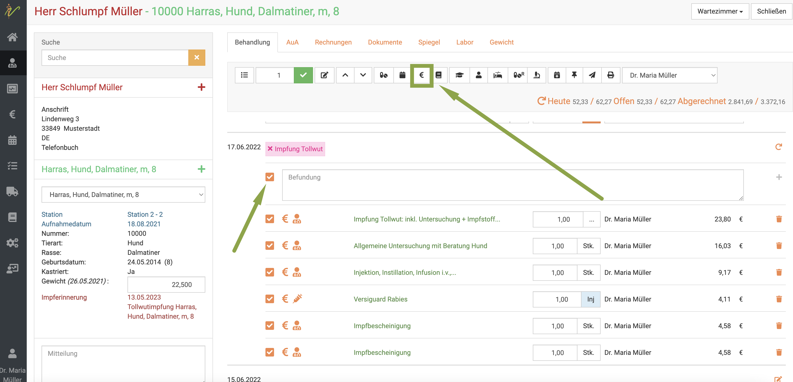
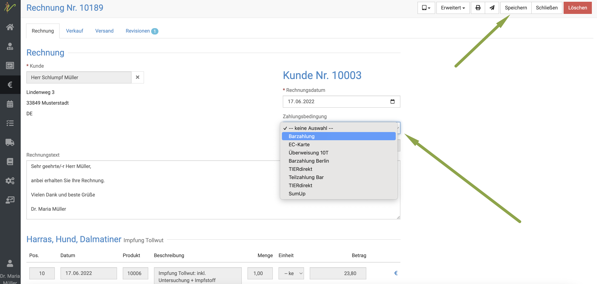
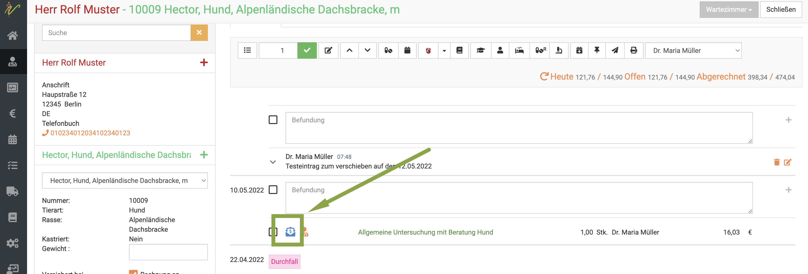
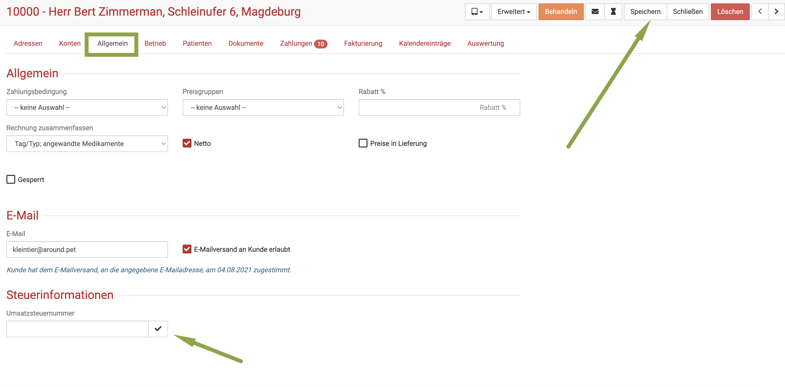
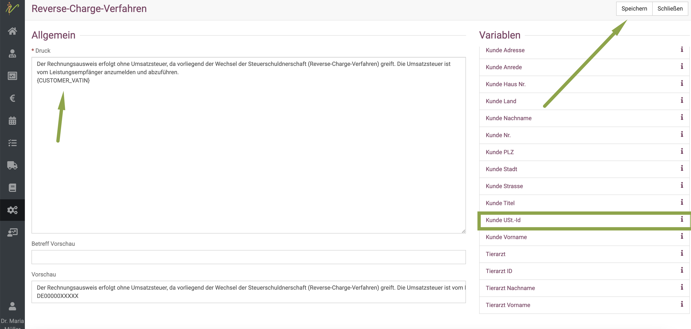
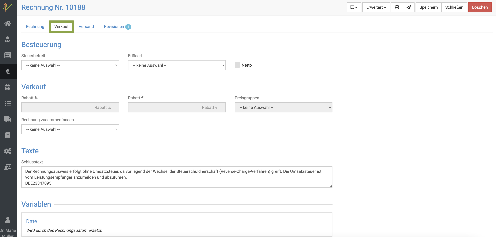
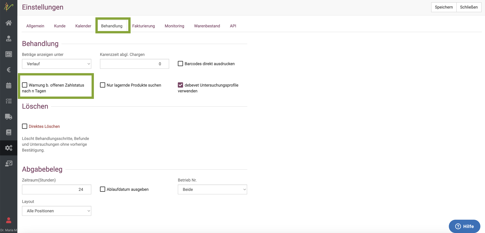

 # Rechnungen 

Hier finden Sie alle wichtigen Punkte zum Thema Rechnungen, Gutschriften und Angebote.

## Rechnungen erstellen  

Um Behandlungen abzurechnen, markieren Sie mit einem Klick auf den Haken oben alle **Checkboxen** des Behandlungstages.
Anschließend klicken Sie oben auf das **Euro Symbol**, um die Posten in die Rechnung zu bringen.

:::tip Tipp  

Wenn Sie keine Checkboxen setzen, werden ALLE noch nicht abgerechneten Posten des Patienten, auch aus der Vergangenheit, mit auf die Rechnung gesetzt.  

:::

## Zahlungsart wählen  

Wenn Sie in der nun automatisch geöffneten Rechnungsansicht den Dropdownpfeil bei **Zahlungsart** klicken, können Sie die für Ihre Praxis hinterlegen
Zahlungsarten auswählen. Klicken Sie anschließend auf **Speichern**.  

     

:::tip Tipp  

So lange die Rechnung noch nicht gebucht ist, können Sie die Zahlungsart noch ändern!  

:::  

## Rechnung direkt an den Kunden mailen  

Wenn Sie am Kunden eine Email Adresse hinterlegt und den Haken bei "Email Versand erlauben" gesetzt haben, können Sie nun auf das
**Mail Symbol** oben klicken und damit die Rechnung direkt an den Kunden mailen, um die Umwelt zu schonen und Papier zu sparen.

## Rechnung drucken  

Natürlich können Sie die Rechnung auch direkt drucken, wenn der Tierhalter dies wünscht. Klicken Sie dazu auf das **Drucker Symbol**.  

## Rechnung buchen  

Um die Rechnung zu buchen, klicken Sie oben auf **Erweitert** und dann **Rechnung buchen**.   

  

Nun ist die Rechnung festgeschrieben und muss für weitere Veränderungen zuerst storniert und dann neu erstellt werden!

### Probleme bzw. Fehlermeldung bei der Buchung 

Teilweise kann es vorkommen, dass Sie beim Verbuchen der Rechnungen eine Fehlermeldung bekommen. Dies tritt vor allem dann auf, wenn 
* ein Posten 0.00% Mwst hat
* ein Posten mit 0.00 Euro eingetragen ist  

Dies kommt dann vor, wenn Sie selbst angelegte Produkte nutzen, bei denen Sie entweder keinen Preis hinterlegt haben oder keine Mwst.  

Um die Rechnungsposten zu prüfen, gehen Sie bitte wie folgt vor:  

Gehen Sie in die Detailansicht der enstprechenden Rechnung. Hierfür gibt es mehrere Wege:
* Klicken Sie Rechnungen und dann in der Spalte "Rechnungsnummer" auf die Rechnungsnummer 

  

* Klicken Sie in der Behandlung auf ein beliebiges blaues Euro Symbol an einem der Abrechnungsposten   

   

Nun öffnet sich die Detailansicht der Rechnung. Hier gibt es erneut ein **blaues Euro-Symbol** an jedem der Abrechnungsposten. 
Klicken Sie auf dieses, um die Ansicht zu erweitern, und den Mehrwertsteuersatz des jeweiligen Postens zu sehen. 

  

  

Wenn Sie nun am Mwst. Satz auf den Dropdownpfeil klicken, können Sie diesen ändern. Klicken Sie dann anschließend oben rechts auf **Speichern**. 
Anschließend kann die Rechnung verbucht werden.

  

Sollten Sie Rechnungen mit 0,00 Euro Posten enthalten haben, müssen Sie zunächst die Rechnung stornieren, das Produkt verändern oder
aus der Behandlung löschen und dann erneut eintragen. Die Rechnung muss dann erneut erstellt werden und sollte nun problemlos verbucht werden.

## Rechnungen automatisch buchen lassen  

Wenn Sie den Schritt sparen möchten, Rechnungen manuell auf "gebucht" setzten zu müssen, können Sie debevet so einstellen, dass direkt
mit Versand oder Druck jede Rechnung automatisch auf "gebucht" gesetzt wird.   

Klicken Sie hierzu **Administration** und dann **Einstellungen**. Klicken Sie dann den Reiter **Fakturierung** und setzen dort ganz unten den
Haken bei **Buchung verpflichtend**. (Abschnitt "Druck")  

  

## Rechnungsposten zusammenfassen  

Sie haben am Kunden direkt die Möglichkeit, seine Rechnungen zusammenzufassen. So werden die Rechnungen gekürzt, um nicht zu lange
und unübersichtliche Rechnungen zu erstellen.  

Klicken Sie unter **Praxis** und **Kunden** auf den Namen des Kunden, so dass Sie in die Detailansicht seiner Daten gelangen. Klicken Sie nun den Reiter **Allgemein**.

Hier können Sie beispielsweise dem Kunden auch eine Preisgruppe zuordnen oder ihm einen festen Rabatt eintragen (in Prozent). Auch die Zahlungsbedingungen des Kunden 
können Sie hier einzeln ändern (abweichend von den global für Ihre Praxis gesetzen).  

Um die Rechnungen zusammen zu fassen, klicken Sie den **Dropdown-Pfeil** bei "Rechnung zusammenfassen". Nun können Sie aus drei Optionen wählen:  

* Nur angewandte Medikamente 
* Tag/Typ 
* Tag/Typ, angewandte Medikamente  

:::tip Tipp  

Denken Sie daran, dass diese Option selbstverständlich VOR der Erstellung der Rechnung gewählt sein muss.  

:::  

## Sammelrechnungen erstellen

Sie möchten für einen Kunden bzw. Besitzer für mehrere Tiere bzw. Patienten eine einzige Rechnung erstellen, also alle offenen Posten +auf einer Sammelrechnung drucken? 
Sie möchten bei einem (oder mehreren) Kunden alle noch nicht abgerechneten Posten abrechnen. 

Hierfür gibt es zwei Wege: 

### 1. Über den Kunden unter "Auswertungen"

Klicken Sie hierzu in Ihrer Behandlung direkt auf den Kundennamen links.   

Alternativ rufen Sie den Kunden über die Kundeliste auf.  

  

Nun klicken Sie auf den Reiter "Auswertungen".  
Dort sehen Sie einen Überblick über die offenen Posten der verschiedenen Tiere und die gesamten offenen Posten.  

Klicken Sie auf den **grünen Button "Abrechnen"**. Es öffnet sich direkt die Rechnungsvorschau, in der Sie wie gewohnt die Zahlungsbedingung
setzen können und die Rechnung dann speichern und versenden/drucken können. 

Der Unterschied ist nun nur, dass alle offenen Posten verschiedener Tiere auf der Rechnung stehen.

### 2. Über die Behandlungen

Klicken Sie hierzu auf **Praxis** und dann **Behandlungen**.

Sie sehen die ungefilterte Liste Ihrer Behandlungen. Klicken Sie nun neben der Suchleiste auf den Dropdown Pfeil, um die Behandlungsliste zu filtern.
Wählen Sie die Checkboxen bei **Rechnung ausstehend**, um alle Behandlungen bzw. Karteien anzuzeigen in denen für denen
noch nicht fakturierte Positionen existieren.

Wenn Sie zusätzlich die Checkbox  **Kunde** ankreuzen, werden die Beträge der noch nicht fakturierten Behandlungen bzw.
Karteien eines Kunden summiert. Drücken Sie nun **Enter** oder klicken das **Lupen-Symbol**, um den Filter anzuwenden.

Wählen Sie nun die Checkboxen der gewünschten Behandlungen (Wenn Sie den Haken bei Kunde gesetzt hatten, sind diese bereits an dem Kunden
zusammen gefasst und Sie müssen die Checkbox des Kunden anhaken) an und drücken oben rechts auf das **€-Symbol**, um die gewählten
Behandlungen abzurechnen. 

Die Rechnungen werden erzeugt und liegen anschließend unter **Fakturierung** - **Rechnungen** vor.

## Rechnungen korrigieren/ stornieren/ löschen

Um Rechnungen zu korrigieren, müssen Sie diese immer zunächst stornieren und dann neu ausstellen.

Zunächst öffnen Sie die gewünschte, zu stornierende Rechnung. Dafür gibt es zwei Wege:

* Klicken Sie auf **Fakturierung** (Euro Symbol) und dann **Rechnungen** und suchen dort nach der Rechnung (z.B. über Kundenamen) und 
klicken dann auf die Rechnungsnummer, um zur Rechnungsansicht zu gelangen    
* Klicken Sie in der Behandlung an der gewünschten Rechnung am Behandlungstag das **blaue Rechnungssymbol** (Brief)  

Nun öffnet sich die Rechnungsansicht. In der Rechnungsansicht klicken Sie nun oben rechts **Erweitert** und wählen im 
Dropdown dann **Rechnung stornieren**.  

  

Es öffnet sich ein Fenster, in dem Sie die Stornierung nun bestätigen müssen.  

  

Anschließend klicken Sie in der Ansicht oben rechts noch einmal den roten Button **Löschen**.
Bestätigen Sie die Löschung.  

  
 
Wenn Sie nun erneut in die Behandlung wechseln, indem Sie oben rechts auf **Schließen** klicken, sind die Behandlungs/Medikamtenposten, die Sie
abgerechnet hatten, wieder freigegeben, um verändert oder einzeln gelöscht zu werden.  

### Gelöschte Rechnungen anzeigen  

Um sich gelöschte/stornierte Rechnungen anzeigen zu lassen, klicken Sie auf **Fakturierung**(Euro-Symbol) und dann **Rechnungen**. 
Klicken Sie den Dropdown-Pfeil neben dem Suchenfeld. Setzten Sie dann den Haken bei **Gelöschte anzeigen** und bestätigen mit der **Entertaste** oder Klick auf 
das **Lupen-Symbol**. 

Nun sehen Sie rot hinterlegt die stornierten Rechnungen.  

:::danger ACHTUNG  

Gelöschte Rechnungen können und DÜRFEN nicht wieder herstellt werden! Deswegen gibt es diese Funktion nicht. Wenn Sie die Rechnung nun doch
genauso benötigen, wie ursprünglich ausgestellt, müssen Sie diese NEU ausstellen.  

:::  

## Reverse-Charge Rechnungen  

Die Kollegen unter Ihnen, die in Grenzgebieten arbeiten, benötigen evtl. diese Funktion, wenn Ihren Kunden eine internationale 
Umsatzsteuer ID haben, damit Sie die Rechnungen ohne Mehrwertsteuer ausstellen können und der Kunde die Mwst. dann in seinem eigenen Land angeben kann. 

:::danger ACHTUNG  

Bitte beachten Sie, dass die Rechnungen nur dann korrekt sind, wenn Sie selbst Ihre Umsatzsteuer ID in den Praxisdaten hinterlegt haben,
so dass diese auf Ihren Rechnungen mit aufgedruckt wird.  

:::

## Steuer ID am Kunden hinterlegen

Zunächst müssen Sie den Kunden aufrufen. Klicken Sie dann den Reiter **Allgemein** und tragen dann die Umsatzsteuer ID des Kunden
im passenden Feld ein. Anschließend müssen Sie mit Klick auf den **Haken** die Eingabe übernehmen. Erst danach oben rechts auf **Speichern** klicken.  

:::danger ACHTUNG   

Bedenken Sie, dass Sie vor Ausstellung von Reverse Charge Rechnungen verpflichtet sind, jede Umsatzsteuer ID Ihres Kunden selbst auf 
Gültigkeit zu prüfen! Hierfür gibt es spezielle Online Portale.  

:::  

### Reverse-Charge Textbaustein anlegen  

Damit der entsprechende Vermerk wie vorgeschrieben auf die Rechnung gedruckt wird, müssen Sie diesen zunächst in den Textbausteinen anlegen.
Klicken Sie auf **Administration**(Zahnradsymbol) und dann **Textbausteine**.  

  

Scrollen Sie dann herunter und klicken auf die Schrift "Reverse-Charge-Verfahren". Dort fügen Sie nun den Text ein, den Sie nutzen wollen.
Hier ein Beispieltext (ohne Haftung für gesetzliche Korrektheit):   

*Der Rechnungsausweis erfolgt ohne Umsatzsteuer, da vorliegend der Wechsel der Steuerschuldnerschaft (Reverse-Charge-Verfahren) 
greift. Die Umsatzsteuer ist vom Leistungsempfänger anzumelden und abzuführen.*   

Anschließend müssen Sie noch einen **Platzhalter** einfügen, damit die Umsatzsteuer ID des Kunden automatisch in die Rechnung eingefügt wird.  

Wählen Sie dazu rechts aus der Liste **Variablen** den Punkt **Kunde Ust.-ID**. Der PLatzhalter wird dann oben hinzugefügt. 
Klicken Sie dann auf **Speichern**.  

   

## Reverse-Charge Rechnung erstellen  

Um die Rechnung nun als Reverse-Charge Rechnung zu erstellen, erstellen Sie die Rechnung wie gewohnt mit Klick auf das **Euro--Symbol**.   

Allerdings müssen Sie nun zunächst auf den Reiter **Verkauf** klicken. 

  

HIer wählen Sie nun am Dropdown **Steuerbefreit** den Punkt **Reverse-Charge_Verfahren**.

Dann wählen Sie am Dropdown **Erlösart** den Punkt **innergemeinschaftliche Lieferung**.  

  

Klicken Sie auf **Speichern** und fahren mit der Abrechnung/Zahlung nun wie gewohnt fort.

## Rechnung als bezahlt setzen  

Damit der Rechnungsstatus auf "bezahlt" gesetzt wird, vor allem bei Rechnungen, die überwiesen werden, müssen Sie diesen selbst setzen.  

:::caution Achtung  

Wir empfehlen, in den Einstellungen der Buchhaltung die Rechnungen bei Zahlung via EC-Karte und Barzahlung so einzustellen, dass diese 
direkt auf "Erledigt" gesetzt werden. Damit stehen diese dann automatisch auf "bezahlt".  

:::  

Klicken Sie auf **Fakturierung** und dann **Rechnungen**. In der Rechnungsliste können Sie anhand der farbigen Symbole direkt sehen,
welche Rechnungen "gebucht" sind (gelbes Symbol), welche "noch zu buchen" sind (rotes Symbol) und welche bereits bezahlt sind (grünes Symbol).  

  

Wenn Sie es so eingestellt haben, dass nur die Zahlungen via Überweisung auf "gebucht (und nicht "erledigt") gesetzt sind, können Sie sich 
diese nun in der Suche heraus filtern, um effizienter zu arbeiten.  

Klicken Sie hierzu auf den **Dropdown-Pfeil** neben dem Suchenfeld. Setzen Sie dann in der Auswahl bei **Zahlungsbedingung** z.B. auf 
"Überweisung 10 Tage".  

  

Auch können Sie den Filter setzen auf Status "gebucht". Nun klicken Sie eine bereits gebuchte Rechnung (gelbes Symbol) an und öffnen diese durch Klick auf die Rechnungsnummer.  

  

Anschließend klicken Sie oben rechts auf **Erweitert** und wählen dort **Zahlung erfassen**.  

  

Nun wählen Sie, wo diese Zahlung eingegangen ist (meistens dann ja Bankkonto). Klicken Sie dann den **grünen Button Zahlung erfassen** und die Rechnung ist
dann auf "erledigt/bezahlt" gesetzt.  

## Offene Rechnungen - offene Posten am Kunden

Leider ist es mit der Zahlungsmoral mancher Kunden nicht immer ideal gestellt, was leider eine Notwendigkeit erzwingt, direkt 
sehen zu können, ob beim Kunden offene Zahlungen vorliegen.

Um direkt in der Behandlung (und nicht nur in der Übersicht der Zahlungen am Kunden) eine Warnung zu sehen, müssen Sie diese zunächst in den Einstelungen aktivieren.

Klicken Sie **Administration** und dann **Einstellungen**. Dort wählen Sie den Reiter **Behandlung**  

  

Setzen Sie das Häkchen bei **Warnung b. offenem Zahlstatus**. Klicken Sie anschließend oben rechts auf **Speichern**.  

Wenn Sie nun ein Tier behandeln, wird Ihnen am Kundennamen links eine rote Zahl angezeigt, welche patientenübergreifend offene Rechnungen anzeigt.  

