# GOT Nutzung in debevet  

Generell bietet die debevet Software Ihnen die Möglichkeit, den GOT Faktor bzw. GOT Satz für Ihre Praxis individuell und global zu hinterlegen.

Außerdem kann dann auch immer individuell in der Behandlung der Satz für alle oder einzelne Positionen geändert werden-

Zur Einführung der neuen GOT bietet debevet ab Oktober 2022 (Gültigkeit der neuen GOT ist der 22.11.2022!) auf mehrfachen Kundenwunsch
nun die Möglichkeit, für jeden einzelnen GOT-Posten einen eigenen Gebührensatz Faktor (kurz Faktor) zu hinterlegen.

Da die GOT mit der Neuerung einige Abweichungen bringt, die evtl. bei der Nutzung eines pauschalen Faktors zu sehr ungewöhnlichen Summen führen können, können Sie
also bei einzelnen Positionen den Faktor abweichend hinterlegen, damit dieser also höher oder niedriger ist, als Ihr global gesetzter Faktor.

:::tip Dabei gilt: 

Sie setzen Ihren Faktor weiter global unter **Administration** **Einstellungen** und **Fakturierung**. 
Dieser wird an allen Posten genutzt, solange Sie keinen abweichenden Faktor hinterlegen.  

:::

## Neue GOT 2022 importieren

:::caution  ACHTUNG!

Die alte GOT wird nicht automatisch gelöscht, wenn Sie die neue importieren! Wann Sie die alte GOT löschen bleibt Ihre Entscheidung, auch dies
muss proaktiv durch Sie selbst erfolgen. In welchem zeitlichen Abstand Sie das erledigen, ist Ihnen selbst überlassen!  

:::  

Um die neuen GOT zu importieren, klicken Sie auf **Warenwirtschaft** und dann **Kataloge**. 

Dort klicken Sie bei GOT 2022 auf den Pfeil. 

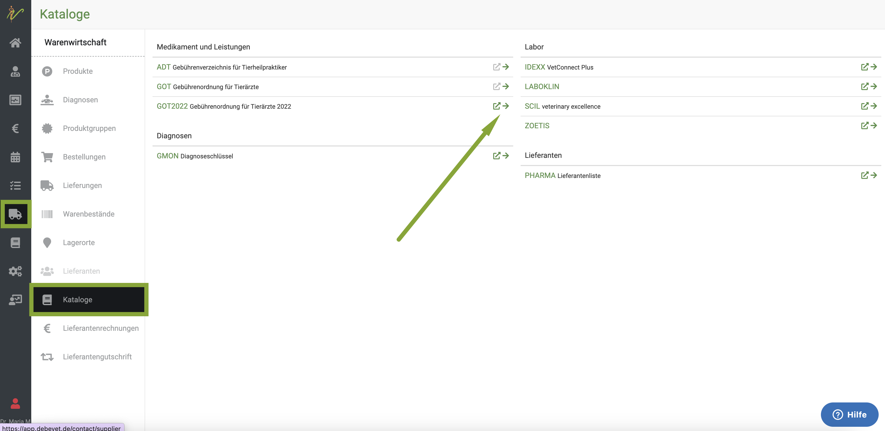  

Nun sehen Sie eine Auflistung ALLER Posten der neuen GOT. Dabei ist vor den bereits importierten ein kleines Link-Symbol und vor
den noch nicht importierten nur ein Kästchen.  

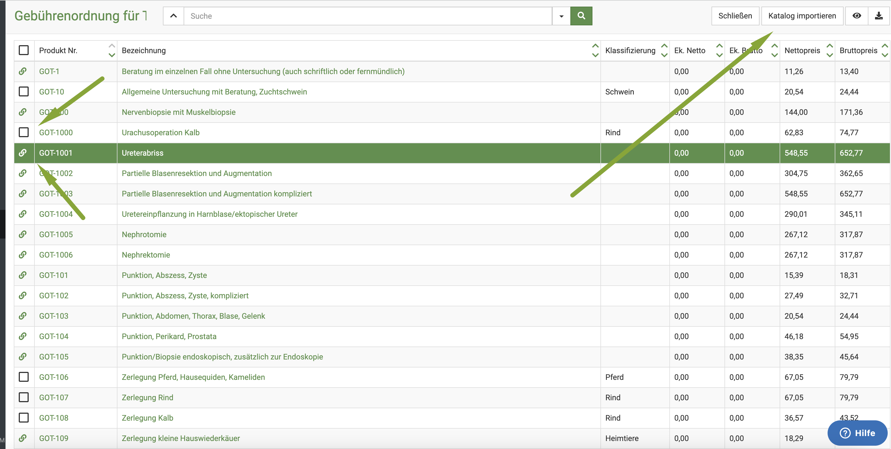  

Sie klicken oben rechts auf **Katalog importieren**. Nun öffnet sich ein Fenster, in dem Sie wählen können, für welche Tierarten Sie die den Katalog benötigen.  

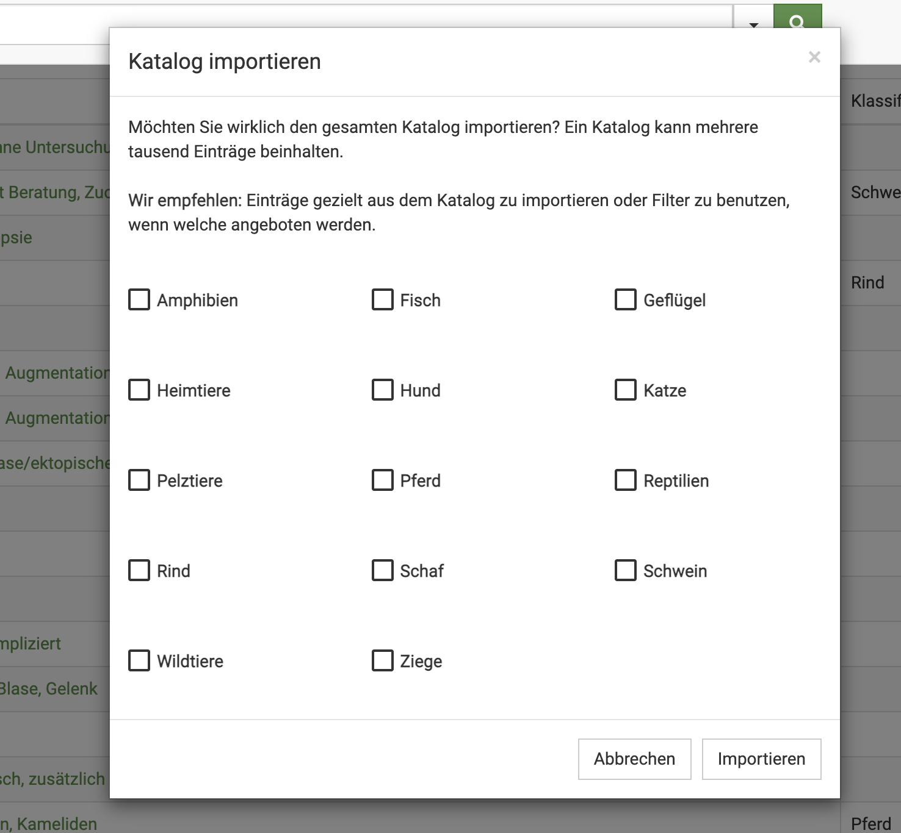

Wählen Sie mit den Checkboxen, welche Tierarten Sie importieren möchten und klicken Sie dann **importieren**. Nun sind die neuen Posten 
in Ihrer Praxis im Produktkatalog und können genutzt werden.

Hier zeigen wir in einem Video, wie Sie sich die neue GOT (gültig ab 22.11.2022) importieren können:

:::info Videotipp

<iframe width="560" height="315" src="https://www.youtube.com/embed/fqbn3z5Ha5o" title="YouTube video player
" frameborder="0" allow="accelerometer; autoplay; clipboard-write; encrypted-media; gyroscope; picture-in-picture" allowfullscreen></iframe>  

::: 

## GOT Satz/Faktor global einrichten 

Um den Faktor, der generell für die GOT Leistungen verwendet werden soll zu hinterlegen, gehen sie wie folgt vor:  

Klicken Sie **Administration** (Zahnradsymbol) und dann **Einstellungen**. Dort klicken Sie den Reiter **Fakturierung** und scrollen 
herunter bis zum Feld **Faktor**. Dort setzen Sie den gewünschten Faktor und klicken oben rechts auf **Speichern**.

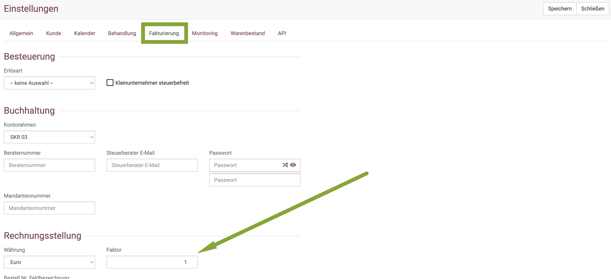

## GOT Satz/Faktor in individueller Behandlung ändern 

Sie können den global für Ihre Praxis gesetzten Faktor im Bedarfsfall in der Behandlung herauf- bzw. heruntersetzen.

Entweder geben Sie den Faktor an der Behandlung vor dem Eintragen der Postionen ein, dann werden alle Leistungen jeweils mit Faktor,
der zum Zeitpunkt des Eintrags hier steht, multipliziert.

:::caution Achtung

Die Eingabe muss durch einen Klick auf den Haken neben dem Faktor aktiv gesetzt werden.

:::

Möchten Sie nur einzelne Positionen der Behandlung im Faktor erhöhen, markieren Sie diese mit der Checkbox, ändern dann den Gebührenfaktor und 
klicken den grünen Haken.

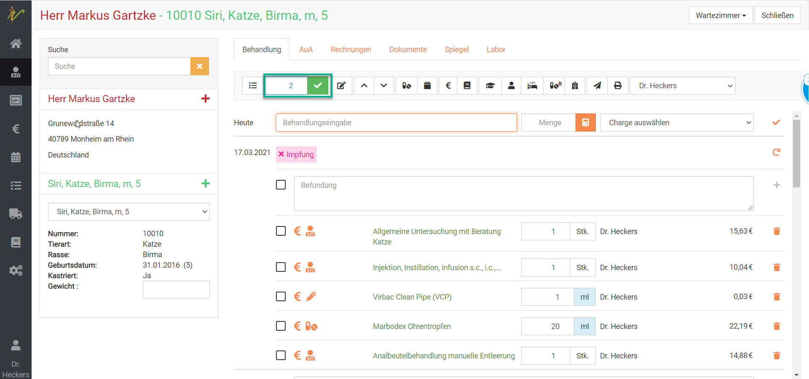

So können an einem Kunden unterschiedliche GOT Faktoren/Sätze verwendet werden, entweder ein Faktor für alle Positionen, oder verschiedene
Faktoren für verschiedene Positionen.  

## Abweichenden Faktor für eine Leistung hinterlegen

Um an einzelnen Leistungen nun pauschal einen abweichenden Faktor zu hinterlegen, rufen Sie im Produktkatalog die gewünschte Leistung auf:

Klicken Sie **Warenwirtschaft** (LKW- Symbol) und dann **Produkte**. 

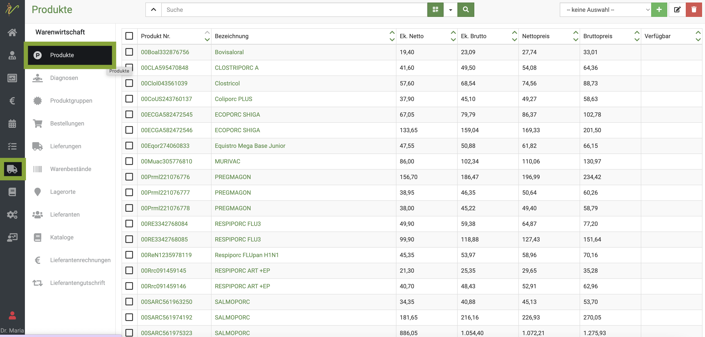  

Geben Sie nun im Suchenfeld die gewünschte Leistung ein und klciken auf das **Lupen-Symbol** oder drücken die **Enter-Taste**.
In der Tabelle klicken Sie dann auf die Bezeichnung der gewünschten Dienstleistung. Nun öffnet sich die Detailansicht.

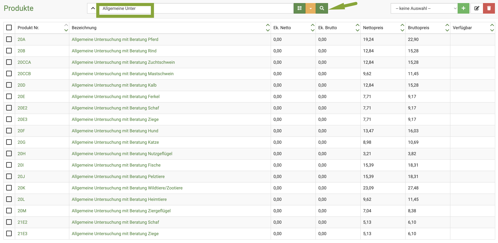  

In der Detailansicht der Leistung sehen Sie nun das Feld **abweichender Faktor**. Dort können Sie eintragen, wie Sie den Gebührensatz abrechnen wollen.  
Klicken Sie anschließend oben rechts auf **Speichern**.

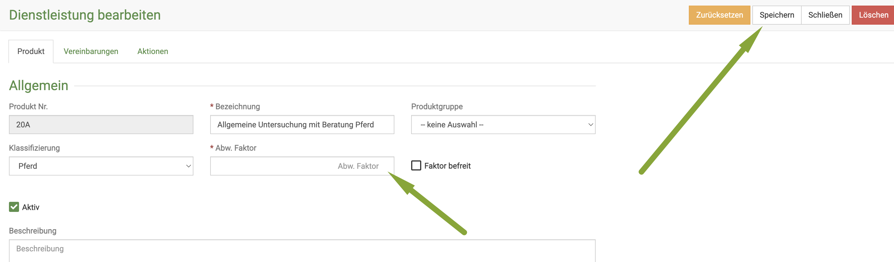 

:::caution Hinweis:  

Dieser Faktor steht nun "hierarchisch" über Ihrem global gesetzten Faktor. Wenn Sie also in einer Behandlung diese Leistung 
eingeben, wird automatisch dieser Faktor genutzt. 

Die höchste "Hierarchie" hat aber immer das Behandlungsfeld mit dem GOT Faktor. Wenn Sie dort einen abweichenden Satz eintragen, wird 
immer dieser genutzt. Wichtig auch bei Notdiensten!  

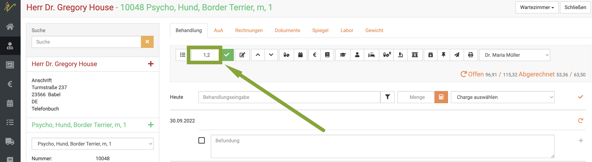  

:::  

:::info Videotipp:   

<iframe width="560" height="315" src="https://www.youtube.com/embed/amu9aEVgs8c" title="YouTube video player
" frameborder="0" allow="accelerometer; autoplay; clipboard-write; encrypted-media; gyroscope; picture-in-picture" allowfullscreen></iframe>

:::  

:::tip Tipp:

Es ist möglich, den erhobenen Gebührensatz/ -faktor mit auf die Rechnung zu drucken, wenn Sie dies wünschen. Mehr Informationen dazu
finden Sie unter Layouts.  

[Layout Rechnungen](https://handbuch.debevet.de/docs/Administration/Layouts#rechnungen-layout)   

:::

## Übergang alte und neue GOT

Wenn Sie die alte GOT komplett von Ihrem System löschen wollen, zeigen wir Ihnen hier in einem Video, wie Sie dies erledigen können:

:::info Videotipp: Alte GOT löschen

:::

Aktuell können Sie die neuen und alten Posten anhand der Buchstaben "GOT" voneinander unterscheiden. Die Posten mit **GOT** davor sind die neuen GOT Posten.

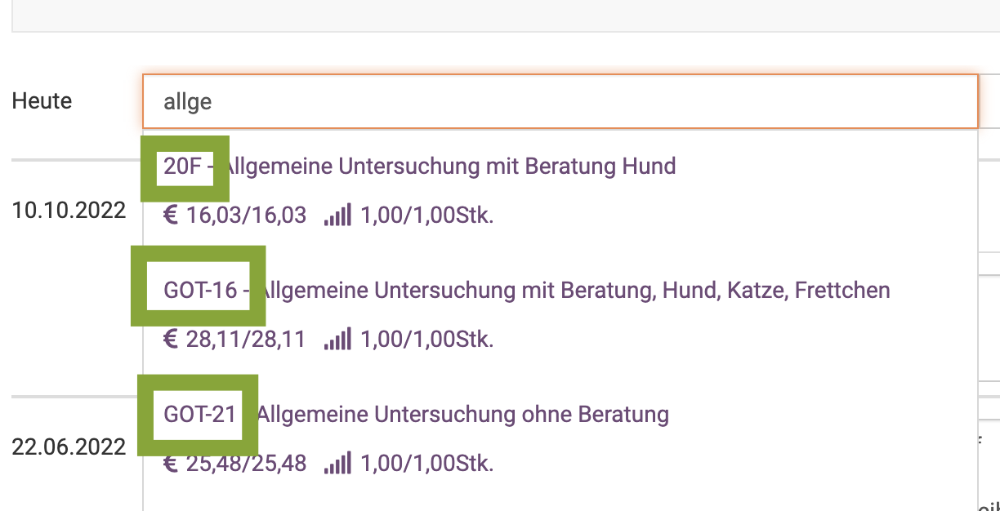

## Zeitfaktor in der GOT    

Viele von Ihnen suchen den früher vorhandenen "Zeitfaktor". Dieser wurde bereits in der GOT Neufassung von 2020 aus der GOT entfernt. Er
ist auch in der Neufassung 2022 nicht vorhanden und kein offizieller GOT Posten.

Auf dem Vortrag zur neuen GOT 2022 hat Dr. Thomas Steidl (Vorsitzender der AdHoc-AG GOT von BTK / bpt und stellvertretender 
Vorsitzender des ehemaligen BTK-Ausschusses Gebühren) erklärt, dass es möglich ist, einen Posten zu erstellen, der mit 2,25 Euro pro Minute 
im einfachen Satz genutzt wird. 
Es wäre also evtl. eine Option, diesen mit §8 GOT (außerordentliche Leistungen) zu nutzen.

Um dies zu nutzen, erstellen Sie unter **Produkte** eine neue Dienstleistung und benennen diese passend. Als Standard Preis hinterlegen Sie dann die
2,25 Euro pro Minute netto.  

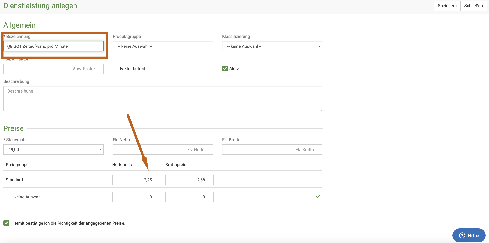

## Vorlagen in der Übergangszeit erstellen 

Sie möchten Ihre Vorlagen schon mit der neuen GOT erstellen, aber die alten Vorlagen noch nutzen? Kein Problem! Gehen Sie wie folgt vor:  

1. Neue GOT importieren und alte noch bestehen lassen
2. Erstellen Sie eine Vorlage, die Sie genauso benennen wie die alte, nur mit dem Wort "NEU" dahinter
3. Fügen Sie die gewünschten neuen GOT Posten ein, achten Sie dabei darauf, dass Sie neue Posten am GOT-Präfix erkennen
4. Nutzen Sie ab dem 22.11. die neuen Vorlagen
5. Löschen Sie am dem 22.11. die alten Vorlagen

Wenn Sie möchten, entfernen Sie dann noch das Wort "NEU" aus der neuen Vorlage, sobald die alte gelöscht ist.

