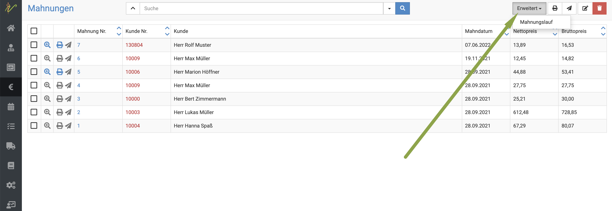
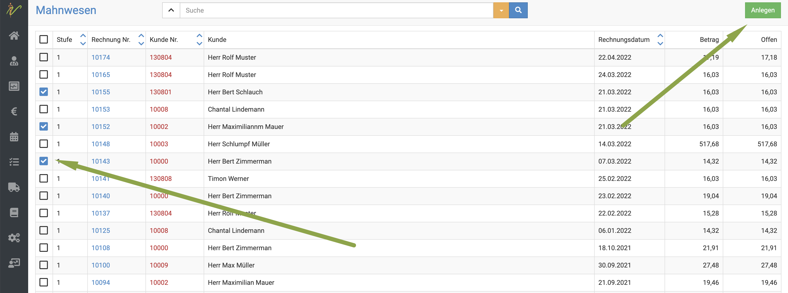
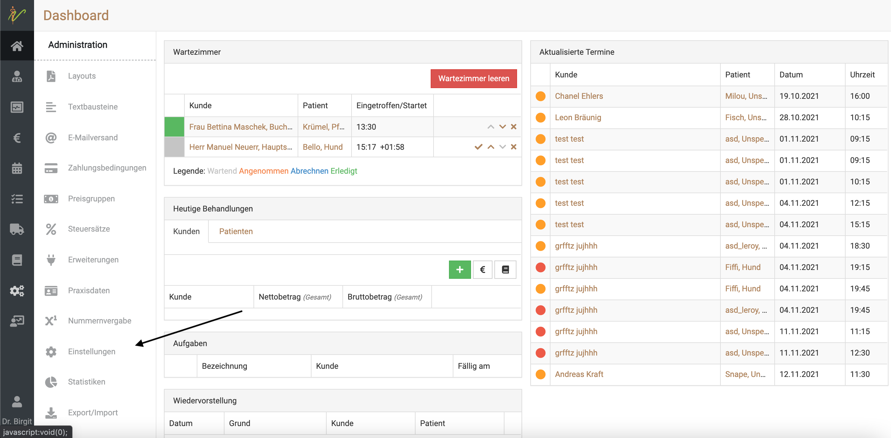
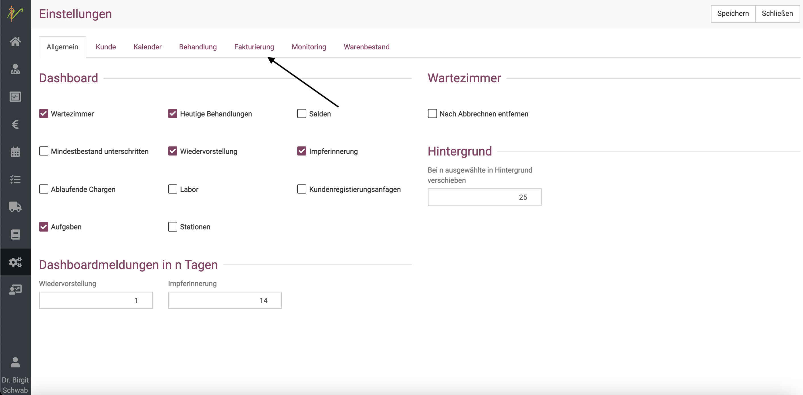
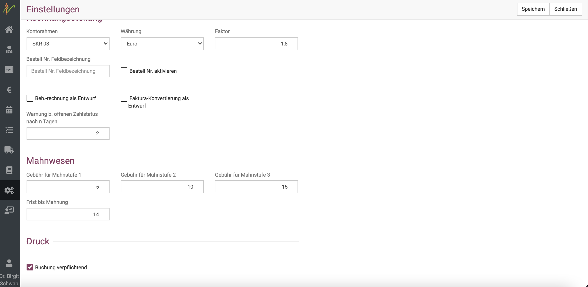
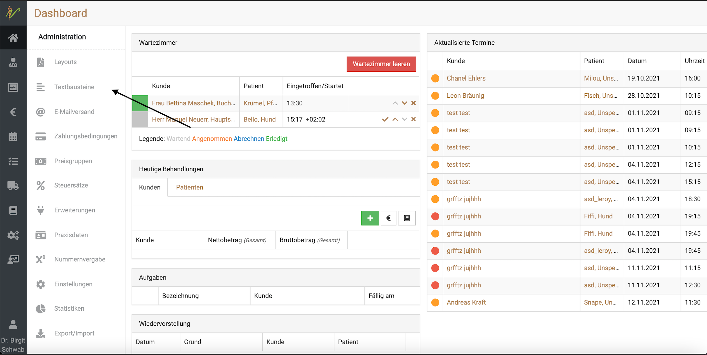
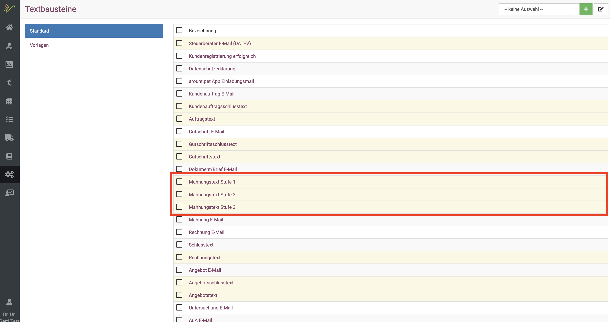
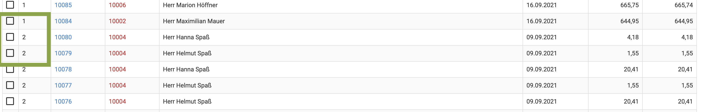

# Mahnungen

Hier zeigen wir Ihnen, wie Sie den Mahnlauf in debevet verwalten.  

:::tip Tipp  

Für Nutzer von Collmex empfehlen wir aufgrund des weitaus größeren Funktionsumfangs das Mahnwesen aus der Collmex-Anwendung. 

:::  

## Mahnungen erstellen  

:::caution Hinweis:

Nur bereits gebuchte Rechnungen (in der Rechnungsübersicht "gelb") werden bei der Erstellung von Mahnungen berücksichtig. Prüfen Sie also bitte 
immer,   

:::  

Klicken Sie auf **Fakturierung** (Euro Symbol) und dann **Mahnungen**. Wenn Sie diese Funktion noch nie genutzt haben, erscheinen
hier zunächst keine Mahnungen aufgelistet.  

Klicken Sie zum erstellen des Mahnlaufes oben rechts auf **Erweitert** und dann **Mahnungslauf**. 

  

Dann öffnet sich eine Liste mit all Ihren offenen Posten. Durch aktivieren der **Checkboxen** wählen Sie aus, welche in den 
Mahnlauf übernommen werden sollen und klicken dann oben rechts auf **Anlegen**.

  

Klicken Sie **schließen** oben rechts, um zurück zu der Mahnungsübersicht zu gelangen.
Klicken Sie **schließen** oben rechts, um zurück zu der Mahnungsübersicht zu gelangen.

## Mahnstufen konfigurieren/ Mahngebühren festlegen

Wichtig ist, dass Sie die Einstellungen für die Mahnungen im Bereich **Administration** (Zahnradsymbol)
über **Einstellungen** in dem Reiter "Fakturierung" vornehmen und Daten für die Mahnstufen und die Frist bis zur Mahnung hinterlegen.  

:::caution Achtung: 

Sie müssen für jede Mahnstufe eine Mahngebühr eingeben bzw. hinterlegen, damit das Erstellen von Mahnungen funktioniert. Dabei können 
Sie auch die Zahl "0" eintragen, aber es muss eine Zahl eingetragen werden.   

:::  

  

  

  

## Mahnungstexte anlegen  

Über **Administration** können Sie unter **Textbausteine** auch noch die Mahnungstexte für die entsprechenden Stufen hinterlegen.  

  

  

## Mahnstufe erhöhen  

Wenn Sie eine erste Mahnung an den Kunden geschickt haben und die Frist zur Zahlung verstrichen ist, finden Sie die Mahnung/Rechnung 
in der entsprechenden nächsten Stufe wieder im Mahnungslauf.  
Klicken Sie also wieder **Fakturierung** und **Mahnungen**, um dann oben rechts auf **Erweitert** den Mahnungslauf zu öffnen.  

Bei weiter nicht gezahlten Rechnungen (wenn Sie also keine Zahlung eingegeben haben) sehen Sie anhand der Spalte "Stufen" die Mahnstufe.  

Wenn Sie die gewünschten Rechnungen/Mahnungen mit aktivieren der **Checkbox** markieren und dann **Anlegen** klicken,
wird die nächste Mahnstufe nun erstellt.  

In der Liste der Mahnungen können Sie diese dann wie zuvor verschicken.  

  

