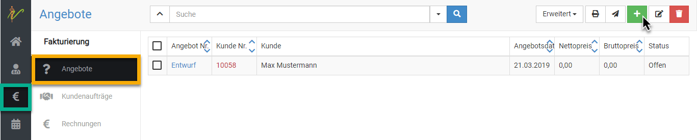
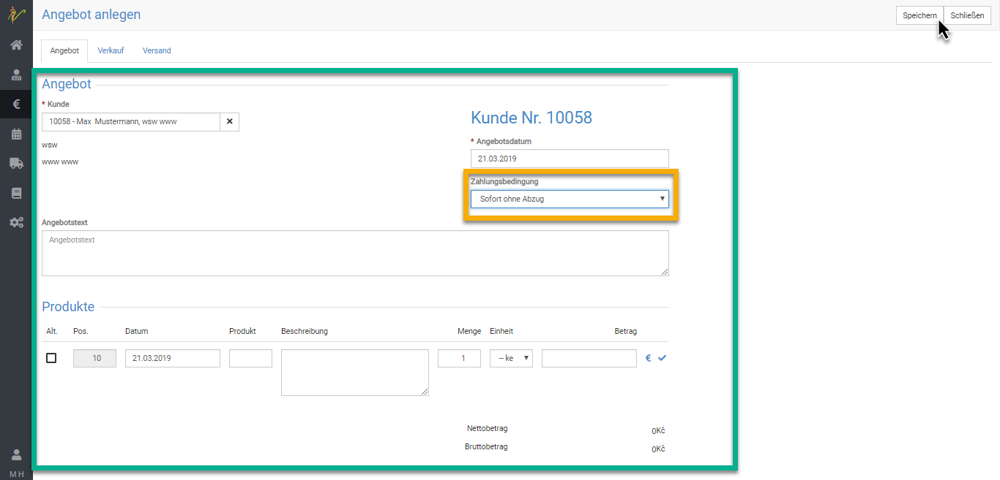
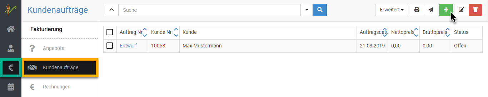
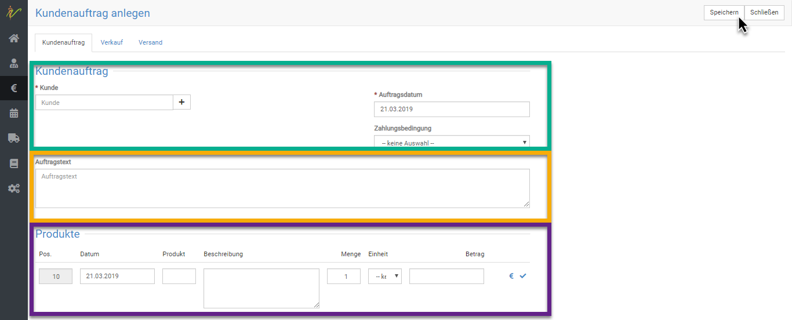

# Angebote und Kundenaufträge

Wenn Sie wollen, können Sie Ihren Kunden Angebote schicken, welche diese dann annehmen können und 
damit einen Kundenauftrag erteilen

## Angebot anlegen  

Klicken Sie **Fakturierung** und dann **Angebote** . Dort klciken Sie auf das **grüne Plus-Symbol**. Es öffnet sich ein neues Fenster "Angebot anlegen". Wählen Sie unter
"Kunde" den passenden Kunden aus oder fügen Sie einen neuen Kunden hinzu. Als Angebotsdatum wird das 
aktuelle Datum ausgewählt. Sie können dieses Datum aber auch ändern.

Wählen Sie die passende Zahlungsbedingung aus und erstellen Sie einen passenden Angebotstext.

Unter Produkte können Sie ein Medikament oder ein anderes Produkt auswählen, 
für das Sie das Angebot stellen möchten. Hier haben Sie auch die Möglichkeit, die Beschreibung und 
die Einheit des Produktes einzutragen.  

  

  

## Kundenauftrag anlegen 

Einen neuen Kundenauftrag legen Sie an, indem Sie auf das **grüne Plus-Symbol** unter Kundenaufträge klicken.
Es öffnet sich daraufhin ein neues Fenster. Hier können Sie entweder durch Eingabe das Namens
zum bereits registrierten Kunden gelangen oder mit Betätigen des **Plus-Symbols** einen neuen 
Kunden hinzufügen.

Als Auftragsdatum ist das aktuelle Datum vorausgewählt. Sie können es aber auch vor- oder zurückdatieren.

Geben Sie nun den gewünschten Auftragstext für Ihren Kundenauftrag ein.

Anschließend wählen Sie die gewünschte Zahlungsbedingung aus und geben unter Produkte die Eckdaten zum Produkt bzw. Präparat ein. 

 

