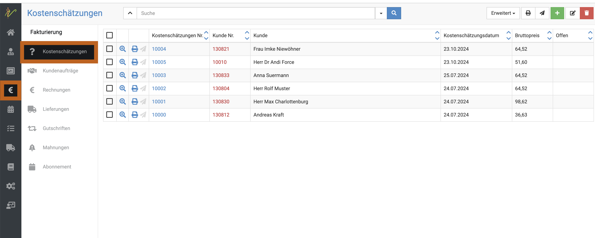
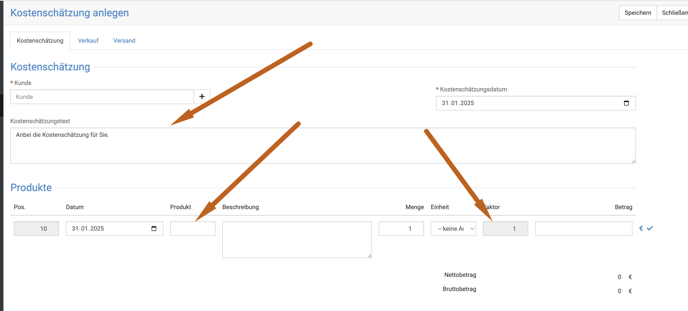
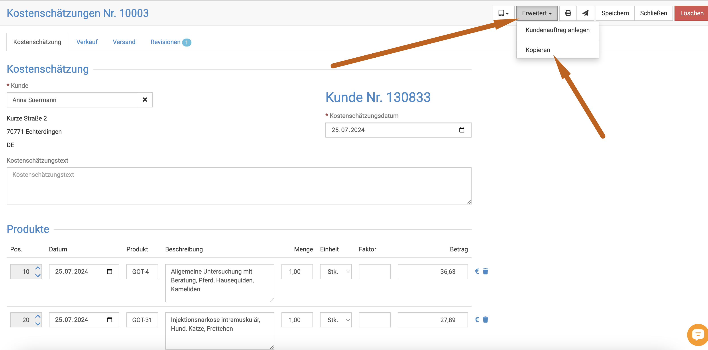

# Kostenvoranschläge / Angebote

Wenn Sie wollen, können Sie Ihren Kunden Angebote  (sogenannte Kostenschätzungen) schicken.  

## Kostenschätzung anlegen  

Klicken Sie **Fakturierung** und dann **Kostenschätzungen**.  
  

Dort klicken Sie auf das **grüne Plus-Symbol**. Es öffnet sich ein neues Fenster "Kostenschätzung anlegen". Wählen Sie unter
"Kunde" den passenden Kunden aus oder fügen Sie einen neuen Kunden hinzu.  

Als Angebotsdatum wird das aktuelle Datum ausgewählt. Sie können dieses Datum aber auch ändern.
 

Unter Produkte können Sie ein Medikament oder ein anderes Produkt auswählen, 
für das Sie das Angebot stellen möchten. Hier haben Sie auch die Möglichkeit, die Beschreibung und 
die Einheit des Produktes einzutragen.  

Ebenso können Sie einen Faktor für jede Leistung hinzufügen. Stand Januar 2025 ist es aktuell leider noch nicht möglich, die
Vorlagen für die Kostenschätzungen zu nutzen, so dass Sie leider die Produkte händisch einfügen müssen.

   

:::tip Unser Tipp:  

Um es im Alltag einfacher zu haben, können Sie für einige gängige Behandlungen oder Operationen eine Kostenschätzung mit einem 
beliebigen Kunden (auch ein Testkunde) anlegen mit den entsprechenden Posten und Faktoren.  

Wenn nun ein Kunde eine Kostenschätzung zu eben dieser OP/Behandlung wünscht, können Sie die Kostenschätzung mit Ihrem Testkunden 
einfach kopieren und nur den Kunden ändern. Das spart viel Zeit und Mühe!    

Öffnen Sie dazu eine Kostenschätzung und klicken oben rechts auf "Erweitert" und dann "Kopieren".  

:::   
