# Lieferungen und Gutschriften 

Sie haben die Möglichkeit, Lieferungen und Gutschriften für Ihre Kunden/ Patientenbesitzer zu erstellen. 

## Lieferungen 

Generell muss unterschieden werden zwischen ausgehenden Lieferungen und eingehenden Lieferungen (siehe Warenwirtschaft). In diesem Abschnitt
geht es um Lieferungen AN Ihre Kunden, falls Sie zum Beispiel Medikamente aus einem bestimmten Grund zuschicken oder ähnliches,
können Sie dies als Lieferung an den Patientenbesitzer erfassen.   

Klicken Sie auf **Fakturierung** und dann **Lieferungen**. Falls Sie bereits Lieferungen erstellt haben, werden diese dort nun aufgelistet. 
Um eine neue Lieferung zu erstellen, kllicken Sie oben rechts auf das **grüne Plus-Symbol**.   

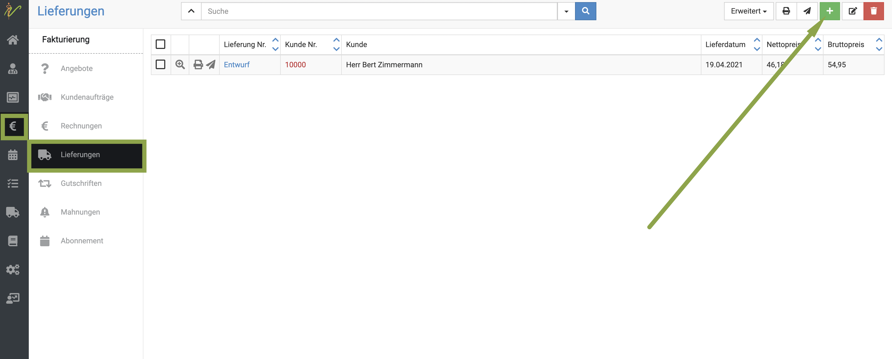  

Nun öffnet sich eine Eingabemaske, bei der Sie zunächst oben den Kontakt/Kunden wählen. Wenn Sie dort den Namen eingeben, schlägt 
die debevet Software Ihnen direkt alle Treffer aus Ihrem Klientel vor. Wählen Sie den gewünschten Kunden.   

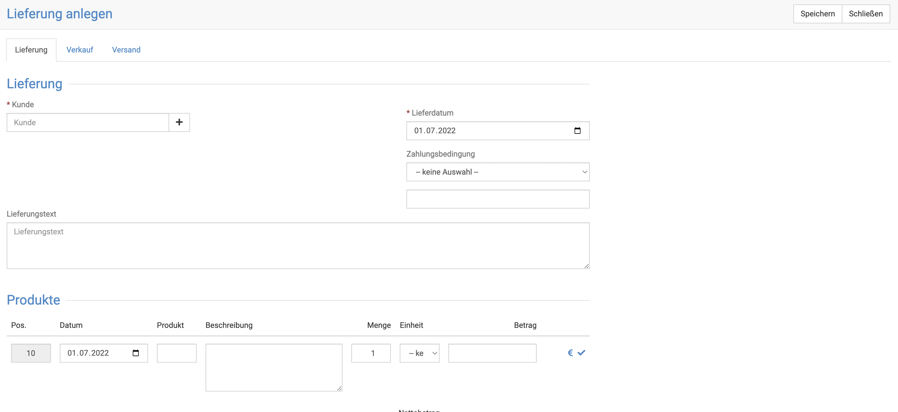

Unten im Feld **Produkt** geben Sie nun den Namen des Produktes ein, welches Sie dem Kunden schicken/abgeben. Es werden 
direkt alle Treffer aus dem Produktkatalog angezeigt und Sie können das passende auswählen.  
 
Klicken Sie anschließend oben rechts auf **Speichern**. 

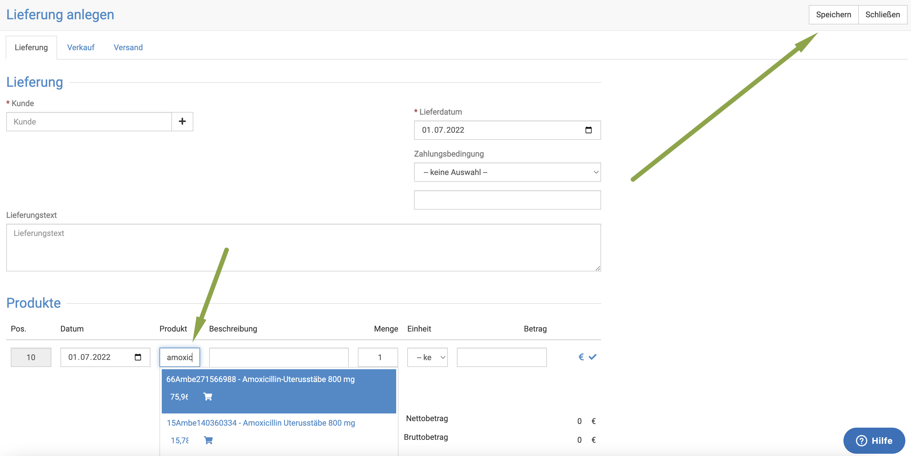  

Um die Lieferung endgültig anzulegen, klicken Sie nun auf **Lieferung anlegen** oben rechts.  

Anschließend können Sie mit einem Klick auf den Dropdown-Pfeil bei **Erweitert** wählen, ob Sie die Rechung erstellen wollen und/oder 
den Warenbestand buchen wollen.  

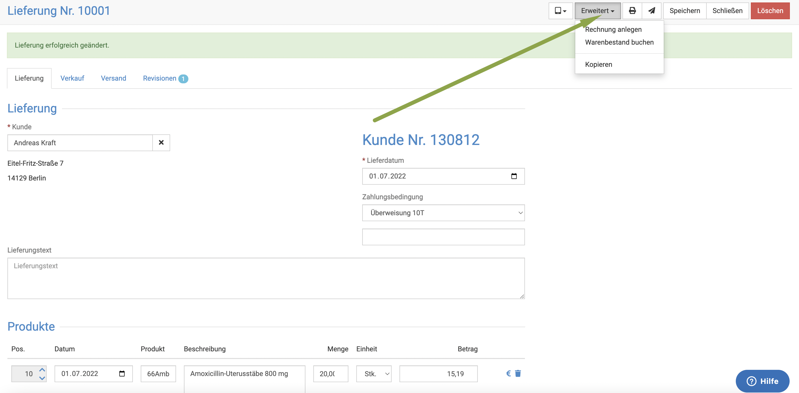  

## Gutschriften  

Falls Sie einem Kunden aus verschiedenen Gründen etwas zurückerstatten möchten, können Sie dies über **Gutschriften** rechtlich korrekt
erledigen. 

Dafür gibt es zwei Wege: Aus der Rechnung des Kunden oder eine frei erstellte Gutschrift

### 1. Aus der Rechnung des Kunden

Um aus einer Rechnung  eine Gutschrift zu erstellen, klicken Sie in der Rechnungsansicht auf **Erweitert** und dann **Gutschrift erstellen**.

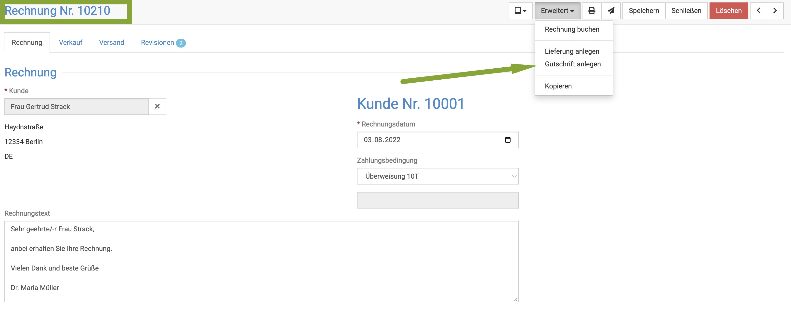

Sie befinden sich dann automatisch im Gutschrift-Entwurf. Nun können Sie entweder aus den bereits abgerechneten Posten zurückerstatten oder neue Posten eintragen. Löschen Sie Posten, die nicht gutgeschrieben werden sollen
durch klicke auf das **Mülleimersymbol** heraus.   

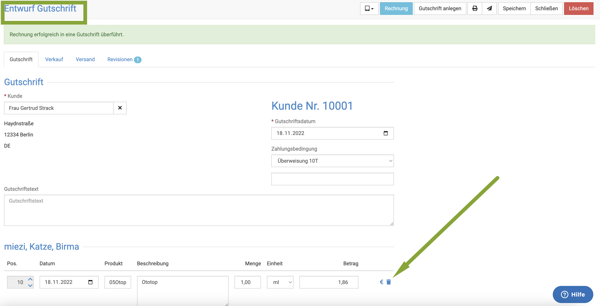 

Wenn Sie die Gutschrift passend erstellt haben,klicken sie oben rechts auf **Gutschrift anlegen**. 

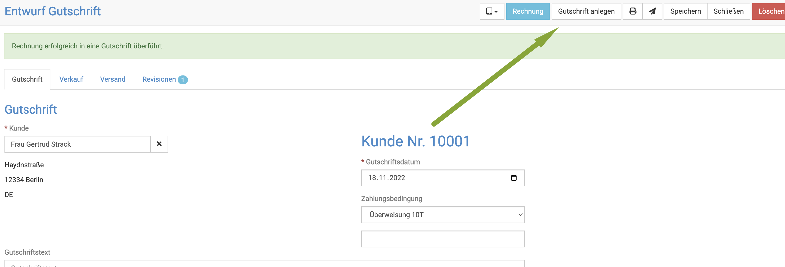

Wenn Sie nun auf **Erweitert** klicken, können Sie die Gutschrift buchen.

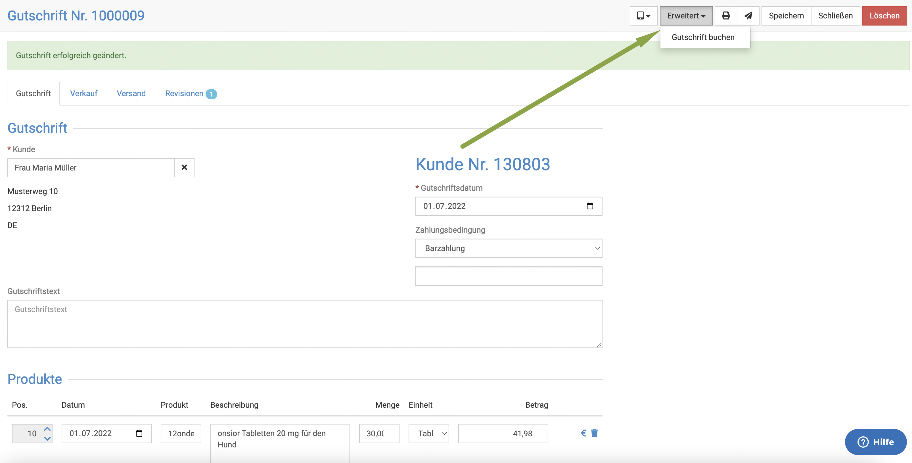

Nun hat die Gutschrift den Status "gebucht", aber ist noch nicht bezahlt. Wenn Sie dem Kunden die Summe ausgezahlt haben, können
Sie, wie bei einer Rechnung, die Zahlung als "erfasst" eingeben.

Klicken Sie dazu in der gebuchten Gutschrift (das geht nur, wenn das Symbol in der Übersicht gelb ist!!!) auf die Gutschriftnummer,
um diese zu öffnen. Klicken Sie nun oben rechts **Erweitert** und dann **Zahlung erfassen**.

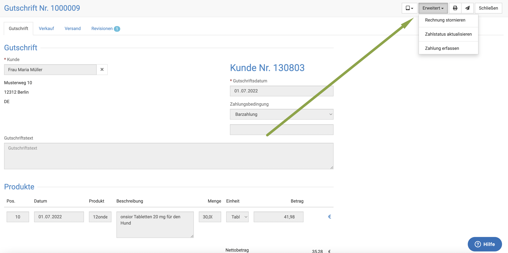

Nun können Sie das Datum, die Summe und die Art der Zahlung wählen.

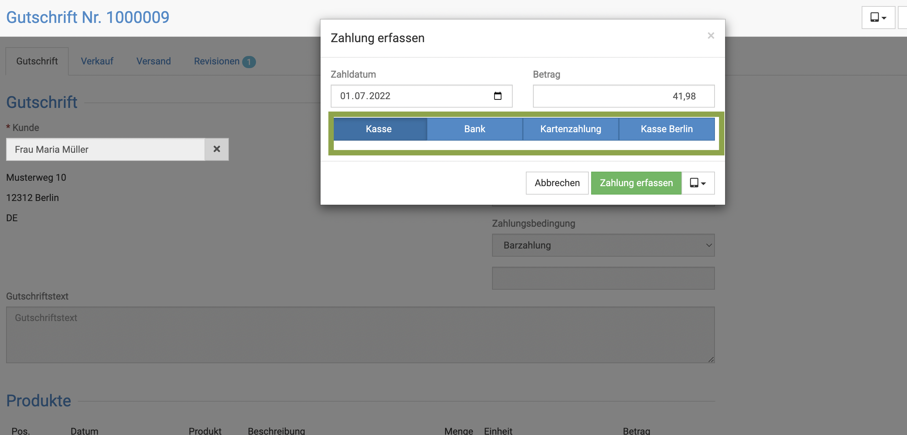

### 2. Frei erstelle Gutschrift 

Um eine freie Gutschrift zu erstellen, klicken Sie auf **Fakturierung** und dann **Gutschriften**. Sie sehen (falls bereits vorhanden) eine Auflistung aller bereits
erstellten Gutschriften. Dabei wird symbolisch dasselbe System genutzt wie bei den Rechnungen:  

* rot: noch nicht gebucht/endgültig anglegt
* gelb: gebucht 
* grün: erledigt  

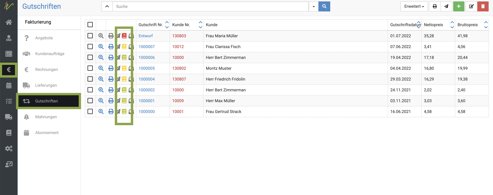  

Um eine neue Gutschrift anzulegen, klicken Sie oben rechts auf das **grüne Plus-Symbol**. Ebenso wie bei den Lieferungen wählen Sie
zunächst den Kunden und geben dann unten bei **Produkt** ein, was Sie dem Kunden gutschreiben wollen. 

Klicken Sie oben rechts auf **Speichern** und dann **Gutschrift anlegen**.  

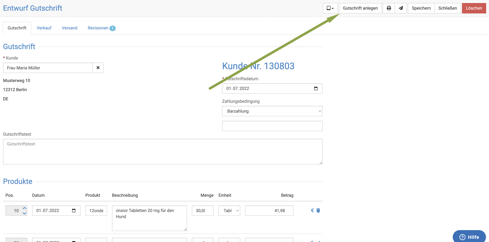  

Wenn Sie nun auf **Erweitert** klicken, können Sie die Gutschrift buchen.  

  

Nun hat die Gutschrift den Status "gebucht", aber ist noch nicht bezahlt. Wenn Sie dem Kunden die Summe ausgezahlt haben, können 
Sie, wie bei einer Rechnung, die Zahlung als "erfasst" eingeben.  

Klicken Sie dazu in der gebuchten Gutschrift (das geht nur, wenn das Symbol in der Übersicht gelb ist!!!) auf die Gutschriftnummer,
um diese zu öffnen. Klicken Sie nun oben rechts **Erweitert** und dann **Zahlung erfassen**.  

  

Nun können Sie das Datum, die Summe und die Art der Zahlung wählen.  

