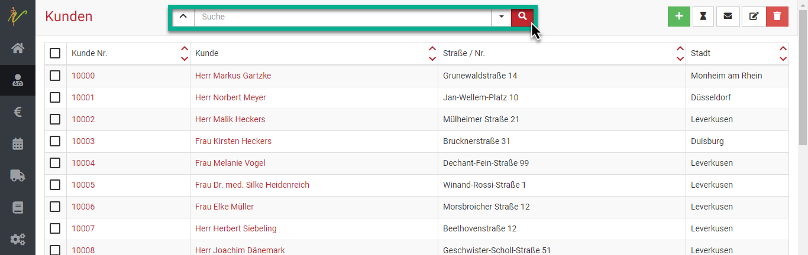
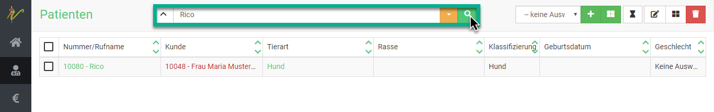
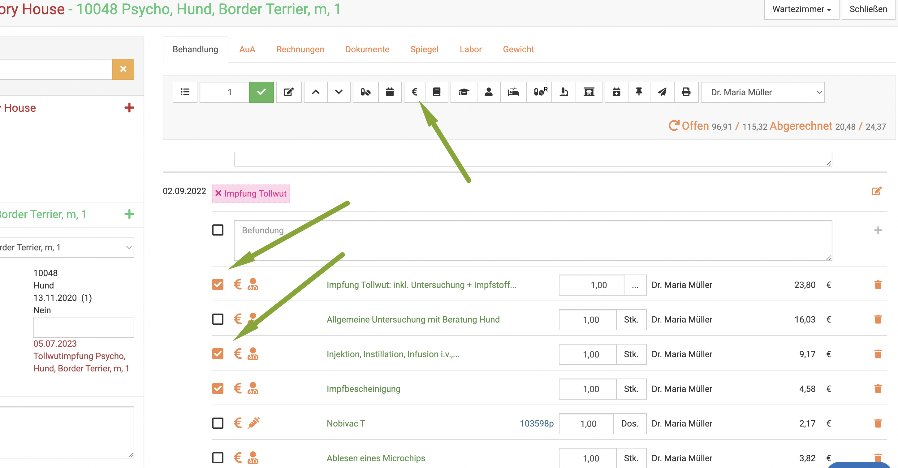
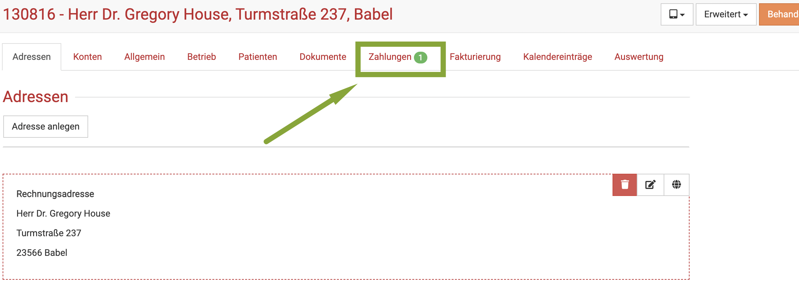
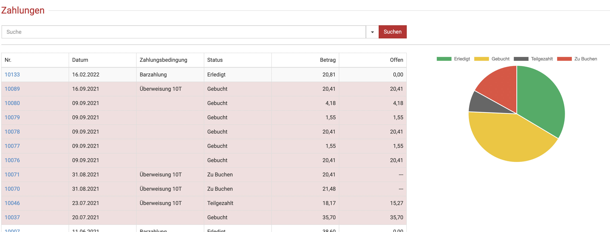
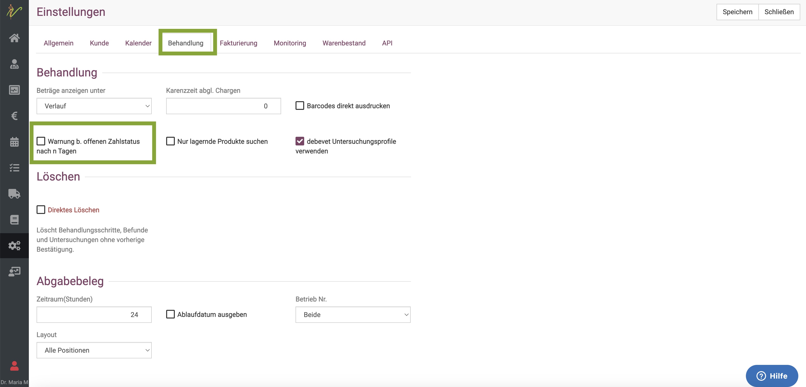
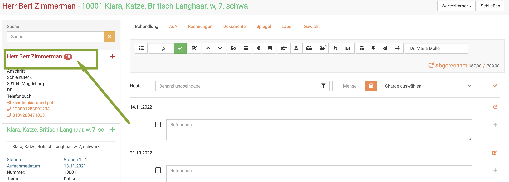
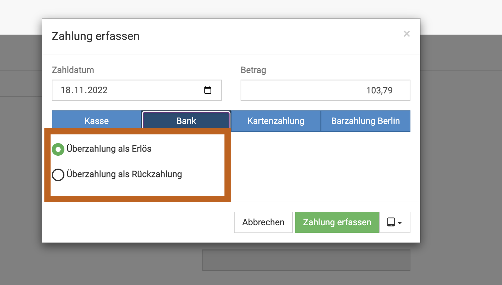
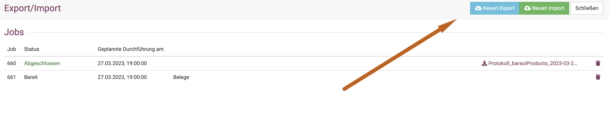
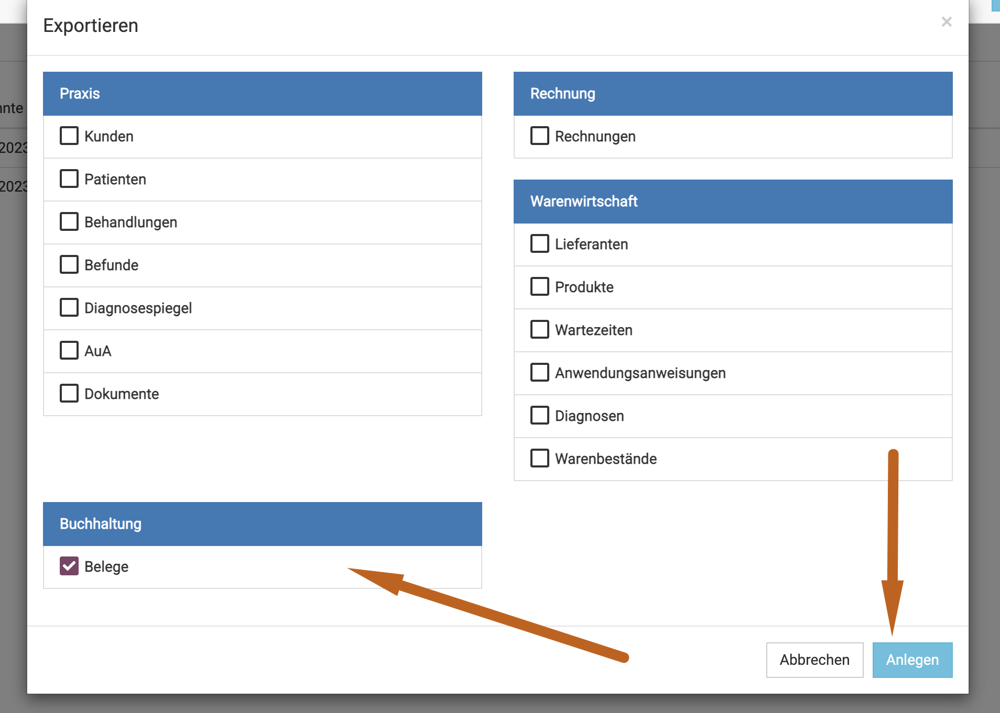

# Praxisalltag Fragen /FAQ

Viele Praxen haben zum Einstieg einige Fragen, die aus dem "alltäglichen Leben" stammen. Standard Szenarios, wie sie in vielen
Tierarztpraxen vorkommen. 

Diese häufigsten Fragen finden sich hier gesammelt und sollen Ihnen helfen, debevet und die Arbeitsweise im Alltag damit besser zu verstehen.

## 1. Kundendatei einsehen, ohne, dass der Kunde im Wartezimmer ist

Viele Praxen setzen bei der Ankunft die Kunden ins Wartezimmer und rufen von dort aus diese zur Behandlung (sowohl physisch, als auch 
digital, hier im debevet). 
Möchten Sie eine Kundendatei einfach nur einsehen, öffnen Sie den Kunden über **Praxis** - **Kunden**, geben dann seinen Namen in die
Suche ein und öffnen den Kunden dann. Klicken Sie auf **Behandeln** und wählen dann sein entsprechendes Tier aus, um die Behandlungshistorie zu sehen.  

## 2. Anruf "Ich war doch mit Bello zum Impfen da, wann muss er denn wieder geimpft werden?"

Jede TFA kennt es: der Anrufer meldet sich ohne Namen oder dieser ist kaum zu verstehen und es wird nur der Tiername genannt. 
Unsere Lösung: Klicken Sie auf **Praxis** und dann **Patienten**, geben sie oben in die Suche nun den Patientennamen ein und drücken **Enter**.

Wenn mehrere Tiere mit diesem Namen vorhanden sind, ist es evtl. leichter, den schlecht verstandenen Namen nun doch zu verstehen- oder noch einmal nachzufragen, wer am
Telefon ist.

Mit einem Klick auf den Namen des korrekten Tieres und einen Klick auf **Behandeln** können Sie nun schnell sehen, wann Bello wieder zur Impfung vorstellig werden muss.  

## 3. Nur einzelne Posten eines Tages abrechnen

Sie möchten an einem Tag nur einzelne Posten abrechnen? Sie möchten verschiedene Posten auf verschiedene Rechnungen setzen, auch wenn 
diese an einem Tag erfolgt sind? 

Beispiele für diesen "Flow" aus dem Alltag wäre so etwas wie: Der Kunde hat bereits die Behandlung bezahlt, kommt aber später noch einmal zurück, weil er 
noch die Wurmkur mitnehmen will und das vergessen hatte, zu erwähnen. Sie möchten diese nun noch eintragen und einzeln abrechnen. 
Hierfür muss der Kunde natürlich nicht erst ins Wartezimmer, sondern kann direkt über **Kunden** aufgerufen werden. 

Um einzelne Posten abzurechnen, setzen Sie in der Behandlungskartei bei den eingegebenen Posten, die Sie abrechnen wollen, einen Haken in die 
**Checkbox** und klicken anschließend auf das **Euro-Symbol**.  

Nun werden auch nur die markierten Posten abgerechnet.

Wenn Sie anschließend noch die anderen auf eine gesonderte Rechnung setzen wollen, verfahren Sie mit diesen Posten genauso. 

:::tip Tipp: 

Wußten Sie schon, dass Sie an der Farbe des Euro-Symbols vor der Posten sehen können, ob für diese bereits eine Rechnung erstellt wurde?
Blau bedeutet: bereits Rechnung erzeugt, Orange bedeutet: noch keine Rechnung erstellt.   

:::  

## 4. Schnell alle Zahlungen/ offene Posten eines Kunden einsehen  

Der Kunde ruft an oder steht an der Anmeldung und Sie möchten schnell wissen, wie es um seine Zahlungsmoral bisher gestellt war?
Sie möchtne wissen, ob der Kunde noch offene Posten hat?

Rufen Sie den Kunden über **Kunden** auf, indem Sie ihn suchen und öffnen.

Am Reiter **Zahlungen** finden Sie ein Grafik und Tabelle mit allen Zahlungen, sortiert nach bezahlt und offen sowie Zahlungsart.  

  

  

Variante 2: 
**Offene Rechnungen - offene Posten am Kunden**

Leider ist es mit der Zahlungsmoral mancher Kunden nicht immer ideal gestellt, was leider eine Notwendigkeit erzwingt, direkt
sehen zu können, ob beim Kunden offene Zahlungen vorliegen.

Um direkt in der Behandlung (und nicht nur in der Übersicht der Zahlungen am Kunden) eine Warnung zu sehen, müssen Sie diese zunächst in den Einstelungen aktivieren.

Klicken Sie **Administration** und dann **Einstellungen**. Dort wählen Sie den Reiter **Behandlung**

Setzen Sie das Häkchen bei **Warnung b. offenem Zahlstatus**. Klicken Sie anschließend oben rechts auf **Speichern**.

Wenn Sie nun ein Tier behandeln, wird Ihnen am Kundennamen links eine rote Zahl angezeigt, welche patientenübergreifend offene Rechnungen anzeigt.

## 5. Digitalte Verwaltung der Apotheke im laufenden Betrieb

Sie wollen endlich die Warenwirtschaft, Ihre Apotheke und Ihr Lager mit debevet digital verwalten? Nun sind Sie etwas ratlos, wie
das im laufenden Betrieb mit bereits angebrochenen Packungen funktioniert?

Dieser Abschnitt hilft Ihnen, Step by Step zu verstehen, was zu tun ist. Wir empfehlen, die Umstellung im Rahmen einer sowieso
geplanten Inventur zu erledigen.

**Erster Schritt:** Sicherstellen, dass alle Produkte korrekt inkl. Packungsgrößen angelegt sind (entfällt bei Nutzung der Barsoi Liste).

**Zweiter Schritt:** Packungen pro Medikament zählen, auch die angebrochenen zählen Sie zunächst als "ganze" Packung mit! Sortieren Sie dabei nach Chargen!

**Dritter Schritt:** Legen Sie einen neuen Warenbestand an pro Medikament. Als Packungsmenge geben Sie bitte Ihre gezählten Packungen, inkl. der "aufgerundeten"
Packungen, ein. Buchen Sie den Warenbestand aktiv.

Hier erfahren Sie, wie das geht:

[Warenbestand anlegen](https://handbuch.debevet.de/docs/Warenwirtschaft/Warenbest%C3%A4nde#neuen-warenbestand-anlegen)   

**Vierter Schritt:** Nun müssen Sie die Ware korrigieren auf die wirklich vorhandene Anzahl. Bei angebrochenen Flaschen müssen Sie vermutlich schätzen
(und am Ende der Flasche dann erneut auf Null korrigieren, schätzen Sie also evtl. minimal mehr), bei Tabletten können Sie zählen. 

Die neue, korrekte Summe Ihres Bestandes geben Sie dann im Korrekturfenster ein.

:::caution Achtung  

Achten Sie darauf, wenn es zwei verschiedene Chargen gibt, zu schauen, welche die angebrochene Charge ist. Nur von dem Warenbestand dieser Charge legen Sie dann 
die Korrektur an und geben dort dann die korrigierte Zahl NUR dieser Charge ein - nicht ihren gesamten Bestand!  

Beispiel: Sie haben 200 Tabletten Charge 1 angelegt und 200 Tabletten Charge 2. Von Charge 1 sind aber schon 30 Tabletten verbraucht. Sie korrigieren nun nur
Charge 1auf 170 Tabletten!

:::

Wie Sie einen Warenbestand korrigieren, erfahren Sie hier:  

[Wrenbestand korrigieren](https://handbuch.debevet.de/Sdocs/Warenwirtschaft/Warenbest%C3%A4nde#warenbestand-korrigieren)   

## 6. Kunde hat zu viel Geld überwiesen/ Umgang mit Überzahlungen  

Falls Sie Rechnungen via Überweisung zahlen lassen und ein Kunde zu viel Geld überweist, müssen Sie dieses ja dennoch als Zahlungseingang verbuchen. 

:::caution Hinweis: 

Wir bitten zunächst mit Ihrem Steuerberater zu sprechen, welche Variante er ihnen empfiehlt!
1. Nur die Rechnungssumme einbuchen als gezahlt und den Rest ohne Belegerstellung zurück überweisen an den Kunden
2. Die Überzahlung buchhalterisch als Überzahlung als Erlös buchen (eher üblich wenn Mahngebühren)
3. Die Überzahlung buchhalterisch als Überzahlung mit Rückzahlung buchen  

:::  

Wenn Sie die Rechnung wie gewohnt als bezahlt kennzeichnen wollen und die höhere Summe eintragen als bezahlte Summe,
bietet unsere debevet Software Ihnen die beiden Varianten

* Überzahlung als Erlös
* Überzahlung als Rückzahlung  

  

Sprechen sie bitte mit Ihrem Steuerberater, aber wenn Sie die Summe zurücküberweisen wollen und der Steuerberater empfiehlt, hierfür Belege zu erstellen, wählen
Sie zweiteres.

Im Anschluss daran erstellen Sie eine Gutschrift, **wenn** ihr Steuerberater einen Beleg für die Rückzahlung empfiehlt. Wenn er sagt, dass das nicht nötig ist, 
überweisen Sie die Summe einfach an den Kunden zurück. 

Wir empfehlen, dann zwei Produkte anzulegen, Summe/Preis ist dabei erstmal egal, dieser kann immer in der Gutschrift später verändert werden:  

* Rückzahlung aus Überzahlung (19% Mwst. angelegt als Sonstiges)
* Rückzahlung aus Überzahlung Futtermittel (7% Mwst. angelegt als Sonstiges)  

Erstellen Sie dann eine Gutschrift, **idealerweise aus der Rechnung des Kunden**, um den Bezug über die Rechnungsnummer auf der 
Gutschrift zu haben. 

Löschen Sie **ALLE**Posten in der Gutschrift und ergänzen dann das angelegte Produkt mit der passenden, auszuzahlenden Differenzsumme.

Wie Sie eine Gutschrift aus einer Rechnung erstellen, erfahren Sie hier: 

[Gutschriften erstellen](/docs/Fakturierung/Lieferungen_und_Gutschriften#gutschriften)

## 7. Die Umsätze aus Futterverkauf / 7% MwSt. einsehen  

Oftmals erreichen uns Anfragen, wie Sie für den Steuerberater darstellen können, welche Umsätze aus den 7% Verkäufen (also Futttermittel und Futterzusatz-Präparate)
generiert wurden. 
Wenn Sie Ihre Belege digital an den Steuerberater senden, sollte dies zwar automatisch erledigt sein, aber hier noch eine Anleitung:

Klicken Sie auf "Administration"(Zahnräder) und dann "Import/Export". Dort erstellen Sie oben recht mit Klick auf "neuen Export".

 

Nun setzen Sie den Haken bei "Belege" und klicken dann "Anlegen". 

Der Job wird nun so angelegt, dass Sie am Abend ab 19 Uhr die Belege in diesem Bereich herunterladen können. 

In der hier nun herunterladbaren CSV Datei (als zip gepackt) kann Ihr Steuerberater (oder sie selbst) sehr einfach Filtern und einsehen, welche Erlöse auf das
entsprechende Erlöskonto gebucht wurden. 

:::caution Achtung: 

Die Schnittstelle zu Lexoffice bietet uns leider nicht die Möglichkeit, die Belegbilder im debevet abzubilden. Wenn Sie Lexoffice nutzen, führen Sie den Beleg-Export
bitte direkt im Lexoffice durch. Bei Fragen dazu wenden Sie sich bitte an den Lexoffice Support.  

:::  

