# Praxisalltag Fragen /FAQ

Viele Praxen haben zum Einstieg einige Fragen, die aus dem "alltäglichen Leben" stammen. Standard Szenarios, wie sie in vielen
Tierarztpraxen vorkommen. 

Diese häufigsten Fragen finden sich hier gesammelt und sollen Ihnen helfen, debevet und die Arbeitsweise im Alltag damit besser zu verstehen.

## 1. Kundendatei einsehen, ohne, dass der Kunde im Wartezimmer ist

Viele Praxen setzen bei der Ankunft die Kunden ins Wartezimmer und rufen von dort aus diese zur Behandlung (sowohl physisch, als auch 
digital, hier im debevet). 
Möchten Sie eine Kundendatei einfach nur einsehen, öffnen Sie den Kunden über **Praxis** - **Kunden**, geben dann seinen Namen in die
Suche ein und öffnen den Kunden dann. Klicken Sie auf **Behandeln** und wählen dann sein entsprechendes Tier aus, um die Behandlungshistorie zu sehen.  

## 2. Anruf "Ich war doch mit Bello zum Impfen da, wann muss er denn wieder geimpft werden?"

Jede TFA kennt es: der Anrufer meldet sich ohne Namen oder dieser ist kaum zu verstehen und es wird nur der Tiername genannt. 
Unsere Lösung: Klicken Sie auf **Praxis** und dann **Patienten**, geben sie oben in die Suche nun den Patientennamen ein und drücken **Enter**.

Wenn mehrere Tiere mit diesem Namen vorhanden sind, ist es evtl. leichter, den schlecht verstandenen Namen nun doch zu verstehen- oder noch einmal nachzufragen, wer am
Telefon ist.

Mit einem Klick auf den Namen des korrekten Tieres und einen Klick auf **Behandeln** können Sie nun schnell sehen, wann Bello wieder zur Impfung vorstellig werden muss.  

## 3. Nur einzelne Posten eines Tages abrechnen

Sie möchten an einem Tag nur einzelne Posten abrechnen? Sie möchten verschiedene Posten auf verschiedene Rechnungen setzen, auch wenn 
diese an einem Tag erfolgt sind? 

Beispiele für diesen "Flow" aus dem Alltag wäre so etwas wie: Der Kunde hat bereits die Behandlung bezahlt, kommt aber später noch einmal zurück, weil er 
noch die Wurmkur mitnehmen will und das vergessen hatte, zu erwähnen. Sie möchten diese nun noch eintragen und einzeln abrechnen. 
Hierfür muss der Kunde natürlich nicht erst ins Wartezimmer, sondern kann direkt über **Kunden** aufgerufen werden. 

Um einzelne Posten abzurechnen, setzen Sie in der Behandlungskartei bei den eingegebenen Posten, die Sie abrechnen wollen, einen Haken in die 
**Checkbox** und klicken anschließend auf das **Euro-Symbol**.  

Nun werden auch nur die markierten Posten abgerechnet.

Wenn Sie anschließend noch die anderen auf eine gesonderte Rechnung setzen wollen, verfahren Sie mit diesen Posten genauso. 

:::tip Tipp: 

Wußten Sie schon, dass Sie an der Farbe des Euro-Symbols vor der Posten sehen können, ob für diese bereits eine Rechnung erstellt wurde?
Blau bedeutet: bereits Rechnung erzeugt, Orange bedeutet: noch keine Rechnung erstellt.   

:::  

## 4. Schnell alle Zahlungen/ offene Posten eines Kunden einsehen  

Der Kunde ruft an oder steht an der Anmeldung und Sie möchten schnell wissen, wie es um seine Zahlungsmoral bisher gestellt war?
Sie möchtne wissen, ob der Kunde noch offene Posten hat?

Rufen Sie den Kunden über **Kunden** auf, indem Sie ihn suchen und öffnen.

Am Reiter **Zahlungen** finden Sie ein Grafik und Tabelle mit allen Zahlungen, sortiert nach bezahlt und offen sowie Zahlungsart.  

  

  

Variante 2: 
**Offene Rechnungen - offene Posten am Kunden**

Leider ist es mit der Zahlungsmoral mancher Kunden nicht immer ideal gestellt, was leider eine Notwendigkeit erzwingt, direkt
sehen zu können, ob beim Kunden offene Zahlungen vorliegen.

Um direkt in der Behandlung (und nicht nur in der Übersicht der Zahlungen am Kunden) eine Warnung zu sehen, müssen Sie diese zunächst in den Einstelungen aktivieren.

Klicken Sie **Administration** und dann **Einstellungen**. Dort wählen Sie den Reiter **Behandlung**

Setzen Sie das Häkchen bei **Warnung b. offenem Zahlstatus**. Klicken Sie anschließend oben rechts auf **Speichern**.

Wenn Sie nun ein Tier behandeln, wird Ihnen am Kundennamen links eine rote Zahl angezeigt, welche patientenübergreifend offene Rechnungen anzeigt.

## 5. Digitalte Verwaltung der Apotheke im laufenden Betrieb

Sie wollen endlich die Warenwirtschaft, Ihre Apotheke und Ihr Lager mit debevet digital verwalten? Nun sind Sie etwas ratlos, wie
das im laufenden Betrieb mit bereits angebrochenen Packungen funktioniert?

Dieser Abschnitt hilft Ihnen, Step by Step zu verstehen, was zu tun ist. Wir empfehlen, die Umstellung im Rahmen einer sowieso
geplanten Inventur zu erledigen.

**Erster Schritt:** Sicherstellen, dass alle Produkte korrekt inkl. Packungsgrößen angelegt sind (entfällt bei Nutzung der Barsoi Liste).

**Zweiter Schritt:** Packungen pro Medikament zählen, auch die angebrochenen zählen Sie zunächst als "ganze" Packung mit! Sortieren Sie dabei nach Chargen!

**Dritter Schritt:** Legen Sie einen neuen Warenbestand an pro Medikament. Als Packungsmenge geben Sie bitte Ihre gezählten Packungen, inkl. der "aufgerundeten"
Packungen, ein. Buchen Sie den Warenbestand aktiv.

Hier erfahren Sie, wie das geht:

[Warenbestand anlegen](https://handbuch.debevet.de/docs/Warenwirtschaft/Warenbest%C3%A4nde#neuen-warenbestand-anlegen)   

**Vierter Schritt:** Nun müssen Sie die Ware korrigieren auf die wirklich vorhandene Anzahl. Bei angebrochenen Flaschen müssen Sie vermutlich schätzen
(und am Ende der Flasche dann erneut auf Null korrigieren, schätzen Sie also evtl. minimal mehr), bei Tabletten können Sie zählen. 

Die neue, korrekte Summe Ihres Bestandes geben Sie dann im Korrekturfenster ein.

:::caution Achtung  

Achten Sie darauf, wenn es zwei verschiedene Chargen gibt, zu schauen, welche die angebrochene Charge ist. Nur von dem Warenbestand dieser Charge legen Sie dann 
die Korrektur an und geben dort dann die korrigierte Zahl NUR dieser Charge ein - nicht ihren gesamten Bestand!  

Beispiel: Sie haben 200 Tabletten Charge 1 angelegt und 200 Tabletten Charge 2. Von Charge 1 sind aber schon 30 Tabletten verbraucht. Sie korrigieren nun nur
Charge 1auf 170 Tabletten!

:::

Wie Sie einen Warenbestand korrigieren, erfahren Sie hier:  

[Wrenbestand korrigieren](https://handbuch.debevet.de/Sdocs/Warenwirtschaft/Warenbest%C3%A4nde#warenbestand-korrigieren)   

## 6. Kunde hat zu viel Geld überwiesen/ Umgang mit Überzahlungen  

Falls Sie Rechnungen via Überweisung zahlen lassen und ein Kunde zu viel Geld überweist, müssen Sie dieses ja dennoch als Zahlungseingang verbuchen. 

:::caution Hinweis: 

Wir bitten zunächst mit Ihrem Steuerberater zu sprechen, welche Variante er ihnen empfiehlt!
1. Nur die Rechnungssumme einbuchen als gezahlt und den Rest ohne Belegerstellung zurück überweisen an den Kunden
2. Die Überzahlung buchhalterisch als Überzahlung als Erlös buchen (eher üblich wenn Mahngebühren)
3. Die Überzahlung buchhalterisch als Überzahlung mit Rückzahlung buchen  

:::  

Wenn Sie die Rechnung wie gewohnt als bezahlt kennzeichnen wollen und die höhere Summe eintragen als bezahlte Summe,
bietet unsere debevet Software Ihnen die beiden Varianten

* Überzahlung als Erlös
* Überzahlung als Rückzahlung  

  

Sprechen sie bitte mit Ihrem Steuerberater, aber wenn Sie die Summe zurücküberweisen wollen und der Steuerberater empfiehlt, hierfür Belege zu erstellen, wählen
Sie zweiteres.

Im Anschluss daran erstellen Sie eine Gutschrift, **wenn** ihr Steuerberater einen Beleg für die Rückzahlung empfiehlt. Wenn er sagt, dass das nicht nötig ist, 
überweisen Sie die Summe einfach an den Kunden zurück. 

Wir empfehlen, dann zwei Produkte anzulegen, Summe/Preis ist dabei erstmal egal, dieser kann immer in der Gutschrift später verändert werden:  

* Rückzahlung aus Überzahlung (19% Mwst. angelegt als Sonstiges)
* Rückzahlung aus Überzahlung Futtermittel (7% Mwst. angelegt als Sonstiges)  

Erstellen Sie dann eine Gutschrift, **idealerweise aus der Rechnung des Kunden**, um den Bezug über die Rechnungsnummer auf der 
Gutschrift zu haben. 

Löschen Sie **ALLE**Posten in der Gutschrift und ergänzen dann das angelegte Produkt mit der passenden, auszuzahlenden Differenzsumme.

Wie Sie eine Gutschrift aus einer Rechnung erstellen, erfahren Sie hier: 

[Gutschriften erstellen](/docs/Fakturierung/Lieferungen_und_Gutschriften#gutschriften)

## 7. Die Umsätze aus Futterverkauf / 7% MwSt. einsehen  

Oftmals erreichen uns Anfragen, wie Sie für den Steuerberater darstellen können, welche Umsätze aus den 7% Verkäufen (also Futttermittel und Futterzusatz-Präparate)
generiert wurden. 
Wenn Sie Ihre Belege digital an den Steuerberater senden, sollte dies zwar automatisch erledigt sein, aber hier noch eine Anleitung:

Klicken Sie auf "Administration"(Zahnräder) und dann "Import/Export". Dort erstellen Sie oben recht mit Klick auf "neuen Export".

 

Nun setzen Sie den Haken bei "Belege" und klicken dann "Anlegen". 

Der Job wird nun so angelegt, dass Sie am Abend ab 19 Uhr die Belege in diesem Bereich herunterladen können. 

In der hier nun herunterladbaren CSV Datei (als zip gepackt) kann Ihr Steuerberater (oder sie selbst) sehr einfach Filtern und einsehen, welche Erlöse auf das
entsprechende Erlöskonto gebucht wurden. 

:::caution Achtung: 

Die Schnittstelle zu Lexoffice bietet uns leider nicht die Möglichkeit, die Belegbilder im debevet abzubilden. Wenn Sie Lexoffice nutzen, führen Sie den Beleg-Export
bitte direkt im Lexoffice durch. Bei Fragen dazu wenden Sie sich bitte an den Lexoffice Support.  

:::  

## 8. Listen über Impfungen oder Betäubungsmittel (BTM) erstellen

Uns erreichen immer wieder Anrufe, dass Veterinärämter von Kleintierpraxen eine Liste wünsche, welcher Impfstoff an welchem Tag in welches
Tier (Mit Namen des Besitzers) angewendet wurde. Wir können in der debevet Software keine Liste mit Tiernamen erstellen lassen, aber 
eine mit den Namen der Besitzer, worüber dann zumindest in der Kartei schnell dargestellt werden kann, welches Tier es war.  

Der kleine Nachteil ist (Stand 04.2023), dass Sie die entsprechenden Medikamente bzw. Impfstoffe über den Produktnamen einzeln abbilden müssen. Dies bedeutet dann,
dass nicht für alle Impfstoffe auf einmal eine Liste erstellt werden kann, sondern nur pro Produkt/ Produktname.

Klicken Sie dazu auf **Warenwirtschaft**, dann **Warenbestände** und oben rechts **Warenbewegungen**.  

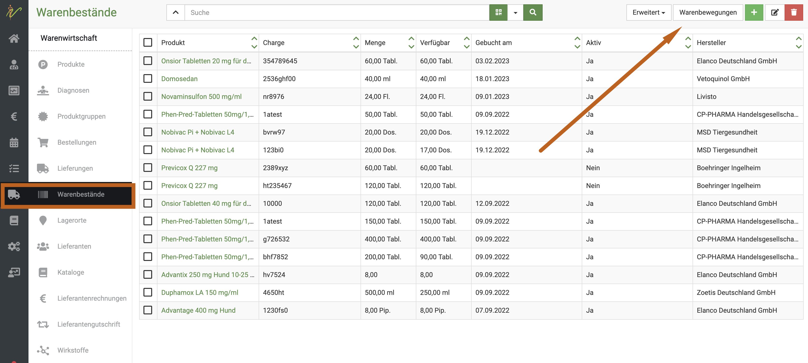    

Öffnen Sie nun mit dem **Dropdown-Pfeil** die erweiterte Suche und wählen den gewünschten Datumsbereich aus.  

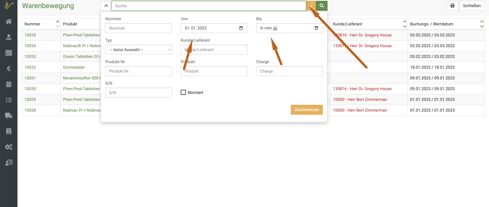  

Geben Sie dann den gewünschten Namen ein (wenn Sie z.B. Nobivac Impfstoffe nutzen, geben Sie nur Nobivac ein, dann werden auch ALLE 
in diesem Zeitraum genutzten Impfstoffe mit Nobivac im Namen gelistet). Klicken Sie dann auf das **Lupensymbol**.   

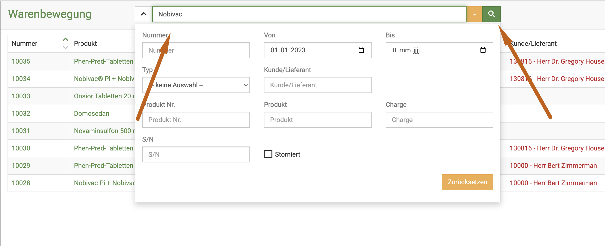    

Nun wird Ihnen die passende Liste angezeigt.  

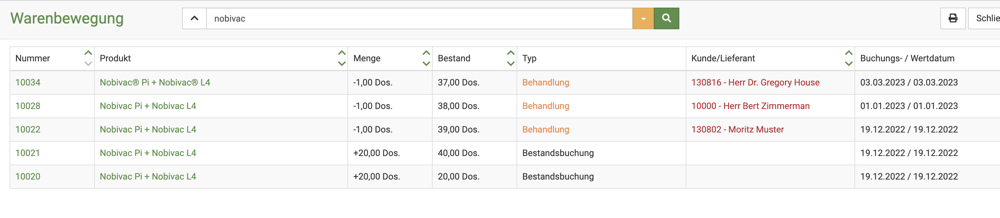   

:::tip Unser Tipp:   

Sparen Sie Papier! Klicken Sie auf das Druckersymbol und dann auf den **Download-Pfeil**. Speichern Sie die Liste in einem Ordner auf Ihrem 
Rechner oder einer Cloud, um dann bei Kontrollen alle Listen zeigen zu können. Klare Benennung (z. B. "2023_quartal1_nobivacimpfungen.pdf" ) helfen bei einer
klaren Organisation.   

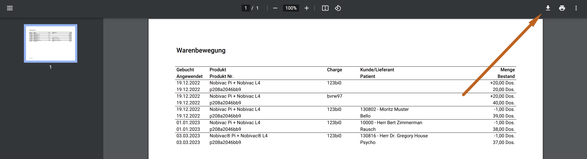
::: 

## 9. Rundschreiben, E-mail an alle Kunden, Rundbrief   

Immer wieder erreichen uns Anfragen, dass Praxen eine Sammelinformation in Form eines Rundschreibens an alle Kunden verschicken möchten.

Öffnen Sie hierzu Ihre Kundenliste mit Klick auf **Praxis** und dann **Kunden**.  

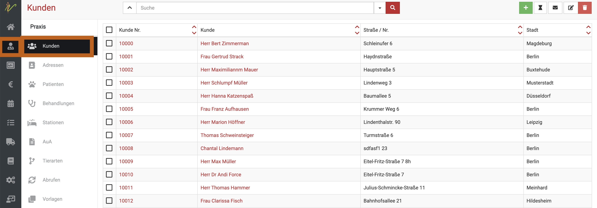   

Nun markieren Sie mit einem Klick in die Checkbox die Kunden, die Ihre Email erhalten sollen. Sie können auch alle Kunden markieren, 
indem Sie ganz oben in der Tabelle die Checkbox aktivieren. Denken Sie jedoch daran, dass Sie vorab einmal die gesamte Seite nach unten
scrollen müssen, vor allem bei großen Kundenzahlen. Wir raten bei zu großen Zahlen von Kunden davon ab, diese Funktion zu nutzen! 

Wenn Sie einen sehr großen Kundenstamm haben, exportieren Sie bitte Ihre Kundendaten als CSV Datei und senden mit einem Mailprogramm
eine Email an alle Kunden, bei denen eine Mailadresse hinterlegt ist.  

Um den Inhalt der Mail zu erstellen, klicken Sie nun oben rechts auf das **Brief-Symbol**.  

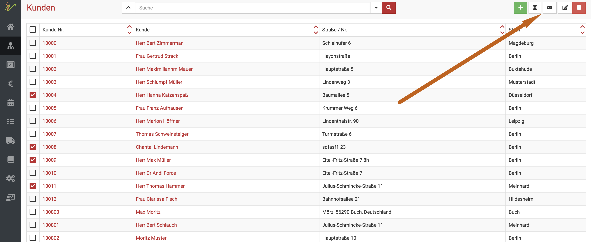

In der sich öffnenden Seite können Sie den Betreff und Mailtext festlegen oder eine Vorlage nutzen.  Klicken Sie anschließend
oben rechts **Speichern**.

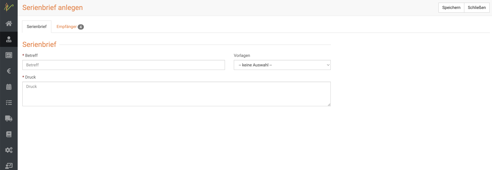

In der folgenden Seite wird Ihnen der Überblick der erstellten Serienbriefe gezeigt. Markieren Sie mit einem Klick oben in die Checkbox
alle Nachrichten und klicken anschließend oben rechts auf das **Papierflieger-Symbol**.  

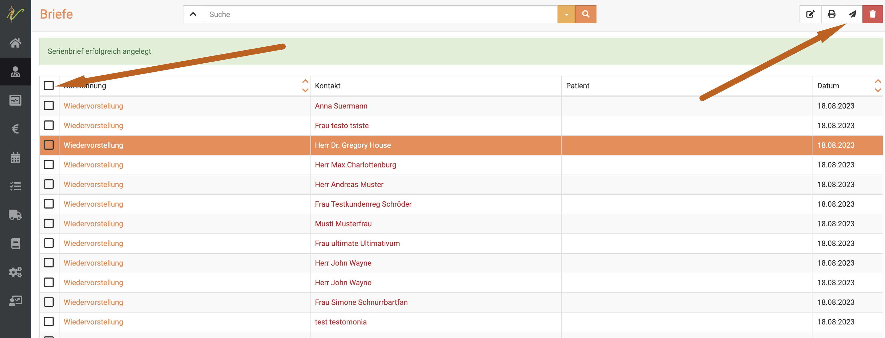

:::caution Bitte beachten Sie:   

Die Informationen werden auf diesem Wege nur als Anhang in Form eines Dokumentes verschickt. Möchten Sie eine reelle Mail mit dem direkten
Text versenden, müssen Sie den Weg über den Export der Kundendaten als CSV Datei gehen. Aus der Tabelle können Sie dann die Mailadressen kopieren und
mit Ihrem Mailprogramm eine Sammelmail erstellen.  

:::   

Falls keine Mailadresse hinterlegt ist, bzw. der Mailversand für den Kunden nicht erlaubt ist, erhalten Sie unten rechts eine kleine Fehlermeldung. 
Klicken Sie rechts unten auf das **Kästchensymbol**,  dieses ist zunächst überlagert vom Hilfe Button, lässt sich aber anklicken. Dann klicken Sie auf das
kleine **Dokumenten-Symbol**, um die Fehlermeldung zu sehen. Dort können Sie detailliert lesen, welchen Kunden die Email nicht zugestellt wurde.  

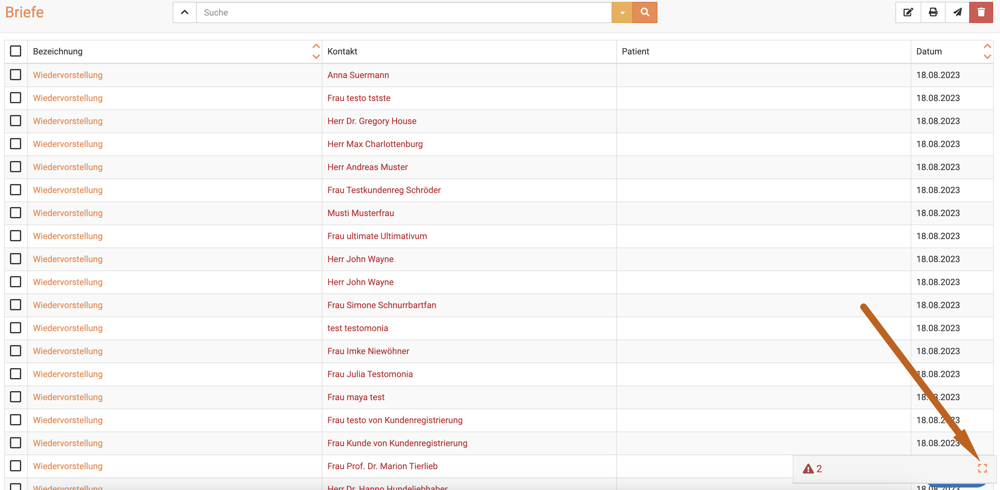  

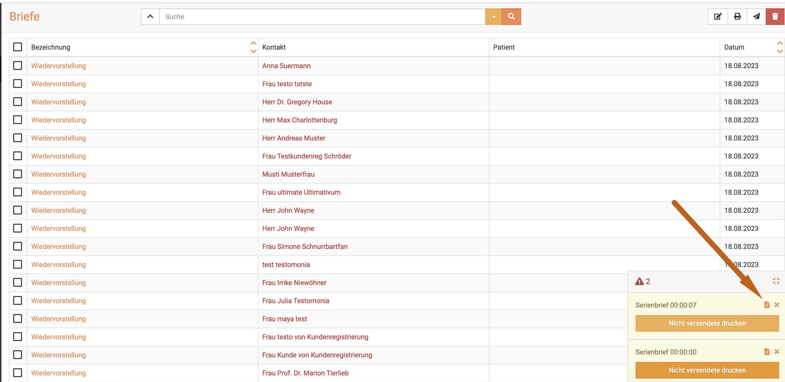  

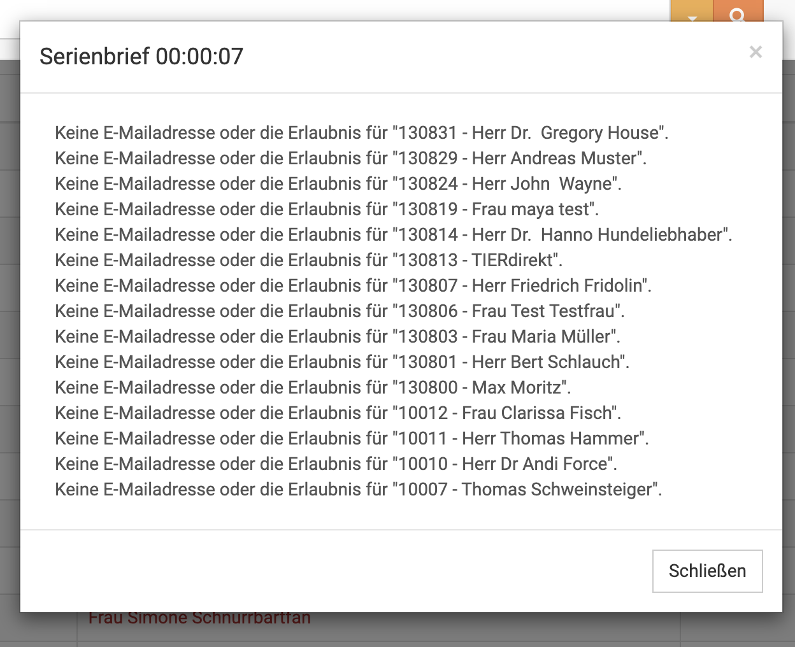

:::caution Achtung!  

Viele Mailanbieter limitieren den Massenversand von Mails pro Nachricht und/oder pro Tag. Ob und wie Ihr Mailanbieter diese Möglichkeit unterstützt,
erfahren Sie direkt bei Ihrem Anbieter (oder bei google).   

:::   

Alternativ können Sie unsere MailChimp Erweiterung nutzen und dort die CSV Datei einfügen, allerdings ist MailChimp selbst kostenpflichtig.

## 10. Login Praxisnummer speichern

Immer wieder fragen unsere Kunden, die sich die Praxisnummer für den Login nicht merken können und kein Passwortprogramm nutzen, ob diese 
gespeichert werden kann. Die Antwort lautet JA!. 

Melden Sie sich aus der debevet Software ab. (Klick unten links auf das Nutzersymbol, dann "abmelden").

 

Sie sehen nun, dass in der Anmeldemaske die Praxisnummer eingetragen ist und in der Browser Adresszeile die Adresse direkt zu Ihrer
Praxisnummer angezeigt wird.

Diese Adresse empfehlen wir nun zu speichern, je nach Vorliebe und Nutzungsangewohnheiten zum Beispiel:

* Als Startseite des Chrome Browsers (das bedeutet, dass diese bei jedem Öffnen von Chrome direkt erscheint)
* In der Lesezeichenleiste anzeigen lassen, so dass Sie mit einem Klick direkt diese Seite öffnen können

Falls Sie eine Anleitung hierfür benötigen, schauen Sie bitte hier in den Google Hilfeseiten:

Hilfe zu Punkt 1: 

[Startseite im Chrome festlegen](https://support.google.com/chrome/answer/95314?hl=de&co=GENIE.Platform%3DAndroid&sjid=1390074707387844122-EU)

Hilfe zu Punkt 2:

[Lesezeichen im Chrome verwalten](https://support.google.com/chrome/answer/188842?hl=de-DE&ref_topic=7439637)   

## 11. Ganze Packungen abgeben    

Vor allem bei Packungsgrößen, die in Gramm als Abgabeeinheit aus der Barsoi oder Vitrapet kommen, kann es etwas umständlich sein,
diese als ganze Packungen abzugeben, wer kann sich schon "6,42 g" merken?   

Unsere Software bietet hier einen einfachen Trick: Klicken Sie in das "Mengen" Feld nach Auswahl des Medikaments und drücken dann einmal
die "Leertaste". Die debevet Software füllt dann automatisch auf die Menge der vollen Packung. (Das gilt bei allem, auch Tabletten, Flaschen etc.).
Dabei wird die Menge der Packung des kompletten inneren Behältnisses genutzt.

Sie wollen mehrere Packungen abgeben? Kein Problem! Geben Sie die Packungsmenge im Mengenfeld ein (z.B. eine "7") und drücken nun die Leertaste.
Die Software rechnet dann automatisch 7 volle Packungen aus und berechnet die Preise dann beim Einfügen in die Behandlung korrekt. 

Hier ein Beispiel, wenn Sie bei "Ivomec P" die Leertaste drücken:  

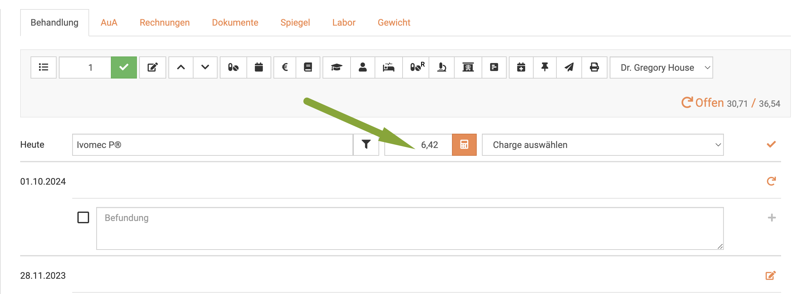   

und dasselbe Produkt, wenn Sie eine "7" in das Mengenfeld setzen und dann die Leertaste drücken:   

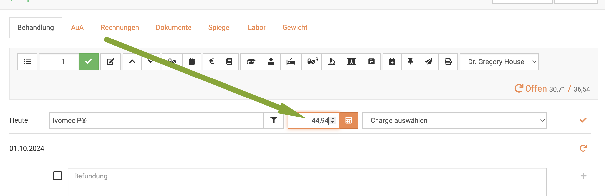   

## 12. Befunde diktieren/ Spracheingabe 

Immer wieder erreichen uns Anfragen, ob debevet eine Spracheingabe hat. In den meisten neueren Rechnern bzw. Tablets ist ein 
Mikrofon integriert. Sofern dies der Fall ist, können Sie sehr einfach eine Spracheingabe nutzen.  

Im Browser muss allerding die Erlaubnis erteilt sein, dass das Mikrofon genutzt werden darf. Normalerweise fragt der Computer dies
einmalig beim ersten Versuch ab. Wenn nicht, googlen Sie bitte, wie Sie im Chrome Browser das Mikrofon zulassen.  

Schauen Sie nun auf Ihrer Tastatur, wie das Mikrofon eingeschaltet wird. Beim Macbook z.B. ist dies mit der Tastenkombination "Funktion(fn)" + F5 
gleichzeitig der Fall. 

Sie klicken nun in das Befundungsfeld in der Patientenkarte, aktivieren das Mikrofon und sprechen Ihren Befund ein. Der Text wird 
direkt geschrieben.   

## 13. Jahreswechsel buchhalterisch   

Zum Jahreswechsel müssen Sie folgende Änderungen selbständig durchführen: 

* Collmex:   

Wenn sie unsere Collmex Anbindung nutzen, müssen Sie einmalig ein neues Geschäftsjahr anlegen im Januar eines jeden
Jahres. Loggen Sie sich hierzu mit den Zugangsdaten direkt bei Collmex ein.  

Klicken Sie hier dann auf "Verwaltung"  und dort "Geschäftsjahr anlegen"

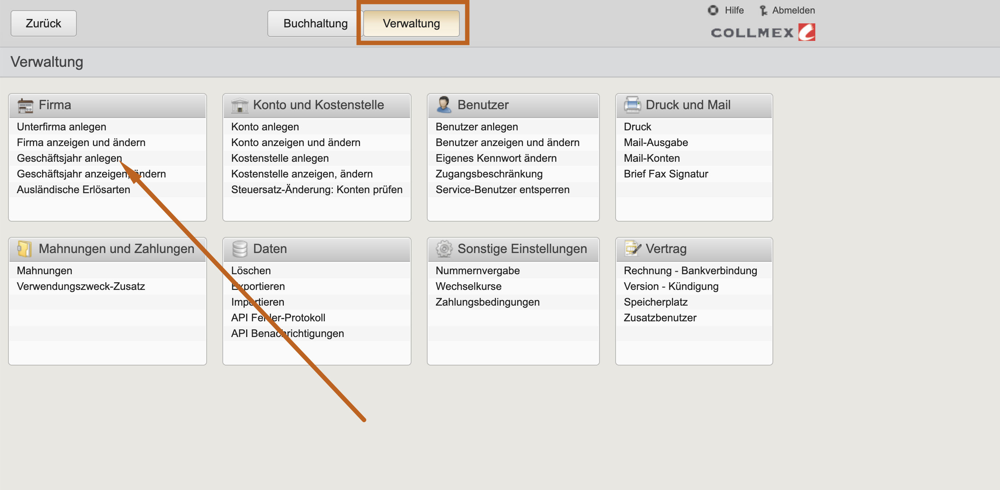   

Anschließend auf "Geschäftsjahr anlegen" und achten auf das korrekt angezeigte, neue Jahr (dieses ist eigentlich
automatisch vorgegeben)  

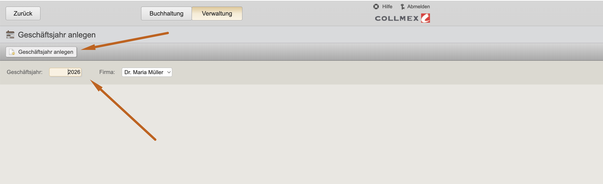   

* debevet Buchhaltung  

Wenn Sie unsere interne Buchhaltung nutzen, müssen Sie einen Saldenvortrag vornehmen.  Dieser sollte für die Konten "Kasse" 
und "Forderungen" erflgen (bei den meisten Konto 1000 und 1400)

:::caution Achtung  

Bitte achten Sie darauf, dass alle offenen Zahlungen, die im **alten** Jahr eingegangen sind, zunächst erfasst werden. 
Nach Saldenvortrag wird diess Jahr "abgeschlossen" und Zahlungen, die nachträglich mit Eingangsdatum Vorjahr (nicht Rechnungsdatum!) 
erfasst werden, werden nicht mehr dem Forderungskonto gegen gerechnet!   

:::  

Führen Sie den Saldenvortrag wie folgt durch:  

licken Sie auf **Buchhaltung** und dann **Belege**.

Dort sehen Sie oben rechts **Vorlagen**

Wenn Sie dort klicken, öffnet sich eine Maske, in der Sie aus verschiedenen Optionen wählen können.

* Kontoeröffnung
* Saldenvortrag
* Privateinlage
* Privatentnahme

Tragen Sie nun den Saldo ein, der auf dem Dashboard angezeigt wird. Wir empfehlen, die Übertragung so zeitnah wie
möglich zum 1.1. vorzunehmen!

