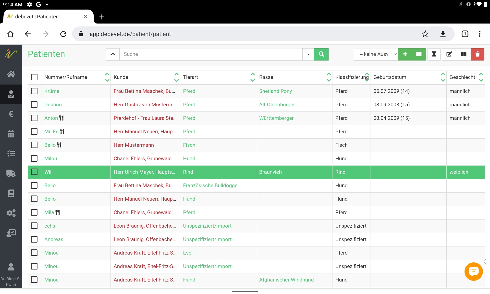
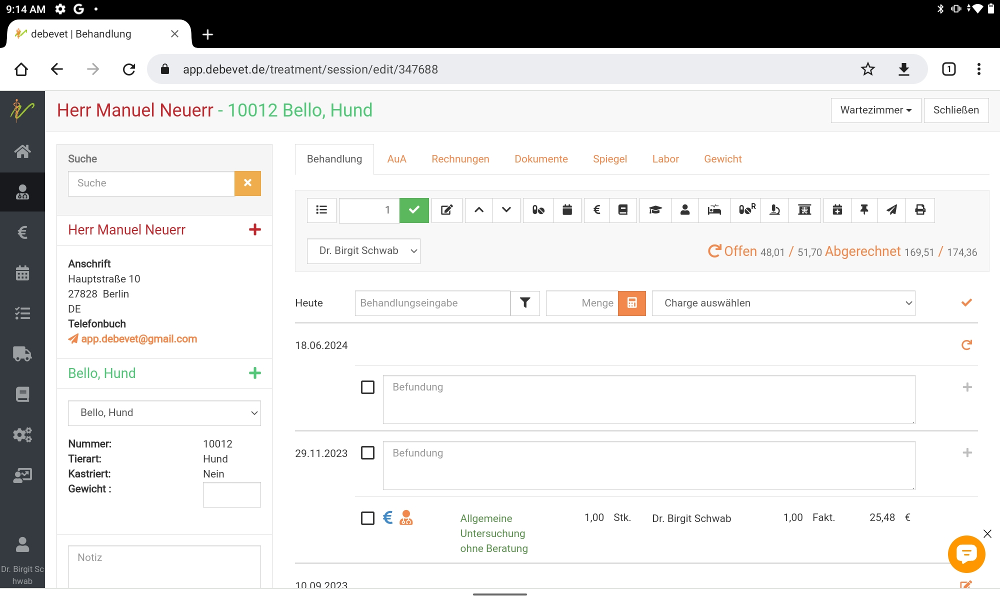
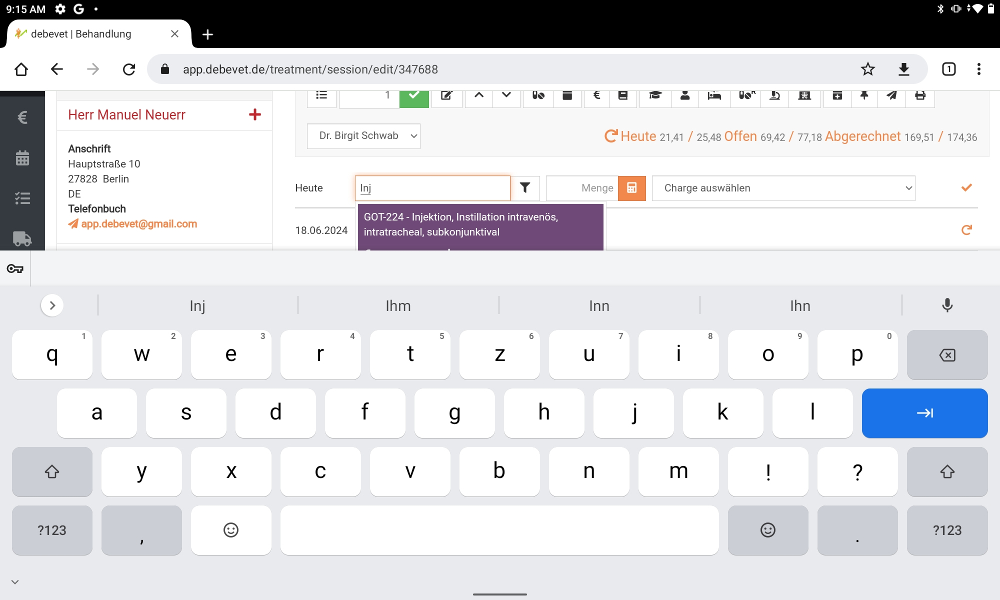
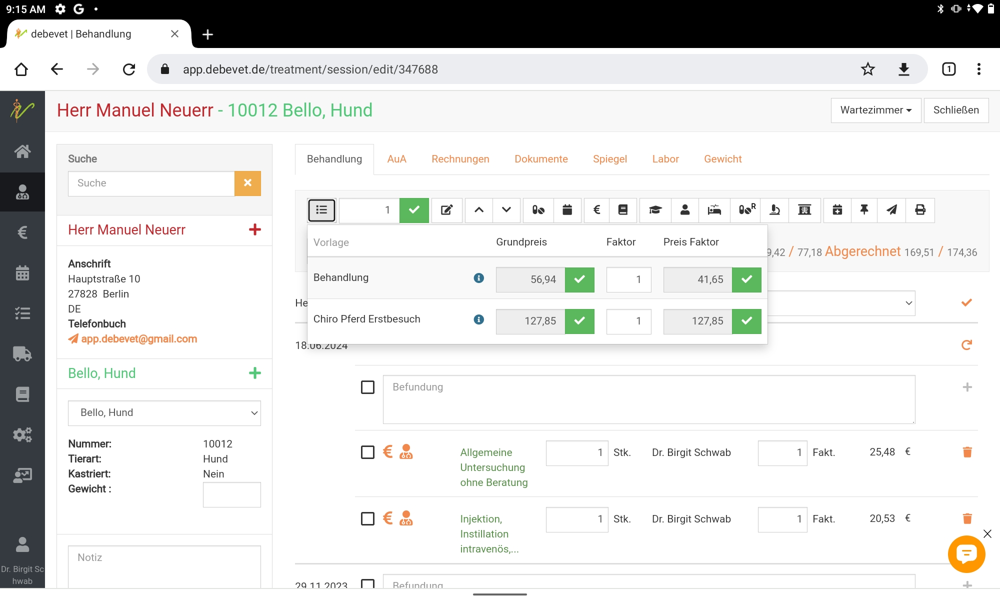
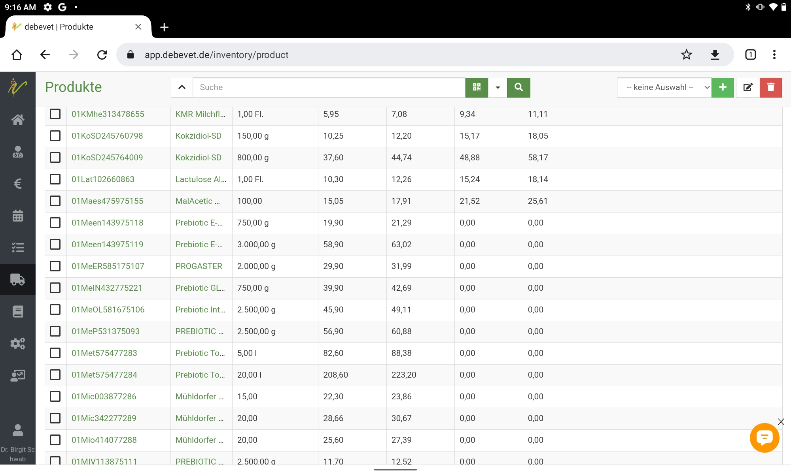
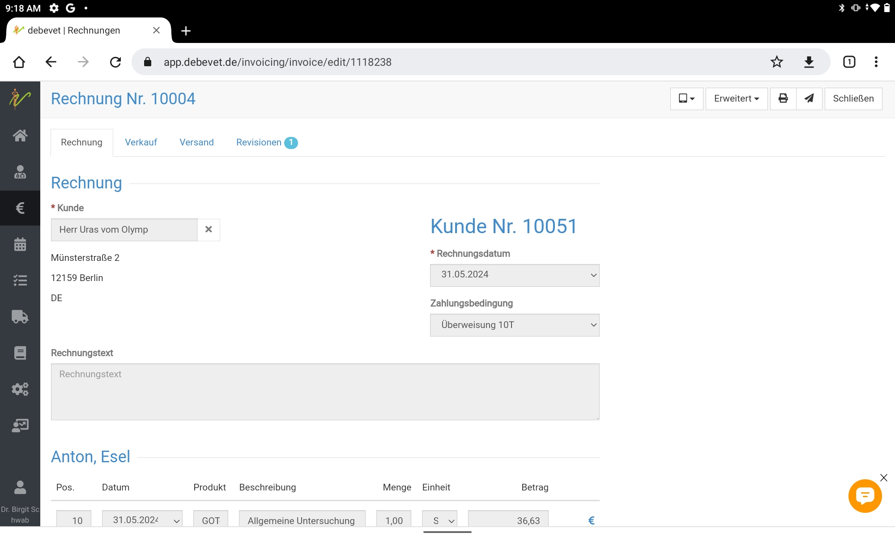
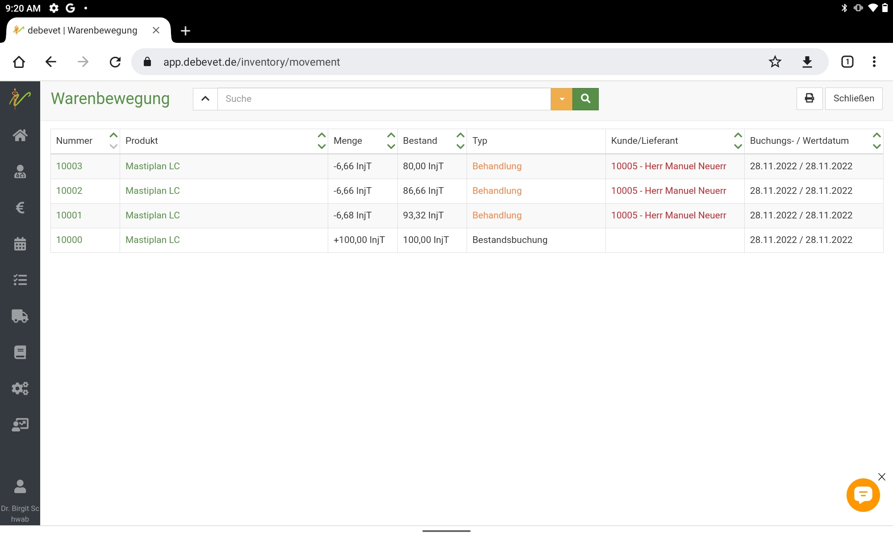
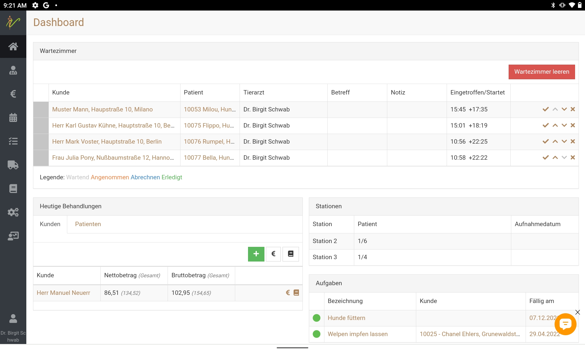

# debevet mobil nutzen (Smartphone/ Tablet)  

Immer wieder erreichen uns Anfragen bezüglich der mobilen Nutzung von debevet. Dazu sagen wir ehrlich: wir haben KEINE gesonderte
App zur perfekten Nutzung am Smartphone und diese ist auch nicht geplant. 

Dennoch lässt sich debevet natürlich mobil nutzen. Um das Programm ideal nutzen zu können, empfehlen wir eine Bildschirmauflösung 
von 1.080 Pixel (HD): 1.920 x 1.080. Ansonsten kann es zu einer unklaren Darstellung kommen, bei der einige Buttons evtl. ausgeblendet sind. 
Es wird eine Nutzung an Tablet oder PC/Laptop empfohlen.

Sie können also beispielsweise ein Laptop mitnehmen und ihr Handy als mobilen Hotspot nutzen, oder aber (und das funktioniert ideal!) ein Tablet
mit einer Simcard nutzen. 

Wir zeigen hier einige Screenshots, die die Nutzung am Tablet zeigen. Beispiele entstanden an einem Lenovo Tab (P11). Bitte beachten Sie unsere
Hinweise zur Bildschirmauflösung!

  

  

  

  

  

  

