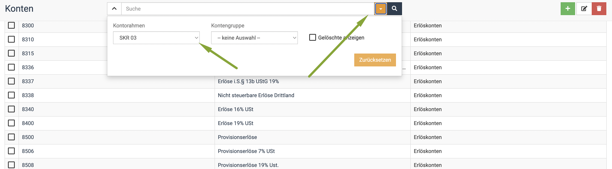
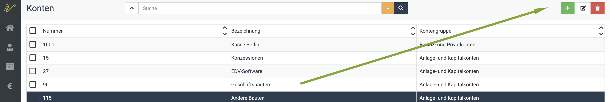
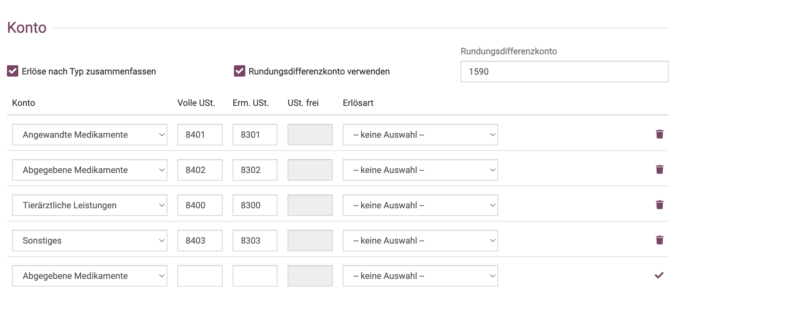
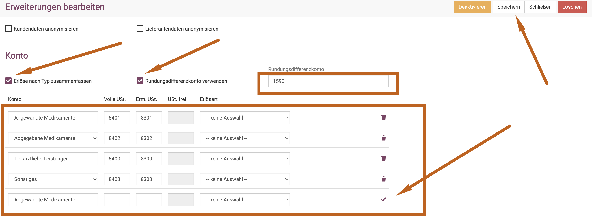

# Konten (Buchhaltungskonten)

## Buchhaltungskonten Übersicht

Wenn Sie auf **Buchhaltung** (Buchsymbol) und dann **Konten** klicken, bekommen Sie eine Auflistung aller vorhandenen Konten.
Wenn Sie oben den **Dropdown-Pfeil** neben dem Suchenfeld kllicken, können Sie zwischen SK03 und SKR04 wechseln. 

  

## Buchhaltungskonten anlegen

Wenn Sie noch weitere Buchhaltungskonten hinzufügen möchten, klicken Sie oben rechts das **grüne Plus-Symbol**. Geben Sie 
dann die gewünschte Nummer und Bezeichnung und den Kontenrahmen an.  

:::caution Achtung  

Wir empfehlen, neue Konten nur nach Rücksprache mit Ihrem Steuerberater anzulegen.  

:::

## Getrennte Kontierung der Leistungen und Medikamente  

Wir raten bei Praxen, deren Apotheke nicht als eigene Firma eingetragen ist (und dies ist nur bei GbR oder GmbH sinnvoll) dazu,
die verschiedenen Erlöse auf verschiedene Erlöskonten (dabei sind Buchhaltungskonten gemeint und nicht Bankkonten!) zu buchen. 

Damit kann eine eindeutige Darlegung im Falle einer Gewerbesteuerpflicht erstellt werden. Wird dies nicht eingerichtet, kann je nach Finanzamt 
im ungünstigsten Fall Ihr gesamter Umsatz zur Berechnung herangezogen werden. Alternativ kann der Steuerberater nur mit einem Mehraufwand, der manuell und 
damit kostenpflichtig ist über die einzelnen Rechnungen diese Summen herausrechnen, aber debevet kann dies nur bei Einrichtung der 
Buchhaltungskonten exakt abbilden.

Bei der Nutzung unserer debevet Buchhaltung oder der Nutzung von Collmex kann dies eingerichtet werden. Die lexware Schnittstelle bietet
diese Variante leider nicht an.  

Dabei wird jeweils ein Konto pro Erlösart für den vollen Umsatzsteuersatz und ein Konto für den reduzierten Umsatzsteuersatz angelegt. 

Damit kann auch jederzeit über den 7% Steuersatz ausgewertet werden, welche Erlöse aus Futtermitteln stammen. 

Wir empfehlen, folgende Erlöskonten anzulegen:

* Tierärztliche Leistungen
* Angewandte Medikamente
* Abgegebene Medikamente
* Sonstiges

Außerdem ist ein Rundungsdifferenzkonto nötig, hier wird gängigerweise das Konto für durchlaufenden Posten genutzt. 

:::caution Hinweis

Bei der Nutzung des Solo Paketes müssen Sie diese Einstellungen selbst vornehmen oder können uns kostenpflichtig hierfür beauftragen. 
Bei allen höheren Paketen nehmen wir diese Einstellungen gern kostenfrei für Sie vor, idealerweise nach kurzem Mailkontakt mit Ihrem Steuerberater.   

:::

Klicken Sie auf **Administration**  und dann **Erweiterungen**. Klicken Sie dann an Ihrer genutzten Buchhaltungserweiterung auf 
"Bearbeiten". Dann scrollen Sie nach unten bis zum Bereich "Konten".    

Bitte bedenken Sie, dass Sie die Konten zunächst erstellen müssen, da es sich nicht um Standardkonten handelt. Im Collmex werden
diese direkt in der Collmex Oberfläche erstellt, bei der debevet internen Buchhaltung wie hier weiter oben erklärt.   

Anschließend können die passenden Konten in die passende Spalte gesetzt werden. 

Setzen Sie das Häkchen bei "Erlöse nach Typ zusammenfassen" und "Rundungsdifferenzkonto verwenden". Tragen Sie die Kontonummern 
nach Rücksprache mit Ihrem Steuerberater ein.   

Denken Sie daran in jeder Zeile nach dem Eintragen den grünen Haken an der Zeile anzuklicken, damit der Eintrag gespeichert. 

