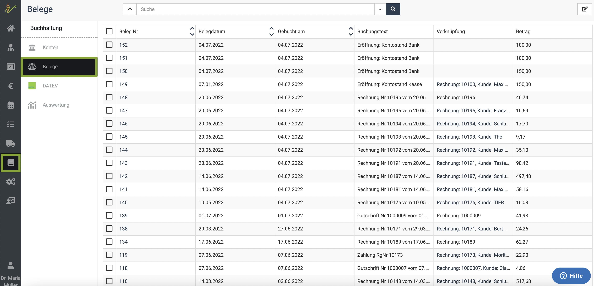
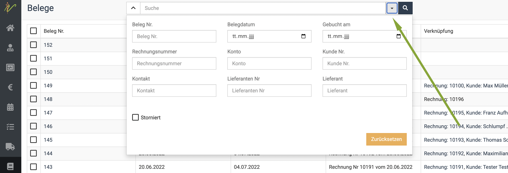
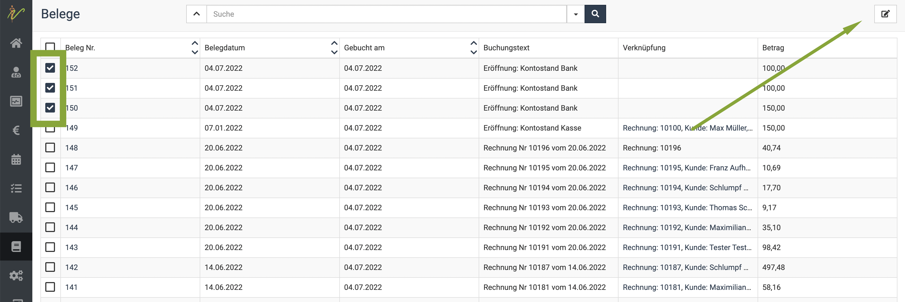
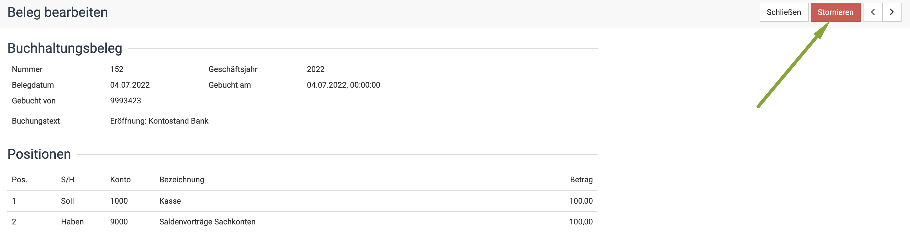

# Belege  

Wenn Sie auf **Buchhaltung** und dann **Belege** klicken, erhalten Sie eine Auflistung Ihrer Buchhaltungsbelege.  

  

Wenn Sie nun auf den **Dropdown-Pfeil** neben der Suche klicken, können Sie sich die angezeigten Belege mit einem beliebigen
Filter gezielter anzeigen lassen oder einzelne Belege suchen. 

Geben Sie etwas in das Suchenfeld ein oder geben einen Filter ein und drücken die **Entertaste** oder klicken das **Lupen-Symbol**. 

Wie immer erkennen Sie einen gesetzten Filter daran, dass der **Dropdown-Pfeil** nun *gelb* ist.  

  

::: tip Tipp: 

Direkt exportieren können Sie die Belege nicht hier, sondern nur über **Administration** und **Import/Export**.  

::: 

## Belege stornieren/löschen    

Wenn Sie einen Beleg stornieren wollen, setzen Sie zunächst einen Haken in die Checkbox vor dem gewünschten Beleg.
Natürlich können Sie auch direkt mehrere markieren, um diese zu stornieren. Anschließend klicken Sie auf das **Stift-Symbol** oben rechts.

  

Nun öffnet sich die Detailansicht des Beleges. Wenn Sie mehrere Belege gewählt haben, sehen Sie oben rechts die **Pfeile** < und > zum
Blättern zwischen den Belegen. 

Um den Beleg zu stornieren, klicken Sie nun oben rechts auf **Stornieren.  

