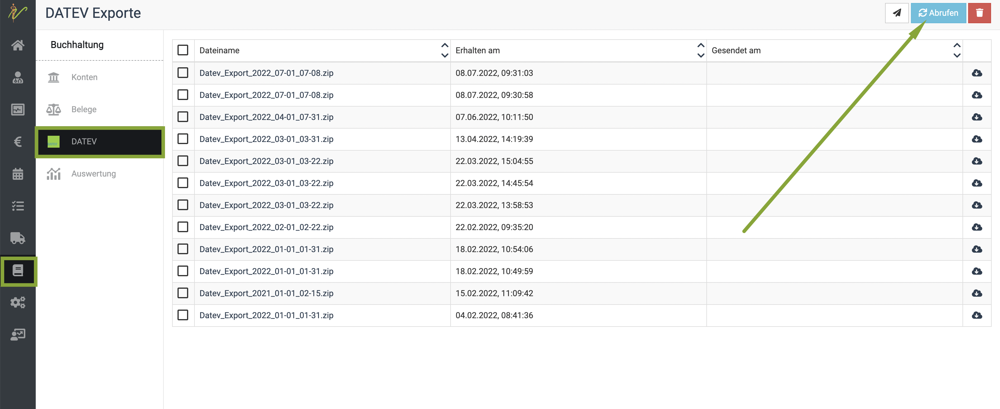
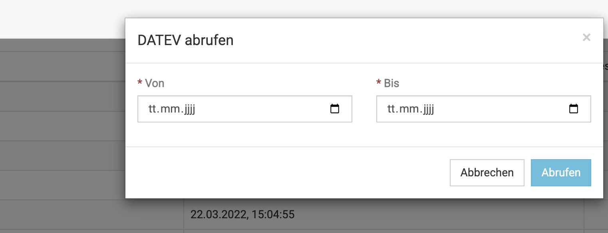
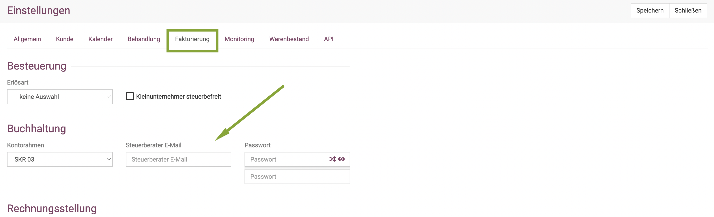
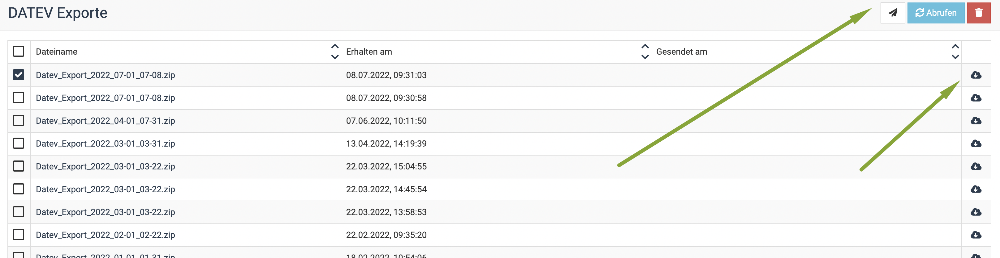

# Datev Exporte  

:::caution Hinweis  

Die Datev Export Funktion steht Ihnen ausschließlich zur Verfügung, wenn Sie die Collmex Erweiterung nutzen. Bei Interesse, 
diese zu nutzen, wenden Sie sich sehr gern an uns, wir können diese für Sie einrichten.  

:::  

Um einen Datev Export einzusehen oder zu erstellen, klicken Sie **Buchhaltung** und dann **Datev**.

Nun sehen Sie, falls bereits vorhanden, eine Liste mit Ihren bereits erstellten Datev Exporten. Um einen aktuellen Export zu erstellen/abzurufen,
klicken Sie oben rechts den blauen Button **Abrufen**.  

  

Nun öffnet sich ein Fenster, in dem Sie den gewünschten Datumsbereich setzen können.  

  

Wenn Sie den Datumssektor gesetzt haben, klicken Sie **abrufen**. 

Nun wird ein neuer Export erstellt.  

## Datev Export versenden  

Um den Export an Ihren Steuerberater zu verschicken, muss dessen Emailadresse hinterlegt sein. Diese hinterlegen Sie unter **Administration** und dann
**Einstellungen**, klicken Sie dort den Reiter "Fakturierung". Dort gibt es das Feld **Steuerberater Email**. Wenn Sie dort die Adresse hinterlegen, wird
diese für den Versand der Exporte genutzt.    

  

Markieren Sie den gewünschten Export durch aktivieren der **Checkbox** und klicken Sie dann oben rechts auf das **Papierflieger-Symbol**.

Alternativ können Sie die Exporte auch herunterladen, klicken Sie dazu auf das **Wolken-Symbol**.    

