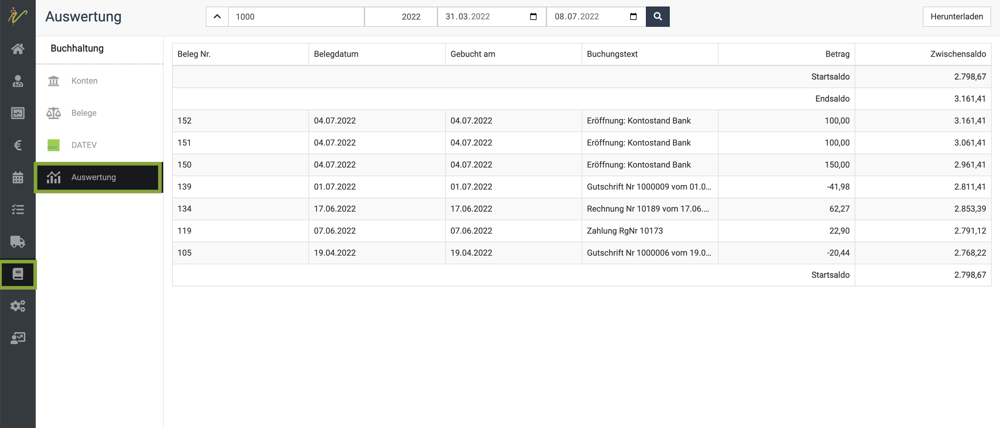
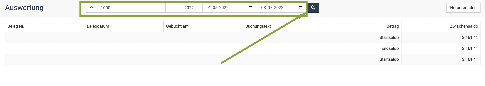
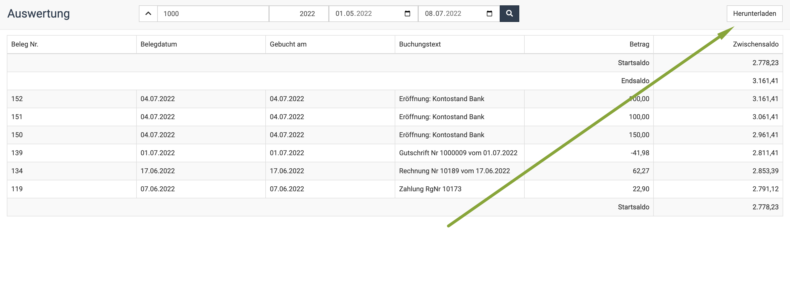

# Auswertungen  

:::caution Achtung  

Wenn Sie die Lexoffice Erweiterung nutzen, stehen Ihnen die Auswertungen nicht zur Verfügung, da Lexoffice diese nicht unterstützt in Richtung 
debevet. 

:::

Um sich die Auswertungen verschiedener Konten anzusehen, klicken Sie **Buchhaltung** und dann **Auswertung**.  

  

Nun müssen Sie oben ein auszuwertendes Konto eintragen (z.B. 1000) und dann den gewünschten Datumsbereich, denn Sie sich ansehen wollen.  

Drücken Sie dann die **Entertaste** oder klicken das **Suchen-Symbol**.  

  

Nun sehen Sie eine Auflistung der entsprechenden Belege für das gewählte Konto. Um diese herunterzuladen, können Sie 
rechts oben **Herunterladen** klicken. 

:::tip Tipp: 

Kennen Sie schon die Möglichkeit, sich die Salden der gewählten Konten direkt auf dem Dashboard anzeigen zu lassen?
Schauen Sie gern hier:  

[Salden auf dem Dashboard](/docs/Dashboard/Einrichtung#salden)  

:::