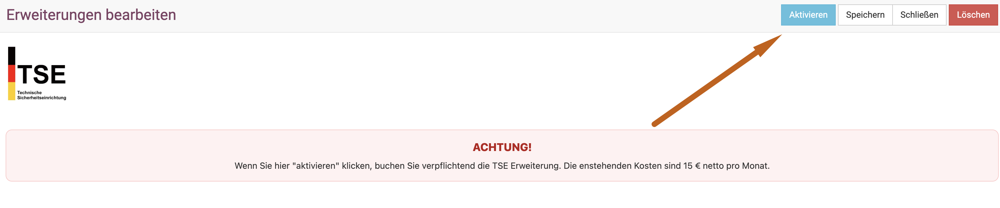
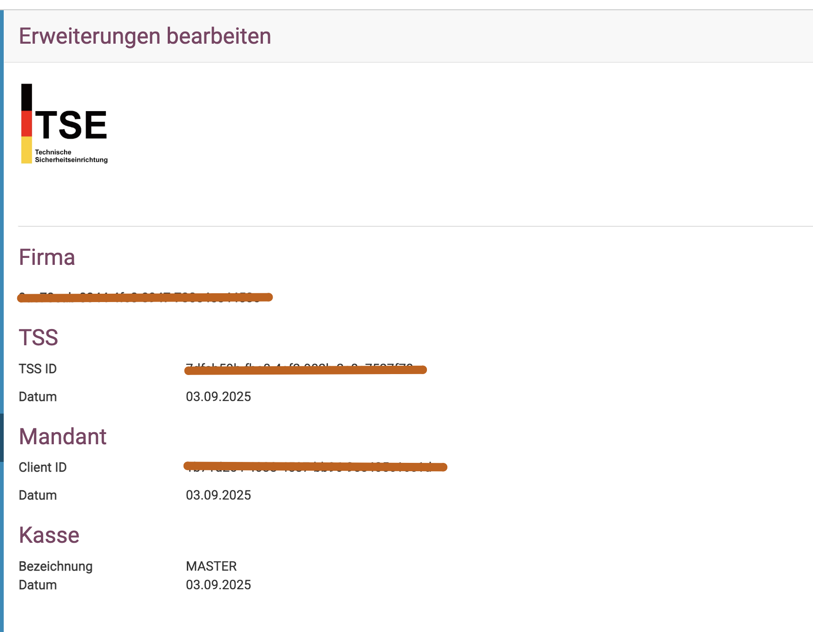
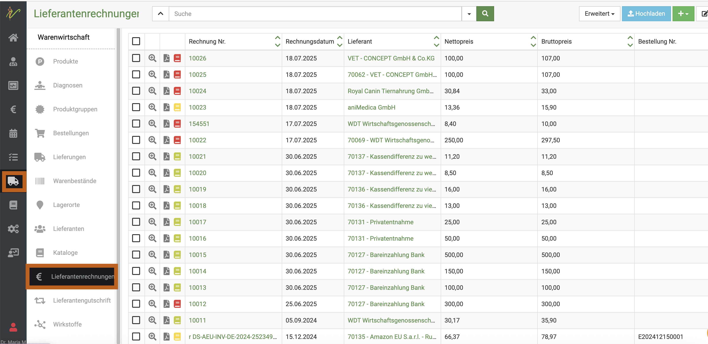
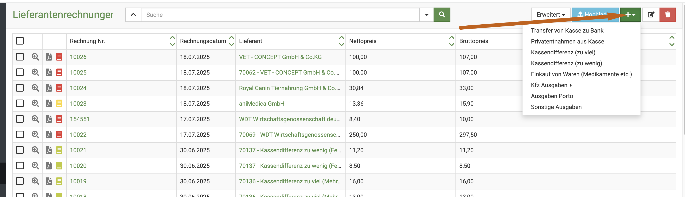
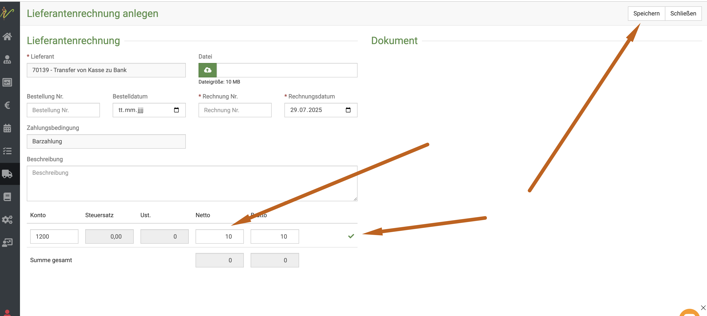
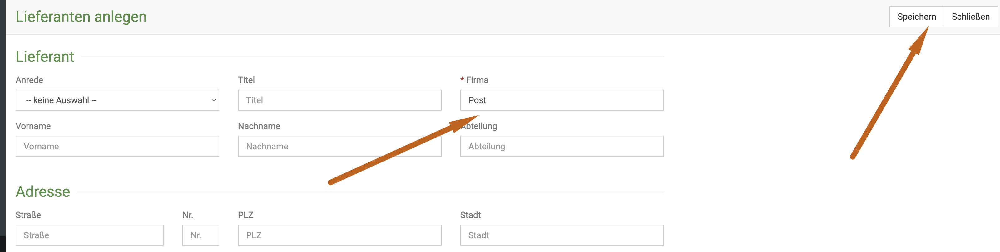
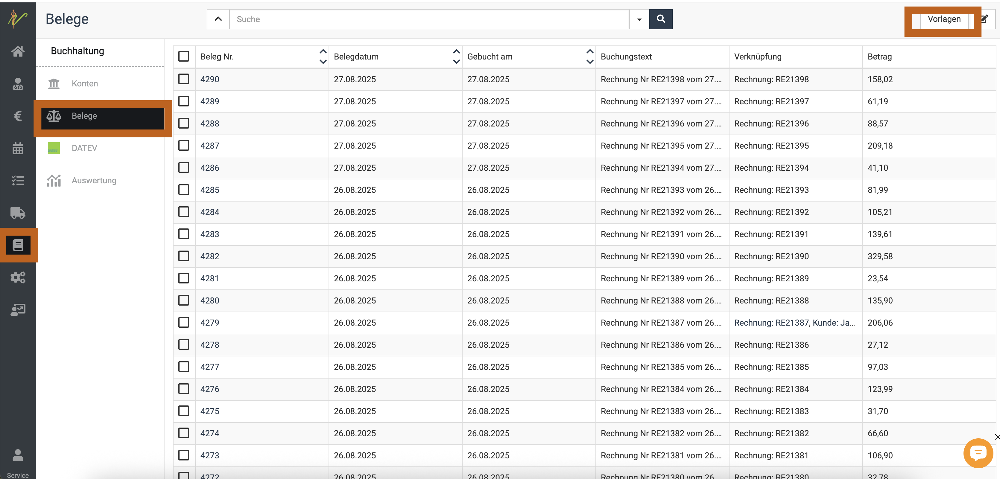
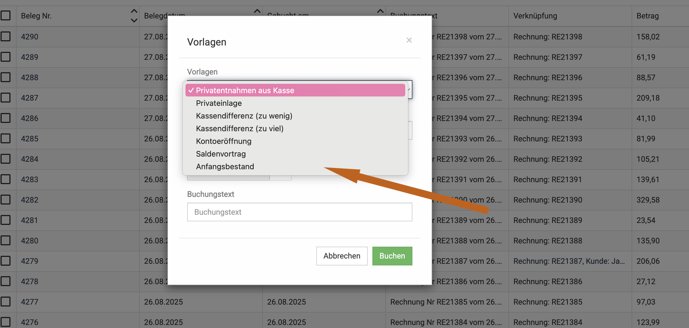

# Kasse  

Generell bietet debevet interne Buchhaltung kein eigenes Kassenbuch. Dies ist vor allem wichtig für die Pflicht zur Aufzeichnung, 
bitte beachten Sie dies! Die meisten unserer Kunden buchen deswegen die Collmex Schnittstelle, um ein voll digitales und automatisch "mitlaufendes 
Kassenbuch" zu haben.

Allerdings werden natürlich die Barzahlungen dennoch als "Kasse" gebucht, dies entspricht aber alleinstehend nicht der Aufzeichnungspflicht.   

Bitte beachten Sie generell folgende Informationen (Stand September 2025)     

## Offene Ladenkasse oder TSE?   

Bisher boten weder die debevet Buchhaltung noch Collmex eine TSE-Schnittstelle und somit auch keine TSE-Nummer zum melden an Ihr Finanzamt.  
Falls Sie bisher eine offene Ladenkasse genutzt haben, kann diese zunächst auch weiter genutzt werden. Genauere rechtliche Hintergründe 
bitten wir, mit dem Steuerberater oder dem Finanzamt zu klären.   

**Die Nutzung des Collmex Kassenbuches erfüllt alle Auflagen der offenen Ladenkasse.**  

Da dennoch viele Finanzämter die TSE fordern, haben wir ab August 2025 im debevet für beide Varianten (Collmex und debevet Buchhaltung)  
die Möglichkeit, für 15,00 Euro monatlich eine TSE-Schnittstelle hinzuzubuchen.  

Hierfür wird der bekannte Anbieter Fiskaly genutzt. Mit der Nutzung dieser sind Sie, auch hinsichtlich aller DSFinVK Exporte auf der 
sicheren Seite.   

## TSE buchen   

Da die Schnittstelle einem externen Anbieter unterliegt und wir diesen bezahlen müssen, fallen für die Zubuchung der TSE pro 
Monat 15 Euro netto an.   
Um die TSE zu buchen und zu aktivieren, gehen Sie bitte in den Bereich der Administration (Zahnrad Symbol) und suchen dann in 
"Erweiterungen" den Sektor "TSE".  

Klicken Sie zunächst "anlegen". 

   

Der Button ändert sich nun und kann erneut geklickt werden, um die TSE zu buchen.   

   

Nun sehen Sie, dass in der Buchungsübersicht des Paketes die monatlichen Kosten dann dazu addiert (Checkbox aktiviert) ist, 
dort können Sie dann erneut "buchen" klicken.   

:::caution Achtung!   
Die TSE steht nicht für das Solo Paket zur Verfügung!   

:::   

Das Programm richtet nach dem klick auf "aktivieren" nun die gesamte Schnittstelle automatisch ein und zeigt Ihnen an der Erweiterungdie 
benötigten Daten/Nummern an, die Sie beim Finanzamt melden müssen.   

     
  
Dies sieht dann so aus (Daten hier unlesbar gemacht!)

## Verschiedene Buchungen aus der Kasse   

Im normalen Praxisalltag gibt es ein paar Vorgänge, die häufig vorkommen. Diese können direkt im debevet gebucht werden- 

Dazu gehören:  
- Kassendifferenzen beim Tagesabschluss / Kassenabschluss   
- Privatentnahmen  
- Privateinlagen  
- Geld zur Bank bringen  
- Ausgaben aus der Kasse (z.B. Porto, Benzin, Bedarf etc.)  
- Bei Beginn der Software: Anfangsbestand der Kasse

## Kassenbuchungen über Lieferantenrechnung durchführen  

Egal, welchen der Schritte Sie durchführen möchten, der einfachste Weg ist der, über die Lieferantenrechnungen zu arbeiten.   
Klicken Sie dazu auf das "LKW Symbol" und dann "Lieferantenrechnungen".   

   

Klicken Sie nun oben rechts auf das grüne "Plus-Symbol" und wählen aus, welche Art der Buchung dies werden soll. Ich zeige hier das 
Beispiel "Transfer Kasse zur Bank".  

Sie müssen nun nur die Summe eintragen, die Sie aus der Kasse entnommen haben. (netto oder brutto ist dabei egal, da es 0,00% MWst sind).  
Klicken Sie dann unbedingt den grünen Haken in der Zeile und anschließend oben rechts "Speichern".  
   

## Rechnungen bar bezahlen /Kassen Entnahmen (z.B. Post, Tankstelle etc.)

Wenn Sie beispielsweise etwas Einkaufen, Tanken oder Briefmarken für Ihre Praxis kaufen und diese Entnahmen aus der Kasse entnehmen,
müssen diese verbucht werden. Bei lexware und Collmex tragen Sie die Entnahmen direkt im Kassenbuch ein (bei Collmex würde auch der hier beschriebene Weg funktionieren).

Sie müssen zunächst den Lieferanten anlegen (Beispiel "Post", "Edeka" etc.).

### Lieferant anlegen 

Falls Sie Post, Tankstelle oder andere Ausgaben benötigen, müssen Sie zunächst einen Lieferanten mit diesem Namen anlegen. 

Klicken Sie dazu auf **Warenwirtschaft** (LKW Symbol) und dann **Lieferanten**.   
Klicken Sie nun das **grüne Plus-Symbol** und geben dann den Namen ein und klicken **Speichern**.  

### Schritt 3 : Lieferantenrechung buchen

Nun müssen Sie diese "Lieferantenrechnung" nur noch buchen. Klicken Sie auf **Erweitert** und dann **Lieferantenrechnung buchen**. Nun ist Ihr Kassenbestand 
entsprechend geändert. 

  

## Kassenstart / Anfangsbestand   
Wenn Sie zu unserer Software wechseln, haben Sie vermutlich keinen Kassenbestand von Null Euro am Beginn des ersten Arbeitstages 
mit debevet.   

Um den korrekten Startbestand am Tag 1 einzugeben, gehen Sie bitte wie folgt vor:   

1. Klicken Sie "Buchhaltung" und dort "Belege" und dann oben rechts "Vorlagen"

  

2. Nun können Sie im sich öffnenden Fenster bei den Vorlagen "Anfangsbestand" wählen. Tragen Sie die gewünschte Summe ein und klicken
 "buchen". Der Kassenbestand ist nun hinterlegt und Sie können damit arbeiten.   

