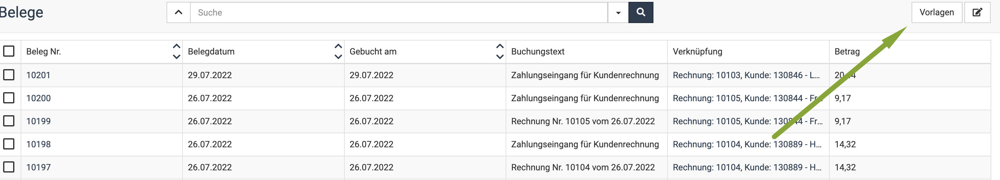
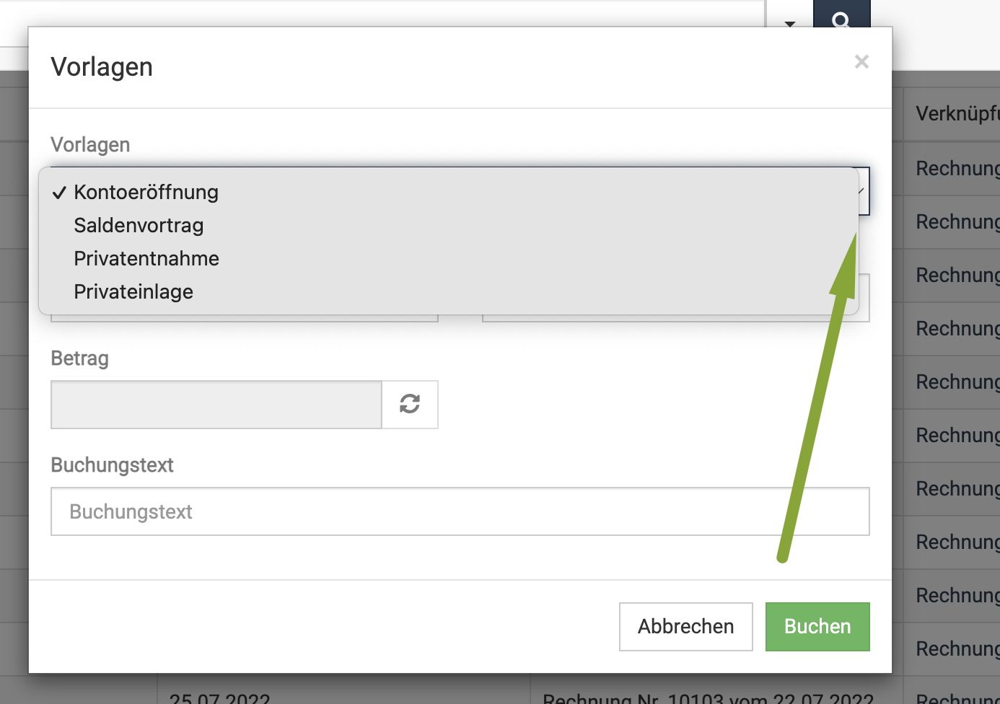
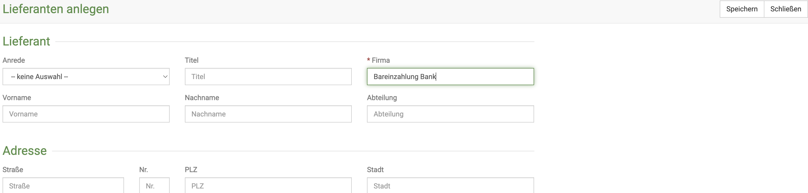
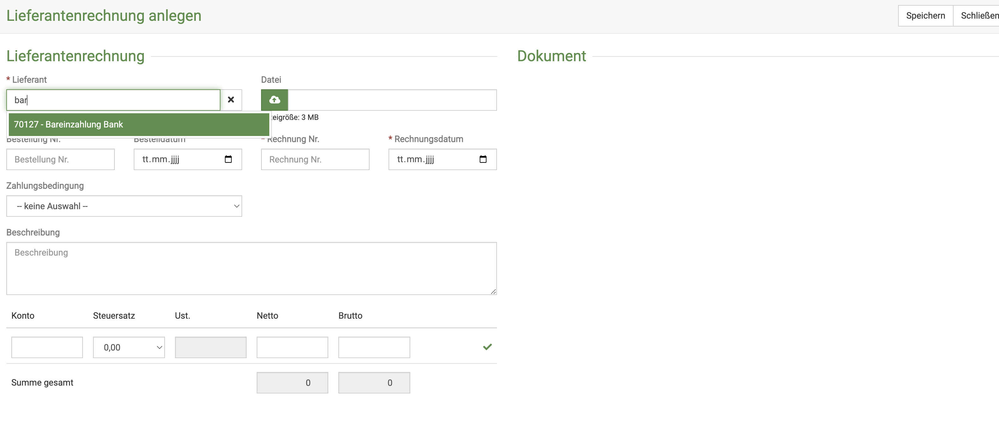
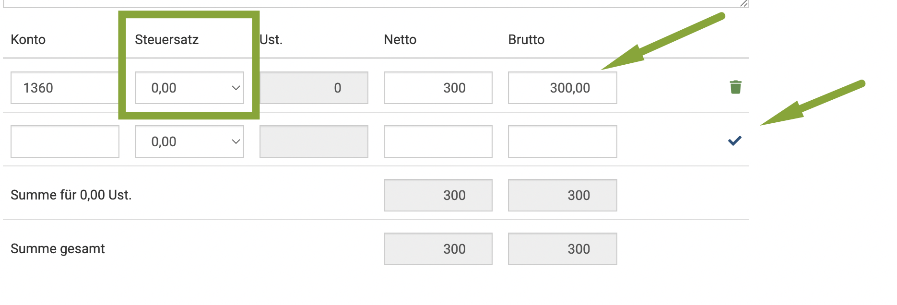
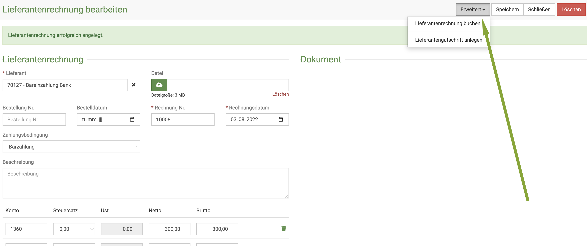
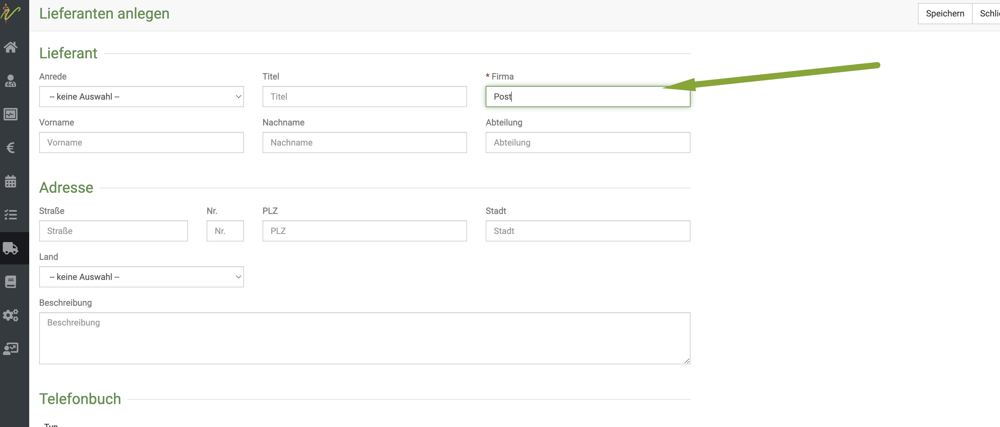
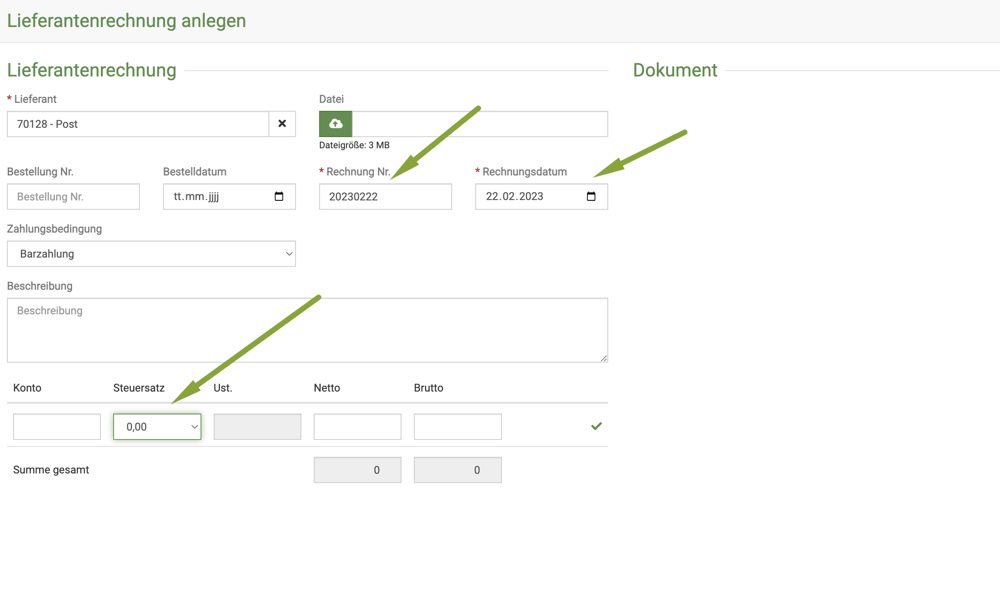
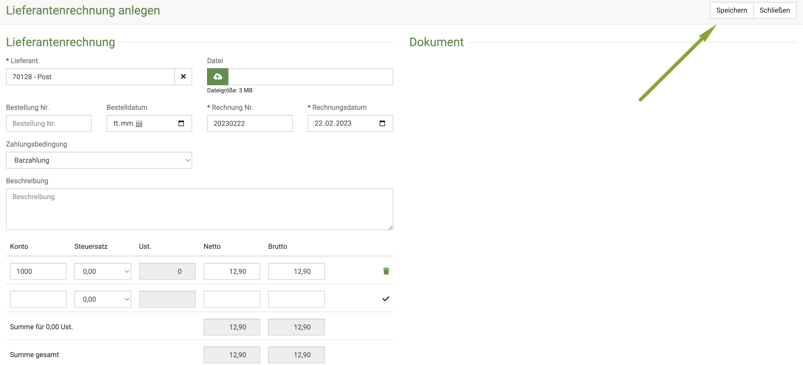

# Kasse  

Generell bietet debevet kein eigenes Kassenbuch. Allerdings werden natürlich die Barzahlungen dennoch als "Kasse" gebucht.
Je nachdem, welche Buchhaltungsanbindung Sie nutzen, haben Sie dort ein eigenes Kassenbuch, was sich dort auch führen lässt. 

## Kasse bei debevet Buchaltung 

### Privatentnahmen, Privateinlagen, Saldenvortrag

Privatentnahmen und Privateinlagen, Kontoeröffnung und Saldenvortag können direkt aus debevet heraus verbucht werden. 
Klicken Sie dazu (wenn Sie die debevet Buchhaltung nutzen!) auf **Buchhaltung** und dann **Belege**. Dort klicken Sie oben rechs **Vorlagen**. 

  

Wählen Sie dann am **Dropdown-Pfeil** in der sich nun öffnenden Maske die gewünschte Buchungsart. 

 
 
Außerdem müssen Sie das Buchhaltungskonto eingeben, auf dem die Buchung stattfindet sowie einen Buchungstext und die Summe. 

Anschließend klicken Sie auf **buchen**.  

## Einzahlung einer Entnahme aus der Kasse auf Ihr Bankkonto   

Wenn Sie Geld aus Ihren Bareinnahmen/ der Kasse zur Bank bringen, muss diese Summe natürlich auch aus der Kasse ausgebucht werden, damit 
der Kassenbestand weiter korrekt angezeigt wird. 

:::caution Achtung!   

Die hier beschriebenen Funktionen funktionieren so in der Form NICHT bei der Nutzung der lexware Buchhaltung. Dort müssen Sie das Kassenbuch komlett 
im lexware direkt berarbeiten.  

::: 

Bei Collmex könnten Sie es direkt mit dem Login im Collmex dort im Kassenbuch bearbeiten, aber der hier beschriebene Weg ist der, den Sie
gehen können, wenn Sie es direkt im debevet lösen möchten. 

### Schritt 1: Lieferant anlegen 

Legen Sie zunächst einen Lieferanten an, der beispielsweise "Bareinzahlung Bank" heißt.   

Klicken Sie dazu auf **Warenwirtschaft** (LKW Symbol) und dann **Lieferanten**.   
Klicken Sie nun das **grüne Plus-Symbol** und geben dann den Namen ein und klicken **Speichern**.  

  

### Schritt 2: Lieferantenrechnung anlegen

Legen Sie nun eine Lieferantenrechnung für diesen "Lieferanten" an.  Klicken Sie erneut auf **Warenwirtschaft** und nun **Lieferantenrechnung**.   
Erneut klicken Sie das **grüne Plus-Symbol**.   

Im Feld **Lieferant** tragen Sie den im vorherigen Schritt gesetzten Lieferanten ein.   

  

Als Zahlungsart geben Sie "Barzahlung" an und geben dann das gewünschte Buchhaltungskonto an. Normal sollte dieses "Geldtransit" sein, aber 
sprechen Sie dies bitte mit Ihrem Steuerberater ab!!   

Wichtig ist, dass Sie als Steuersatz "0,00" hinterlegen und dann den Betrag eingeben. Vergessen Sie nicht, dann den **grünen Haken** zu klicken! Nur so
wird die Eingabe übernommen! (dies erkennen Sie daran, dass dann in der Zeile an der Stelle, wo der Haken war nun ein Mülltonnen-Symbol ist).   

   

Klicken Sie nun auf **Speichern**.  

### Schritt 3 : Lieferantenrechung buchen

Nun müssen Sie diese "Lieferantenrechnung" nur noch buchen. Klicken Sie auf **Erweitert** und dann **Lieferantenrechnung buchen**. Nun ist Ihr Kassenbestand 
entsprechend geändert. 

## Rechnungen bar bezahlen /Kassen Entnahmen (z.B. Post, Tankstelle etc.)  

Wenn Sie beispielsweise etwas Einkaufen, Tanken oder Briefmarken für Ihre Praxis kaufen und diese Entnahmen aus der Kasse entnehmen, 
müssen diese verbucht werden. Bei lexware und Collmex tragen Sie die Entnahmen direkt im Kassenbuch ein (bei Collmex würde auch der hier beschriebene Weg funktionieren).  

Sie müssen zunächst den Lieferanten anlegen (Beispiel "Post", "Edeka" etc.). 

### Schritt 1: Lieferant anlegen

Legen Sie zunächst einen Lieferanten an, der beispielsweise "Post" heißt.

Klicken Sie dazu auf **Warenwirtschaft** (LKW Symbol) und dann **Lieferanten**.   
Klicken Sie nun das **grüne Plus-Symbol** und geben dann den Namen ein und klicken **Speichern**.

  

### Schritt 2: Lieferantenrechnung anlegen

Legen Sie nun eine Lieferantenrechnung für diesen "Lieferanten" an. Klicken Sie erneut auf **Warenwirtschaft** und nun **Lieferantenrechnung**.   
Erneut klicken Sie das **grüne Plus-Symbol**.

Im Feld **Lieferant** tragen Sie den im vorherigen Schritt gesetzten Lieferanten ein.

Als Zahlungsart geben Sie "Barzahlung" an und geben dann das gewünschte Buchhaltungskonto an. Falls Sie unsicher sind, welches dies ist (z.B. Betriebsausgabe, Kfz etc.)
sprechen Sie dies bitte mit Ihrem Steuerberater ab!!

Wichtig ist, dass Sie als Steuersatz den korrekten Steuersatz hinterlegen und dann den Betrag eingeben. Vergessen Sie nicht, dann den **grünen Haken** zu klicken! Nur so
wird die Eingabe übernommen! (dies erkennen Sie daran, dass dann in der Zeile an der Stelle, wo der Haken war nun ein Mülltonnen-Symbol ist).

Klicken Sie nun auf **Speichern**.

### Schritt 3 : Lieferantenrechung buchen

Nun müssen Sie diese "Lieferantenrechnung" nur noch buchen. Klicken Sie auf **Erweitert** und dann **Lieferantenrechnung buchen**. Nun ist Ihr Kassenbestand
entsprechend geändert.

