# Administration und Einstellungen 

In diesem Sektor finden Sie diverse Tricks und Kniffe für verschiedene Einstellungen, Nutzerverwaltung, die Verwaltung 
Ihrer Praxisdaten und vieles mehr.  

## Gelöschte anzeigen und wieder herstellen  

Da so häufig die Frage auftaucht, wie gelöschte Einträge (egal ob Kunden, Patienten, oder alle anderen Infos) angezeigt werden können,
wenn Sie gelöscht sind, zeigen wir dies in einem Video. Dort lernen Sie ebenfalls, wie Sie die gelöschten Einträge wieder herstellen können.  

:::info Videotipp  

<iframe width="560" height="315" src="https://www.youtube.com/embed/-bA9uTK_RFk" title="YouTube video player" frameborder="0" 
allow="accelerometer; autoplay; clipboard-write; encrypted-media; gyroscope; picture-in-picture" allowfullscreen></iframe>  

:::  

## Benutzerverwaltung  

Sie möchten, dass Ihre Mitarbeiter eigene Zugänge haben? Das ist bei debevet kein Problem, je nach Paket sind unterschiedlich
viele Nutzer im Monatspreis bereits inbegriffen. Darüberhinaus können Sie jederzeit schnell und eigenständig mehr Nutzer zu buchen.  

### Einen neuen oder weiteren Benutzer hinzufügen  

Um einen neuen Benutzer anzulegen, müssen Sie in die Nutzerverwaltung. Klicken Sie unten links auf das **Personen-Symbol** mit Ihrem Admin Namen. 

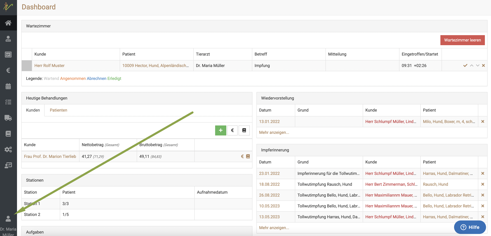  

Dann klicken Sie auf **Profil** und anschließend auf das Symbol mit der **Personengruppe**.  

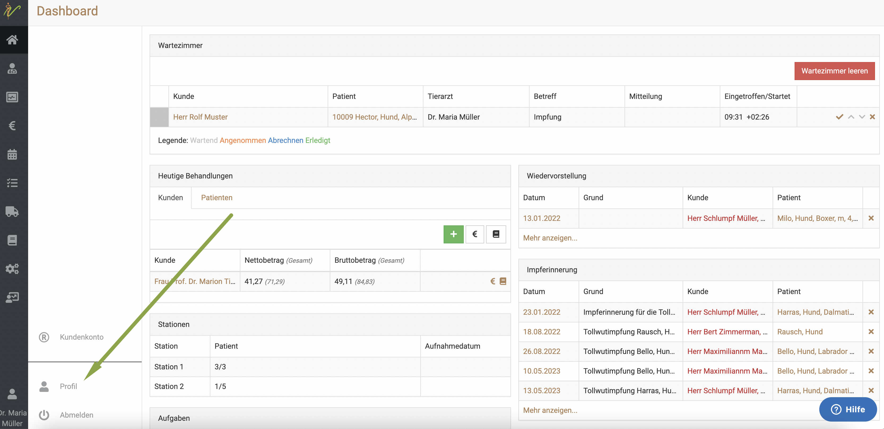  

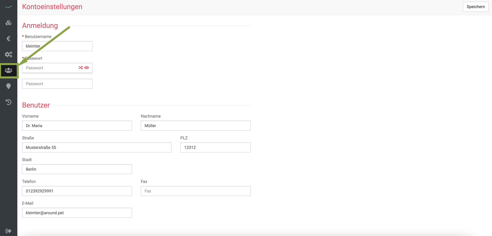  

Nun sehen sie eine Übersicht über die bereits vorhandenen Nutzer. 
Um einen neuen Nutzer anzulegen, klicken Sie oben rechts auf das **grüne Plus-Symbol**. 

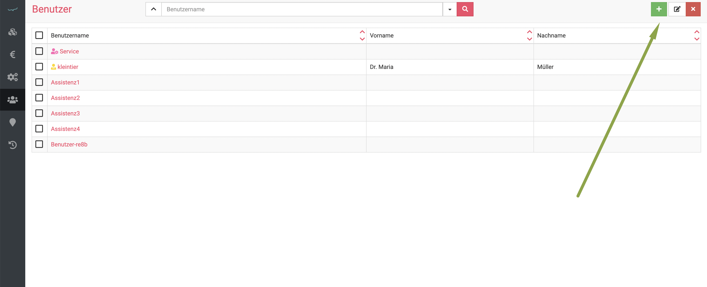   

Nun erscheint eine Maske, in der Sie sehen können, wie viele Ihrer Benutzer aus Ihrem Paket bereits belegt/zugewiesen sind. Die Preisinformation
gilt erst dann, wenn dort beispielsweise 3/3 steht und Sie dann einen weiteren Benutzer anlegen.  

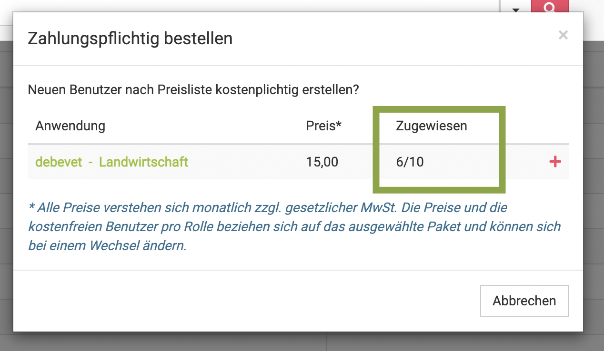

Wenn Sie nun auf das **rote Plus-Symbol** klicken, öffnet sich eine Eingabe Maske, in der Sie die gewünschten Daten des Nutzers anlegen können.  

:::tip Tipp 

Nutzen Sie einen Benutzernamen, der für Ihre Praxis und den Arbeitsplatz sinnvoll ist. Vergeben Sie ein sicheres Passwort mit Sonderzeichen. 

:::

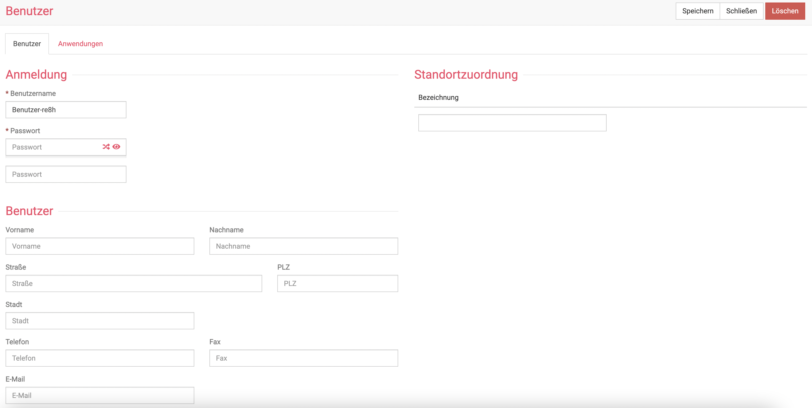   

Bitte beachten Sie zu dem Thema "verschiedene Nutzer" und deren Einträge auch unsere Sektion in der Behandlung. Dort erklären wir,
wie Sie für andere Benutzer einen Eintrag machen können.  

[Eintrag für andere Benutzer erstellen](/docs/Patienten/Behandlung#eintrag-für-anderen-benutzer-erstellen) 

## Benutzerrechte vergeben  

Eventuell möchten Sie nicht, dass alle Mitarbeiter Zugriff und Einsicht auf alle Interna, wie beispielsweise Umsätze oder Apotheke haben.
In diesem Fall können Sie Ihren unterschiedlichen Mitarbeitern als Benutzer unterschiedliche Rechte bzw. Zugriffe in der debevet Software zuteilen.  

Um einem Benutzer bestimmte Rechte zuzuweisen, klicken Sie in der Benutzerverwaltung auf den Namen des gewünschten Mitarbeiters.  

Dort klicken Sie nun den Reiter **Anwendungen** und dann rechts auf das kleine **Zahnrad-Symbol**. 

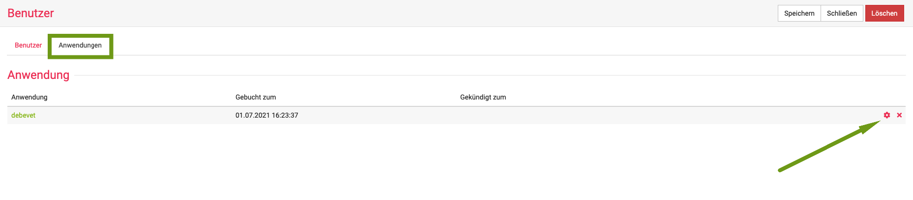  

In der sich nun öffnenden Seite klicken Sie den Reiter **Zugriffsrechte** und können dann Häkchen setzen oder deaktivieren, je nachdem,
welche Rechte der Benutzer erhalten soll. 

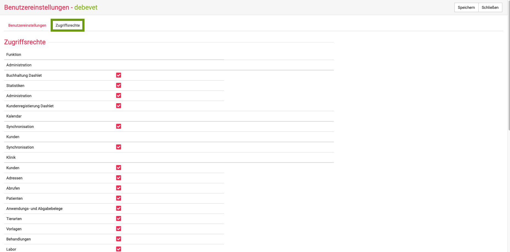  

Klicken Sie anschließend oben rechts auf **Speichern**. 

## Die Tierarzt ID am Benutzer hinterlegen 

Um dem Mitarbeiter eine Tierarzt ID zuzuordnen (wichtig für die AUA Belege), gehen Sie wie folgt vor: 

Klicken Sie unten links auf Ihren Namen und dann auf "Kundenkonto".   

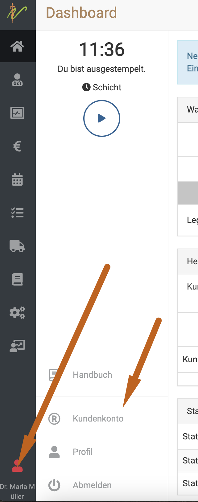  

Dort klicken Sie auf "Benutzer"  

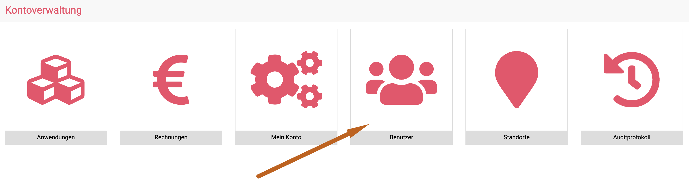  

Anschließend klicken Sie auf den Namen/ die Bezeichnung des betreffenden Mitarbeiters.  

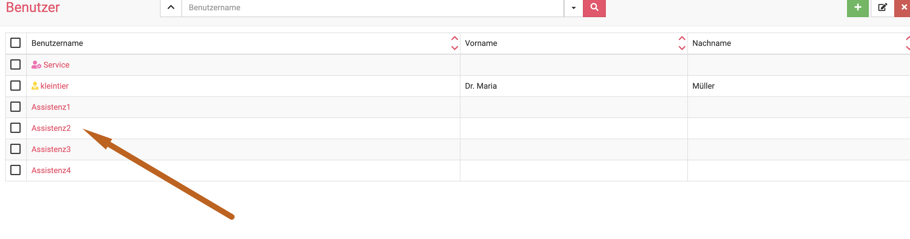  

Nun klicken Sie den Reiter "Anwendungen"  

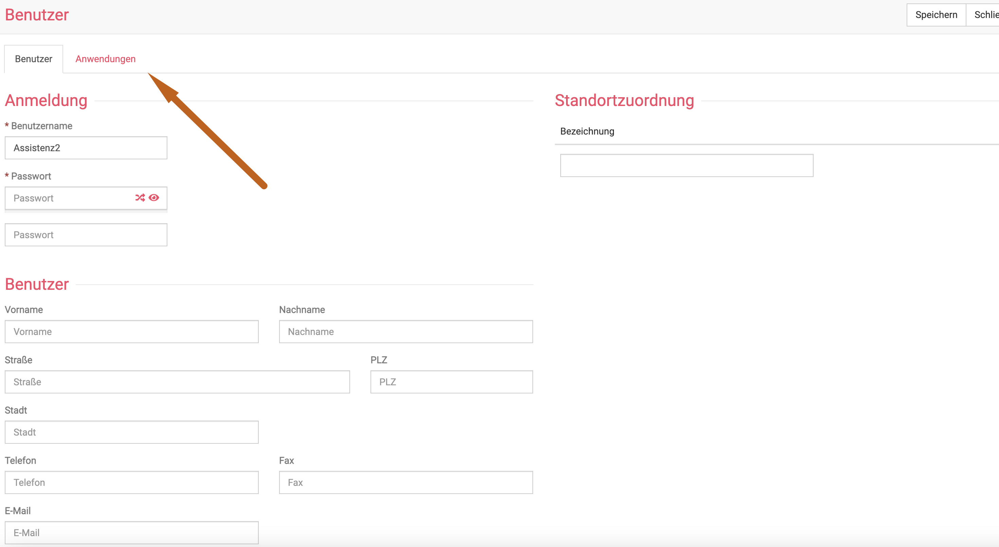   

Klicken Sie nun rechts das **kleine Zahnrädchen-Symbol**.  

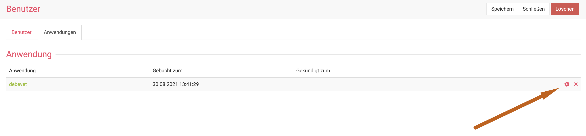   

Nun finden Sie das Feld für **Tierarzt ID**. Tragen Sie die ID ein und klicken Sie dann oben rechts **Speichern**.  

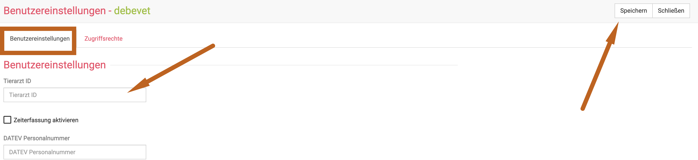  

:::info Videotipp:  

<iframe width="560" height="315" src="https://www.youtube.com/embed/1c_6SG6ao4Y" title="YouTube video player" frameborder="0" allow="accelerometer; 
autoplay; clipboard-write; encrypted-media; gyroscope; picture-in-picture; web-share" allowfullscreen></iframe>   

:::  

## Service Nutzer aktivieren 

Sollten Sie wünschen, dass sich ein Mitarbeiter des Supports einen Sachverhalt innerhalb Ihres debevet anschaut, 
so müssen Sie den Support dazu ausdrücklich legitimieren. Wie dies funktioniert, erfahren Sie im Folgenden.  

Melden Sie sich in debevet mit den Daten des **Kontoadministrators** an. Nur dieser kann die folgenden Einstellungen 
vornehmen. Klicken Sie unten links auf das **Benutzersymbol** und dann auf **Kundenkonto**.

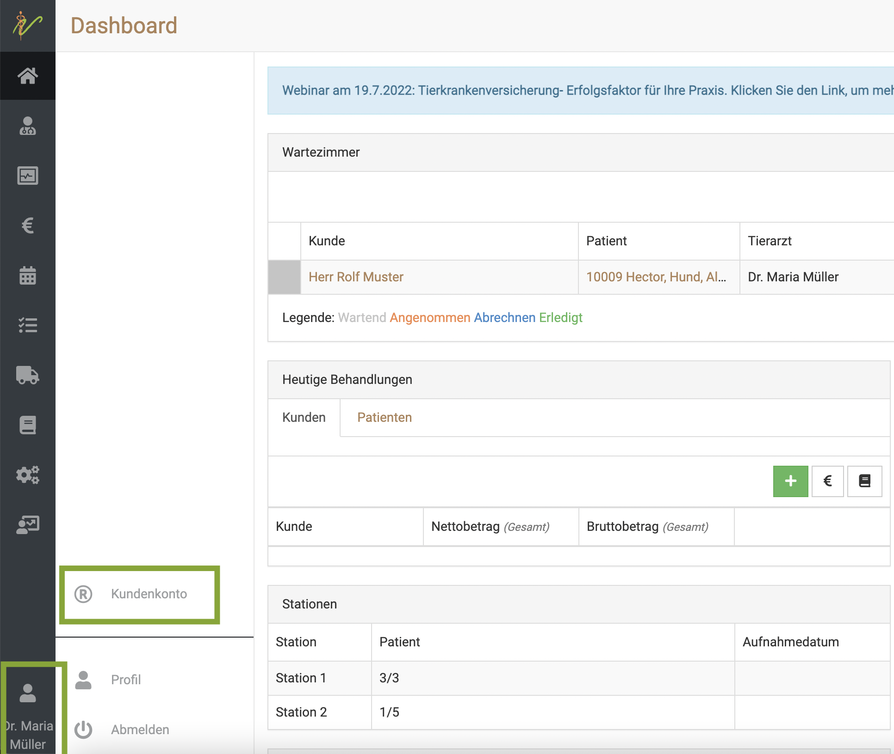 

Klicken Sie dann entweder auf die Kachel **Benutzer** oder links in der Leiste das **Gruppen-Symbol**.  

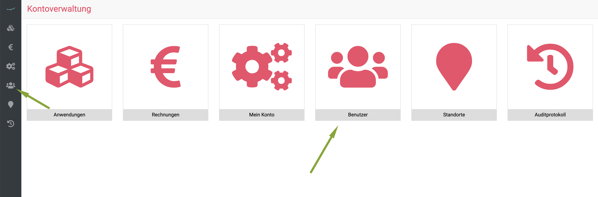  

Klicken sie nun auf den Benutzernamen **Service**.  

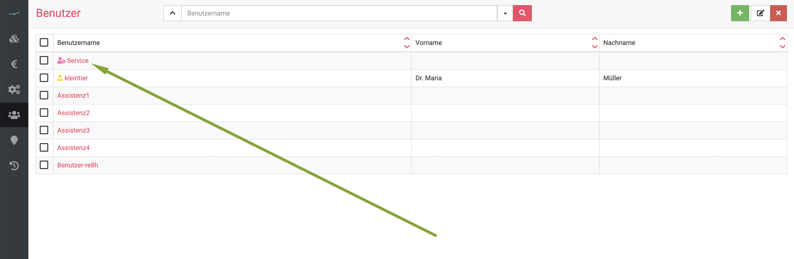  

Nun klicken sie oben rechts auf **Aktivieren**. 

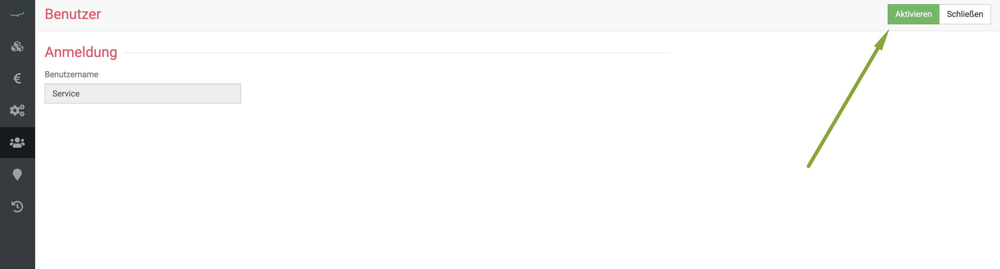

## Benutzer abmelden 

Um sich abzumelden, klicken Sie unten links auf Ihr **Benutzersymbol** und dann **Abmelden**.  

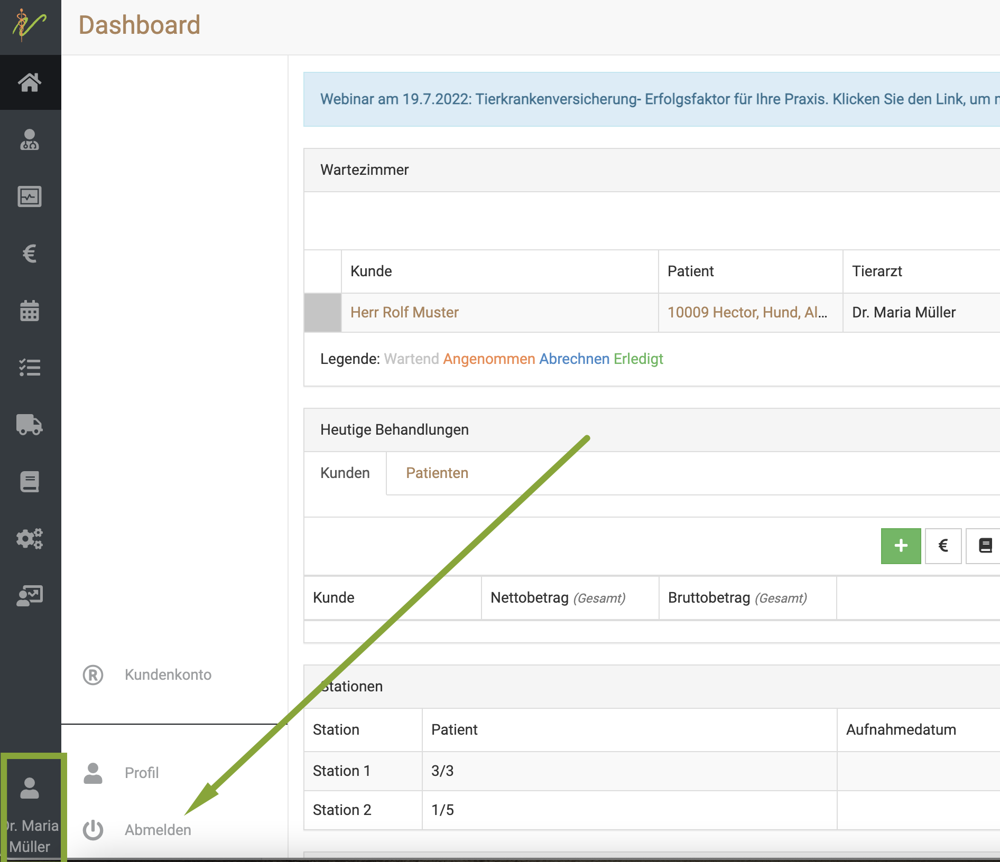

Ein Mitarbeiter des Supports hat nun die Möglichkeit, sich Ihr Anliegen näher anzuschauen. 
Nach 24 Stunden, wird der Service-Zugang automatisch deaktiviert.
Wünschen Sie eine frühere Deaktivierung, können Sie den Zugang auch bereits vorher durch Klicken auf 'Deaktivieren' wieder sperren, 
wo Sie zuvor 'Aktivieren' angeklickt haben.

Um die Kontoverwaltung zu verlassen und zurück nach debevet zu wechseln, klicken Sie unten links im Hauptmenü auf das **Exit-Symbol**.

## Email Versand und Einstellungen  

Zunächst ist es als Standard in Ihrem Account so eingestellt, dass Ihre Emails (Rechnungen, Briefe etc.) aus der debevet Software 
über einen Standard Server verschickt werden. 

Selbstverständlich können Sie einen anderen Server nutzen! Um Ihre eigenen Maildaten zu hinterlegen, klicken Sie auf **Administration** und dann 
**Email-Versand**. 

Wenn Sie oben rechts auf das **grüne Plus-Symbol** klicken, können Sie eine neue Mailadresse anlegen.

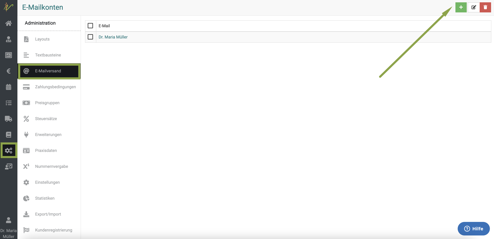  

Geben Sie zunächst nur Ihren Namen (der als Absendername erscheinen soll), die Mailadresse und das Passwort ein. Die Software versucht, die restlichen Einstellungen
selbständig zu finden. 

Wenn das nicht funktioniert, erscheint zwar eine Fehlermeldung, aber Sie können dann in den Feldern unten die Daten manuell eintragen. 

Klicken Sie anschließend oben rechts auf **Speichern**. 

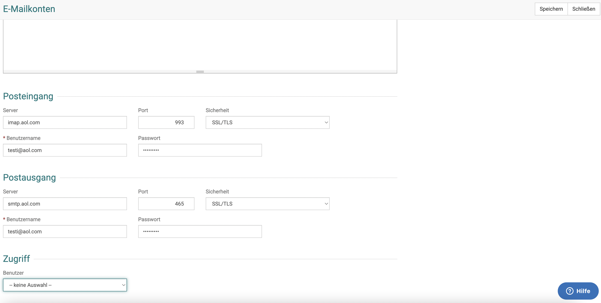  

:::tip Tipp: 

Ganz unten in diesen Einstellungen finden Sie **Zugriff**. Dort können Sie via Dropdown wählen, welcher Ihrer Benutzer diese Mailadresse
nutzen darf. (keine Auswahl = ALLE)  

:::  

### Email Details  

Entweder können Sie direkt beim Einrichten Ihrer Mailanbindung, oder später, eine Signatur (Unterschrift) für Ihre Mails einrichten 
und eine Mailadresse als Standard Versandadresse einrichten.  

Um die Maileinstellungen noch einmal zu bearbeiten, klicken Sie in der Übersicht Ihrer Email Konten auf den Namen des gewünschten Kontos. 

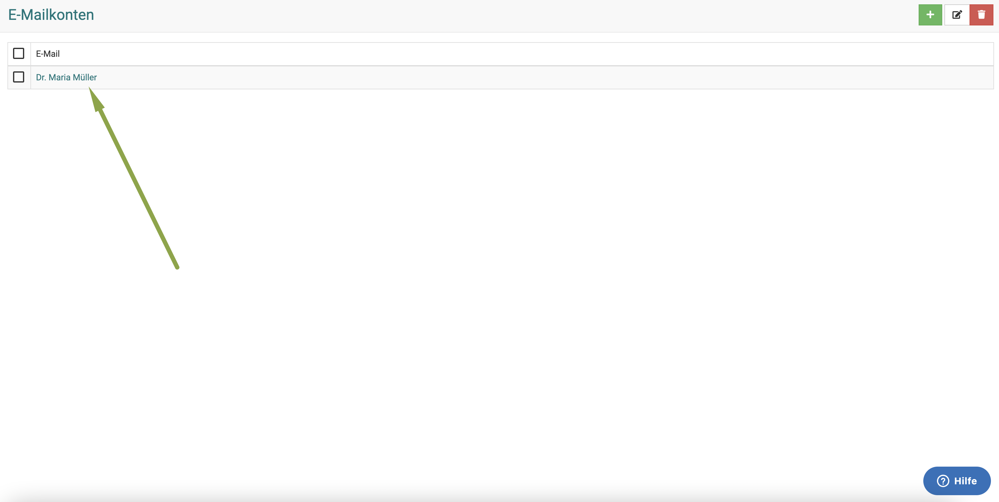  

Nun gelangen Sie in die Eingabemaske, die Sie bereits von der Einrichtung kennen. Oben sehen Sie die Möglichkeit, einen Haken bei
**Standard** zu setzen. Wenn dieser Haken gesetzt wird, wird diese Mailadresse immer als Standard genutzt, wenn Sie etwas aus 
debevet heraus via Mail verschicken.  

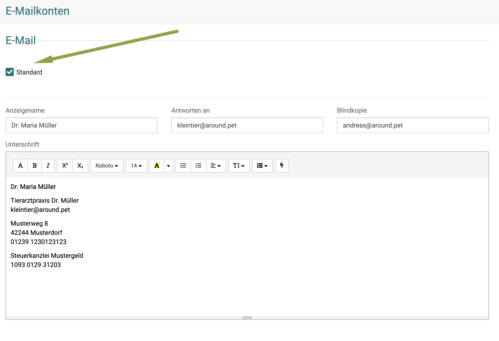  

Im Feld **Unterschrift** können Sie nun Ihre Signatur hinterlegen. Außerdem können Sie auf Wunsch auch weitere Mailadressen 
eingeben, an die beispielsweise immer eine Kopie verschickt werden soll, oder eine alternative Antwortadresse setzen.  

### Praxis in Blindkopie setzen  

:::tip Tipp zum Mailversand:

Wenn Sie sicher gehen möchten, ob Ihre Mails verschickt werden, können Sie bei jedem Mailversand eine Blindkopie an sich selbst verschicken lassen.
Tragen Sie dazu oben im Feld "Blindkopie" Ihre eigene Mailadresse ein.

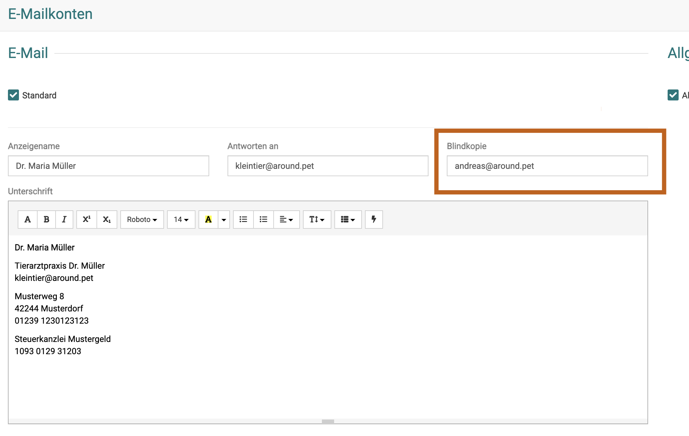

:::
### Über eigenen Server Emails verschicken  

Wenn Sie Ihren eigenen Mailserver hinterlegen wollen, um über IMAP Emails zu versenden, können Sie dies problemlos anlegen. Bedenken Sie aber bitte,
dass wir keinen Support bieten, wenn Mails bei Ihren Kunden als Spam erkannt werden. 
Bitte prüfen Sie Ihre eigene Mailadresse auf Spam-empfindlichkeit und sprechen dann mit dem IT Support, der für Ihren Mailserver verantwortlich ist. 
Ein Beispiel Link zur Spam Prüfung ist hier zu finden (wir bieten KEINEN Support dafür):  

[https://www.mail-tester.com/?lang=de](https://www.mail-tester.com/?lang=de)

Klicken Sie in der Detailansicht bei dem Email Einstellungen auf den Haken "Standard", um diesen zu entfernen. 
Nun können Sie weiter unten auf der Seite Ihre Server Daten hinterlegen.

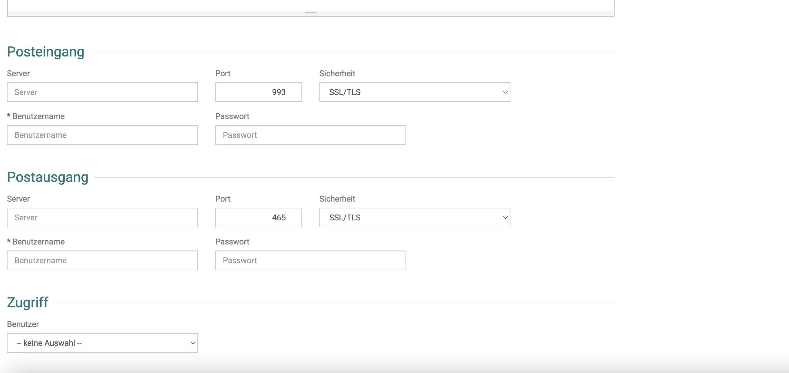

## Zahlungsbedingungen anlegen

Natürlich haben Sie die Möglichkeit, selbst Zahlungsbedingungen anzugeben. Um die Zahlungsbedingungen zu bearbeiten oder neue hinzuzufügen
klicken Sie auf **Administration** und dann **Zahlungsbedingungen**. Sie sehen nun die Übersichtsliste mit allen Zahlungsbedingungen.

Wenn Sie eine neue Zahlungsbedingung anlegen wollen, klicken Sie oben rechts auf das **grüne Plus-Symbol**.  

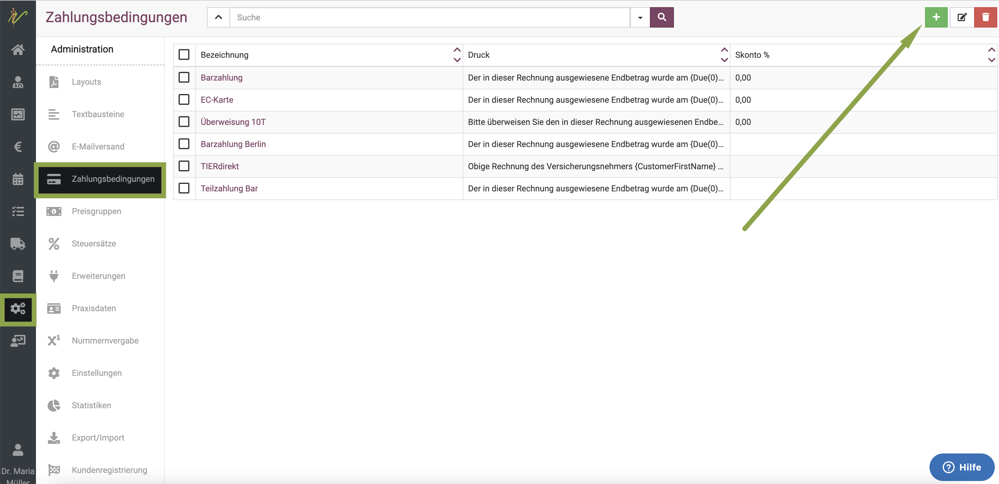  

Um eine Zahlungsbedingung zu bearbeiten, klicken Sie auf die Bezeichnung der gewünschten Zahlungsbedingung in der Spalte "Bezeichnung" in der 
Übersichtsliste.  

Die Maske, die sich nun öffnet, öffnet sich ebenso beim neu Anlegen einer Zahlungsbedingung.  

Sie können hier auch den Text hinterlegen, welcher am Fuß der Rechnung erscheinen soll. Diesen können Sie frei gestalten oder 
mit den Platzhaltern rechts ergänzen.

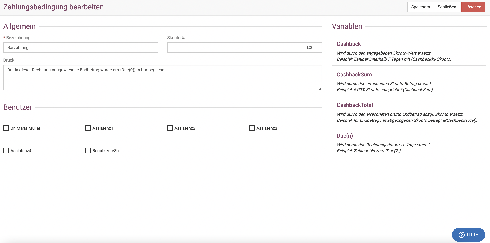  

:::caution Achtung!

Anschließend müssen Sie in Ihrer Buchhaltungserweiterung (außer bei Nutzung von lexware) die beiden Zahlungsbedingungen korrekt hinterlegen.  

:::  

Klicken Sie **Administration** und dann **Erweiterungen** und dann an Ihrer genutzten Buchhaltungserweiterung auf **bearbeiten**.

Nun wählen Sie unter **Zahlungsbedingungen** via Dropdown-Pfeil in der untersten Zeile eine der neuen Zahlungsbedingungen.
(hier am Beispiel Gutschriften) 

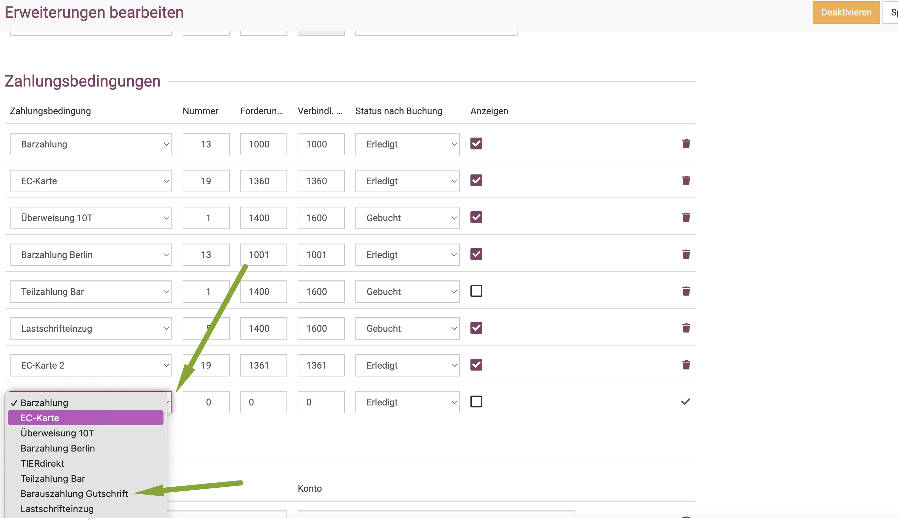

Bei den Konten tragen Sie die gewünschten Buchhaltungskonten ein (Rücksprache mit dem Steuerberater halten im Zweifelsfall) 

Setzen Sie außerdem das Häkchen bei **Anzeigen**, wenn Sie diese Zahlungsbedingung auch auf dem Dashboard sehen möchten.

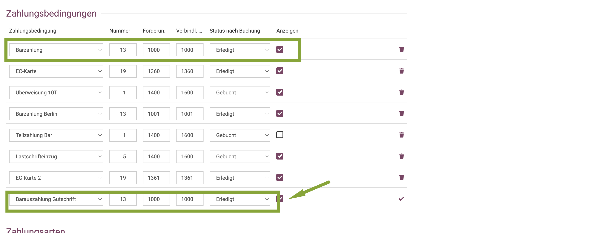

Klicken Sie anschließend oben rechts auf **Speichern**.

### Skonto 

Wenn Sie für eine bestimmte Zahlungsbedingung den Kunden Skonto gewähren möchten, kann diese hier ebenso pro Zahlungsbedingung 
hinterlegt werden. Klicken Sie dazu auf die gewünschte Zahlungsbedingung und tragen Sie in "Skonto" den gewünschten Prozentsatz sein.

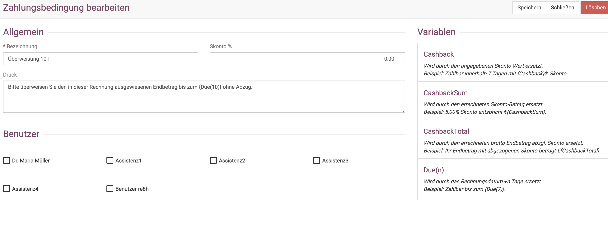

## Preisgruppen  

Sie können in debevet verschiedene Preisgruppen anlegen. An jedem Patienten haben Sie dann die Möglichkeit, diesem Kunden
eine dieser Preisgruppen zuzuordnen. 

:::caution Achtung 

An den Produkten müssen für die Preisgruppen dann auch veränderte Preise zu der passenden Preisgruppe hinterlegt werden, um diese dann
für den entsprechenden Kundenstamm günstiger (oder teurer ;) in der jeweiligen Preisgruppe automatisch anders zu berechnen.  

:::  

### Eine Preisgruppe anlegen  

Klicken Sie auf **Administration** und dann **Preisgruppen**. Nun sehen Sie, falls Sie schon Preisgruppen angelegt haben, eine Liste
mit allen Ihren Preisgruppen.
Um eine neue Preisgruppe zu erstellen, klicken Sie oben rechts auf das **grüne Plus-Symbol** und geben dann die Bezeichnung der gewünschten
Gruppe ein.  

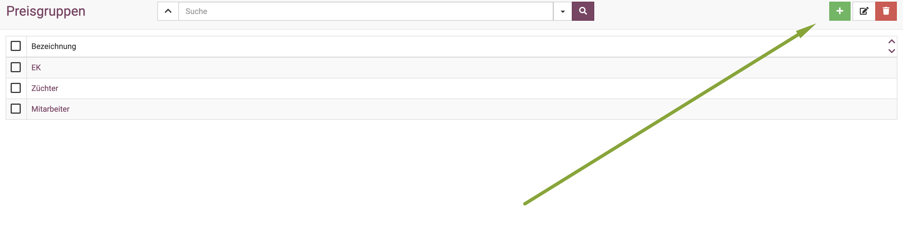

Klicken Sie dann auf **Speichern**. Die Preisgruppe ist nun angelegt, Sie sehen eine grüne Erfolgsmeldung.  

### Eine Preisgruppe an einem Produkt hinterlegen  

Nehmen wir an, dass Sie das Erstellen von Impfbescheinigungen bei allen Personen der Gruppe "Züchter" für 2,50 Euro anbieten wollen.
Öffnen Sie das Produkt "Impfbescheinigung" in der Produktliste. KLicken Sie auf den **Dropdown-Pfeil** unter dem bereits gesetzten 
Preis "Standard", um eine Preisgruppe aus den von Ihnen angelegten zu wählen.
 
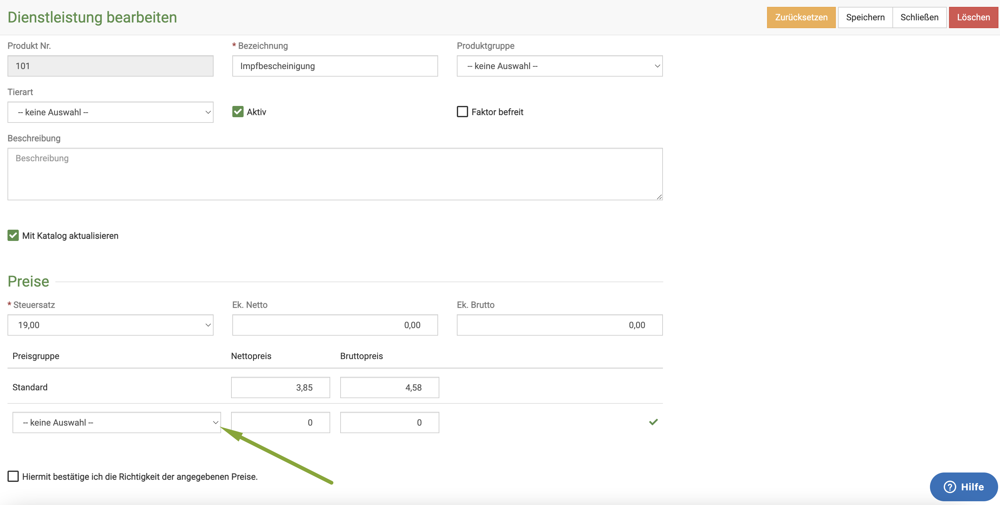  

Nun geben Sie den gewünschten netto Preis ein und klicken dann oben rechts auf **Speichern**. 

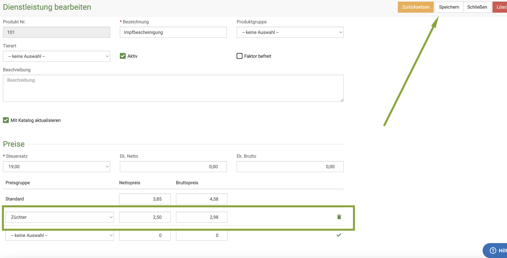  

### Einem Kunden eine Preisgruppe zuordnen  

Um nun einen Kunden zu einer bestimmten Preisgruppe hinzuzufügen, öffnen Sie den Kunden über Ihre Kundenliste.  

Klicken Sie dann auf den Reiter **Allgemein** und wählen dann bei "Preisgruppe" über den **Dropdown-Pfeil** die gewünschte 
Preisgruppe. Bitte nicht vergessen, zu **Speichern**.  

## Steuersätze  

Die Steuersätze (Umsatzsteuer alias Mehrwertsteuer) in debevet Cloud Tierarztsoftware können von Ihnen anhand der in 
Ihrem Land gültigen Sätze (Deutschland, Schweiz, Österreich, Niederlande u.v.m.) eigenständig gepflegt und geändert werden.

Um Steuersätze zu ändern, klicken Sie im Hauptmenü auf **Administration** und wählen Sie dann **Steuersätze**.  

:::caution Achtung  

**Hinweis für externe Buchhaltungssysteme (Collmex Finanzbuchhaltung, lexware)**

Die Änderung bestehender Steuersätze kann entscheidende Auswirkungen auf Ihre Buchhaltung haben und dort weitere Schritte notwendig machen. 
Vor allem wenn Sie eigene Erlöskonten in debevet definiert haben, können weitere Schritte in Ihrer Finanzbuchhaltungssoftware notwendig sein.

Für Fragen hierzu steht Ihnen der jeweilige Anbieter (www.collmex.de / www.lexware.de) zur Verfügung.

Für die interne Buchführung (debevet Buchhaltung) ist keine Änderung notwendig, außer Sie saldieren nach Erlöstyp und Ihr
Steuerberater wünscht ausdrücklich eine Anpassung der individuell pflegbaren Erlöskonten abweichend von Ihren bisher definierten Erlöskonten.   

:::    

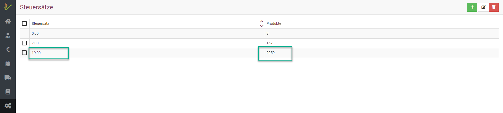  

### Steuersatz ändern 

Wählen Sie aus der Liste der hinterlegten Steuersätze, den Steuersatz, den Sie ändern möchten, in dem Sie auf die Zahl 
des Steuersatzes in der dargestellten Liste klicken. Die Zahl in der Spalte Produkte zeigt Ihnen an, wieviele Produkte (Medikamente,
Leistungen, Futtermittel u.a.) diesen Steuersatz verwenden, den Sie aktuell ändern möchten.

Hinweis: Der 0-%-Steuersatz kann nicht geändert oder gelöscht werden.  

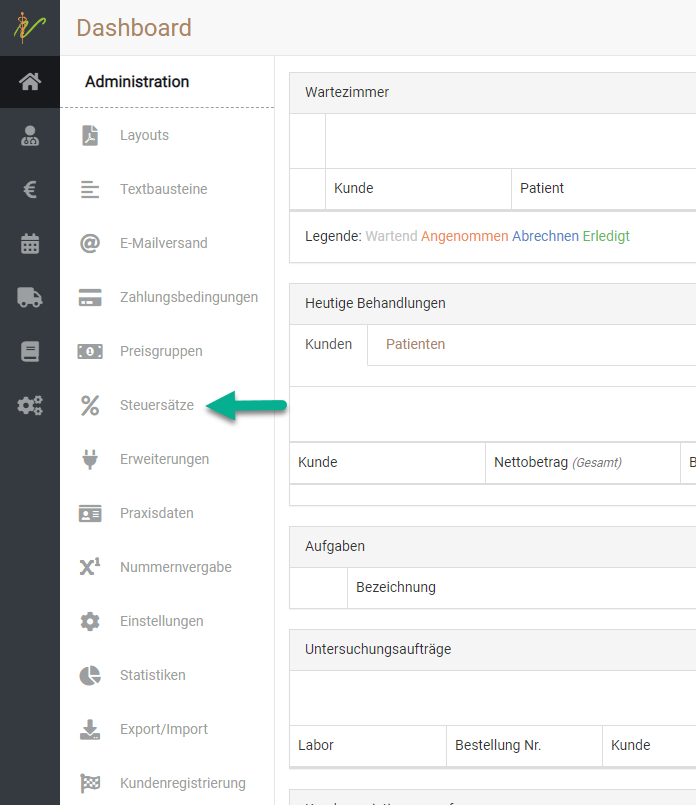  

Auf der nun folgenden Seite müssen Sie den Hinweis zur vorherigen Erfassung und Abrechnung ausdrücklich bestätigen. 
Sobald Sie den Hinweis bestätigt haben, können Sie den Steuersatz ändern und auf **Speichern** klicken.

Als Steuersatz zulässig ist eine Ganzzahl oder eine Gleitkommazahl mit maximal zwei Nachkommastellen. 
Ein Steuersatz muss außerdem eindeutig sein, das heißt, Sie können z.B. nicht zweimal den gleichen Steuersatz erfassen.   

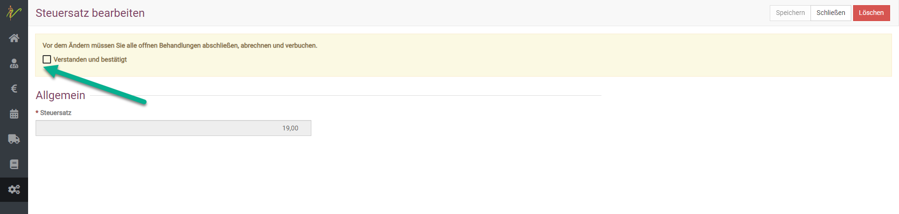  

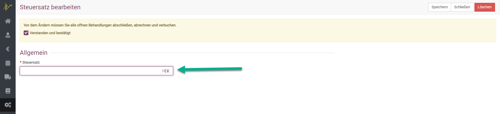  

Auf der folgenden Seite, wählen Sie die Berechnungsmethode aus, mit der die Preise der Produkte, die bisher diesen Steuersatz verwendet haben, 
neu berechnet werden sollen. Bitte beachten Sie die Hinweise zu den jeweiligen Berechnungsmethoden.

:::danger Achtung! 

**Tierarztpraxen und sonstigen Therapeuten, die auf der Grundlage von Gebührenverzeichnissen, Produktkatalogen (Laboklin, IDEXX u.a.) 
abrechnen oder sogar eine Hausapotheke führen, raten wir dringend davon ab, die Nettopreise zu verändern.**  

:::

Bevor Sie die Neuberechnung durchführen, müssen Sie dieser ausdrücklich zustimmen.  

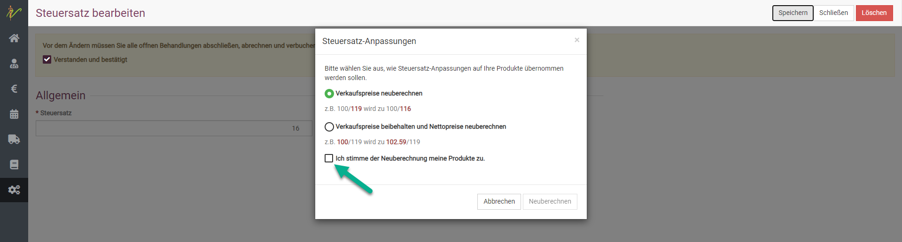  

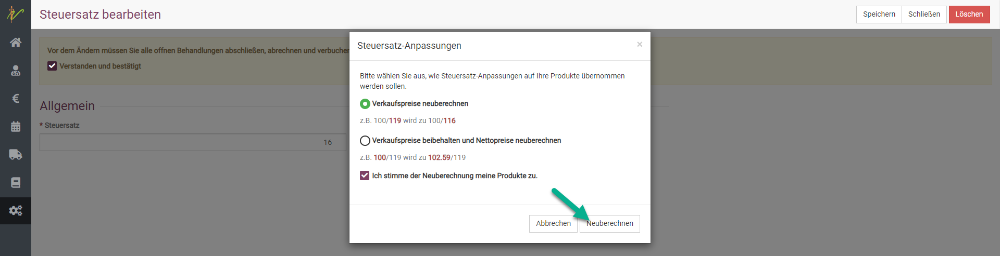  

### Steuersätze löschen

Klicken Sie im Hauptmenü auf **Administration** und dann auf **Steuersätze**.   

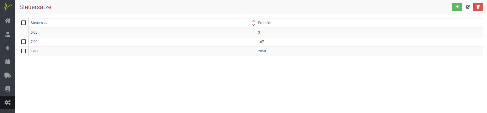    

Wählen Sie den Steuersatz, den Sie unwiderruflich löschen wollen, aus und klicken Sie oben rechts auf das **Mülleimer-Symbol**.

:::danger ACHTUNG!
Beachten Sie, dass alle Produkte mit diesem Steuersatz mit 0% Steuer neuberechnet werden.

:::

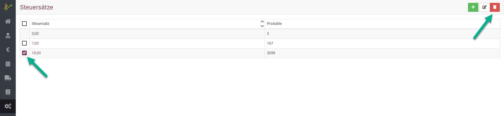

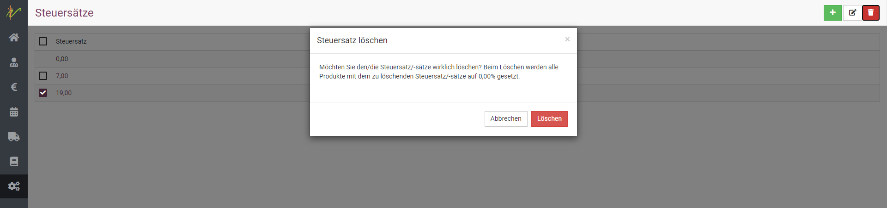
  
### Steuersatz hinzufügen

Klicken Sie im Hauptmenü auf **Administration** und dann auf **Steuersätze**. 
Auf der Liste der Steuersätze klicken Sie oben rechts auf das **grüne Plus-Symbol**.  

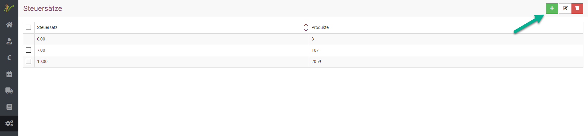  

Auf der nun folgenden Seite tragen Sie in das Feld Steuersatz den Satz ein und klicken abschließend oben rechts auf **Speichern**.  

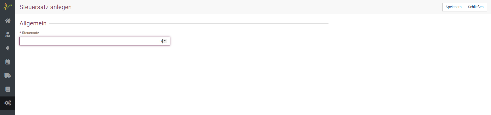

## Nummernvergabe  

Sie können die Nummernkreise der verschiedenen Entitäten einsehen und ggf. ändern. Klicken Sie auf **Administration** und dann
**Nummernvergabe**. 

Bitte beachten Sie hier, dass die Nummernkreise Rechnung und Gutschrift sich nicht überschneiden dürfen.  

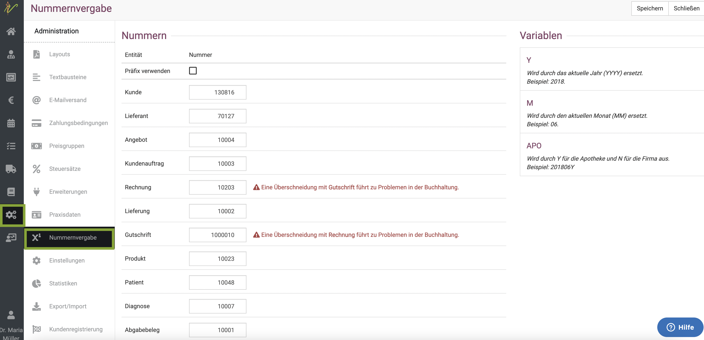   

## Export/ Import  

Um diverse Dateien zu importieren oder zu exportieren, klicken Sie auf **Administration** und dann **Export/Import**.  
Oben rechts können Sie dann **Neuen Import** oder **Neuen Export**  wählen.  

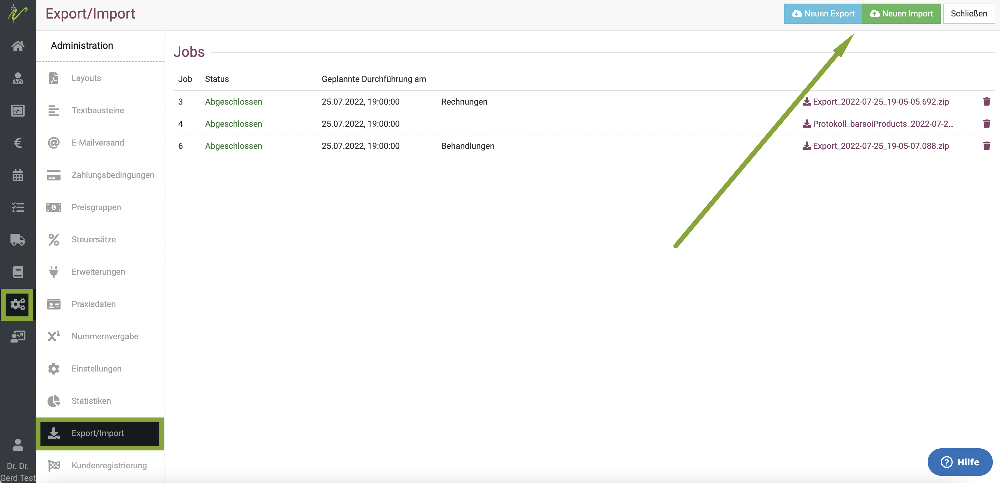
  
Unter Export können Sie je nach Kategorie exportieren:

**Rechnungen**
**Belege**
Für diesen Bereich sollten Sie einen Datumssektor angeben, für welchen exportiert werden soll

**Praxis**
* Kunden exportieren
* Patienten exportieren
* Behandlungen exportieren
* Befunde exportieren
* Diagnosespiegel exportieren
* AUA exportieren 
* Dokumente exportieren 

**Warenwirtschaft**
* Lieferanten exportieren
* Produkte exportieren
* Wartezeiten exportieren
* Anwendungsanweisungen exportieren
* Diagnosen exportieren
* Warenbestände exportieren  

:::tip Tipp: 
Wenn Sie die pfd für die Buchhaltung mit exportieren möchten, setzen Sie bitte den Haken an das Feld "Rechnungen PDFs erunterladen"  
Für Buchhaltungsbelege sollten Sie unbedingt den Filter setzen, für welchen Datumszeitraum Sie exportieren wollen.

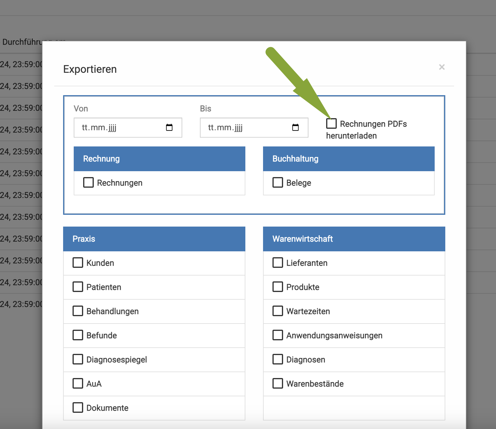  

:::   

Wenn Sie die gewünschten Exporte angeklickt haben, klicken Sie unten auf **Anlegen**.  

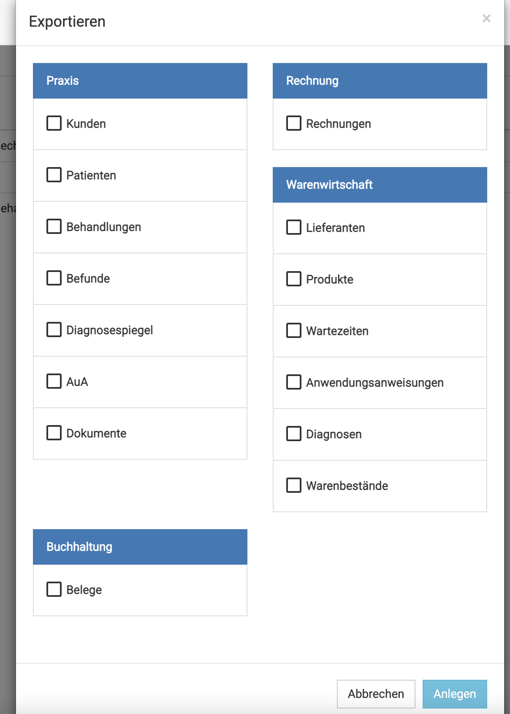

:::caution Bitte beachten!  

Die Anforderung des Exportes wird nicht direkt durchgeführt. Es wird nur ein Auftrag, ein sogenannter "Job" erstellt, der dann zu einer
bestimmten Uhrzeit erfolgt. Um die genannte Uhrzeit steht dann Ihr Export als CSV Datei zur Verfügung (Diese können dann im Excel eingelesen werden und be
Bedarf in eine xml Datei umgewandelt werden).     

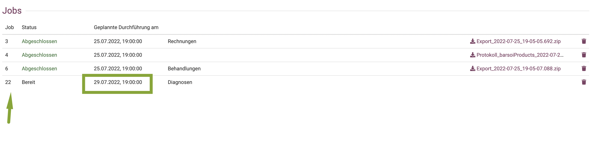  

::: 

Als Import stehen verschiedene Varianten (vor allem für den Wechsel aus anderen Programmen) zur Verfügung:

Debevet Daten:

Alle, die auch als Export zur Verfügung stehen

Import aus EasyVet:  

* Kunden
* Patienten
* Produkte
* Eigene Dienstleistungen  

Import aus Vetera:  

* Kunden  
* Patienten 

Sonstiges: 
* XML Barsoi-Liste importieren   

:::caution Bitte beachten!

Die Anforderung des Exports/Imports wird nicht direkt durchgeführt. Es wird nur ein Auftrag, ein sogenannter "Job" erstellt, der dann zu einer
bestimmten Uhrzeit erfolgt. Um die genannte Uhrzeit steht dann Ihr Export als CSV Datei zur Verfügung (Diese können dann im Excel eingelesen werden und be
Bedarf in eine xml Datei umgewandelt werden).

:::

:::tip Tipp 

Wenn Sie aus einem anderen Praxisprogramm zu debevet wechseln möchten, können wir aus den meisten Programmen die Kundendaten ohne 
Probleme und Kosten für Sie importieren!  

:::    

## Import von Kunden und Patienten aus anderen Programmen  

Sie haben die Möglichkeit, beim Wechsel zu debevet Ihre Kunden und Patienten zu importieren. Dazu benötigen Sie zwei getrennte 
CSV Dateien, eine für die Kunden (also Tierbesitzer) und eine für die Patienten. Beide müssen eindeutig zueinander zuzuordnen sein, über eine 
Kundennummer, Halter ID oder ähnliches. Dabei hat ein Kunde immer eine Kundennummer und seine Tiere alle dann eben diese Kundennummer, um zugeordnet werden 
zu können.    

Die Datenfelder, die benötigt werden, damit diese Daten sauber importiert werden können, sind bei der Kundendatei folgende  Spalten:  
(genauso benannt, genau in der Reihenfolge)

CUSTOMER_NO (Pflichtfeld)  hier muss die Kundennummer eingetragen werden. Sollten diese Kundennummern unter 10000 liegen, empfehlen wir eine Anpassung, um bei Nutzung von Collmex
keine Probleme zu provozieren und eine einwandfreie Verarbeitung in debevet generell zu ermöglichen. Achten Sie dabei darauf, dass die Kundennummern auch
am Tier (also in der Patientenliste) entsprechend geändert werden. Dies kann mit Chat GPT erfolgen oder durch einen Programmierer.  

**Wenn Sie schon bestehende Kunden in debevet haben, muss der Nummernkreis dem aktuellen Stand in Ihrem debevet angepasst werden!**

SALUTATION  Hier muss die Anrede eingefüht werden, entweder MRS oder MR (genau so, Schreibweise und Großbuchstaben immer beachten)   

FIRSTNAME   

LASTNAME  (Pflichtfeld)

FIRM  

DEPARTMENT (oft leer, aber Spalte muss vorhanden sein)   

STREET   

HOUSE (Hausnr.)   

POSTALCODE  (ACHTUNG! unbedingt in DE 5 stellig, keine anderen Zeichen!)

CITY  

PHONE_HOME  

PHONE_WORK  

EMAIL_WORK  

EMAIL  

EMAIL_CONSENT_DATE (Achtung, ALLE Daten immer im Format YYYY_MM-DD ansonsten kein Import machbar)  

HIT_NUMBER    

VVVO_NUMBER   

Die Datenfelder, die benötigt werden, damit diese Daten sauber importiert werden können, sind bei der Patientendatei folgende  Spalten:  
(genauso benannt, genau in der Reihenfolge)   

CUSTOMER_NO  Siehe Anmerkung in der Kundendatei! Muss unbedingt das Matchen der Patienten zu den Kunden ermöglichen   

PATIENT_ID  (leer lassen, wird von debevet im Hintergrund gefüllt)  

PATIENT_NO  (steigene Nummer von 10000 aufwärts, Pflichtfeld! Wenn im debevet bereits Patienten eingetragen sind, Nummern an den laufenden Nummernkreis 
anpassen!)   

CALLNAME 

SPECIES (Katze, Hund, Rind, Schwein, Kaninchen, KEINE RASSEN!)   

RACE  (Rassen, aber vieles wird nicht einlesbar sein, je nach Schreibweise etc. Kann aber nach Import dann bei Behandlung gesetzt werden)   

GENDER  (GEschlecht, immer setzen als MALE oder FEMALE)    

COLOR (kann ausgefüllt werden, muss aber nicht)   

EUID  (Heimtierausweisnummer)   

DESCRIPTION   (Anmerkungen zum Tier)   

CASTRATED  (nur 0 (nein) oder 1 (ja) eintragen!   

BIRTHDATE  (wieder strikt im Format YYYY-MM-DD- es wird NICHTS anderes toleriert und der Import wird abgebrochen!!!)  

OBIT  (leer lassen)  

CHIP_NO   

CHIP_DATE  (Siehe Datumsformat birthdate))   

:::caution   ACHTUNG  

Wir bitten um Beachtung: Uns erreichen oft fehlerhafte Daten, bei denen z.B. der Name im Feld Geburtsdatum steht, der ort bei Telefonnnummer etc. 
Wir bitten Sie, dass Sie selbst die Daten mit Hilfe von Chat GPT sauber aufarbeiten und korrigieren, damit diese importfähig werden. Wir assistieren gern,
aber wenn die Aufarbeitung mehrere Stunden dauert, behalten wir uns vor, dies in Rechnung zu stellen.   

:::   

## Kleinunternehmer  

Sie sind Kleinunternehmer und somit umsatzsteuerbefreit? Natürlich kann debevet alle Ihre Rechnungen auch mehrwertsteuerbefreit ausstellen.

Generell werden dann die Nettopreise am Kunden in der Rechnung abgerechnet.  

Um diese Einstellung zu aktivieren, klicken Sie **Administration** und dann **Einstellungen**.  

Dort klicken Sie den Reiter **Fakturierung** und setzen dann den Haken bei "Kleinunternehmen steuerbefreit".  

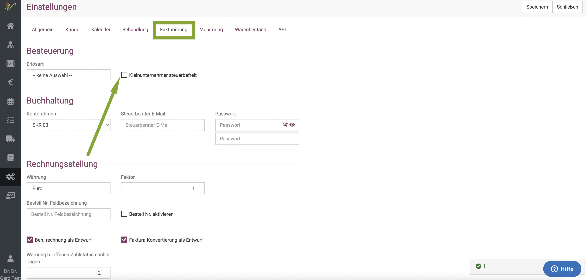  

Sie sind verpflichtet, der Rechnung einen schriftlichen Zusatz hinzuzufügen, dass es sich um eine Kleinunternehmerrechnung handelt. 
Wir empfehlen, diese als Schlusstext unter die Zahlungsbedingung zu setzen.  

Klicken Sie auf **Administration** und dann **Textbausteine**. Dort finden Sie unter den Standard Texten den **Schlusstext**.

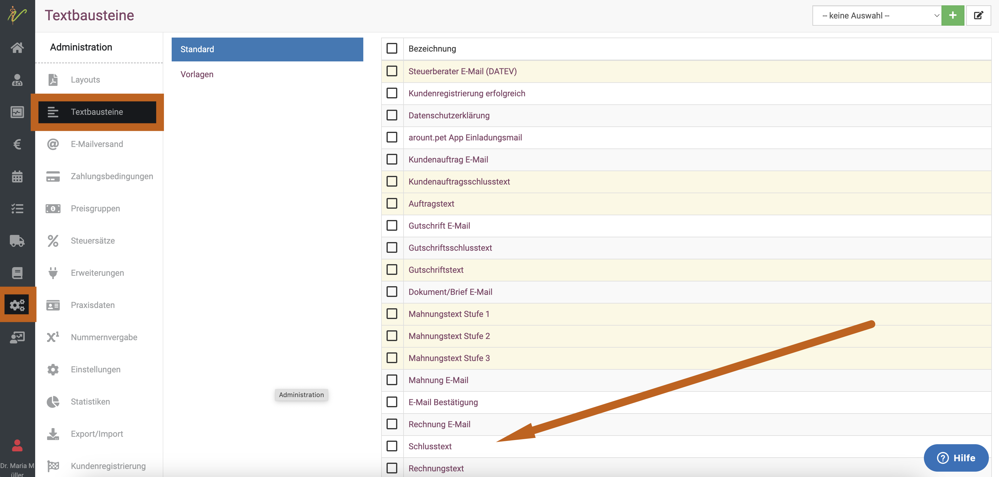  

Klicken Sie auf das Wort **Schlusstext**, um diesen zu bearbeiten/neu anzulegen.  

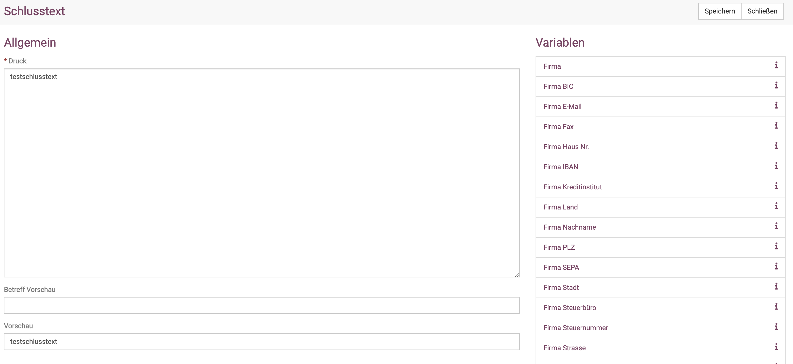  

:::tip Tipp: 

Wenn Sie es wünschen, können sogar (wie bei vielen Textvorlagen im debevet) individuelle Texte mit den Variablen rechts hinzugefügt werden.  

:::  

Um die Rechnungen buchhalterisch korrekt verbuchen zu können, müssen Sie nun außerdem noch in der Buchhaltungserweiterung die 
Steuerbefreiung hinterlegen. 
Klicken Sie dazu auf **Administration** und dann **Erweiterungen**. Klicken Sie dann auf die Erweiterung, die Sie nutzen (hier im Beispiel
in den Bildern die debevet Buchahltung, das Prinzip ist aber bei allen gleich). 

Im Bereich der Erlöskonten müssen Sie den Dropdownpfeil an jeder Zeile klicken.

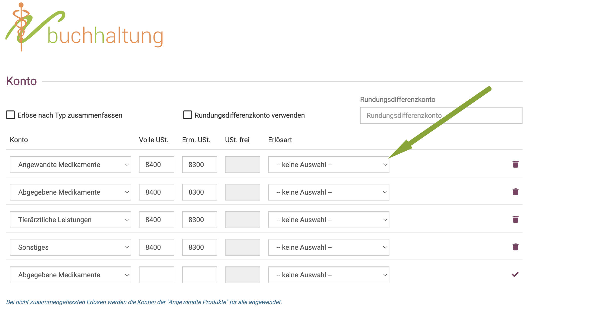

Dann öffnet sich die Auswahl, in der Sie "generell steuerbefreit" wählen.

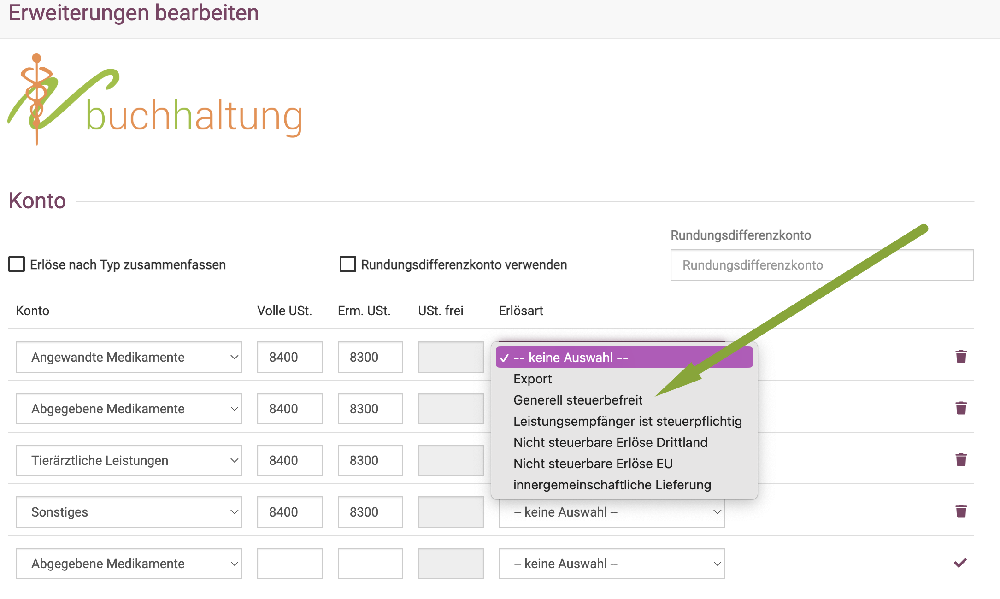  

Nun ändern sich die grau hinterlegten Felder bei den Buchhaltungskonten und Sie müssen bei "Ust frei" das entsprechende Buchhaltungskonto
hinterlegen. Fragen Sie hierzu bitte Ihren Steuerberater, welches Erlöskonto Sie nutzen sollen. (in SKR03 ist dies eigentlich 8195 und in SKR04 4185).

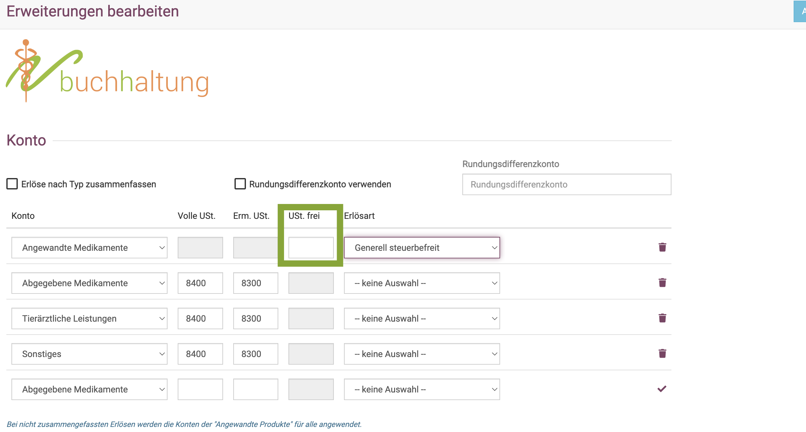

 

