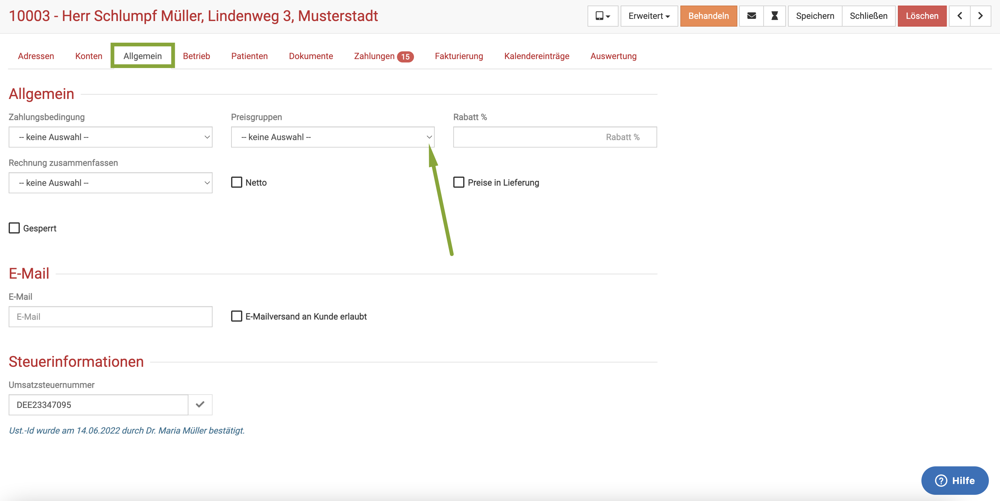

# Administration und Einstellungen 

In diesem Sektor finden Sie diverse Tricks und Kniffe für verschiedene Einstellungen, Nutzerverwaltung, die Verwaltung 
Ihrer Praxisdaten und vieles mehr.  

## Gelöschte anzeigen und wieder herstellen  

Da so häufig die Frage auftaucht, wie gelöschte Einträge (egal ob Kunden, Patienten, oder alle anderen Infos) angezeigt werden können,
wenn Sie gelöscht sind, zeigen wir dies in einem Video. Dort lernen Sie ebenfalls, wie Sie die gelöschten Einträge wieder herstellen können.  

:::info Videotipp  

<iframe width="560" height="315" src="https://www.youtube.com/embed/-bA9uTK_RFk" title="YouTube video player" frameborder="0" 
allow="accelerometer; autoplay; clipboard-write; encrypted-media; gyroscope; picture-in-picture" allowfullscreen></iframe>  

:::  

## Benutzerverwaltung  

Sie möchten, dass Ihre Mitarbeiter eigene Zugänge haben? Das ist bei debevet kein Problem, je nach Paket sind unterschiedlich
viele Nutzer im Monatspreis bereits inbegriffen. Darüberhinaus können Sie jederzeit schnell und eigenständig mehr Nutzer zu buchen.  

Um einen neuen Benutzer anzulegen, müssen Sie in die Nutzerverwaltung. Klicken Sie unten links auf das **Personen-Symbol** mit Ihrem Admin Namen. 

  

Dann klicken Sie auf **Profil** und anschließend auf das Symbol mit der **Personengruppe**.  

  

  

Nun sehen sie eine Übersicht über die bereits vorhandenen Nutzer. 
Um einen neuen Nutzer anzulegen, klicken Sie oben rechts auf das **grüne Plus-Symbol**. 

   

Nun erscheint eine Maske, in der Sie sehen können, wie viele Ihrer Benutzer aus Ihrem Paket bereits belegt/zugewiesen sind. Die Preisinformation
gilt erst dann, wenn dort beispielsweise 3/3 steht und Sie dann einen weiteren Benutzer anlegen.  

Wenn Sie nun auf das **rote Plus-Symbol** klicken, öffnet sich eine Eingabe Maske, in der Sie die gewünschten Daten des Nutzers anlegen können.  

:::tip Tipp 

Nutzen Sie einen Benutzernamen, der für Ihre Praxis und den Arbeitsplatz sinnvoll ist. Vergeben Sie ein sicheres Passwort mit Sonderzeichen. 

:::

   

Bitte beachten Sie zu dem Thema "verschiedene Nutzer" und deren Einträge auch unsere Sektion in der Behandlung. Dort erklären wir,
wie Sie für andere Benutzer einen Eintrag machen können.  

[Eintrag für andere Benutzer erstellen](/docs/Patienten/Behandlung#eintrag-für-anderen-benutzer-erstellen)   

## Service Nutzer aktivieren 

Sollten Sie wünschen, dass sich ein Mitarbeiter des Supports einen Sachverhalt innerhalb Ihres debevet anschaut, 
so müssen Sie den Support dazu ausdrücklich legitimieren. Wie dies funktioniert, erfahren Sie im Folgenden.  

Melden Sie sich in debevet mit den Daten des **Kontoadministrators** an. Nur dieser kann die folgenden Einstellungen 
vornehmen. Klicken Sie unten links auf das **Benutzersymbol** und dann auf **Kundenkonto**.

 

Klicken Sie dann entweder auf die Kachel **Benutzer** oder links in der Leiste das **Gruppen-Symbol**.  

  

Klicken sie nun auf den Benutzernamen **Service**.  

  

Nun klicken sie oben rechts auf **Akltivieren**. 

## Benutzer abmelden 

Um sich abzumelden, klicken Sie unten links auf Ihr **Benutzersymbol** und dann **Abmelden**.  

  

Ein Mitarbeiter des Supports hat nun die Möglichkeit, sich Ihr Anliegen näher anzuschauen. 
Nach 24 Stunden, wird der Service-Zugang automatisch deaktiviert.
Wünschen Sie eine frühere Deaktivierung, können Sie den Zugang auch bereits vorher durch Klicken auf 'Deaktivieren' wieder sperren, 
wo Sie zuvor 'Aktivieren' angeklickt haben.

Um die Kontoverwaltung zu verlassen und zurück nach debevet zu wechseln, klicken Sie unten links im Hauptmenü auf das **Exit-Symbol**.

## Email Versand und Einstellungen  

Zunächst ist es als Standard in Ihrem Account so eingestellt, dass Ihre Emails (Rechnungen, Briefe etc.) aus der debevet Software 
über einen Standard Server verschickt werden. 

Selbstverständlich können Sie einen anderen Server nutzen! Um Ihre eigenen Maildaten zu hinterlegen, klicken Sie auf **Administration** und dann 
**Email-Versand**. 

Wenn Sie oben rechts auf das **grüne Plus-Symbol** klicken, können Sie eine neue Mailadresse anlegen.

  

Geben Sie zunächst nur Ihren Namen (der als Absendername erscheinen soll), die Mailadresse und das Passwort ein. Die Software versucht, die restlichen Einstellungen
selbständig zu finden. 

Wenn das nicht funktioniert, erscheint zwar eine Fehlermeldung, aber Sie können dann in den Feldern unten die Daten manuell eintragen. 

Klicken Sie anschließend oben rechts auf **Speichern**. 

  

:::tip Tipp: 

Ganz unten in diesen Einstellungen finden Sie **Zugriff**. Dort können Sie via Dropdown wählen, welcher Ihrer Benutzer diese Mailadresse
nutzen darf. (keine Auswahl = ALLE)  

:::  

### Email Details  

Entweder können Sie direkt beim Einrichten Ihrer Mailanbindung, oder später, eine Signatur (Unterschrift) für Ihre Mails einrichten 
und eine Mailadresse als Standard Versandadresse einrichten.  

Um die Maileinstellungen noch einmal zu bearbeiten, klicken Sie in der Übersicht Ihrer Email Konten auf den Namen des gewünschten Kontos. 

  

Nun gelangen Sie in die Eingabemaske, die Sie bereits von der Einrichtung kennen. Oben sehen Sie die Möglichkeit, einen Haken bei
**Standard** zu setzen. Wenn dieser Haken gesetzt wird, wird diese Mailadresse immer als Standard genutzt, wenn Sie etwas aus 
debevet heraus via Mail verschicken.  

  

Im Feld **Unterschrift** können Sie nun Ihre Signatur hinterlegen. Außerdem können Sie auf Wunsch auch weitere Mailadressen 
eingeben, an die beispielsweise immer eine Kopie verschickt werden soll, oder eine alternative Antwortadresse setzen.  

## Zahlungsbedingungen  

Natürlich haben Sie die Möglichkeit, selbst Zahlungsbedingungen anzugeben. Um die Zahlungsbedingungen zu bearbeiten oder neue hinzuzufügen
klicken Sie auf **Administration** und dann **Zahlungsbedingungen**. Sie sehen nun die Übersichtsliste mit allen Zahlungsbedingungen.

Wenn Sie eine neue Zahlungsbedingung anlegen wollen, klicken Sie oben rechts auf das **grüne Plus-Symbol**.  

  

Um eine Zahlungsbedingung zu bearbeiten, klicken Sie auf die Bezeichnung der gewünschten Zahlungsbedingung in der Spalte "Bezeichnung" in der 
Übersichtsliste.  

Die Maske, die sich nun öffnet, öffnet sich ebenso beim neu Anlegen einer Zahlungsbedingung.  

Sie können hier auch den Text hinterlegen, welcher am Fuß der Rechnung erscheinen soll. Diesen können Sie frei gestalten oder 
mit den Platzhaltern rechts ergänzen.

 

## Preisgruppen  

Sie können in debevet verschiedene Preisgruppen anlegen. An jedem Patienten haben Sie dann die Möglichkeit, diesem Kunden
eine dieser Preisgruppen zuzuordnen. 

:::caution Achtung 

An den Produkten müssen für die Preisgruppen dann auch veränderte Preise zu der passenden Preisgruppe hinterlegt werden, um diese dann
für den entsprechenden Kundenstamm günstiger (oder teurer ;) in der jeweiligen Preisgruppe automatisch anders zu berechnen.  

:::  

### Eine Preisgruppe anlegen  

Klicken Sie auf **Administration** und dann **Preisgruppen**. Nun sehen Sie, falls Sie schon Preisgruppen angelegt haben, eine Liste
mit allen Ihren Preisgruppen.
Um eine neue Preisgruppe zu erstellen, klicken Sie oben rechts auf das **grüne Plus-Symbol** und geben dann die Bezeichnung der gewünschten
Gruppe ein.  

Klicken Sie dann auf **Speichern**. Die Preisgruppe ist nun angelegt, Sie sehen eine grüne Erfolgsmeldung.  

### Eine Preisgruppe an einem Produkt hinterlegen  

Nehmen wir an, dass Sie das Erstellen von Impfbescheinigungen bei allen Personen der Gruppe "Züchter" für 2,50 Euro anbieten wollen.
Öffnen Sie das Produkt "Impfbescheinigung" in der Produktliste. KLicken Sie auf den **Dropdown-Pfeil** unter dem bereits gesetzten 
Preis "Standard", um eine Preisgruppe aus den von Ihnen angelegten zu wählen.
 
  

Nun geben Sie den gewünschten netto Preis ein und klicken dann oben rechts auf **Speichern**. 

  

### Einem Kunden eine Preisgruppe zuordnen  

Um nun einen Kunden zu einer bestimmten Preisgruppe hinzuzufügen, öffnen Sie den Kunden über Ihre Kundenliste.  

Klicken Sie dann auf den Reiter **Allgemein** und wählen dann bei "Preisgruppe" über den **Dropdown-Pfeil** die gewünschte 
Preisgruppe. Bitte nicht vergessen, zu **Speichern**.  

## Steuersätze  

Die Steuersätze (Umsatzsteuer alias Mehrwertsteuer) in debevet Cloud Tierarztsoftware können von Ihnen anhand der in 
Ihrem Land gültigen Sätze (Deutschland, Schweiz, Österreich, Niederlande u.v.m.) eigenständig gepflegt und geändert werden.

Um Steuersätze zu ändern, klicken Sie im Hauptmenü auf **Administration** und wählen Sie dann **Steuersätze**.  

:::caution Achtung  

**Hinweis für externe Buchhaltungssysteme (Collmex Finanzbuchhaltung, lexoffice)**

Die Änderung bestehender Steuersätze kann entscheidende Auswirkungen auf Ihre Buchhaltung haben und dort weitere Schritte notwendig machen. 
Vor allem wenn Sie eigene Erlöskonten in debevet definiert haben, können weitere Schritte in Ihrer Finanzbuchhaltungssoftware notwendig sein.

Für Fragen hierzu steht Ihnen der jeweilige Anbieter (www.collmex.de / www.lexoffice.de) zur Verfügung.

Für die interne Buchführung (debevet Buchhaltung) ist keine Änderung notwendig, außer Sie saldieren nach Erlöstyp und Ihr
Steuerberater wünscht ausdrücklich eine Anpassung der individuell pflegbaren Erlöskonten abweichend von Ihren bisher definierten Erlöskonten.   

:::    

  

### Steuersatz ändern 

Wählen Sie aus der Liste der hinterlegten Steuersätze, den Steuersatz, den Sie ändern möchten, in dem Sie auf die Zahl 
des Steuersatzes in der dargestellten Liste klicken. Die Zahl in der Spalte Produkte zeigt Ihnen an, wieviele Produkte (Medikamente,
Leistungen, Futtermittel u.a.) diesen Steuersatz verwenden, den Sie aktuell ändern möchten.

Hinweis: Der 0-%-Steuersatz kann nicht geändert oder gelöscht werden.  

  

Auf der nun folgenden Seite müssen Sie den Hinweis zur vorherigen Erfassung und Abrechnung ausdrücklich bestätigen. 
Sobald Sie den Hinweis bestätigt haben, können Sie den Steuersatz ändern und auf **Speichern** klicken.

Als Steuersatz zulässig ist eine Ganzzahl oder eine Gleitkommazahl mit maximal zwei Nachkommastellen. 
Ein Steuersatz muss außerdem eindeutig sein, das heißt, Sie können z.B. nicht zweimal den gleichen Steuersatz erfassen.   

  

  

Auf der folgenden Seite, wählen Sie die Berechnungsmethode aus, mit der die Preise der Produkte, die bisher diesen Steuersatz verwendet haben, 
neu berechnet werden sollen. Bitte beachten Sie die Hinweise zu den jeweiligen Berechnungsmethoden.

:::danger Achtung! 

**Tierarztpraxen und sonstigen Therapeuten, die auf der Grundlage von Gebührenverzeichnissen, Produktkatalogen (Laboklin, IDEXX u.a.) 
abrechnen oder sogar eine Hausapotheke führen, raten wir dringend davon ab, die Nettopreise zu verändern.**  

:::

Bevor Sie die Neuberechnung durchführen, müssen Sie dieser ausdrücklich zustimmen.  

  

  

### Steuersätze löschen

Klicken Sie im Hauptmenü auf **Administration** und dann auf **Steuersätze**.   

    

Wählen Sie den Steuersatz, den Sie unwiderruflich löschen wollen, aus und klicken Sie oben rechts auf das **Mülleimer-Symbol**.

:::danger ACHTUNG!
Beachten Sie, dass alle Produkte mit diesem Steuersatz mit 0% Steuer neuberechnet werden.

:::

  
### Steuersatz hinzufügen

Klicken Sie im Hauptmenü auf **Administration** und dann auf **Steuersätze**. 
Auf der Liste der Steuersätze klicken Sie oben rechts auf das **grüne Plus-Symbol**.  

  

Auf der nun folgenden Seite tragen Sie in das Feld Steuersatz den Satz ein und klicken abschließend oben rechts auf **Speichern**.  

## Nummernvergabe  

Sie können die Nummernkreise der verschiedenen Entitäten einsehen und ggf. ändern. Klicken Sie auf **Administration** und dann
**Nummernvergabe**. 

Bitte beachten Sie hier, dass die Nummernkreise Rechnung und Gutschrift sich nicht überschneiden dürfen.  

 

