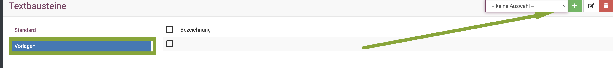
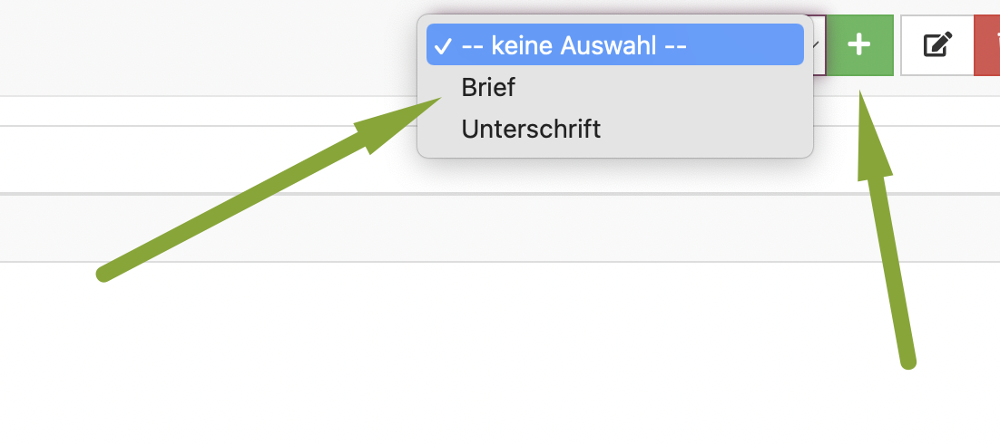
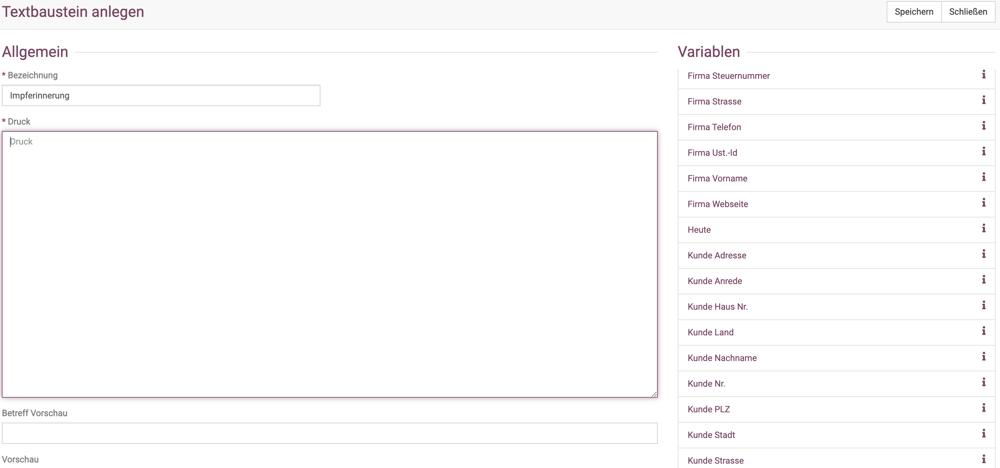
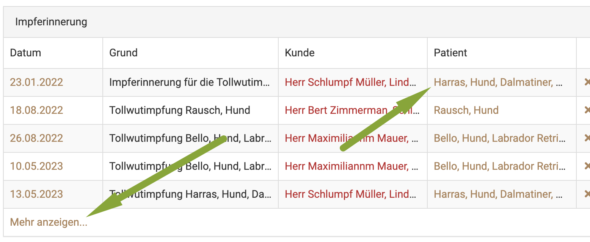
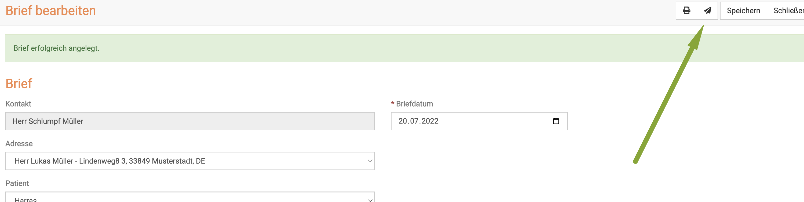

# Impferinnerungen  

Vor allem in der Kleintierpraxis ist das Verschicken von Impferinnerungen ein wichtiger Punkt. Viele von Ihnen haben dies bisher
mit Postkarten oder Briefen erledigt. 

Im Zeitalter der Digitalisierung empfiehlt sich, dies auch digital zu erledigen. Sie sparen Kosten, Zeit und Papier. 

debevet bietet Ihnen die Möglichkeit, direkt auf dem Dashboard angezeigt zu bekommen, welche Kunden eine Impferinnerung bekommen sollen. 

## Impferinnerung automatisch erstellen lassen  

Damit Sie nicht bei jeder Impfung händisch am Patienten eine Impferinnerung anlegen müssen, können Sie im debevet eine Aktion 
mit einem Produkt verknüpfen. In diesem Fall wäre das der verwendete Impfstoff.

Klicken Sie hierfür am gewünschten Produkt den Reiter **Aktionen**.

Hier können Sie zu einem Impfstoff als Aktion eine Impferinnerung hinzufügen, um automatisch nach jedem Verwenden dieses 
Impfstoffes eine Impferinnerung für den behandelten Patienten XXX Tage später hinzuzufügen (z.B. 340). 

   

:::caution Achtung: 

Die Impferinnerung wird dann nur erstellt, nicht automatisch verschickt!  

:::

## Impferinnerung Text anlegen 

Sie können einen Text nach Ihren Wünschen anpassen, welcher dann für den Versand der Impferinnerung genutzt wird. 
Klicken Sie hierzu auf **Administration** und dann **Textbausteine**. Dort wählen Sie **Vorlagen**.  

  

Nun wählen Sie oben rechts mit dem **Dropdown-Pfeil** die Variante **Brief** und klicken dann das **grüne Plus-Symbol**.  
  
  

Nennen Sie das Dokument dann im Feld **Beschreibung** z. B. Impferinnerung. Mit den Variablen rechts können Sie persönliche Daten,
also den Namen des Kunden, des Tieres, Ihrer Praxis etc. einfügen lassen. 

Im Vorschaufeld unten sehen Sie dann eine Vorschau, wie die Nachricht aussehen wird. 

## Impferinnerung verschicken 

Aktuell haben wir leider noch keine Möglichkeit für einen Massenversand der ausstehenden Impferinnerungen, aber wir arbeiten daran.

Wenn Sie auf dem Dashboard die Anzeige der Impferinnerungen aktiviert haben, können Sie von dort direkt die ausstehenden Impferinnerungen aufrufen.  

Klicken Sie entweder direkt auf den Patientennamen, oder unten auf "Mehr anzeigen", falls Ihre Liste sehr lang ist.  

Am Patienten müssen Sie nun folgende Schritte vornehmen:

1. Klicken Sie auf **Behandeln**  
2. Klicken Sie oben in der Leiste das kleine **Briefsymbol**  
3. Wählen Sie die passende Vorlage aus 
4. Klicken Sie oben rechts **Speichern**
5. Klicken Sie nun das **Briefsymbol** um die Nachricht zu verschicken   

