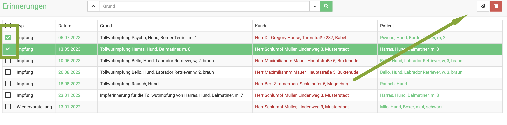

# Impferinnerungen und Wiedervorstellungen

Vor allem in der Kleintierpraxis ist das Verschicken von Impferinnerungen und Wiedervorstellungen ein wichtiger Punkt. Viele von Ihnen haben dies bisher
mit Postkarten oder Briefen erledigt. 

Im Zeitalter der Digitalisierung empfiehlt sich, dies auch digital zu erledigen. Sie sparen Kosten, Zeit und Papier. 

debevet bietet Ihnen die Möglichkeit, direkt auf dem Dashboard angezeigt zu bekommen, welche Kunden eine Impferinnerung bekommen sollen oder zur Wiedervorstellung 
erinnert werden sollen.

## Impferinnerung bzw. Wiedervorstellung einzeln manuell erstellen  

Sie können an einem Patienten auch manuell eine einzelne/mehrere Impferinnerungen bzw. Erinnerung zur Wiedervorstellung anlegen. Klicken Sie dazu **Praxis** und dann **Patienten**. 
Suchen Sie den Patienten und klicken Sie dann auf seinen Namen in der Spalte "Rufname".  

  

In der Detailansicht scrollen Sie dann etwas nach unten bis zum Abschnitt **Erinnerungen**. Dort können Sie die Erinnerung mit Datum und Text eintragen. 

Dort wählen Sie via Klick auf den **Dropdown-Pfeil**, welcher Typ Erinnerung erstellt werden soll (Impferinnerung oder Wiedervorstellung). Setzen Sie
dann das Datum, an dem erinnert werden soll und Tragen den Namen der Erinnerung ein.  

Klicken sie zur Eingabe das grüne Häkchen und dann oben rechts auf **Speichern**.

:::tip Tipp

Nutzer der App aroundpet bekommen nicht nur einfach eine Email, sondern werden über Erinnerungen dieser Form direkt via
push-Nachricht auf Ihrem Handy benachrichtigt.

:::    

Erfahren Sie weiter unten, wie Sie die Impferinnerung via Mail verschicken und wo Sie die fälligen Impferinnerungen sehen.  

  

## Impferinnerung automatisch erstellen lassen  

Damit Sie nicht bei jeder Impfung händisch am Patienten eine Impferinnerung anlegen müssen, können Sie im debevet eine Aktion 
mit einem Produkt oder einer Diagnose verknüpfen. 

### Variante 1: Die Nutzung von Diagnosen zum automatischen Erstellen einer Impferinnerung 

Der Vorteil dieser Variante besteht darin, dass Sie z.B. die Diagnosen "Grundimmunisierung Katze 1", "Grundimmunisierung Katze 2" erstellen
könnten, um dann nach jeweils 3 Wochen eine Impferinnerung zu erzeugen. Für Jahresimpfungen kann dann eine weitere Diagnose, z.B. "Jahresimpfung Katze" 
erstellt werden, welche die Impferinnerung beispielsweise nach 340 Tagen erzeugt (so sind noch Vorlaufzeiten für die Kunden eingeplant).   

Klicken Sie auf **Warenwirtschaft" und dann *+Diagnosen**. Klicken Sie oben rechts das **grüne Plus-Symbol**, um eine neue Diagnose anzulegen.  

   

Geben Sie den Namen der Diagnose sinnvoll für die geplante Impferinnerung ein. Wählen Sie bei Klassifizierung das gewünschte Tier. Ratsam ist es ebenso, bei
Kategorie etwas einzutragen, z.B. Impfung. So bleibt es für Sie übersichtlicher. Klicken Sie anschließend oben rechts **Speichern**.

  

Wenn sie nun eine angelegte Diagnose wieder öffnen, sehen Sie den Reiter **Aktionen**. Klicken Sie diesen an. 

  

Klicken Sie auf das Dropdown-Menü und wählen dort **Impferinnerung**.  

  

  

Nun tragen Sie die gewünschten Werte ein. Bei Grundimmunisierungen macht es z.B. Sinn, die Impferinnerung bereits nach 3 Wochen zu verschicken, 
damit die Kunden noch eine Vorlaufzeit haben um den Termin zu buchen.   

:::tip  Tipp:  

Wenn Sie unten auf "Variablen" klicken, können Sie z.B. eine Variable für den Tiernamen mit einfügen in den Text.   

:::  

Klicken Sie erneut oben rechts **Speichern**. Wann immer diese Diagnose nun genutzt wird, wird die Impferinnerung automatisch erstellt.
Bedenken Sie aber bitte, dass Sie diese dennoch manuell versenden müssen!

:::tip Tipp:  

Sie können eine Diagnose in Ihren Behandlungsvorlagen einfügen. So werden dann nicht nur alle benötigten Posten automatisch in die
Behandlung eingefügt, sondern auch die Diagnose- und mit dieser die nun hieran gebundene Impferinnerung!   

:::

### Variante 2: Die Nutzung eines Produktes zum automatischen Erstellen einer Impferinnerung

Eine weitere Variante wäre es, die Erinnerung an die Nutzung eines bestimmten Impfstoffes zu verknüpfen. 

Klicken Sie hierfür am gewünschten Produkt den Reiter **Aktionen**.

Hier können Sie zu einem Impfstoff als Aktion eine Impferinnerung hinzufügen, um automatisch nach jedem Verwenden dieses 
Impfstoffes eine Impferinnerung für den behandelten Patienten XXX Tage später hinzuzufügen (z.B. 340). 

   

:::caution Achtung: 

Die Impferinnerung wird dann nur erstellt, nicht automatisch verschickt!  

:::

## Impferinnerung Text anlegen 

Sie können einen Text nach Ihren Wünschen anpassen, welcher dann für den Versand der Impferinnerung via Mail genutzt wird. 
Klicken Sie hierzu auf **Administration** und dann **Textbausteine**. Dort wählen Sie **Erinnerung Email**.  Klicken Sie auf das 
Wort, um direkt in die Bearbeitung zu gelangen.

Sie können nun mit den Varviablen einen individuellen Text erstellen, wir empfehlen, einen zu nutzen, in dem der Typ der Erinnerung (also
ob Impferinnerung oder Wiedervorstellung) und der Grund (das ist der "Name, den Sie an der Erinnerung am Tier als Grund algeben, z.B. "Zahnkorrektur" oder 
Tollwut Impfung o.ä. eingegeben haben)  genutzt werden.  

Im Vorschaufenster können Sie dann sehen, wie der Text aussehen würde.  

Hier ein Beispiel:  

  

Speichern Sie anschließend, und ab sofort wird dieser Text genutzt, wenn die Erinnerungsmail verschickt wird.

## Erinnerung verschicken 

Sie können die Erinnerungen einzeln oder gesammelt verschicken. Entweder gehen Sie den Weg über Ihre Dashboard Anzeige, oder direkt über die Erinnerungen.

### Über das Erinnerungen Menü  

Klicken Sie **Praxis** und dann **Erinnerungen**. 

Setzen Sie nun die Checkboxen der Erinnerungen auf aktiv, die verschickt werden sollen und klicken Sie dann oben rechts das **Papierflieger-Symbol**. 

### Über die Dashboard Übersicht

Wenn Sie auf dem Dashboard die Anzeige der Impferinnerungen aktiviert haben, können Sie von dort direkt die ausstehenden Impferinnerungen aufrufen.  

Klicken Sie in der Ansicht dieser Anzeige unten auf **Mehr anzeigen**.  

  

Nun können Sie in der Liste der Erinnerungen entweder alle oder einzelne mit klick in die **Checkboxen** markieren.
Klicken Sie anschließend oben rechts auf das **Papierflieger-Symbol**. Direkt werden die Erinnerungen verschickt.

:::tip Tipp

Nutzer der App aroundpet bekommen nicht nur einfach eine Email, sondern werden über Erinnerungen dieser Form direkt via
push-Nachricht auf Ihrem Handy benachrichtigt.

:::  

## Erinnerungen löschen 

Falls Sie aus Versehen falsche oder doppelte Erinnerungen erstellt haben oder eine Erinnerung nicht mehr brauchen, können Sie diese 
selbstverständlich auch wieder löschen. Dabei können Sie sowohl Wiedervorstelungen löschen, als auch Impferinnerungen löschen.  

Klicken Sie unter **Praxis** auf **Erinnerungen**.  

In der Liste wählen Sie nun mit Klick in die Checkboxen die Erinnerungen aus, die gelöscht werden sollen. Klicken Sie anschließend oben rechts auf das
**Mülleimer-Symbol**.  

