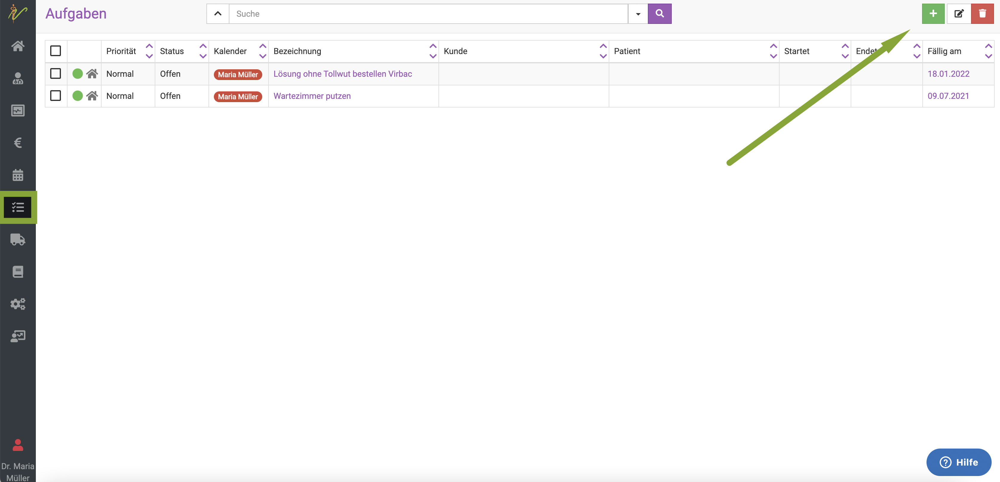

# Aufgaben  

Die debevet Software bietet die Möglichkeit, für Ihre Mitarbeiter oder sich selbst Aufgaben anzulegen. 
Diese erscheinen sowohl im Kalender, als auch, wenn eingestellt, auf dem Dashboard. 

Aufgaben können auch an Kunden/Patienten verknüpft werden, und als Besuche vor Ort beim Kunden angelegt werden.

## Eine neue Aufgabe erstellen  

Klicken Sie links in der Menüleiste auf **Aufgaben**. Dann klicken Sie oben rechts auf das **grüne Plus-Symbol**.

  

Nun können Sie der Aufgabe folgende Inhalte zuordnen:
* Titel (also den Namen der Aufgabe, z.B. "Rückruf" o.ä.)  
* Kalender (also welcher Mitarbeiter es erledigen soll)  
* Priorität  
* Datum (Fällig am)  
* Dauer  
* Beschreibung
* Kunde (hier können Kunde und Patient zugeordnet werden)
* Checkbox für "beim Kunden vor Ort"

## Kunden und Patienten einer Aufgabe hinzufügen  

Unten im Aufgabenfeld beim Erstellen der Aufgabe finden Sie den Sektor **Kunde**. Dort können Sie einen Kunden und einen Patienten hinzufügen.  
Wählen Sie in den Auswahlfeldern aus Ihren Kundenlisten die gewünschten Einträge aus. Die debevet Software schlägt Ihnen direkt die passenden Einträge vor,
wenn Sie die ersten Buchstaben eingeben.

Sie können auch eine Checkbox aktivieren, um einen Termin vor Ort beim Kunden stattfinden zu lassen.  

## Checkliste hinzufügen

Sie können zu der Aufgabe eine Checkliste zuordnen. Dort können zum Beispiel noch einmal einzelne Teilaufgaben hinterlegt werden.
Klicken Sie oben rechts auf "hinzufügen".  

  

Nun geben Sie den einzelnen Checkpunkt ein und klicken das **grüne Symbol zum Speichern**.  

  

Wenn sie weitere Checkpunkte hinzufügen wollen, wiederholen Sie diesen Schritt mehrfach. Es erscheint dann eine Liste, bei der die einzelnen Punkte
abgehakt werden können.  

  

## Aufgaben erledigen 

Um eine Aufgabe zu erledigen, öffnen Sie diese, indem Sie in der Aufgabenliste in der Spalte "Bezeichnung" auf den Namen der Aufgabe klicken.

Nun klicken Sie oben rechts auf **Erweitert** und dann **Abschließen**.  

